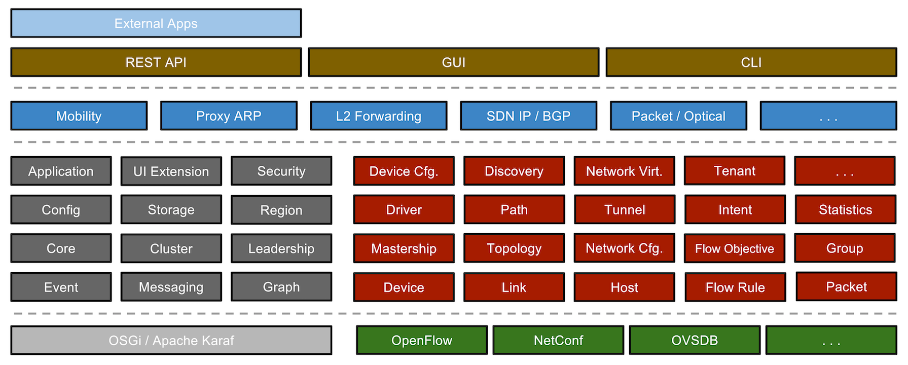
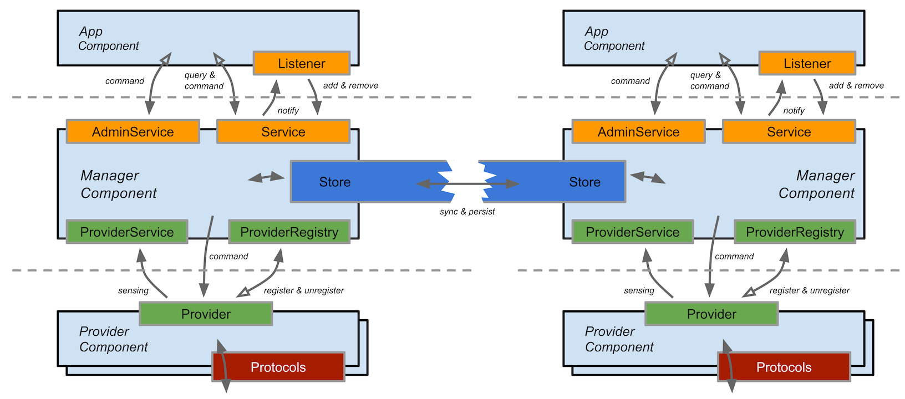
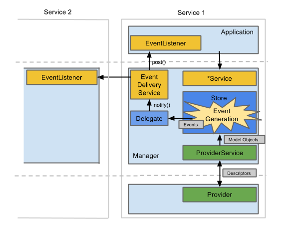

# System Components

This section describes the organization of the major subsystems found in ONOS.

## System Tiers

As mentioned in the previous section, ONOS is architected with tiers of functionality. We present the following figure as a summary of the discussions in the next few sections :

## Services and Subsystems

A ***service***is a unit of functionality that is comprised of multiple components that create a vertical slice through the tiers as a software stack. We refer to the collection of components making up the service as a ***subsystem**.*We use the terms 'service' and 'subsystem' interchangeably in this guide.

ONOS defines several primary services:

* *Device Subsystem* - Manages the inventory of infrastructure devices.
* *Link Subsystem* - Manages the inventory of infrastructure links.
* *Host Subsystem* - Manages the inventory of end-station hosts and their locations on the network.
* *Topology Subsystem* - Manages time-ordered snapshots of network graph views.
* *PathService* - Computes/finds paths between infrastructure devices or between end-station hosts using the most recent topology graph snapshot.
* *FlowRule Subsystem* - Manages inventory of the match/action flow rules installed on infrastructure devices and provides flow metrics.
* *Packet Subsystem* - Allows applications to listen for data packets received from network devices and to emit data packets out onto the network via one or more network devices.

The following figure illustrates the various subsystems that are part of ONOS today and a few that are planned in the near future:

## Subsystem Structure

Each of a subsystem's components resides in one of the three main tiers, and can be identified by one or more Java Interfaces that they implement.

The figure below summarizes the relationships of the subsystem components. The top and bottom dotted lines in the figure represent the inter-tier boundaries created by the northbound and southbound APIs, respectively.

### Provider

The lowest tier of the ONOS stack, Providers interface with the network via protocol-specific libraries, and with the core via the `ProviderService` interface.

The protocol-aware providers are responsible for interacting with the network environment using various control and configuration protocols, and supplying service-specific sensory data to the core. Providers may also collect data from other subsystems, converting them into service-specific data.

Some providers may also need to accept control edicts from the core and apply them to the network using the appropriate protocol-specific means. These are fed into the Provider via the `Provider` interface.

#### Provider ID

A Provider is associated with a `ProviderId`. The main purpose of the `ProviderId` is to provide an externalizable identity of a family of providers, which allows devices and other model entities to remain associated with the identity of the provider responsible for their existence even after the provider is uninstalled/unloaded.

The `ProviderId` carries a URI scheme designation to allow for loosely pairing devices with providers from an alternate provider family, and for this to be possible without access to the Provider itself.

#### Multiple Providers

A Subsystem may be associated with multiple providers. In such cases, Providers are designated as either *primary* or *ancillary.*The primary provider owns the entities associated with its service, with ancillary providers contributing their information as overlays. This approach gives precedence to the principal provider information, should any overlay result in conflicts with the underlay information.

The Device Subsystem is one such service capable of supporting multiple Providers.

### Manager

A component residing in the core, the Manager receives information from Providers and serves it to applications and other services. It exposes several interfaces :

* A northbound `Service` interface through which applications or other core components can learn about a particular aspect of the network state
* An `AdminService` interface for taking administrative commands and applying them onto the network state or the system
* A southbound `ProviderRegistry` interface through which Providers can register with the manager, so that it may interact with it
* A southbound `ProviderService` interface presented to a registered Provider, through which it may send and receive information to and from the manager

The consumers of a Manager's service interface may receive information both synchronously by querying the service, and asynchronously as an event listener (e.g. by using a `ListenerService` interface that is part of each `Service` interface to register for events and implementing an `EventListener` interface for receiving the events).

### Store

Also within the core and associated closely with the Manager, Stores have the task of indexing, persisting, and synchronizing the information received by the Manager. This includes ensuring consistency and robustness of information across multiple ONOS instances by directly communicating with stores on other ONOS instances. Further discussion of Stores in distributed settings is found in [Cluster Coordination](distributed-operation/cluster-coordination.md).

#### Application

Applications consume and manipulate information aggregated by the managers via the `AdminService` and `Service` interfaces. Applications have a wide range of functionality, ranging from displaying network topologies in a web browser to setting up paths for network traffic.

#### Application ID

Each application is associated with a unique `ApplicationId`. This identifier is used by ONOS to track context associated with an application (e.g. tasks and objectives such as intents and flow rules). To obtain a valid ID, applications register with the `CoreService`, providing their name which is expected to follow the reverse DNS notation, e.g. *org.onlab.onos.fwd*.

Not all subsystems possess all of these components, and not all components strictly adhere to these functions. For example, `TopologyProvider` purely acts upon the system core's protocol-agnostic representations of devices and links, and never interacts with the infrastructure directly, and `CoreService` is implemented by `CoreManager`, a Manager that implements only a Service interface.

## Events and Descriptions

Two fundamental units of information distribution within ONOS are Events and Descriptions. As with services, Events and Descriptions are associated with specific network elements and concepts. Both are immutable once created.

### Descriptions

Descriptions are used to pass information about a element across the southbound API. For example, a `HostDescription` contains information about a host's MAC and IP Addresses and its location in the network (VLAN ID and device/port attachment point). Descriptions are usually made up of one or more m*odel objects*, ONOS's representations of various network components.

### Events

Events are used by Managers to notify its listeners about changes in the network, and by Stores to notify their peers of events in a distributed setting. An Event is comprised of an event type and a subject built of model objects`.` For example, a `DeviceEvent` can be used to notify `DeviceListeners` that a device (the subject) has been detected (*`DEVICE_ADDED`*), lost (`DEVICE_REMOVED`), or some aspect of it has changed (*`DEVICE_UPDATED`*), among others. 

#### Event dispatch

Events are generated by the Store, based on input from the Manager. Once generated, an Event is dispatched to interested listeners via the `StoreDelegate` interface, which ultimately invokes the `EventDeliveryService`. Essentially, the `StoreDelegate` moves the event out of the store, and the `EventDeliveryService` ensures that the event only reaches interested listeners. Due to how they interact, these two components reside in the Manager, where the manager provides the implementation class of the `StoreDelegate` to the store`.`

#### Event Listeners

Event listeners are any components that implement the `EventListener` interface. `EventListener` child interfaces are classified by the type of `Event` subclass they listen for. The typical mode of implementation is for an Event listener to be an inner class of a manager or an application, from which the appropriate services are invoked based on received event. This restricts the handling of events external to a subsystem to the subsystem's manager or an application, i.e. to the logical locations where they should be handled.

The figure below elaborates on the previous figure to show the relationship between Descriptions, Events, and the components described here.

### Network representations

Model objects are ONOS's protocol-agnostic representations of various network elements and properties. Events carry these representations as their subject body. These representations are built from the information found in Descriptions by the system core.

Further discussion about network representations can be found in [Representing Networks](network-state-construction/representing-networks.md).

 

 

---

[Previous : ONOS : An Overview](onos-an-overview.md)  
[Next : Representing Networks](network-state-construction/representing-networks.md)

---
