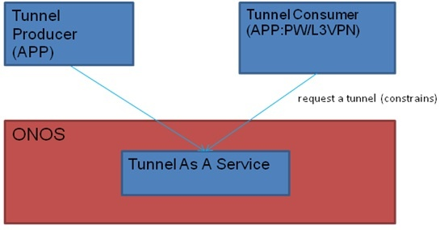
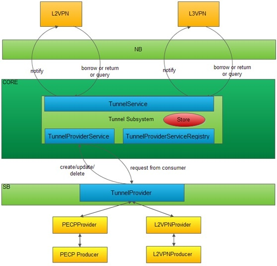

# Tunnel Subsystem

**Tunnel Subsystem**

**Overview**

Tunnel is a type of system resources in ONOS. Tunnel subsystem is built to support tunnel setup for applications. This subsystem is constructed in a processing approach based on the model of producer and consumer (P-C). The P-C model distinguishes two types of applications, tunnel producers and tunnel consumers. A tunnel producer is an application capable of creating, updating and deleting tunnels. Tunnel subsystem is responsible of storing and managing tunnels in ONOS store. A tunnel consumer is an application that can borrow tunnels from ONOS store and return tunnels to ONOS store. A consumer can communicate with producer via ONOS for creating tunnels.

**The Model of Tunnel Producer and Consumer**

The following figure depicts the tunnel subsystem architecture.

****

**WorkFlow:**

1. Tunnels are firstly created by tunnel producers and then tunnel consumers can borrow tunnels from the tunnel store.
2. When a tunnel a consumer is requesting is not available, the *TunnelManager* invoke the method of *TunnelProvider* to inform a producer what the consumer is requesting with tunnel attributes. After a producer creates a tunnel, the tunnel is stored in ONOS *TunnelStore*. Eventually *TunnelStore* will notify the consumer that the tunnel is available and the consumer can start to borrow again.

**Featuring**:

* A *TunnelAdminService* provides service for administrators to interact with the inventory of tunnels.
* A *TunnelService* provides services for consumers to borrow, return, and query tunnels.
* A *TunnelManager* manages interface with multiple *Providers* via a *TunnelProviderService* interface and multiple listeners via a *TunnelService* interface.
* *TunnelProviders* support their own network protocol libraries or ways to interface with the network.
* A *TunnelStore* tracks *Tunnel* model objects and generates *TunnelEvent.*

**Programming APIs for ONOS applications**

The tunnels are managed by ONOS as a type of system resources. Customer applications, as tunnel consumers, can require tunnels from ONOS via northbound API calls. The tunnels are created by producer applications via southbound APIs and stored inside ONOS. The current northbound APIs support future applications (normally admin) capable of removing and updating specific tunnels.

Firstly, applications should register the tunnel events for the notifications of new tunnel creation. An application starts to require a tunnel from ONOS by calling *borrowTunnel.* If two or more applications are requiring same tunnel, ONOS will serve the applications based on a FIFO order, until the tunnel’s bandwidth is not meeting any more requirements, and then the not served requests will be rejected. Before acquiring a tunnel or for admin purpose, applications can query the tunnel resource’s availability by tunnel’s ID, type, source/dest points, etc. similarly, an application can require a tunnel with different parameters. If a required tunnel is not available in resource pool, ONOS will produce this type of the tunnel by calling southbound APIs to request producer application to create it. After application finishes its use with tunnels, it should return them to ONOS resource pool by calling northbound API *returnTunnel.*

The followings list current APIs available in ONOS.

***Southbound APIs***

* *setupTunnel* ONOS setup a tunnel per consumer application request to instructs provider to create the tunnel with or without a given device.
* *releaseTunnel* ONOS release a tunnel per consumer application request to instruct provider to remove the tunnel with or without a given device.
* *updateTunnel* ONOS update a tunnel per consumer application request to instruct provider to update the tunnel with or without a given device.
* *tunnelAdded* Producer signals ONOS that a tunnel has been added.
* *tunnelRemoved* Producer signals ONOS that a tunnel has been removed.
* *tunnelUpdated* Producer signals ONOS that a tunnel was changed (e.g., sensing changes of tunnel).

***Northbound APIs***

* *removeTunnel* Removes the provisioned tunnel.
* *removeTunnel* Removes the provisioned tunnel leading to and from the specified labels.
* *removeTunnels* Removes all provisioned tunnels leading to and from the specified connection point.
* *updateTunnel* Invokes the core to update a tunnel based on specified tunnel parameters.
* *borrowTunnel* Borrows a specific tunnel. If the tunnel is not available in the store, returns a "null" object, and record the tunnel subscription. After tunnel is created, ONOS notifies the subscribing consumers.
* *borrowTunnel* Borrows a specific tunnel by tunnelName. If the tunnel is not available  in the store, return a "null" object, and record the tunnel subscription. After tunnel is created, ONOS notifies the subscribing consumers.
* *borrowTunnel* Borrows all tunnels between source and destination. If the tunnel is not available re in the store, return an empty collection, and record the tunnel subscription. After tunnel is created, ONOS notifies the subscribing consumers. Otherwise ONOS core returns all the tunnels, and consumer determined which one to use.
* *borrowTunnel* Borrows all specified type tunnels between source and destination. If the tunnel is not available in the store, return a empty collection, and record the tunnel subscription. After tunnel is created, ONOS notifies the subscribing consumers. Otherwise, ONOS core returns all available tunnels, and consumer determined which one to use.
* *returnTunnel* Returns a specific tunnel to store.
* *returnTunnel* Returns all specific name tunnel to store. if the tunnel is not available  in the store, return a "null" object, and record the tunnel subscription. After tunnel is created, ONOS notifies the subscribing consumers.
* *returnTunnel* Returns all specific type tunnels between source and destination to store.
* *returnTunnel* Returns all tunnels between source and destination to the store.
* *queryTunnel* Query a tunnel by a specific tunnel identity.
* *queryTunnelSubscription* Query all tunnel subscription record by consumer.
* *queryTunnel* Query all specified type tunnels.
* *queryTunnel* Querys all tunnels between source point and destination point.
* *queryAllTunnels* Query all tunnels.
* *tunnelCount* Query all tunnels.

**Tunnel management CLI commands**

Administrators can interact with the inventory of tunnel resource using the following console commands:

* *tunnel-create* Supports for creating a tunnel. It's used by producers.
* *tunnel- update* Supports for updating a tunnel by tunnel id . It's used by producers.
* *Tunnel-remove* Supports for removing tunnels via tunnel identifier, source point, end point or tunnel type . It's used by producers.
* *tunnel-subscriptions* Query all request orders of consumer by consumer id. It's used by consumers.
* *tunnels* Supports for querying tunnels via tunnel identifier, source point, end point and so on. It's used by consumers.
* *Tunnel-borrow* Borrows tunnels via tunnel identifier, source point, end point, tunnel type or tunnel name. It's used by consumers.
* *Tunnel-return* Returns all tunnels via tunnel identifier, source point, end point, tunnel type or tunnel name. It's used by consumers.
