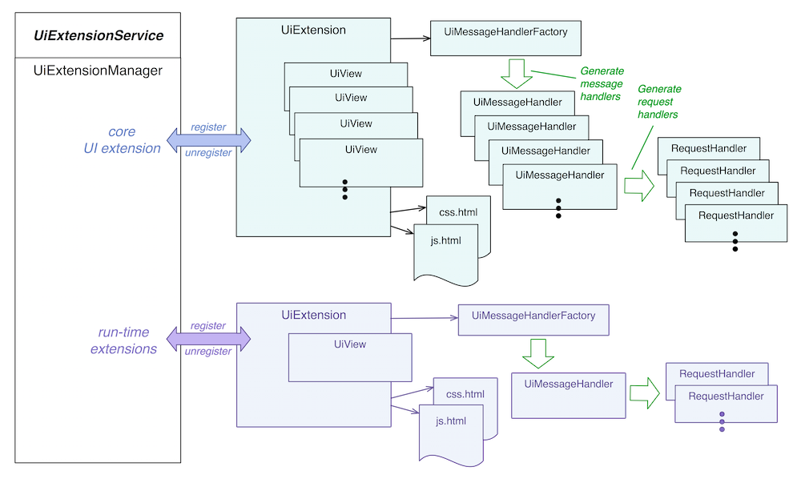

# Web UI Architecture

# 

## Overview

The ONOS GUI is a *single-page web-application* with *hash-navigation*. The GUI system comprises *client-side* code (a single HTML page structured as an [AngularJS](https://angularjs.org/) application, javascript libraries and modules, CSS files, etc.) and *server-side* code (Java classes that "model" the GUI views, and interface with ONOS Server APIs to provide the data for those views). The GUI web page is served up by a web server running on an ONOS instance.

## Client-Side Architecture

From the web-browser's point of view, the client side code is comprised of:

|  |  |
| --- | --- |
| The main application page | * `index.html`(1) |
| Third party libraries | * `tp/angular.js` * `tp/angular-route.js` * `tp/angular-cookies.js` * `tp/d3.js` *(v3.4.12)* * `tp/topojson.v1.min.js` |
| Framework code | * `onos.js`(2) * `app/directives.js` * `app/mast/mast.js` * `app/mast/mast.html` * `app/nav/nav.js` * `nav.html`(3) |
| Supporting framework utilities | * `app/fw/util/*.js` * `app/fw/svg/*.js` * `app/fw/remote/*.js` * `app/fw/widget/*.js` * `app/fw/layer/*.js` |
| Core Views  (installed with out-of-the-box ONOS) | * `app/view/app/*.js` * `app/view/settings/*.js` * `app/view/cluster/*.js` * `app/view/topo/*.js` * `app/view/device/*.js` * `app/view/flow/*.js` * `app/view/port/*.js` * `app/view/group/*.js` * `app/view/link/*.js` * `app/view/host/*.js` * `app/view/intent/*.js` |

... along with their associated `*.css` stylesheets.

Notes:

*For the following notes, the "wiring" can be seen by examining the `web.xml` configuration file.*

(1) `index.html` is generated dynamically via the *`MainIndexResource`* class. The `index.html` file is used as a template, with javascript *<script>* elements and style sheet *<link>* elements injected where indicated. The contents of these sections are composed by querying all *`UiExtensions`* registered with the *`UiExtensionService`*.

(2) `onos.js` is generated dynamically via the *`MainModuleResource`* class. The `onos.js` file is used as a template, with view IDs injected where indicated. The list of view IDs is generated by iterating across the *`UiViews`* defined by each registered *`UiExtension`*.

(3) `nav.html` is an HTML fragment generated dynamically via the *`MainNavResource`* class. The `nav.html` file is used as a template, with the navigation category headers and links injected where indicated. The headers and links are generated by iterating across the category values, and within each category iterating across the *`UiViews`* (for that category) defined by each registered *`UiExtension`*.

### Injected Views

Additional views can be injected into the GUI at runtime. Each view has a unique identifier (e.g. "myviewid"). The following convention should be used to place client-side resources in the **.oar** file:

`|`  
`+-- resources`  
`|   +-- <UiExtId>`  
`|       +-- css.html`  
`|       +-- js.html`  
`|`  
`+-- webapp`  
`+-- app`  
`+-- view`  
`+-- <viewid1>`  
`|   +-- *.css`  
`|   +-- *.html`  
`|   +-- *.js`  
`|`  
`+-- <viewid2>`  
`+-- *.css`  
`+-- *.html`  
`+-- *.js`

where *<UiExtId>* is the unique ID of the *[UiExtension](https://github.com/opennetworkinglab/onos/blob/master/core/api/src/main/java/org/onosproject/ui/UiExtension.java)* instance (passed in as the "path" parameter at construction), and *<viewid1>* and *<viewid2>* are the unique IDs of the views provided by the extension.

## Server-Side Architecture

The ONOS GUI has a corresponding server-side presence (on each ONOS instance in the cluster) which is exposed as the *[UiExtensionService](https://github.com/opennetworkinglab/onos/blob/master/core/api/src/main/java/org/onosproject/ui/UiExtensionService.java)*. The following figure illustrates the relationships between the various components:



The *[UiExtensionService](https://github.com/opennetworkinglab/onos/blob/master/core/api/src/main/java/org/onosproject/ui/UiExtensionService.java)* provides an API allowing the run-time addition (or removal) of *[UiExtension](https://github.com/opennetworkinglab/onos/blob/master/core/api/src/main/java/org/onosproject/ui/UiExtension.java)* instances. The *[UiExtensionManager](https://github.com/opennetworkinglab/onos/blob/master/web/gui/src/main/java/org/onosproject/ui/impl/UiExtensionManager.java)* implements this service, and internally registers the "core" *UiExtension* instance (shown at the top of the figure) on activation of the service. ONOS applications may provide their own *UiExtension* instance, which they will register on activation, and unregister on deactivation. The bottom of the figure shows a typical extension implementing a single, additional view.

When a *UiExtension* registers, a mapping is cached to bind the identifiers of the extension's views to the extension instance, so that a look up of which extension implements a specific view can be performed at runtime.

See also the section *"When a browser connects.."*

### *UiExtension*

Each *[UiExtension](https://github.com/opennetworkinglab/onos/blob/master/core/api/src/main/java/org/onosproject/ui/UiExtension.java)* instance provides:

* a unique internal identifier (e.g. "core")
* a *[UiMessageHandlerFactory](https://github.com/opennetworkinglab/onos/blob/master/core/api/src/main/java/org/onosproject/ui/UiMessageHandlerFactory.java)* which generates *[UiMessageHandler](https://github.com/opennetworkinglab/onos/blob/master/core/api/src/main/java/org/onosproject/ui/UiMessageHandler.java)s* on demand, each of which generate *[RequestHandler](https://github.com/opennetworkinglab/onos/blob/master/core/api/src/main/java/org/onosproject/ui/RequestHandler.java)s*.
* one or more *[UiView](https://github.com/opennetworkinglab/onos/blob/master/core/api/src/main/java/org/onosproject/ui/UiView.java)s*; these are server side "model" objects each representing a "view" in the GUI.
* two **.*html*** snippets providing linkage for injected ***.css*** and ***.js*** resources.

Note that there is generally a 1:1 correspondence between *UiViews* and *UiMessageHandlers*; the message handler providing a request handler for each request type that the view sends from the client to the server.

### UiView

*[UiView](https://github.com/opennetworkinglab/onos/blob/master/core/api/src/main/java/org/onosproject/ui/UiView.java)* instances are immutable objects that encapsulate information about a view:

* A Category; (currently, PLATFORM, NETWORK, OTHER, or HIDDEN)
* An internal identifier (e.g. "topo")
* A label (display string, e.g. "Topology")
* An icon identifier (e.g. "nav\_topo")

### CSS and JS Linkage

The files `css.html` and `js.html` should be provided under the resources directory. These snippets are injected into `index.html` to provide the necessary linkage to the stylesheets and JavaScript required for the injected views.

`|`  
`+-- resources`  
`+-- <UiExtId>`  
`+-- css.html`  
`+-- js.html`

A typical `css.html` file might look like this:

```
<link rel="stylesheet" href="app/view/myviewid/myviewid.css">
```

A typical `js.html` file might look like this:

```
<script src="app/view/myviewid/myviewMain.js"></script>
<script src="app/view/myviewid/myviewUtil.js"></script>
```

### UiMessageHandlerFactory

The *[UiMessageHandlerFactory](https://github.com/opennetworkinglab/onos/blob/master/core/api/src/main/java/org/onosproject/ui/UiMessageHandlerFactory.java)* is responsible for generating a set of *[UiMessageHandler](https://github.com/opennetworkinglab/onos/blob/master/core/api/src/main/java/org/onosproject/ui/UiMessageHandler.java)s* on demand. These are requested when a browser connection is established with the server, to serve that GUI instance. The factory generates message handlers to handle all message events from the client (browser) that the views in this UI extension are expecting.

### UiMessageHandler

Generally, there is a 1:1 correspondence between a *[UiView](https://github.com/opennetworkinglab/onos/blob/master/core/api/src/main/java/org/onosproject/ui/UiView.java)* and a *[UiMessageHandler](https://github.com/opennetworkinglab/onos/blob/master/core/api/src/main/java/org/onosproject/ui/UiMessageHandler.java)*; i.e. the message handler handles all request messages that a specific (client-side) view sends to the server. For example, the *[DeviceViewMessageHandler](https://github.com/opennetworkinglab/onos/blob/master/web/gui/src/main/java/org/onosproject/ui/impl/DeviceViewMessageHandler.java)* is responsible for fielding the messages received from the "Device" view.

### RequestHandler

Each instance of *[RequestHandler](https://github.com/opennetworkinglab/onos/blob/master/core/api/src/main/java/org/onosproject/ui/RequestHandler.java)* handles one specific request type. When the corresponding event comes in from a client, the appropriate handler's *process(...)* method is invoked to handle the request.

### TableRequestHandler

The *[TableRequestHandler](https://github.com/opennetworkinglab/onos/blob/master/core/api/src/main/java/org/onosproject/ui/table/TableRequestHandler.java)* is an abstract subclass of *[RequestHandler](https://github.com/opennetworkinglab/onos/blob/master/core/api/src/main/java/org/onosproject/ui/RequestHandler.java)*. The table pattern is so common that it makes sense to provide a partial implementation of the handler, as well as additional constructs to model the construction of the table data, and facilitate custom sorts and cell renderers.

## When a Browser Connects...

As noted above, the `index.html` file is generated *on-the-fly* to provide the initial load of the GUI. During the "bootstrap" sequence (in particular, the creation of the main (Angular) controller "*[OnosCtrl](https://github.com/opennetworkinglab/onos/blob/master/web/gui/src/main/webapp/onos.js#L71)*") a web-socket connection is established with the server by a call to the web socket service function *[createWebSocket()](https://github.com/opennetworkinglab/onos/blob/master/web/gui/src/main/webapp/app/fw/remote/websocket.js#L187)*.

On the server-side, the *[UiWebSocketServlet](https://github.com/opennetworkinglab/onos/blob/master/web/gui/src/main/java/org/onosproject/ui/impl/UiWebSocketServlet.java)* handles the incoming request and creates a *[UiWebSocket](https://github.com/opennetworkinglab/onos/blob/master/web/gui/src/main/java/org/onosproject/ui/impl/UiWebSocket.java)* instance to establish a dedicated TCP connection between the server and the GUI. It is during the web-socket's *[onOpen()](https://github.com/opennetworkinglab/onos/blob/master/web/gui/src/main/java/org/onosproject/ui/impl/UiWebSocket.java#L103)* method call that the *UiExtensionService* is referenced to [create handler instances](https://github.com/opennetworkinglab/onos/blob/master/web/gui/src/main/java/org/onosproject/ui/impl/UiWebSocket.java#L175) and bind them to *this* web-socket instance.

(See also: [Federated ONOS Web UI](web-ui-architecture/federated-onos-web-ui.md))

### Message Events between Client and Server

With the establishment of the web-socket, both the client (browser) and the server are free to send messages to the other. This means that the server may send unsolicited messages to the client, as events occur in the environment.

Event messages are structured JSON objects, with the following general format:

```
{
  "event": "eventType",
  "sid": ... ,
  "payload": {
    ...
  }
}
```

The ***event*** field is a string uniquely identifying the event type.

The ***sid*** field is an optional sequence identifier (monotonically increasing integers) which, if provided by the client, should be duplicated in the server's response to that event. Note that, in general, server-initiated events do not include a *sid*field.

To date, no particular use for the SID field has been found. It is thus deprecated, and may be removed in a future release.

The ***payload*** field is an arbitrary JSON object, the structure of which is implied by the event type. Many payloads include an ***id***field at the top level, which holds the unique ID of the item being described by the event.

## Additional Material

See also the [Core UI Extension Architecture](web-ui-architecture/core-ui-extension-architecture.md) page, which provides details on the architecture of the out-of-the-box views.

## Localization of the UI

The ONOS Web UI has mechanisms in place to allow "user-facing" text to be localized to different languages. See the [Web UI Localization Architecture](web-ui-architecture/web-ui-localization-architecture.md) page for more details.

---

[Previous : The Intent Framework](https://wiki.onosproject.org/display/ONOS/The+Intent+Framework)  
[Use Cases : Architecture](#)

---
