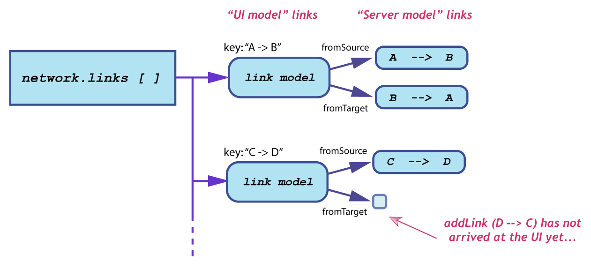

# Topology View Architecture

This page needs re-working, now that traffic has been separated out

# WIP page..

The UI maintains an internal model of the topology by storing data representing *ONOS instances*, *nodes* (devices and hosts) and *links*. The model is empty initially, but is augmented as events (such as *addInstance*, *addDevice*, *addLink*, etc.) come in from the server. As these events arrive, the model is updated and the visual representation modified to reflect the current model.

## Topology Event Descriptions

The following table enumerates the events, providing a high-level description of the payload. For explicit details of the payloads, see the source-code .

Note that the term "node" (in this context) is used to mean "device or host node" in the topology visualization.

| Source | Event Type | Description of Payload | Trigger | Comments |
| --- | --- | --- | --- | --- |
| UI | ***requestSummary*** | *(no payload)* | Summary pane shown | Client requesting the server to send topology summary data. |
| Server | ***showSummary*** | High level summary properties: total number of devices, links, hosts, ... | Periodic updates in response to *requestSummary* | The summary data is displayed in a "fly-in" pane in the top right of the view. Note that the server will continue to send these events to keep the summary data up-to-date. |
| UI | ***cancelSummary*** | *(no payload)* | Summary pane hidden | Client requesting the server to stop sending summary data. |
| Server | ***addInstance*** | Instance ID, IP address, online status, ... | ONOS instance added to cluster | An ONOS instance to be added to the model. |
| Server | ***addDevice*** | Device ID, type, online status, mastership, labels, properties, ... | ONOS discovers new device | A device (switch, roadm, ...) to be added to the model. |
| Server | ***addHost*** | Host ID, type, connection point, labels, properties, ... | ONOS discovers new host | A host (endstation, bgpSpeaker, router, ...) to be added to the model. |
| Server | ***addLink*** | Link ID, type, source ID/port, destination ID/port, ... | ONOS discovers new link | A link (direct, optical, tunnel, ...) to be added to the model. |
| Server | ***updateInstance*** | *(same as addInstance)* | Instance changes state | An ONOS instance with updated state. |
| Server | ***updateDevice*** | *(same as addDevice)* | Device changes state | A device with updated state. |
| Server | ***updateHost*** | *(same as addHost)* | Host changes state | A host with updated state. |
| Server | ***moveHost*** | *(same as addHost)* | Host changes location | A host's connection to the network changes to a new switch/port. |
| Server | ***updateLink*** | *(same as addLink)* | Link changes state | A link with updated state. |
| Server | ***removeInstance*** | *(same as addInstance)(1)* | ONOS instance leaves cluster | An ONOS instance to be removed from the model. |
| Server | ***removeDevice*** | *(same as addDevice)(1)* | Device removed | A device to be removed from the model. |
| Server | ***removeHost*** | *(same as addHost)(1)* | Host removed | A host to be removed from the model. |
| Server | ***removeLink*** | *(same as addLink)(1)* | Link removed | A link to be removed from the model. |
| UI | ***updateMeta*** | item ID, item class (device, host, ...) memento data | User drags node to new position | Client requesting data (a memento) associated with a specific node to be stored server-side; That same data (memento) should be returned in the payload of future events pertaining to that node. This mechanism facilitates server-side persistence of client-side meta data, such as the (user-placed) location of a node on the topology map. |
| UI | ***requestDetails*** | item ID, item class (device, host, ...) | User selects node on map | Client requesting details for the specified item. |
| Server | ***showDetails*** | item ID, item type (switch, roadm, endstation, ...) and list of properties | Response to *requestDetails* | Server response to *requestDetails*. |
| NOTE | Traffic Overlay generates events listed below |  |  |  |
| UI | ***addHostIntent‡*** | IDs of two selected hosts | 'Create Host-to-Host Flow' action button on multi-select pane. | Client requesting server to install a host-to-host intent. |
| UI | ***addMultiSourceIntent‡*** | IDs of selected nodes (multi source, single destination) | 'Create Multi-Source Flow' action button on multi-select pane. | Client requesting server to install multiple intents. |
| UI | ***requestRelatedIntents‡*** | IDs of selected nodes, ID of hovered-over node | 'V' keystroke | Client requesting intents relating to current selection of nodes be highlighted. |
| UI | ***requestPrevRelatedIntent‡*** | *(no payload)* | 'L-arrow' keystroke | Client requesting previous related intent to be highlighted |
| UI | ***requestNextRelatedIntent‡*** | *(no payload)* | 'R-arrow' keystroke | Client requesting next related intent to be highlighted |
| UI | ***requestSelectedIntentTraffic‡*** | *(no payload)* | 'W' keystroke | Client requesting continuous monitoring of traffic on the links of the selected intent |
| UI | ***requestDeviceLinkFlows‡*** | IDs of selected nodes, ID of hovered-over node | 'F' keystroke | Client requesting continuous monitoring of flow rules on the egress links of the selected device(s) |
| UI | ***requestAllTraffic‡*** | *(no payload)* | 'A' keystroke | Client requesting continuous monitoring of traffic on all network infrastructure links |
| Server | ***showHighlights*** | highlights to be applied to the topology: devices, hosts, links. Badges can be applied to devices/hosts, labels and highlighting (primary, secondary) can be applied to links. | Response to UI requests marked with ***‡*** | Server response to *requestTraffic*. Note that the server will continue to send these events to keep updating the display. |
| UI | ***cancelTraffic*** | *(no payload)* | 'ESC' keystroke | User cancels selection – Client requesting the server to stop sending traffic updates. |
| UI | ***equalizeMasters*** | *(no payload)* | 'E' keystroke | Client requesting server to rebalance mastership of devices across the cluster. |

Notes:

(1) *Technically, only the ID field is required, but the server-side code is simplified by using the payload as is.*

### A Note about Links

The topology model on the server side represents links as unidirectional, with a source and destination. In the UI, each link model object abstracts away the directionality. This is to provide a single "link" element between two "nodes" in the visualization. However, this makes the link event processing a little more complex. Internally the links are modeled something like this:

When a link event arrives, a lookup is done to see if the "parent" object for that link already exists.
