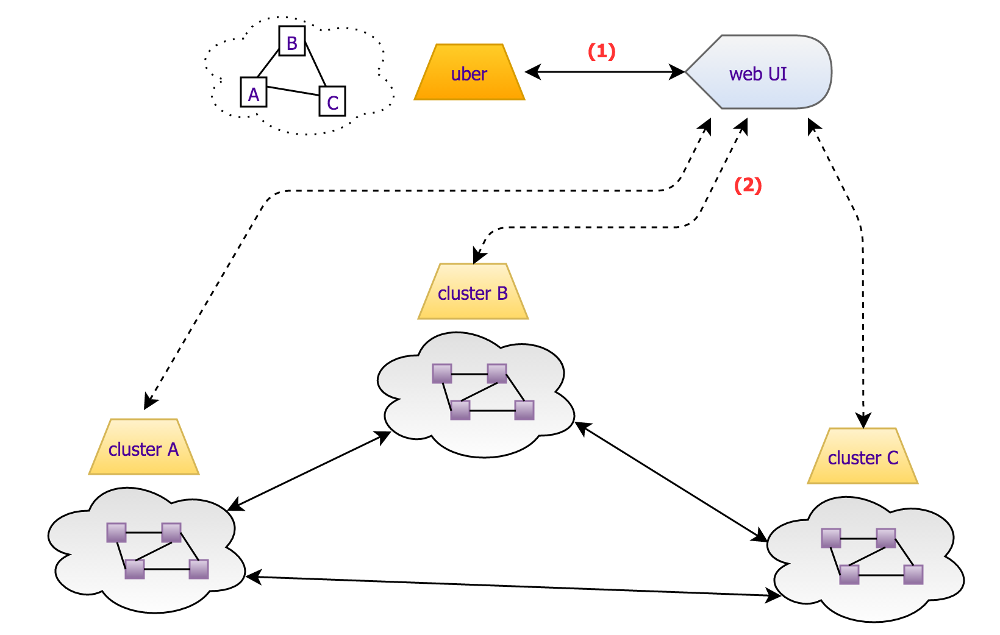

# Federated ONOS Web UI

# Overview

This page describes the *proposed* architecture for the ONOS Web UI to support "federated ONOS". Right now it is just capturing initial thoughts...

After review, it was suggested that opening multiple web sockets from the UI (browser) was overcomplicating things. Since the subordinate clusters would need to be communicating with the uber cluster anyway, they should supply any data needed for UI visualization along the same channel. The UI should remain as a single web socket connection to the main controller/cluster.

# Web UI Connection Protocol

It is proposed that the Web UI is enhanced to implement a "connection protocol" after the establishment of the web socket connection to the ONOS controller. This is to allow the controller to inform the UI about the "mode" in which it is running.

## Single Cluster Deployment

For a (traditional) single-cluster deployment the initial message exchange should look something like this:

| UI --> controller | Controller –> UI |
| --- | --- |
| ``` { ```  ```   "conn": "main" ```  ``` } ``` |  |
|  | ``` { ```  ```   "deployment": "single" ```  ``` } ``` |

The UI is informing the controller to which it is connecting that this is a "main" connection.

The controller is informing the UI that this is a "single cluster" deployment.

From here, everything else as before...

## Federated Deployment

For a federation of ONOS clusters, (either hierarchical or peer-peer), the initial message exchange would look a little different.

Consider the following figure (connections between ONOS clusters and Uber controller not shown):



```
 
```

First, **(1)**, the UI informs the Uber controller (to which it is connecting) that this is a main connection.

The Uber controller responds that this is a federated deployment, and provides contact information for the other clusters.

| UI --> Uber | Uber --> UI |
| --- | --- |
| ``` { ```  ```   "conn": "main" ```  ``` } ``` |  |
|  | ``` {   "deployment": "federated",   "clusters": [     {       "name": "Cluster A",       "ip": "10.0.21.1"     },     {       "name": "Cluster B",       "ip": "10.0.22.1"     },     {       "name": "Cluster C",       "ip": "10.0.23.1"     }   ] } ``` |

Second, **(2)**, the UI opens up web sockets to the controllers listed in the above exchange, informing each that they are an auxiliary UI connection.

The controller acknowledges the auxiliary connection.

| UI --> Controller A|B|C | Controller A|B|C --> UI |
| --- | --- |
| ``` { ```  ```   "conn": "aux" ```  ``` } ``` |  |
|  | ``` { ```  ```   "aux": "ok" ```  ``` } ``` |

# Modifications to existing UiWebSocket class

The [UiWebSocket](https://github.com/opennetworkinglab/onos/blob/master/web/gui/src/main/java/org/onosproject/ui/impl/UiWebSocket.java) class would need to be enhanced to track the notion of whether the connection was MAIN or AUX. In this way, the UI resources / message handlers would be able to modify their behavior if needed.

# Further Notes / Assumptions

* The topology view would work as it currently does, showing the "model" that is maintained at the Uber controller.
* In the Uber model, the clusters would appear as a single device – a "big switch".
* A "onos-federation-ui" application bundle (.oar file) would implement a topology overlay to:
  + augment the detail panel when a "big-switch" device was selected, showing:
    - additional data about the underlying topology
    - a "display underlying topology" button
      * pressing the button would launch a pop-up window, with the topology of the underlying network displayed\*\*

\*\* This is where the auxiliary connection to the subordinate cluster would come in, to retrieve the "model" data.
