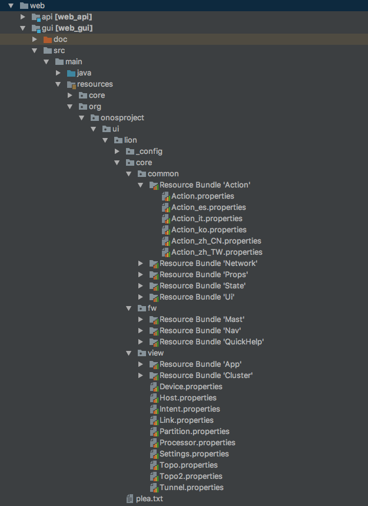
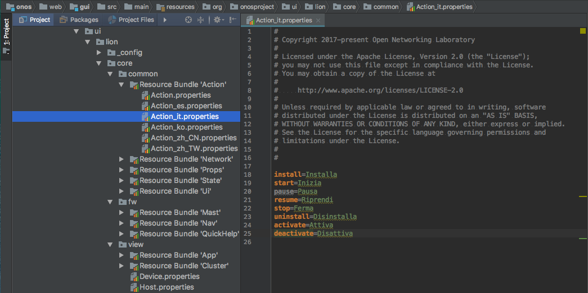
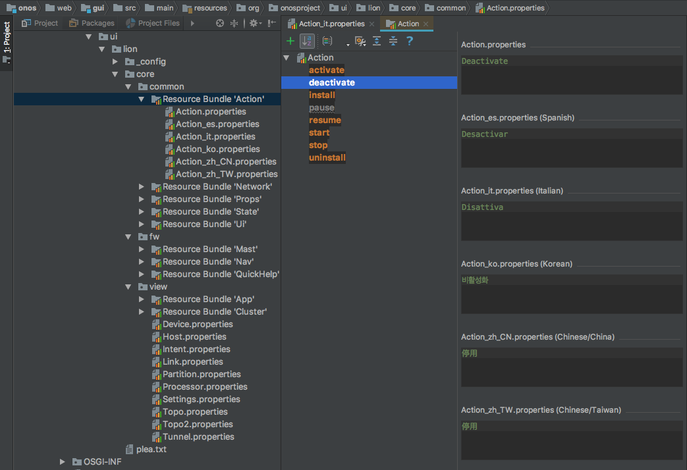
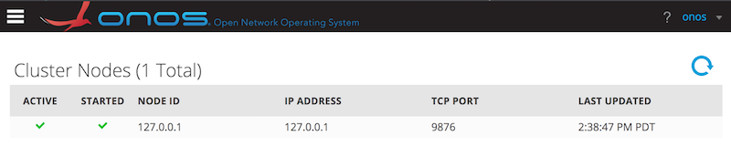
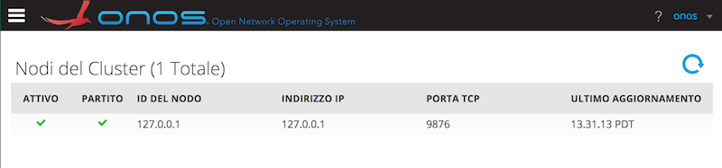
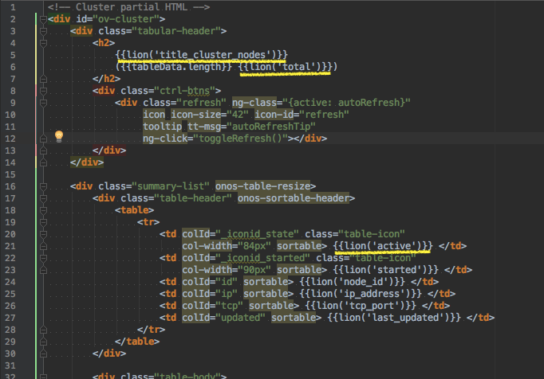
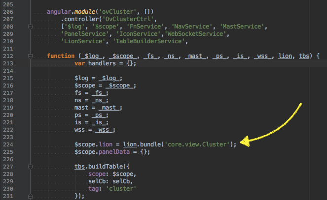
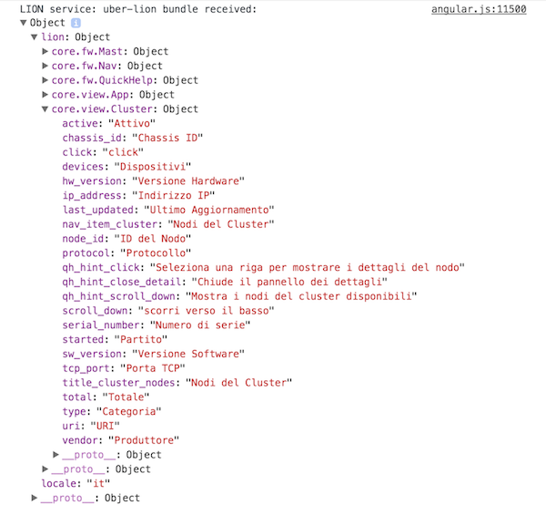
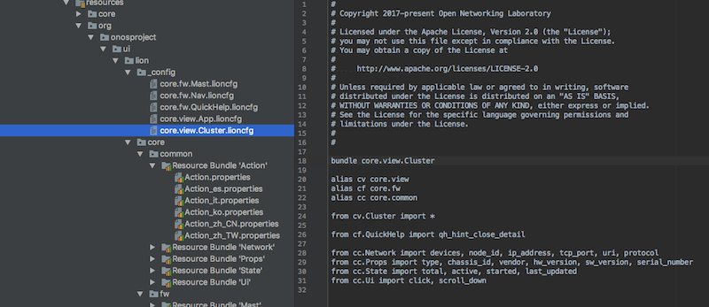

# Web UI Localization Architecture

# Overview

The Web UI has a mechanism in place to allow "user-facing" text to be localized to different languages.

At its heart, the mechanism uses *Java Resource Bundles* backed by properties files (see [Java Tutorial](https://docs.oracle.com/javase/tutorial/i18n/resbundle/propfile.html)) to provide each text snippet with a "key" that is used for lookup of the text in the language of the configured Locale.

# Implementation Goals

A primary goal of the implementation is to keep translation work down to a minimum. This means that words and phrases used in multiple places in the UI should be "re-used" from a single source in the resource bundles, where possible. Using this approach reduces duplication of language translations, and prevents subtly different translations for the same phrase in different places.

# Resource Bundle Collection

The resource bundles are maintained in the onos ***web\_gui*** module, under the ***~/src/main/resources*** tree, in the ***org/onosproject/ui/lion*** directory.

A "top level" directory -- ***core*** -- contains three directories:

* ***common*** – for bundles of words and phrases that will appear in many places in the UI
* ***fw*** - for bundles relating to text appearing in "UI framework" code
* ***view*** - for bundles relating to specific "UI views" code

It is expected that a second top level directory – ***apps*** -- will be created in the future, for bundles relating to the ONOS Apps that are included in the distribution.

Note in the image above that the "*Resource Bundle 'X'*" elements are synthetic containers created by *IntelliJ (IDE)* to group together bundles of the same text in the different languages.

Looking at the (expanded) '**Action**' bundle, it can be seen that there is a default bundle (**Action.properties**) which has text in English, along with translations into Spanish (**es**), Italian (**it**), Korean (**ko**), Simplified Chinese (**zh\_CN**) and Traditional Chinese (**zh\_TW**).

In the IDE, selecting the actual file will allow the developer to edit the text of the file, as you would expect:

However, selecting the "bundle" provides an edit mode where each localization key can be selected to display all translations for that specific key:

# LionBundles

When localizing a specific "view" (or other UI component), the simplest arrangement is to have *flat structure* for lookup of localization keys. As an example, let's take a look at the *Cluster Nodes* view:

Here it is in English (default):

Here it is localized to Italian:

Let's take a peek under the hood; here is part of the HTML snippet for the view...

Notice the *Angular expressions* being evaluated in the highlighted **{{ ... }}** syntax; these are a function call – **lion(key)** – where "key" is the localization key of the phrase to be inserted.

The **lion(...)** function is installed on the *$scope* of the view in the controller code, as indicated here...

Without going too much deeper, what we are doing is requesting the *LionService* to provide us with a function that will allow us to look up localization keys for the *"core.view.Cluster"* bundle. That function will "wrap" the named portion of the localization data structure that the *LionService* retrieved from the server during initialization of the UI...

Note that when we invoke the function, if we request a key that does not exist in the bundle – e.g. **lion('nonexistent')** – the text returned will be the key wrapped in %'s – e.g. **"%nonexistent%"**. This should help identify where there are missing localization keys, during development.

# Bundle Stitching

So now the question is, how do we reconcile the "tree" structure required to reduce/prevent duplication of translated text in localization bundles, with the "flat" structure required for ease of retrieval when inserting localized text into a UI component?

The answer is the *[BundleStitcher](https://github.com/opennetworkinglab/onos/blob/master/web/gui/src/main/java/org/onosproject/ui/impl/lion/BundleStitcher.java)* class. As part of the generation of the core *UiExtension* (in *[UiExtensionManager](https://github.com/opennetworkinglab/onos/blob/master/web/gui/src/main/java/org/onosproject/ui/impl/UiExtensionManager.java#L176)*), the *BundleStitcher* is invoked to process all ***.lioncfg*** files in the ***\_config*** subdirectory. The following figure shows the config file for the *core.view.Cluster* lion bundle.

The ***.lioncfg*** files use a simple syntax to "pull" localization strings from the resource bundle tree, into a single flat mapping. A brief explanation of the command formats follows:

#### bundle <bundle-name>

Defines the name of the bundle. The dot-delimited nature is to avoid name collisions, but (just like Java package naming) there is no hierarchy inferred. The bundle name should also be the name of the file (with a **.lioncfg** suffix).

In the example, the bundle name is **core.view.Cluster**.

#### alias <name> <text-replacement>

Defines an alias for text replacement, to simplify / shorten statements that follow.

An example from above is **alias cc core.common**, which will replace, for example, **cc.Network** with **core.common.Network**.

#### from <resource-path> import \*

Imports all localization keys from the specified resource bundle.

In the example, all the resource keys defined in the **core.view.Cluster** resource bundle will be included in this *LionBundle*.

#### from <resource-path> import key1, key2, ...

Imports the specified localization keys from the given resource bundle.

In the example, the **total**, **active**, **started**, and **last\_updated** localization keys from the **core.common.State** resource bundle will be included in this *LionBundle*.
