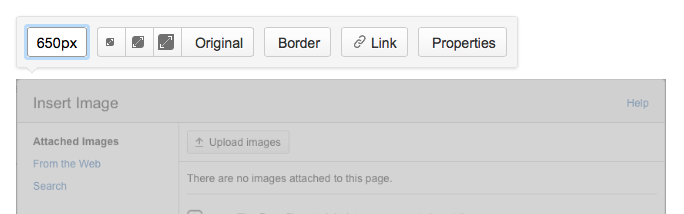
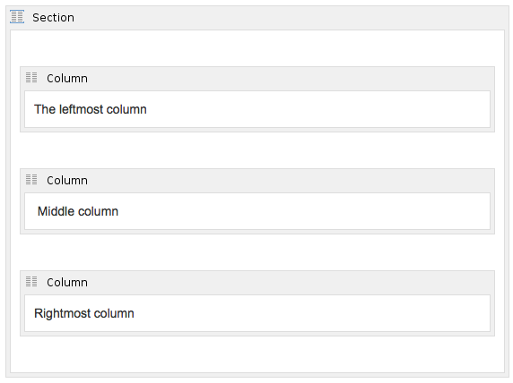
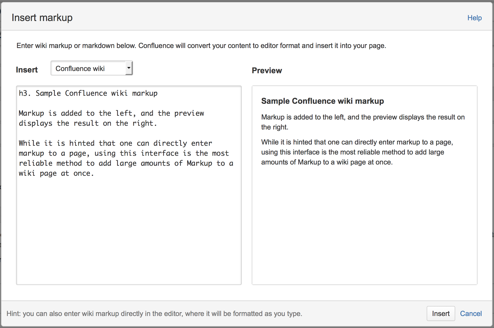

# Wiki Formatting Conventions

## Overview

The ONOS Guides and tutorials are written using the Confluence Wiki markup interface. In order to lower the curve required to add or edit information, and to introduce consistency, the Guides avoid the usage of raw HTML and Wiki Notation (the exceptions being some of the [Appendix pages](#WikiFormattingConventions-Appendix)), instead relying on formatting and macros provided by the default Confluence interface.

Several conventions are used within the documents, and any new material should conform to them to keep a uniform look. 

For an introduction to the basics of editing the wiki, refer to [Getting Started with Wiki Contents](getting-started-with-wiki-contents.md).

For a sample template page implementing the conventions described here, refer to [Sample Document Template](sample-document-template.md).

## Section Headings

Each section in a page should have a terse title in one of the Heading levels under the **Paragraph** dropdown. The convention for (sub)section headings are:

* Main sections : Heading 2
* Subsections : Heading 3
* Subsequent subsections : Heading 4

To apply a heading format, simply place the cursor on a line, and select the heading from the dropdown.

## Table of Contents (TOC)

* ***For Individual Pages*** :  
  A new page with more than one section should always have a table of contents near the top, after a brief summary of the page. This makes it easier for someone to get the gist of the page. The Table of Contents macro is used to automatically grow the TOC out of the page as sections are added. To add a TOC, select **Insert > Table of Contents**. A popup for TOC options should appear. Here, set the Maximum Heading Level to 3, to prevent the TOC from capturing subsections past Heading 3. This aids to reduce the noise in the listing.
* ***For the Guides*** :   
  An ONOS guidebook is a collection of child pages whose parent pages contain a top-level table of contents. This TOC shows pages and their main sections (i.e. up to Heading 2 of a page) as links.

## Code blocks

Code blocks are used instead of inlined monotype for multi-word/line commands and sample shell/CLI output. Code blocks may be added by:

1. Navigating to **Insert >  Other Macros**
2. Choosing *Code Block* from the "Select Macro" popup window

This brings up the prompt for configuring the code block. If copying terminal output, syntax highlighting should be turned off by selecting "Plain Text" in the Syntax Highlighting option before hitting "Create". Otherwise, select the appropriate language scheme.

## Links

It is good to link to the appropriate pages/sections whenever they are mentioned. 

Whenever a new page is added to a Guide, corresponding links should also be added to the top-level TOC.

## Diagrams and Figures

These are usually in PNG format, though others are acceptable. To add a figure, select **Insert > Image > Upload images** and browse to the image to add.  

A figure's size is also usually adjusted to about 650px wide by entering a custom size:

## Tables

The default tables available from the GUI have borders. If borders are not wanted, or more than 20 rows are needed, consider using a combination of the *Section* and *Column* macros.

To access these macros, select **Insert > Other Macros**  and search for "Section".

The above will appear as an line of text across three invisible columns:

The leftmost column

Middle column

Rightmost column

## Page Naming

Choose a name that describes the contents. Some special characters, such as '/' should be avoided, as this can have unexpected results e.g. unresolved links.

## Autogenerated content

Parts of the ONOS Guides contain information that is fairly painful to collect and/or format by hand. A [small set of scripts](https://github.com/akoshibe/onos-docutils) have been written that either generate content that can be pasted into the wiki markup dialogue, or scrape the source code for relevant information.

The markup dialogue is accessed from the Confluence editor with **ctrl-shift-d**. The dialogue box displayed in the editor is shown below:

More information about Confluence Markup can be found [here](https://confluence.atlassian.com/display/DOC/Confluence+Wiki+Markup).
