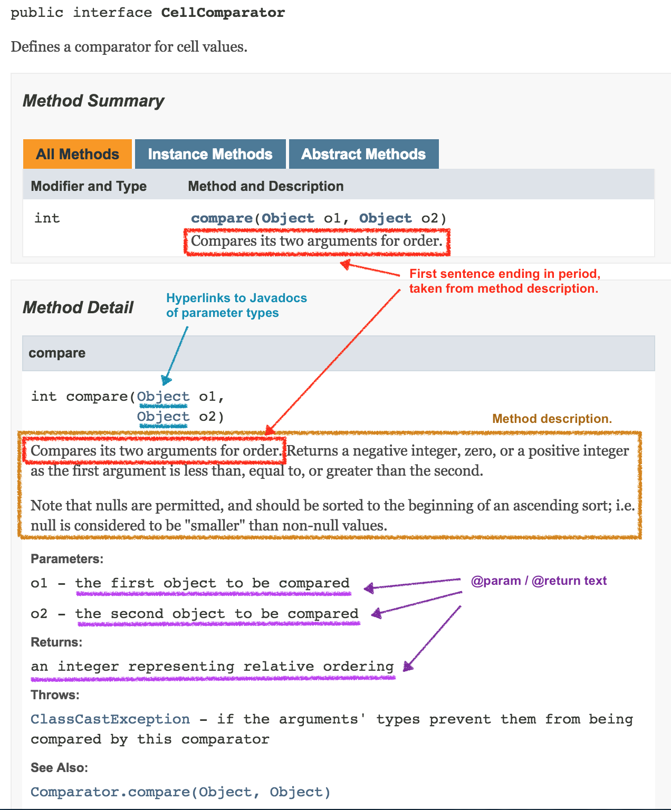

# Code Style Guidelines

To maintain a level of quality in the codebase, the project maintains a set of coding and testing guidelines.

## Indentation and spaces

* A blank line should separate method declarations:

  ```
     ... // end of previous method
  }
                   <-- blank line here
  /** 
   * ... javadoc description
   */
  public void someMethod() {
     ...
  ```
* *Four spaces*, **NOT** a tab character, are used for regular indentation. For code broken into multiple lines, *eight spaces* are used indent lines after the first:

  ```
  if (obj instanceof DefaultDevice) {
      return Objects.equals(this.id, other.id) &&
              Objects.equals(this.type, other.type) &&
              Objects.equals(this.manufacturer, other.manufacturer);
  ```
* If the line has to break at an operator (such as "&&" in the example above), the operator should be at the end of the previous line.
* If the line has to break at the dot separator "." (method invocation), the dot symbol should be at the beginning of the next line: 

  ```
  public void describeTo(Description description) {
      description.appendText("status '")
                 .appendText(status.getDescription())
                 .appendText("'");
  }
  ```
* Trailing whitespaces should be removed in both code and comments.
* There should be a space between keywords (`if`, `for`, `catch``,` etc.), parenthesis, and braces, as well as when casting:

  ```
  if (timer != null) {
      try {
          DeviceId did = (DeviceId) elementId;
          ...
      } catch (IOException e) {
  ...
  ```
* There should be a space before the curly braces in method definitions. Arguments are not padded (neither in definition nor invocation):

  ```
  public Device getDevice(DeviceId deviceId) {
      return store.getDevice(deviceId);
  }
  ```

The project uses [Checkstyle](http://checkstyle.sourceforge.net/)  to enforce some of the formatting mentioned above. Violations will prevent the build from succeeding.

## Line Length

Recommended line-length limit is 80 characters, but it is understood if lines *occasionally* spill over this limit for aesthetic reasons. Chronic trespasses of the 80 character line-length boundary may fail the review.

Exceeding the maximum line-length of 120 characters will fail the build.

## Comments

### Javadoc Comments

Javadocs are used to document the APIs of the codebase. Interfaces are heavily documented with Javadocs so that implementing methods (annotated with *`@Override`*) inherit the commenting.

Clarity of comments is important and therefore it is important to pay attention to detail and try to write concise, yet meaningful and clear comments.

Here are a number of Javadoc conventions that frequently need to be addressed in reviews:

* All **public**/ **protected** / **package-private** entities must have javadoc comments; remember this is the documentation for the entity's API.
* **private** entities do not need to have javadoc comments, but if they do, the comments should be properly formatted and complete.
* Acronyms in comments should be properly capitalized, e.g. YANG, NETCONF, SNMP.
* Descriptions should avoid gratuitous capitalization and should avoid referencing class-names unless part of a `@link` pragma.
* *Class Descriptions*
  + Descriptions of **interfaces** / **classes** / **enums** should start with a noun, and describe what the entity embodies.
  + For example "Representation of...", "Aggregation of...".
  + Avoid starting with "This class....", or "This interface..." etc. as it is obvious from the context, and the phrase is redundant.
  + Unit tests classes should also have a class description.
    - but methods within do not need to have javadoc comments, (although it is not discouraged)
* *Enum Constant Descriptions*
  + Not only should the enum as a whole be documented, but each constant (which is also public) should be documented.
  + Typically a single line format is used, for example, for SortDirection.ASC you might have:
    - /\*\* Designates ascending sort order. \*/
* *Constructor Descriptions*
  + Descriptions of constructors should start with a passive verb, e.g. "Creates..." or "Constructs..."
  + Avoid starting the description with "This constructor..." or "Constructor", or "Default constructor"
  + The first sentence of the description should be a complete, high level summary of what is constructed.
  + Note that the first sentence of the constructor (or method) description is used in the generated "Method Summary" section of the documentation page; (see example below)
  + Any additional sentences should provide the reader with further detail as needed.
  + The description text should be written as prose, and therefore be capitalized and punctuated properly.
  + The direct use of type names or variable names should be avoided where possible; for example:
    - rather than "Constructs a StructureHolder for the given WidgetElement."
    - it would be better to write "Constructs a structure holder for the given widget element."
* *Method Descriptions*  
  + Descriptions of methods should start with a passive verb, e.g. "Returns...", "Adds...", "Computes..."
  + Avoid starting the description with "This method..."
  + Further sentences should provide additional details (in prose) as needed, typically referring to the method parameters and the return value (if any).
  + The description should include details of special circumstances, for example, if and when null might be returned instead of a value type.
  + Note that parameter / return types should not be referenced with *@link* pragmas in the method description; the javadoc compiler will automatically provide hyperlinks to those entities in the constructed documentation page (see example below).

* *Parameters and Return Value Descriptions*
  + There should be a blank line between the method description and the first *@param* clause.
  + There should be a *@param* clause for each parameter to the method.
  + There should be a *@return* clause if the method is declared as returning anything other than *void*.
  + As a general guide, the reader should get a good sense of what the method does and what the parameters are, from reading just the method description alone.
  + The description of the parameter / return value should simply remind the reader what the parameter / value is; the details of which they have already read in the method description.
  + The description (sentence fragment) should start with lower case and ***not*** end with a period (***.***); for example:  
    - *@param id the entity identifier*
    - *@return the corresponding entity; or null if no such entity exists*
    - *@return true, if the key exists; false otherwise*
* *Thrown Exception Descriptions*
  + Documentation should always be provided (with a @throws clause) for each type of exception thrown by the method (both checked and unchecked exceptions).
  + Remember, only checked exceptions should be part of the method signature; unchecked exceptions should be omitted.
  + For example:
    - @throws IllegalArgumentException if the provided value is out of bounds
    - @throws IllegalStateException if the context has not been initialized
  + Note that these descriptions are short and to the point. If more detail is required about when or why the exceptions might be thrown, include it in the method description text.
* *Javadoc comments are parsed as HTML*
  + Whitespace is ignored, so use ***<p>*** (but not *<p></p>* or *<p/>*) to mark paragraph breaks.
  + ***<pre> ... </pre>*** can be used for blocks of monospaced text (e.g. example code fragments).
  + ***<ul> <li> ... </li>... </ul>*** constructs can be used for bulleted lists.

For more information, see [How to Write Doc Comments for the Javadoc Tool](http://www.oracle.com/technetwork/java/javase/documentation/index-137868.html). 

### Other Comments

* Internal comments ( // or /\* ... \*/ ) are encouraged to provide additional context to the reader, where the nuances may not be discerned from the code alone.
* Avoid adding comments that provide no additional information, for example:
  + // sets the parent value on the node
  + node.setParent(parent);
* Avoid adding comments at the end of a statement; place them above the line concerned.

```
/**
 * Representation of something with "foo" behavior.
 * <p>
 * This is Javadoc commenting for classes and interfaces.
 * Javadoc descriptions are full sentences using English prose.
 */
public interface Foo {
 
    /**
     * Returns true if the given parameter is within tolerance of the sample.
     * <p>
     * Additional detail about what the method does, and maybe constraints
     * or assumptions about input parameters should be provided in the 
     * method description here.
     *
     * @param param functions that take arguments have this
     * @return methods that return a value should indicate this
     */
    boolean sampleMethod(Integer param);
} 
 
```

At the time of this writing, various formats are used within the code.

```
/**
 * Implementing classes should have Javadocs as well, to emphasize 
 * their function.
 */
public class FooImpl implements Foo {
	
	/**
     * Important variables and structures should also be 
     * commented so that it is picked up by Javadocs.
     */
	private static final int SAMPLE = 5;

    @Override
    public boolean sampleMethod(int param) {
        // classic one-liner
        boolean val = false;
        /*
         * Multi-line comments within the code may use this 
         * convention.
         */
        if (param < SAMPLE) {
            // FIXME: multiple lines may be commented like this
            // for code that may be removed or changed
            // return true;  
            val = true;
        }
        return val;
    }	
} 
```

## Sample Javadoc generated documentation page



## Interfaces and classes

### Naming

Interfaces should always be given first pick of clear names that convey their purpose.  For example, if there is an interface representing a network device, and a class implementing it, the interface should be given the name `Device`, and the class, something indicating that it implements the `Device` interface, e.g. `DefaultDevice`.

Class and interface names whose names are based on acronyms such as `IP`, `PCEP`, `BGP`, etc. should continue to follow the standard camel-casing convention, e.g. `IpAddress`, `PcepService`, `BgpMessage`. This maintains readability and avoids confusion between names of classes and names of constants. There are a few exceptions to this in ONOS code-base, mostly in legacy code; new code should adhere to the camel-casing convention, however.

### Referencing

Wherever possible, references should be made to the interface, and not the implementing class. This includes method parameters.

### Nested (Inner) classes

A class that implements functions specific to a particular class (e.g. its event handlers or services that it exports) should be implemented as an*inner private class* within the class. Such classes have names beginning with `Internal-`, e,g `InternalClusterEventListener`. 

## Objects, Methods, Fields and Variables

### Data types

Wherever possible, use a rich data type over a primitive (e.g. `MacAddress` versus a `long`). This reduces ambiguity.

### Immutable objects

* Classes that are intended to be instantiated as immutable objects (e.g. `DefaultDevice`) should have all class variables declared `final`.

Collections (`Sets`, `Maps`, etc) returned by getters should be immutable, or a copy of the existing Collection.

```
@Override
public Iterable<Device> getDevices() {
    return Collections.unmodifiableCollection(devices.values());
}

 
// or, if copying
@Override
public Set<DeviceId> getDevices(NodeId nodeId) {
    Set<DeviceId> ids = new HashSet<>();
    for (Map.Entry<DeviceId, NodeId> d : masterMap.entrySet()) {
        if (d.getValue().equals(nodeId)) {
            ids.add(d.getKey());
        }
    }
    return ids;
}
```

### Constants

* Constant names should be all-uppercase-underline-delimited:

  ```
  private static final long TIMEOUT_MS = 2_000;
  private static final String APP_NAME = "org.onosproject.fooapp";
  ```
* Recommendation: Constant strings for exception messages start with E\_ prefix:

  ```
  private static final String E_BAD_ARG = "Bad argument detected: {}";
  ```

### Concurrency

* Avoid `synchronized(this)` and synchronized methods wherever possible.
* Opt for thread-safe objects such as `ConcurrentMap`, and if using `synchronized`, apply it to the structure that must be locked:

  ```
  protected final Map<DeviceId, LinkDiscovery> discoverers = new HashMap<>();

  @Override
  public void event(MastershipEvent event) {
      ...
      synchronized (discoverers) {
          if (!discoverers.containsKey(deviceId)) {
              discoverers.put(deviceId, new LinkDiscovery(device,
                      packetSevice, masterService, providerService,
                      useBDDP));
          }
      }
  }
  ```

  Additionally, some structures such as Hazelcast's `IMap` have per-key locks.

### equals() and hashCode()

Any objects that are compared, or stored in any hash based data structure (e.g. HashSet, HashMap), should implement these methods. For objects that implement them, comparisons should use their `equals()` method, and not `==`. An exception to this rule are Enums.

### Final keyword

Variables and parameters *should not* be gratuitously decorated with the **`final`** keyword; (This is an out-dated convention from *Java 1.1* era). Let the Java compiler do its work of optimizing the code for you.

The exception to this "rule" is when the parameter is used as part of an anonymous class closure defined within the method.

The **`final`** keyword should also be used on class declarations to prevent classes from being extended. For example, utility classes or collections of constants.

On a related note, even though method parameters are not decorated with **final**, they should still be treated as final; it is considered bad coding practice to modify a parameter within the method. The same behavior can always be achieved with local variables.

```
public void badExample(SomeType type, SomeValue value) {
    if (value == null) {
        value = SomeValue.DEFAULT_VALUE;
    }
    ...
 
 
public void goodExample(SomeType type, SomeValue value) {
    SomeValue v = value != null ? value : SomeValue.DEFAULT_VALUE;
    ...
```

## Naming

* JSON fields should be in camel case:

  ```
  {
      "aliasIp": "10.1.2.3"
  }
  ```

  and not `"alias_ip"`.

## Logging

The codebase uses [SLF4J](http://www.slf4j.org) for logging. **DO NOT** use `System.out.*`.

The logger should be private final, and associated with the particular class:

```
import static org.slf4j.LoggerFactory.getLogger;
import org.slf4j.Logger;
...
private final Logger log = getLogger(getClass());
...
    /**
     * Checks if all the reachable devices have a valid mastership role.
     */
    private void mastershipCheck() {
        log.debug("Checking mastership");
        for (Device device : getDevices()) {
```

When adding logs for debugging, rather than using `info` or `warn`, use the `debug` or `trace` verbosity level and set the log level in Karaf to inspect the debug messages.

When logging parameterized messages, use {} substituttion, not string concatenation. That is, do NOT do this:

```
  log.debug("Error detected at line " + lineNo + ", position " + pos);
```

Instead, do this:

```
  log.debug("Error detected at line {}, position {}", lineNo, pos);
```

## Usage of Guava (More of a tools section topic)

ONOS leverages [guava](https://code.google.com/p/guava-libraries/) in several areas. Some prominent areas are:

* Checking for null method inputs - using *checkNotNull()*: 

  ```
  import static com.google.common.base.Preconditions.checkNotNull;
  ...
      @Override
      public void removeDevice(DeviceId deviceId) {
          checkNotNull(deviceId, DEVICE_ID_NULL);
          DeviceEvent event = store.removeDevice(deviceId);
          if (event != null) {
              log.info("Device {} administratively removed", deviceId);
              post(event);
          }
      }
  ```
* *toString()* - *ToStringHelper():*

  ```
  import static com.google.common.base.MoreObjects.toStringHelper;
  ...
      @Override
      public String toString() {
          return toStringHelper(this)
                  .add("id", id)
                  .add("vlan", vlan)
                  .add("ipAddresses", ips)
                  .toString();
      }
  ```
* Data structures such as `Lists`, `ImmutableSet`, and `HashMultiMap`
* Unit testing - *EqualsTester():*

  ```
  import com.google.common.testing.EqualsTester;
  ...
  VlanId vlan1 = VlanId.vlanId((short) -1);
  VlanId vlan2 = VlanId.vlanId((short) 100);
  VlanId vlan3 = VlanId.vlanId((short) 100);
   
  // first two equality groups contain equal objects, last differs
  // from constituents of first two groups
  new EqualsTester().addEqualityGroup(VlanId.vlanId(), vlan1)
          .addEqualityGroup(vlan2, vlan3)
          .addEqualityGroup(VlanId.vlanId((short) 10));
  ```

## Imports

Import statements are expected to be organized by the IDE. It is understood that different IDEs use a slightly different scheme for organization. Settings for both Eclipse and IntelliJ IDEA are available to minimize (but not quite eliminate) these discrepancies.

Duplicate and unnecessary imports will result in build failure.

 

---

[Home : Contributing to the ONOS Codebase](../contributing-to-the-onos-codebase.md)

---
