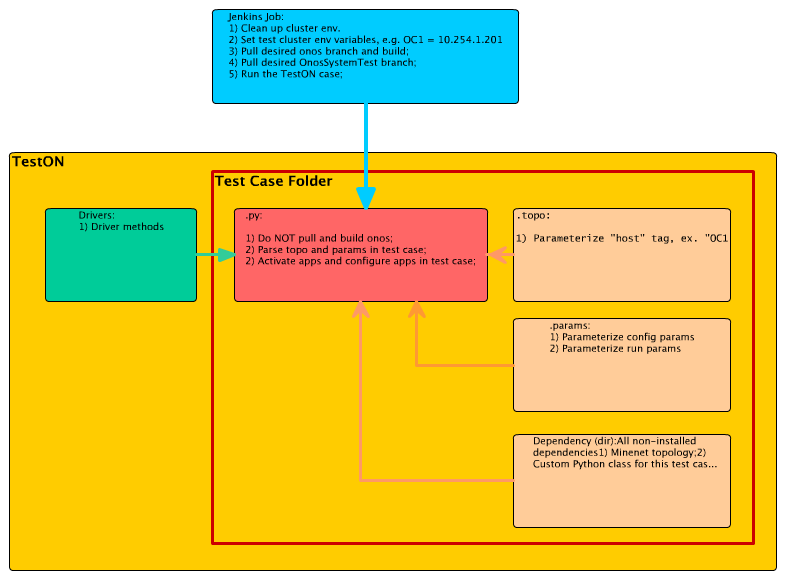

# How to Contribute to System Test

# **A few quick tips to get started contributing to OnosSystemTest:**

* Subscribe to the System Testing mailing list <[onos-test@onosproject.org](mailto:onos-test@onosproject.org)>. All [mailing lists](../../community-information/mailing-lists.md) can be found here.
* Sign up for an account on onosproject.org to be able to commit test codes to gerrit.onosproject.org.
* If you are not familiar with Gerrit workflow, check out this tutorial: [Gerrit Workflow for System Test Development](../system-testing-guide/gerrit-workflow-for-system-test-development.md).
* Check out our guides about the TestON framework: [System Testing Guide](../system-testing-guide.md).

# **Fundamentals on Authoring a Test Case**

Because we are targeting all tests to be automated in a Continuous Integration (CI) environment, there are several fundamental principles that we adhere to when writing test cases and driver files:

1. Portability - allow the test case to be run in other similar test environments, as well as merging community contributed tests into our production environment.
2. Stability - the test must handle various environment (e.g. response time of starting ONOS on VMs vs. on Bare Metals); test case must have stability in passing or failing results.
3. Clarity - strive to make Python cases simple to comprehend.
4. Debugging - use logging capabilities liberally to catch all cases of exceptions, and to ensure test failures don't go silently.

In order to achieve these objectives, it is essential to have a good understanding of the Jenkins - TestON interactions and abstractions in running a test case. The following diagram illustrates the interaction and abstraction of TestON and Jenkins.

# **TestON Scripting General Guidelines:**

* Pre-requisites and testbed environment setting - should be set manually, and/or with CI framework (i.e. through Jenkins jobs):
  + First Time Setup:
  + 1. TestStations:
       - should have a root account of "**sdn**" (password: **rocks**) to run TestON cli (so all hosts in the test infrastructure has the same **sdn/rocks** credential)
       - should be able to login to all nodes specified in the cell. See this guide to setup ssh keys.
    2. "ONOS Bench" and cells: set up per "[ONOS from Scratch](../../tutorials/onos-from-scratch.md)".
    3. Mininet (OCN) host: set up per  "[Mininet Walkthrough](http://mininet.org/download/)".  
       *N*ote: it is possible to run "TestStation", "onos Bench" and "Mininet" on the same host, with .topo file set up accordingly.**
  + General Steps:
    1. Clean up TestON and Mininet before each test run.
    2. Set OnosSystemTest version, and update OnosSystemTest by typing: "git pull OnosSystemTest" from [gerrit.onosproject.org](http://gerrit.onosproject.org).
    3. Set ONOS version, and update ONOS by typing: "git pull onos" from [gerrit.onosproject.org](http://gerrit.onosproject.org).
    4. Compile/Build ONOS.
    5. Set up ONOS Java Virtual Machine (JVM) related configurations if the default configuration is not desirable.
    6. Run test cases.  See scripting guidelines below.
  + Optional:
    1. Run post-test tasks, such as:
       - Data storage
       - Result publishing
    2. Teardown by uninstalling ONOS and cleaning up Mininet.
* OnosSystemTest/TestON Script should perform in:  
  + Test suite naming, see [Test Plans](../../system-test-plans-and-results/test-plans.md).
  + README file
    - Should describe the test topology to run the default test case.
    - Should explain the main goal of the test.
    - Provide any additional requirements needed to run the test.
  + *testname*.params
    - Use environment variable names to reference to components - no static IP's.
    - Move any hardcoded values to this file - e.g. sleep times, counters, file names... etc.
    - If any modifications need to be made to the test, it should be done in this file.
  + *testname*.topo
    - Use environment variable names to reference to components - no static IP's.
    - Leave out any passwords for the login information - Password-less login should be setup.
  + *testname*.py
    - Log ONOS version/commit.
    - Set prompt, terminal type.
    - Handle test case dependencies.
    - Explicit ONOS cell creation and setting.
    - Explicit activation of bundles/apps.
    - Test case specific app configurations for non-default values - cell apps should be specified in the params file.
    - Test dependencies, Mininet topologies, and helper functions should be stored in the Dependency directory located in the test directory.
    - Test log should log the relevant config information - Log is cheap; be as verbose as possible to help the debugging process.
    - Avoid static reference to paths, files - put any static references in the .params file.
    - Check and log summary of onos exceptions, errors, warnings - Ideally, this should be done after each test case/
    - Handling of Test results - write to test log and /tmp file for post-test processing purposes - Try to assert on every test result so that it can be shown on the wiki.
