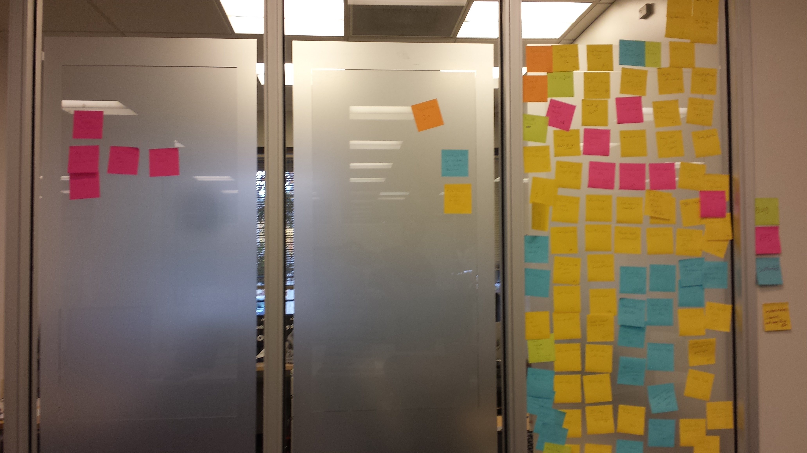

# Issue Tracking and Submission with JIRA

This section introduces how to use JIRA in order to search for, and post, bugs, feature requests, and various project tasks.

## JIRA - A Quick Overview

[JIRA](https://www.atlassian.com/software/jira) is the issue tracking system used by the ONOS project to keep track of various tasks and works-in-progress. These topics, called *issues,*are categorized based on:

* ***Type -***a general category, such as a bug, story, or new feature
* ***Priority -*** how crucial it is to address the issue
* ***Epics -*** an overarching theme, such as a specific use case, or a class of task, such as documentation or testing.
* ***Labels -*** subcategories not associated with specific Epics or Types, such as Starter tasks aimed at beginners.
* ***Sprint -*** a span of time associated with a deadline, such as a phase of the release cycle.

Essentially, each sprint is made up of a set of issues, each associated with an epic and zero or more labels. Any issues not included in a sprint are part of the ***backlog***.

An issue itself if identified by a JIRA-generated identifier of the form ***ONOS-<number>***. For example, the issue for creating this page in the wiki was [*ONOS-371*](https://jira.onosproject.org/browse/ONOS-371), a major-priority story part of the Documentation epic.

Atlassian provides some great tutorials on using Jira. Unfamiliar readers should therefore visit their [website.](https://www.atlassian.com/software/jira)

## Remaining Sections

The first section will discuss viewing, searching for, and taking issues on the ONOS JIRA. The second section will discuss how to create issues. The final section will describe how to submit feature proposals.

* [Finding, Claiming, and Working On Issues](issue-tracking-and-submission-with-jira/finding-claiming-and-working-on-issues.md)
* [Creating Issues: bugs, feature requests, documentation](issue-tracking-and-submission-with-jira/using-jira-to-create-an-issue-bugs-feature-requests-documentation.md)
* [Submitting a new feature proposal](issue-tracking-and-submission-with-jira/submitting-a-new-feature-proposal.md)

---

[Previous : Continuous Integration](continuous-integration.md)  
[Next :](issue-tracking-and-submission-with-jira/finding-claiming-and-working-on-issues.md)[Finding, Claiming, and Working On Issues](issue-tracking-and-submission-with-jira/finding-claiming-and-working-on-issues.md)

---
