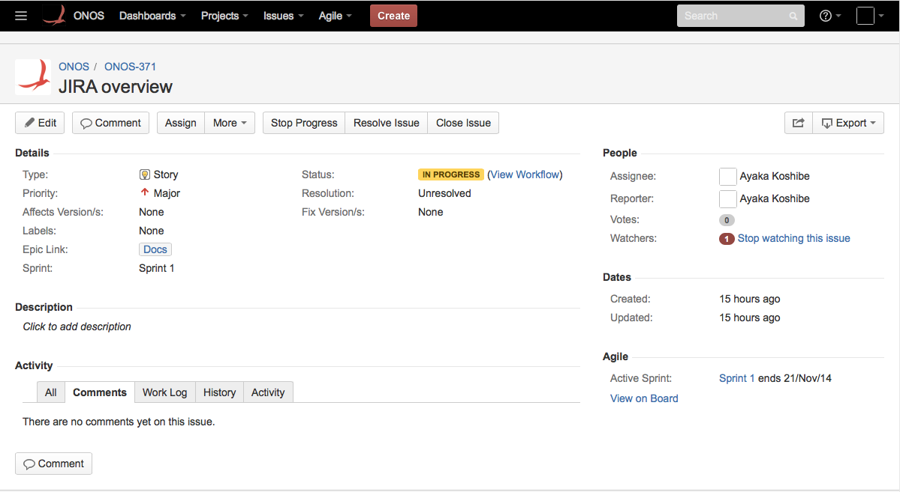
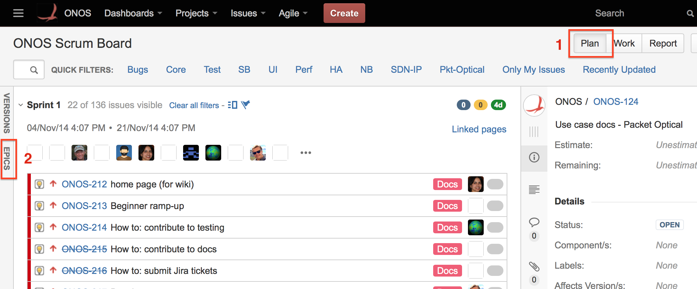
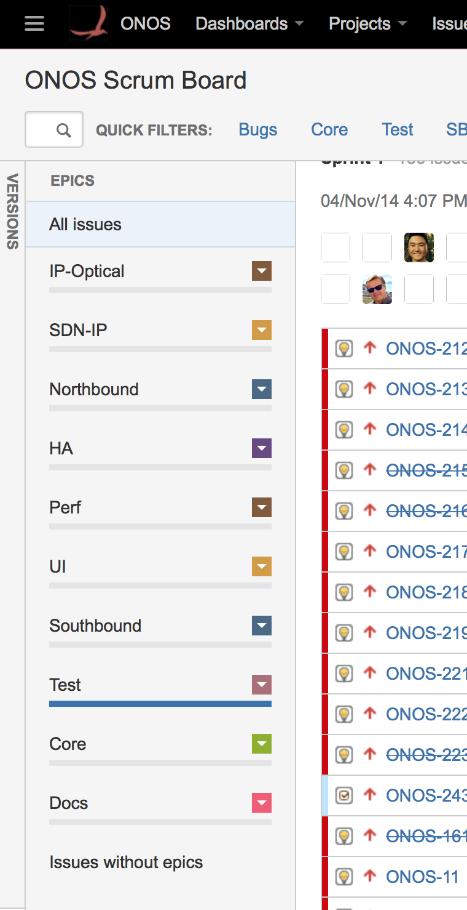
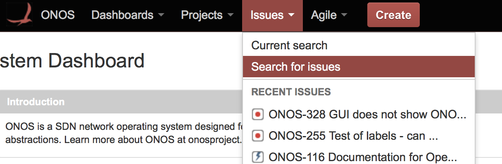
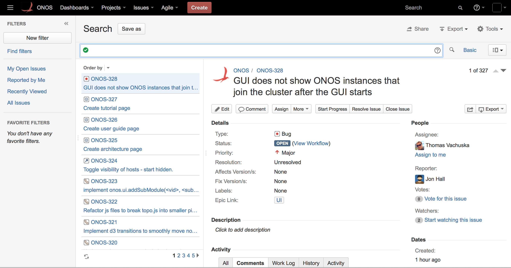
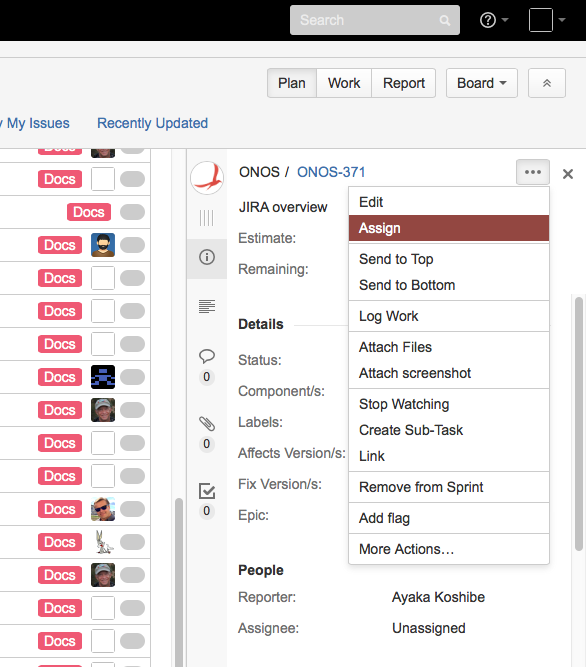
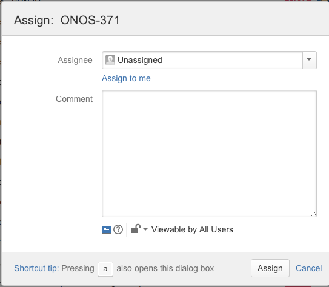
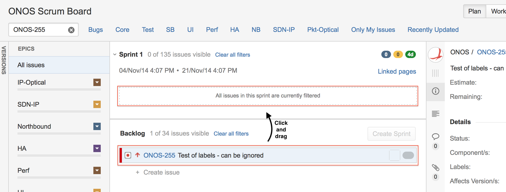
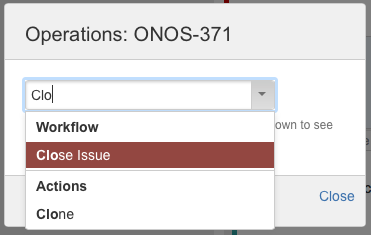
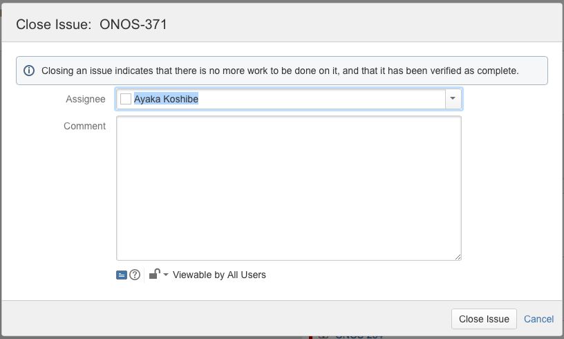

# Finding, Claiming, and Working On Issues

This section describes how to search JIRA for issues, as well as how to take ownership of them.

## The ONOS JIRA

The JIRA for the project is at <https://jira.onosproject.org>.

## Directly Searching for an Issue

If the issue's identifier is known, it can be entered in the search field found in the upper righthand corner of the page. If the issue is found, its *detailed view* will be displayed:



## Searching by Epics and Labels

### The ONOS Scrum Board

The ***Scrum board*** is the primary way to glean the state of the issues. The ONOS Scrum board is found by going to **Agile > ONOS Scrum Board**. The board has several views:

* **Plan -**A list of all issues, with the current sprint at top, and the backlog at the bottom. This is the default view of the Scrum board.
* **Work -** A *swim lane* view of the issues in the current sprint, with their assignees and current progress
* **Report -** A summary of the project's progress

All three views are accessible from the buttons in the top righthand corner of any Scrum board page. This section focuses on the first two views.

### Finding Issues by Epic

The available epic names can be found by going to the Scrum board Plan view (labeled 1 below) and clicking the **Epic** sidebar to the left (2 in same figure). It should display a list of Epics (categories), as shown in the right figure below.





Selecting an epic from this sidebar will filter the Plan view to display just the issues of that epic.

### Advanced Searching

More sophisticated searches may be done by going to **Issues > Search for Issues**.



This brings up the **Search** page:



Here, JIRA Query Language (JQL) may be used to filter for particular issues by any identifying fields. The query is entered at the field with the green check mark. For example:

```
"Epic Name" = UI AND status = OPEN
```

Returns all issues of the UI epic that are still open. More information about using JQL can be found [here](https://confluence.atlassian.com/display/JIRA063/Advanced+Searching).

## Claiming an Issue

To claim an issue from its detailed view, select ***'**Assign to me'*under the **People**field in the right column of the view.

Alternatively,an issue may be displayed as a side-panel in the Scrum board by clicking on it. To claim an issue from the side panel, select **Assign** from its dropdown (left), and select 'Assign to me' in the popup window (right): 

 





### Verification

One may verify that they are the owner of the issue by checking that their name is next to the **Assignee:** field of any view of the issue. Issues that are part of the on-going sprint will also appear in the swim lane view of the Scrum board, under the assignee's name, under the leftmost **To Do** column.

Moving issues from backlogs

To make an issue appear in the swim lane view, it must be moved from the backlog to the current sprint. This may be done from the plan view by searching for the issue, and when found, selecting and dragging the issue from under the backlog section to the current sprint:



Confirm when the Move Issue dialog box appears, and check the Work view again.

## Working on an Issue

### Issue Lifecycle

Each issue is also associated with a *status*. The lifecycle of an issue is a series of changes to its **Status field**, as follows:

* **Open** - issue is open and may or may not be assigned
* **In Progress** - issue is open, is assigned to someone, and work is in progress
* **Resolved** - the assigned person has declared that the issue has been addressed, and is now waiting to be verified - when the assigned person changes the issue status to resolved, that person must reassign the issue to the person who will do the verification
* **Reopened** - issue is not resolved and must be returned to the open status
* **Closed** - everyone agrees the issue has been addressed and should no longer be considered

For example, the sample workflow for a bug is:

* Tester finds a bug, opens an issue - it is now in **open** status
* Component owner or manager assigns the issue to a developer to re-create the bug and fix it
* Developer agrees it is a bug, sets the issue to '**in progress**', and fixes it as they see fit
* Developer moves the issue status to **resolved** and sets assignee to the tester who will validate the fix
  + Tester agrees it is resolved and moves issue to **closed** --or--
  + Tester disagrees it is resolved and moves issue to **reopened**, assigns it back to developer

### Using the Scrum Board Swim Lanes

The swim lane view provides a convenient way to quickly inspect the status of an issue based on which column they are in:

* An open or reopened issue is in the **To Do** (left) column.
* An issue in progress is in the **In Progress** (center) column.
* A closed or resolved issue is in the **Done** (right) column.

The status of an issue may be changed by dragging and dropping it between the three columns. There are a few points to be aware of when moving issues:

* **Closing issues -**The Done column has two areas: for resolved issues and closed issues. *As a convention of the project, issues should always be resolved before being closed.*

  To close a resolved issue, select it to bring up its side panel view and go to **dropdown > More Actions**. At the **Operations** popup (left), select **Close Issue** (or begin typing it to make it appear, and select). At the next **Close Issue** popup (right), add any comments and select Close Issue, at bottom right.

  

  
* **Reopening issues -**An issue that has been placed in the Done column must be moved to the To Do column before being moved back to the In Progress status.

---

[Previous : Issue Tracking and Submission with JIRA](../issue-tracking-and-submission-with-jira.md)[Next : Creating Issues](using-jira-to-create-an-issue-bugs-feature-requests-documentation.md) 

---
