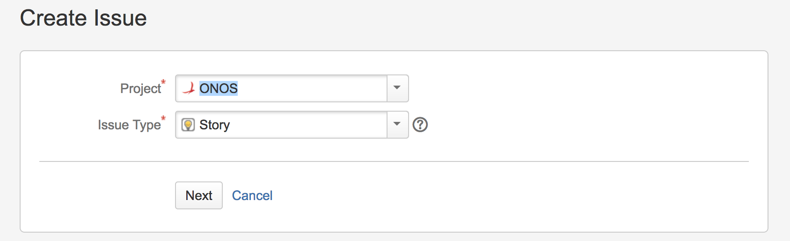
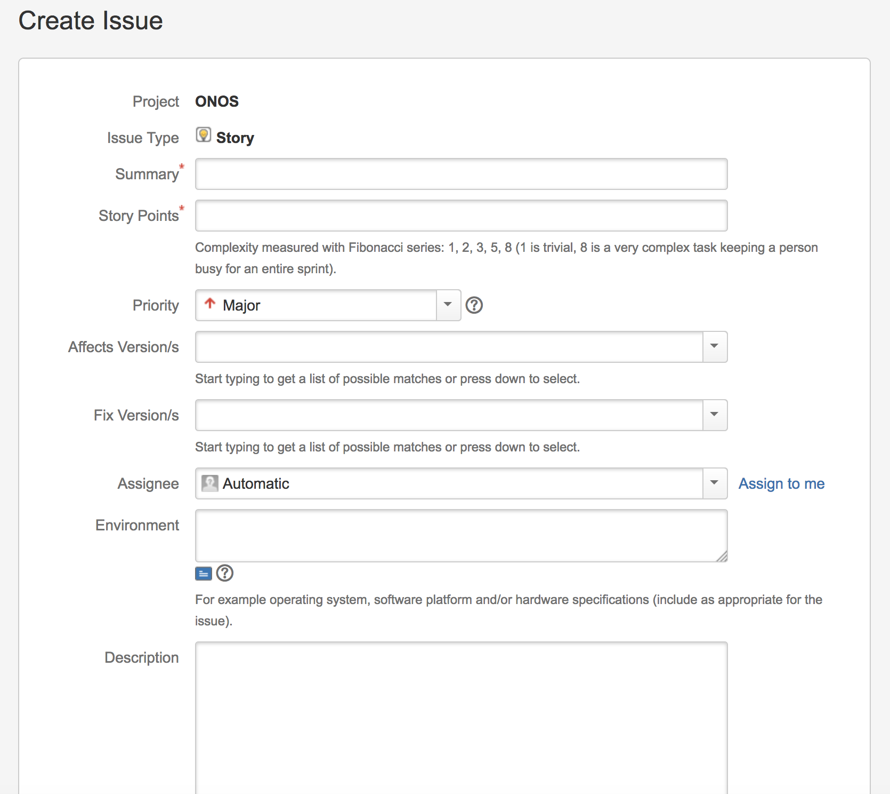
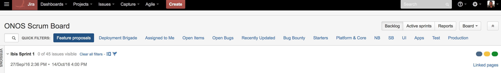

# Submitting a new feature proposal

This section describes the steps needed for submitting a new feature or project proposal.

## Types of proposals

Proposals are classified into the following types:

* The proposal is related to Core ONOS modules
* The proposal is for an external module or application or product that interacts with ONOS core.
* The proposal is related to Core ONOS modules as well as external modules that interact with ONOS.

## Submitting a Proposal

To submit a new feature proposal, [click here](https://jira.onosproject.org/secure/CreateIssue!default.jspa).

## Steps

1. Create a feature request in JIRA. Please select the **type** as "**Story**" and click Next.

2. Add "**proposal**" in the **Labels** field in JIRA and add the time estimate in the "Original Estimate" field ( if available).

**In the Description field in JIRA (see above), add the following details:**

1. Problem statement
   1. Use case or requirements
   2. The problem it is trying to solve
   3. Other alternatives that exist and why they are not adequate
2. Pointers to Proposal Documentation (Detailed Description, Implementation, design etc)  
   1. Pointers to documentation, websites etc
3. Testing needs of the proposal (if applicable)
   1. End user impact
      1. API changes
      2. Configuration changes
      3. Debugging changes
      4. Other changes
   2. Work items:
   1. 1. High level list of tasks along with approximate time estimates.
4. Dependencies
5. Assignees:
   1. 1. Proposal Point of contact: Name/email/Organization
      2. Will this project be driven externally by a single or group of organizations? If yes, provide details.

You can view all the submitted open feature requests and project proposals through the quick filter **"Feature proposals"** at the top of the ONOS Project in JIRA.

3. The ONOS Steering Teams and the ONOS product owner will review the feature requests/project proposals and determine next steps. Every new feature request should be reviewed and the next steps for it will be determined and the submitter of the proposal will be notified in, at a maximum, 15 days from the date of submission

---

[Previous : Creating Issues](using-jira-to-create-an-issue-bugs-feature-requests-documentation.md) [Next : Contributing to the ONOS Codebase](../contributing-to-the-onos-codebase.md)

---
