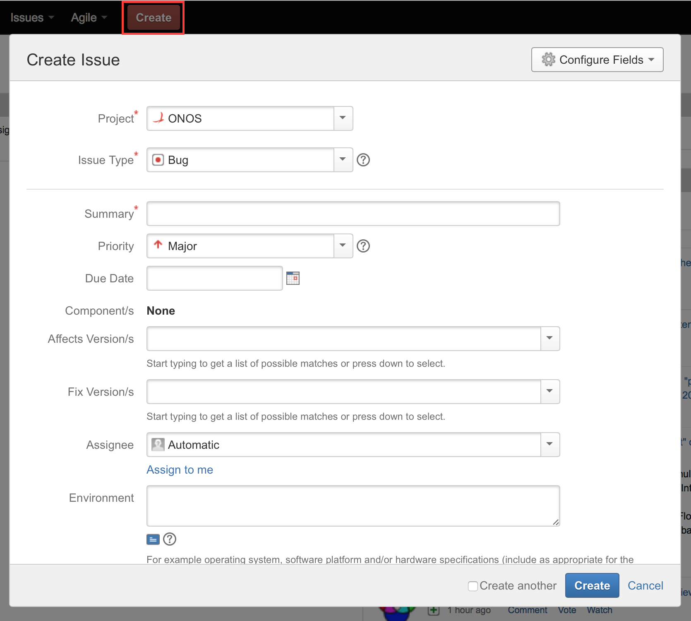
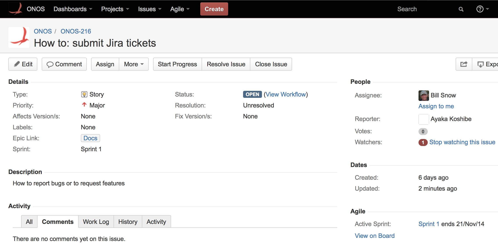

# Using Jira to create an issue: bugs, feature requests, documentation

This page describes how to submit tickets on JIRA.

## Creating an Issue

1. Go to the ONOS JIRA [page](http://jira.onosproject.org).
2. Select the ***Create*** button at the top of the page (outlined by a red box below). This will bring up the form to create an issue.  
     
     
     
   The fields of this form are:  
     
   * **Project** - select project, usually ONOS
   * **Issue type** - choose an issue type using these guidelines:
     + **bug** - the issue is reporting a defect
     + **epic -**this will be used by the product owner to create new epics - ****please do \***not\*** create issues of this type!****
     + ****story -**** the issue is a user story - typically for some larger change or improvement to ONOS

1. * **Summary** - enter a summary of the issue that is meaningful to someone reading only summaries in a list
   * **Story Points** - complexity measured with Fibonacci series: 1, 2, 3, 5, 8 (1 is trivial, 8 is a very complex task keeping a person busy for an entire sprint).
   * **Priority** - choose a priority for the issue, based on the viewpoint of the person requesting work to be done:

* + - **Blocker -**Highest priority, it is stopping people from doing work
    - **Critical -**Needs to be addressed right away
    - **Minor -**Can wait until blocker and critical issues are addressed
    - **Trivial -**very simple issue, address when possible

1. * **Affects Version(s)** - select versions affected if it is a bug, otherwise leave blank
   * **Fix Version(s)** - do not change, will be used by release management
   * **Assignee** - enter person assigned to the issue if known, else choose Automatic
   * **Environment** - enter information to help the person assigned understand the context of the issue - if it is a bug enter all of the relevant information about the environment in which the bug was found
   * **Description** - enter a description of the issue so that it is clear what is being addressed or requested
   * **Attachment** - attach any relevant documents for this issue (log files for a bug, for example)
   * **Labels** - add a label to help find related issues - ONOS defines some standard labels such as:
     + **Test** - for issues that are related to testing
     + **Starter** - easier issues good for beginners
   * **Epic Link** - select the epic to which the issue belongs, if there is one - ONOS will have well defined epics during each release cycle for the larger themes being worked on
   * **Sprint** - if using agile, enter the sprint in this field
2. Fill out the form and hit the create button. JIRA should generate an issue name linked to a summary of the created ticket:  
     
     
     
   If any of the fields need to be changed, the ***Edit*** button in the upper lefthand corner of the ticket will open an ***Edit Issue*** form with access to all of the fields. The issue should be visible in both the Work and Plan views of the Scrum board under **Agile > ONOS Scrum Board** or by searching for the ticket's name in the search bar.

## JIRA Issues FAQ

### How do I find an issue to work on?

If you are new to ONOS and want to ease into it, search for an issue that has the label "Starter" and which is not assigned. Then, assign yourself!

### How do I submit a new feature request or a project proposal?

You can follow the process described [here](#UsingJiratocreateanissue:bugs,featurerequests,documentation-Newf). Learn more about releases [here](https://wiki.onosproject.org/display/ONOS/Releases).

### Documentation vs Software - What is the difference?

The way that a documentation issue is different from a software issue is the epic. A documentation issue will have a documentation epic link.

### I created an issue, but I can't find it on the Scrum board!

Make sure that the issue's *Sprint* field is set to the current sprint, since the swim lane (the *work view*) only shows those. The *plan view* should show all open issues, including those outside of the current sprint under the Backlogs section.

---

[Previous : Finding, Claiming, and Working On Issues](finding-claiming-and-working-on-issues.md)  
[Next : Submitting a new feature proposal](submitting-a-new-feature-proposal.md)

---
