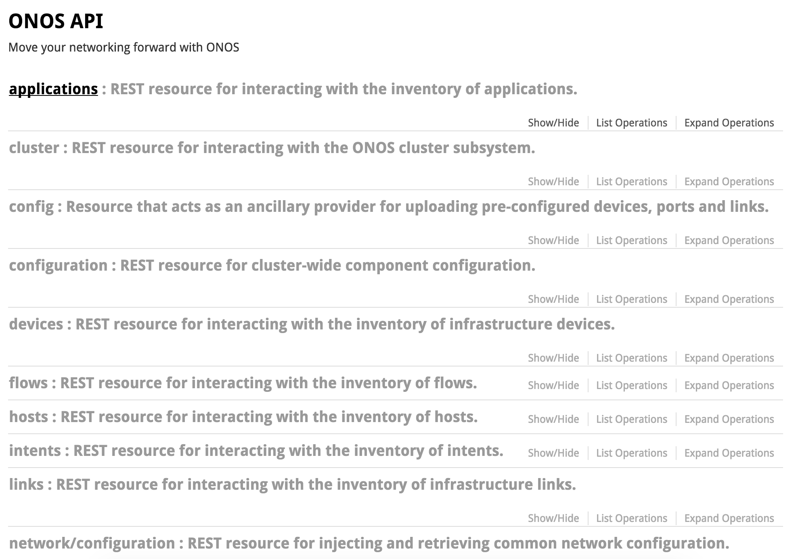
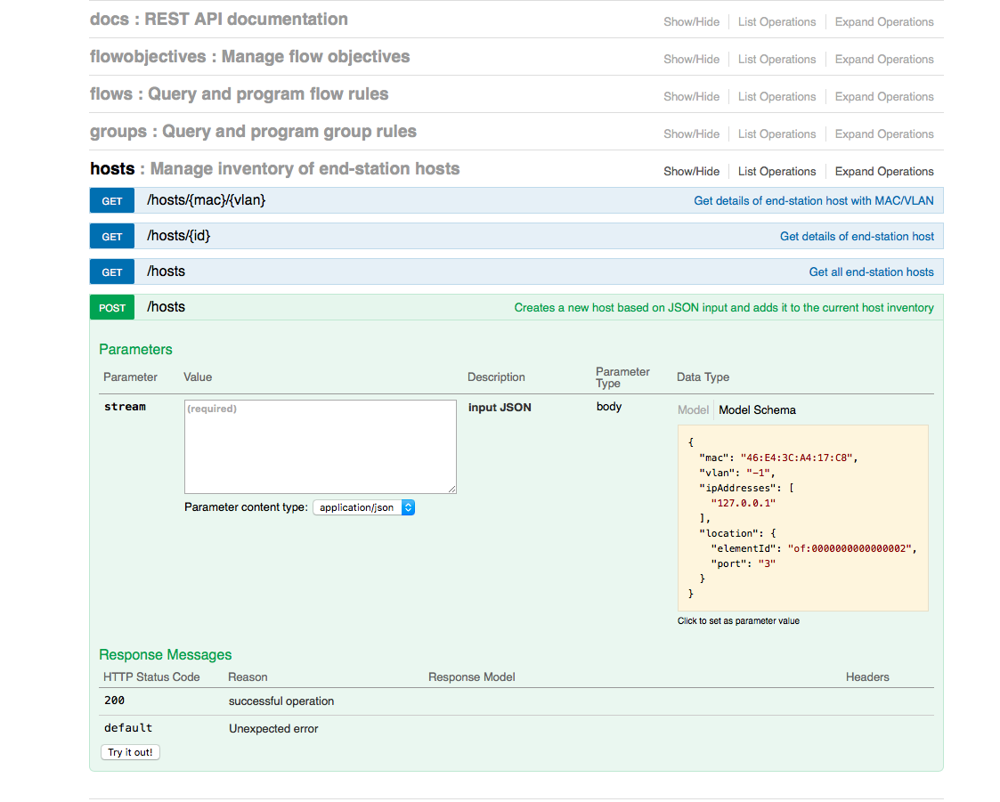

# Generating Swagger documentation for the REST API

## REST API Documentation (Swagger)

Swagger UI is a tool to visualize and document REST API's in a sandbox environment. The resource reads in the API specification from a single JSON file which is generated through the OnosSwaggerMojo class under the onos-maven-plugin. The OnosSwaggerMojo class allows flexibility by using QDox to sweep through API resource files and process annotations (JAX-RS and Javadocs) to build the JSON file using consumed by Swagger UI.

#### Creating the Documentation

OnosSwaggerMojo begins by looking for a "@path" annotation to decide whether a class contains REST API's. If it finds one it then:

* Creates a tag for the class so that all API's underneath a class are grouped together
* Searches through each method looking for API methods and documenting
  + Method type (Get, Post, Put, Delete), summary, description, tags (which class it belongs to)
  + Parameters: in (Path, Query, or Body), descriptions, type (String, integer, number, boolean), required
  + Swagger json schema: *@onos.rsModel <Json\_schema\_file\_name\_without\_extension>*javadoc annotation and a .json schema file in the dircrectory <app\_path>/src/main/resources/definitions. An example can be seen with the DHCP app.
* Responses: Types of response codes returned and their associated meanings
* Produces/consumes: application type returned or consumed by the API (ex. "application/json")

The JSON file is written to onos/web/api/target/classes/SwaggerConfig/SwaggerConfileFile.json

For further Swagger requirements/configuration see the [Swagger spec](https://github.com/swagger-api/swagger-spec/blob/master/versions/2.0.md#tagObject).

#### Using Swagger UI

Eventually the JSON file is fed into Swagger UI which provides a sandbox for using ONOS's REST API's:

The OnosSwaggerMojo can be used to generate Swagger compliant documentation for any REST API that applications on top of ONOS provide.
