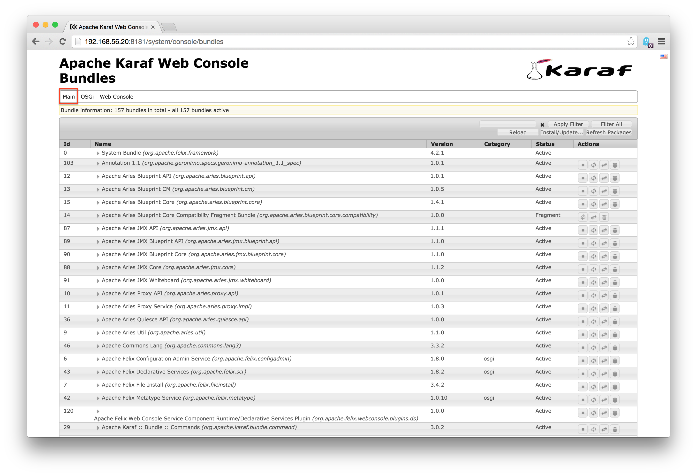
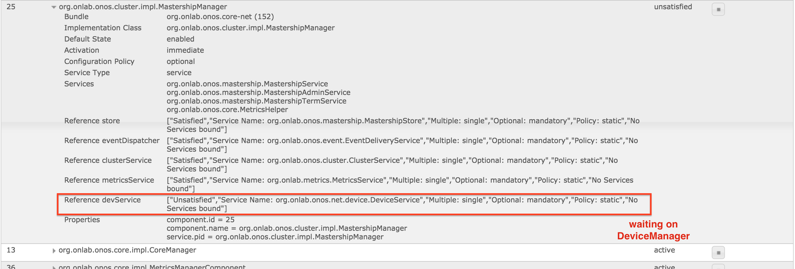
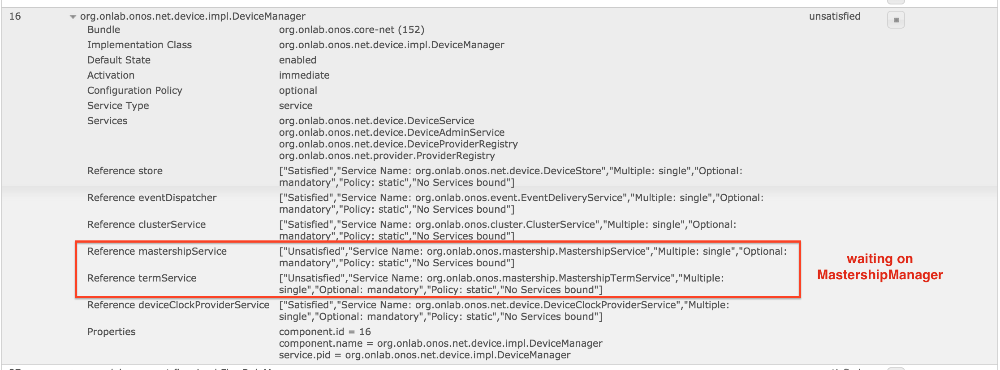
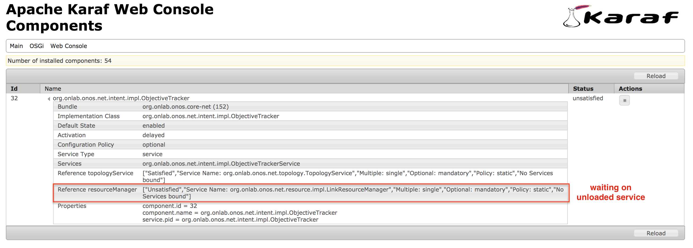

# Appendix D : Troubleshooting Multi-module Projects

This section discusses the troubleshooting process with respect to the multi-bundle/OSGi aspects of ONOS.

## Bundle Internals

As mentioned in [ONOS : An Overview](../architecture-and-internals-guide/onos-an-overview.md), ONOS is a multi-module project managed as OSGi bundles by Karaf.

Each bundle is represented by a Maven project with its own POM file, and each project may implement zero or more services defined by Java interfaces. The dependencies for a bundle are described by:

* **POM files -**  interdependencies between various projects, used by Maven during the build process
* **Annotations (e.g. `@Reference`) within the code -** interdependencies between various services, used by Karaf to resolve module dependencies during system startup and when loading bundles at runtime

Notably, both prohibit circular references, and the POM file hierarchy, the cross-linking of projects not indicated to be dependencies. As such, the following result in various failure modes:

1. **Not adhering to the dependencies indicated in the POM file(s).** One can attempt to reference or import a class from a package not listed as a dependency in the POM file. In addition to direct build failures, this may manifest as the IDE not recognizing the usage of certain packages within others.
2. **Circular annotation references among services.** Two services may be misconfigured to require one another as prerequisites to startup. This case may build correctly, but may prevent bundles and/or services from loading.
3. **Misconfiguration e.g. circular dependency references in the POM file(s).** POM files can be misconfigured such that they reference each other as dependencies. This will result in build failures.
4. **Reference to an implementation of a service.** While not a direct problem itself, referencing an implementation class, rather than an interface for a service, may result in unexpected behavior when code is refactored, e.g. in a way such that the reference crosses package boundaries. Referencing an implementation class may also prevent your module from resolving its dependencies at runtime, and cause it to fail to load.

We focus on the case where the project builds, but does not load properly, as in cases 2 and 4.

## Runtime Symptoms

Unloaded modules may manifest as failures of certain commands from the Karaf command line, and/or the absence of bundles in the output of `list`. As a contrived example, for a system with a circular dependency between two services:

* In DeviceManager.java:

  ```
      @Reference(cardinality = ReferenceCardinality.MANDATORY_UNARY)
      protected MastershipService mastershipService;
  ```
* In MastershipManager.java:

  ```
      @Reference(cardinality = ReferenceCardinality.MANDATORY_UNARY)
      protected DeviceService devService;
  ```

One finds that the project builds without errors, but many CLI commands do not work:

```
onos> roles
Service org.onlab.onos.net.device.DeviceService not found
```

Additionally, in the above case, `list` will show that all proper bundles are loaded, as the cyclically dependent Services are just a subset of services exported by `onos-core(-trivial)`.

An example of case 4 may be where one references `MastershipManager` (a class), instead of `MastershipService` (an interface) in the above snippet.

## Webconsole

The Karaf runtime may be viewed via the `webconsole` Web GUI. `webconsole` may be loaded at runtime at the CLI:

```
onos> feature:install webconsole
```

Alternatively, it can be loaded by appending `webconsole` to *featuresBoot* in *apache-karaf-3.0.2/etc/org.apache.karaf.features.cfg* .

To access, point a browser at the machine running karaf (in this example, 192.168.56.20):

```
http://192.168.56.20:8181/system/console
```

At this time, the username/password are the default *karaf*/*karaf*. The console should take you to a page displaying all bundles:



Selecting an entry in the list displays more information regarding the bundle, such as imported and exported packages and used services. Bundles may also be stopped, uninstalled, or restarted from here. Two views of particular interest in our case are (accessed from dropdown, highlighted in red above):

* **Main > features** - To view all available bundles, including ones not installed
* **Main > Components** - To view all services and their status

Returning to the cyclic dependency example -- While *onos-core-trivial* appears as ***installed*** in the *features* page:


the interdependent services reveal unmet dependencies (each other) on the *Components* page.

MastershipManager:



DeviceManager:



A similar diagnosis can be used to detect other forms of unmet dependencies, such as a service referencing an implementing class. In the example below, part of the Intent Framework was referencing an implementing class (`LinkResourceManager`) instead of the `LinkResourceService`. After the codebase was refactored, the service could not be found:



### Summary

As demonstrated above, cross-referencing the *bundles*, *features*, and *Components* views of `webconsole` provides better hints about what is going on than the Karaf CLI.

---

[Previous : Appendix C : Source Tree Organization](appendix-c-source-tree-organization.md)  
[Home : Developer's Guide](../developer-guide.md)

---
