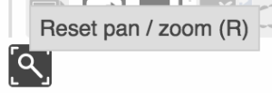
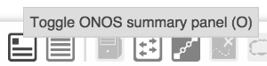
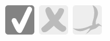

# UI Service - ButtonService

# ButtonService

ButtonService is an [Angular Factory](https://docs.angularjs.org/guide/services) in the [Widget module](https://wiki.onosproject.org/display/ONOS/UI+View+-+Framework+Libraries) with the name `button.js`. It provides an API to create buttons, toggles, and radio button sets. To use these functions, see the documentation on [injecting Angular services](https://docs.angularjs.org/guide/di).

| Name | Summary |
| --- | --- |
| `button` | Creates a button. |
| `toggle` | Creates a toggle. |
| `radioSet` | Creates a radio button set. |

# Function Descriptions

## button

Creates a button – an element that executes a function when clicked.

| Example Usage | Arguments | Return Value |
| --- | --- | --- |
| var button = bns.button(**`div`**, `id`, `gid`, `cb`, `tooltip`); | `div` - [d3 selection](https://github.com/mbostock/d3/wiki/Selections) of the div that the button will be in  `id` - globally unique button ID string  `gid` - the [glyph](ui-service-glyphservice.md) ID string to be used for the button  `cb` - a function reference to be executed when the button is clicked  `tooltip` - (optional) string of tooltip to appear on hover | creates a button with the given information  returns an object with an API (see below) |
| Returned API Example Usage | Arguments | Return Value |
| button.id; \* | none | string that is the ID of the button |
| button.width(); | none | number that is the width of the button plus padding (in pixels) |

> *\* This API property is not a function.*

An example of a button is the Reset pan / zoom button on the [Topology View](../../../administrator-guide/interacting-with-onos/the-onos-web-gui/gui-topology-view.md).



When clicked, the pan and zoom of the [Topology View](../../../administrator-guide/interacting-with-onos/the-onos-web-gui/gui-topology-view.md) is reset to the default. This is an example of an "execute once" type of function, which is what buttons are for. Also shown is the tooltip.

## toggle

Creates a toggle – an element that has state (selected or unselected) that executes a function on click.

| Example Usage | Arguments | Return Value |
| --- | --- | --- |
| var toggle = bns.toggle(`div`, `id`, `gid`, `initState`, `cb`, `tooltip`); | `div` - [d3 selection](https://github.com/mbostock/d3/wiki/Selections) of the div that the toggle will be in  `id` - globally unique toggle ID string  `gid` - the [glyph](ui-service-glyphservice.md) ID string to be used for the toggle  `initState` - whether the toggle should be "selected" or "unselected" to begin with. Truthy values will be active and falsy values will be inactive.  `cb` - a function reference to be executed when the toggle is clicked. This callback ("cb") function should take an argument of the selected state of the button.  `tooltip` - (optional) string of tooltip to appear on hover | creates a toggle with the given information |
| Returned API Example Usage | Arguments | Return Value |
| toggle.id \* | none | string that is the ID of the toggle |
| toggle.width(); | none | number that is the width of the toggle plus padding (in pixels) |
| toggle.selected(); | none | boolean of the state of the toggle  **true** - toggle is selected  **false** - toggle is unselected |
| toggle.toggle(); | none | this toggles the state of the button and *executes* `cb` with the selected state |
| toggle.toggleNoCb(); | none | toggles the state of the button but does *not execute* `cb` |

> *\* This API property is not a function.*

An example of a toggle is the ONOS summary panel toggle on the [Topology View](../../../administrator-guide/interacting-with-onos/the-onos-web-gui/gui-topology-view.md):



When the state of the toggle is "selected", the summary panel will be shown on the [Topology View](../../../administrator-guide/interacting-with-onos/the-onos-web-gui/gui-topology-view.md). When the state is "unselected", the summary panel will not be shown on the view. The callback function for this toggle takes into account the state of the toggle and will either show or hide the panel based on the state. Also shown is the tooltip.

## radioSet

Creates a radio button set – set of one or more elements that have state (one is selected at a time) that executes assigned functions when each are clicked.

| Example Usage | Arguments | Return Value |
| --- | --- | --- |
| var radioSet = radioSet(`div`, `id`, `rset`); | `div` - [d3 selection](https://github.com/mbostock/d3/wiki/Selections) of the div that the radio button set will be in  `id` - globally unique radio set ID string  `rset` - an array of objects.\* *Each object represents one radio button* and should have the following members:  `gid` - the [glyph](ui-service-glyphservice.md) ID string to be used for the button  `cb` - a function reference to be executed when this button is selected. The function can take two arguments - first, the array index of the button, and second the `key`.  `tooltip` - (optional) string of tooltip to appear on hover  `key` - (optional) a unique identifier for this button. If key is not given, then the array index of this object will be used instead. | creates a radio button set  returns an object with an API (see below) |
| Returned API Example Usage | Arguments | Return Value |
| radioSet.width(); | none | returns the width of the entire radio button set plus padding |
| radioSet.selected(`x`); | getter / setter function  `undefined` - if no argument is given, then the selected radio button's `key` (if it exists) or index is returned  **`x`** - selects the radio button with the specified key or index and invokes the corresponding `cb` | selected radio button's `key` or index if called with no arguments |
| radioSet.selectedIndex(x); | getter / setter function  `undefined` - if no argument is given, then the selected radio button's index is returned  **`x`** - selects the radio button with the specified index and invokes the corresponding `cb` | selected radio button's index if called with no arguments |

\* Note: the first object (button) in the rset array will be initially selected.

Example of creating a radio button set:

```
var radioSet = radioSet(d3.select('div.foo'),
						'foo-radio-set',
						[
							{
								gid: 'bird',
								cb: function (index, key) { /* do something */ },
								tooltip: 'Cool radio button 0',
								key: 'radioButton0'
							},
							{
								gid: 'checkMark',
								cb: function (index, key) { /* do something else */ },
								tooltip: 'Cool radio button 1',
								key: 'radioButton1'
							},
							{
								gid: 'xMark',
								cb: function (index, key) { /* do something different than the other two */ },
								tooltip: 'Cool radio button 2',
								key: 'radioButton2'
							}
						]);
```

An example of a radio button set is below.



Each of the above buttons has a different callback and only one is active at a time.
