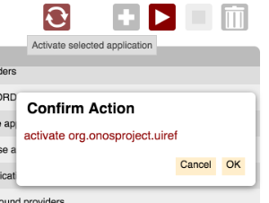

# UI Service - DialogService

# DialogService

DialogService is an *Angular Factory* in the [Layer module](../web-ui-client-side-framework-libraries.md) implemented by `dialog.js`. It provides an API to create (and show) a dialog panel with title, arbitrary content, and action buttons.

Here is the dialog in action in the [Application View](../../../administrator-guide/interacting-with-onos/the-onos-web-gui/gui-application-view.md):



| `Name` | `Summary` |
| --- | --- |
| `openDialog` | Opens (creates if necessary) the dialog. |
| `closeDialog` | Closes the dialog. |
| `createDiv` | Creates an unattached <div> element. |

# Function Descriptions

## openDialog

Creates the dialog panel if necessary, resets its content, then shows it on the screen. This function returns an API that allows the dialog box to be configured (more information below).

| Example Usage | Arguments | Return Value |
| --- | --- | --- |
| `dialog = ds.openDialog(id, opts);` | **`id`** - a unique DOM identifier **`opts`** - options for the dialog (see below) | an API to configure the dialog. See below. |

Both the ***id*** and ***opts*** arguments are passed through to the *createPanel()* function of the [PanelService](ui-service-panelservice.md).

The ***opts*** object is [angular.extended](https://docs.angularjs.org/api/ng/function/angular.extend) with the default options, shown below:

```
var defaultSettings = {
        width: 300,
        edge: 'left'
    };
```

If a ***cssCls*** property is defined on the options object, it's value is used as a CSS class that is applied to the dialog element.

closeDialog

Closes the dialog panel. This function is idempotent.

| Example Usage | Arguments | Return Value |
| --- | --- | --- |
| `ds.closeDialog();` | none | none |

Note that the user action of pressing one of the dialog buttons closes the dialog panel implicitly. Typically, `closeDialog()` should be invoked when navigating away from the view, to make sure the dialog is cleaned up if it was left open by the user.

## createDiv

Creates a detached `<div>` element, returning a D3 selection. Optionally, a CSS class may be specified to be applied to the element. 

| Example Usage | Arguments | Return Value |
| --- | --- | --- |
| ``` content = ds.createDiv('my-class'); content.append('p').text('Some text'); ``` | ***cssCls*** - optional CSS class to apply to the *div* element. | D3 selection of a detached *div* element. |

This is a convenience function to help in the construction of content for the dialog. See below for a more complete example.

# Dialog API

The API returned from `openDialog()` provides methods to set the title, add content, and add buttons.

| Example Usage | Arguments | Return Value |
| --- | --- | --- |
| `dialog.setTitle(title);` | **title** - the text to set as the title | dialog API |
| `dialog.addContent(content);` | **content** - a D3 selection to be appended to the content section of the dialog | dialog API |
| `dialog.addButton(cb, text, key, chained);` | **cb** - the callback function to be invoked when the button is pressed  **text** - the text to display on the button  **key** - the logical name of the keyboard key bound to the button  **chained** - boolean *true* prevents dialog from being hidden when the button is pressed | dialog API |
| `dialog.addOk(cb, text);` | **cb** - the callback function to be invoked when the button is pressed  **text** - the text to display on the button [defaults to "OK"] | dialog API |
| `dialog.addOkChained(cb, text);` | **cb** - the callback function to be invoked when the button is pressed  **text** - the text to display on the button [defaults to "OK"] | dialog API |
| `dialog.addCancel(cb, text);` | **cb** - the callback function to be invoked when the button is pressed  **text** - the text to display on the button [defaults to "Cancel"] | dialog API |
| `dialog.bindKeys();` | (none) | (none) |

Notes:

* ***addOk()*** is shorthand for invoking *addButton()* bound to the *enter* key, with *chained* == false
* ***addOkChained()*** is shorthand for invoking *addButton()* bound to the *enter* key, with *chained* == true
* ***addCancel()*** is shorthand for invoking addButton bound to the *escape* key, with *chained* == false
* specifying *chained* == true prevents the dialog from being dismissed; this allows the dialog to be reconfigured with a follow-on question
* ***bindKeys()*** is required to be called as the last function, to bind the keys to the key service.

The following dialog box might have code structured as listed below:


# A More Complete Example

```
// ds is a reference to the DialogService.
 
var dialogId = 'app-dialog',
    dialogOpts = {
        edge: 'right'
    };
 
function createConfirmationText(action, itemId) {
    var content = ds.createDiv();
    content.append('p').text(action + ' ' + itemId);
    return content;
}

function confirmAction(action) {
    var itemId = $scope.selId,
    spar = $scope.sortParams;

    function dOk() {
        $log.debug('Initiating', action, 'of', itemId);
        wss.sendEvent(appMgmtReq, {
            action: action,
            name: itemId,
            sortCol: spar.sortCol,
            sortDir: spar.sortDir
        });
    }

    function dCancel() {
        $log.debug('Canceling', action, 'of', itemId);
    }

    ds.openDialog(dialogId, dialogOpts)
        .setTitle('Confirm Action')
        .addContent(createConfirmationText(action, itemId))
        .addOk(dOk)
        .addCancel(dCancel)
        .bindKeys();
}
 
// e.g. confirmAction('activate');
//      $scope.selId contains the ID of the selected item
```

Notice how buttons added to the dialog appear right to left.

Also note, since `addButton()` takes just a function reference as its first argument, any data required for the function should be defined in the closure.
