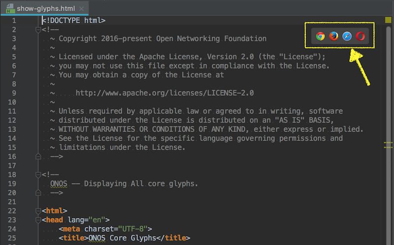
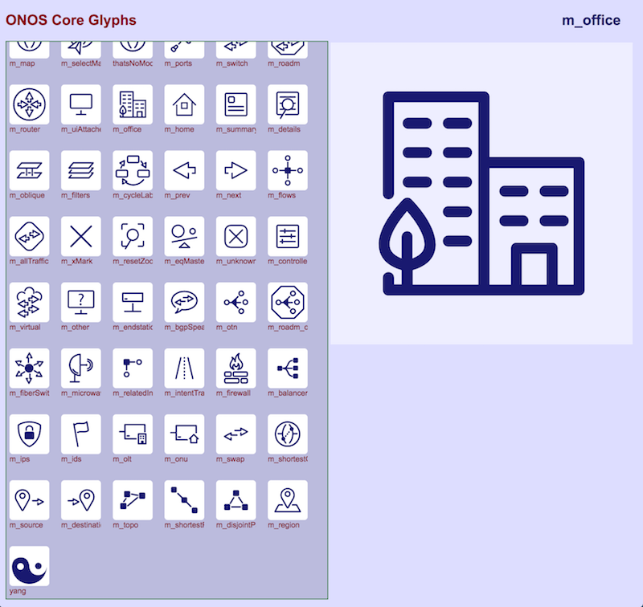

# UI Service - GlyphService

# Glyph Service

GlyphService is an [Angular Factory](https://docs.angularjs.org/guide/services) in the [SVG module](https://wiki.onosproject.org/display/ONOS/UI+View+-+Framework+Libraries) with the name `glyph.js`. It provides an API to load and inject custom glyphs ([SVG path data](http://www.w3.org/TR/SVG/paths.html)) to be used in the client-side application. To use this API, see the documentation on [injecting Angular services](https://docs.angularjs.org/guide/di).

## What is a glyph?

A glyph is an abstraction of an [HTML SVG](http://www.w3schools.com/svg/svg_inhtml.asp). An example of a glyph is below.


The red bird is the glyph. Glyphs are used throughout the client-side GUI for decoration and helpful indicators. They are drawn using SVG path data and colored/styled using CSS.

> See [All Glyphs](#UIServiceGlyphService-AllGlyphs) for a list of all glyphs and this [defining your own custom glyph](../../../../tutorials/web-ui-tutorials/ui-view-defining-a-custom-glyph.md) walk-through.

## API Functions

| Name | Summary |
| --- | --- |
| `clear` | Clears the glyph library. |
| `init` | Initializes the glyph library with default glyphs. |
| `registerGlyphs` | Register glyphs that each have their own custom [viewbox](https://developer.mozilla.org/en-US/docs/Web/SVG/Attribute/viewBox). |
| `registerGlyphSet` | Register a set of glyphs that all share the same [viewbox](https://developer.mozilla.org/en-US/docs/Web/SVG/Attribute/viewBox). |
| `ids` | Get all of the glyph names/ids currently in the library. |
| `glyph` | Get a specific glyph's path data. |
| `loadDefs` | Load a set of glyph symbols into a [SVG <defs>](https://developer.mozilla.org/en-US/docs/Web/SVG/Element/defs) element. |
| `addGlyph` | Add a defined glyph to a specified SVG element. |

# Function Descriptions

## clear

Clears the glyph library of all previously defined glyphs. This should only be used when cleaning up a session: **use this sparingly!**

| Example Usage | Arguments |
| --- | --- |
| gs.clear(); | none |

## init

Initializes the glyph library with default glyphs. This should only be used when starting up a session: **use this sparingly!**

See [all default glyphs](#UIServiceGlyphService-AllGlyphs) below.

| Example Usage | Arguments |
| --- | --- |
| gs.init(); | none |

## registerGlyphs

Register glyphs that each have their own custom [viewbox](https://developer.mozilla.org/en-US/docs/Web/SVG/Attribute/viewBox).

> Note: all glyph data must be a **single path**. See the [Adding a Custom Glyph](../../../../tutorials/web-ui-tutorials/ui-view-defining-a-custom-glyph.md) tutorial for more information.

| Example Usage | Arguments | Return Values |
| --- | --- | --- |
| gs.registerGlyphs(`data`, `overwrite`); | `data`: an object that contains viewboxes and key-value pairings of name-path data for the custom glyphs  `overwrite`: boolean that indicates whether duplicate glyph names in the library should be overwritten. Truthy values overwrite duplicates. | true if there were no issues adding glyph  false if there was   * a missing viewbox * a duplicate glyph id and overwrite was falsy |

```
// Example data format
var data = {
	_foo: '0 0 10 10',              // viewbox for foo
	foo: 'M2,4h6v2h-6z',            // foo path data
	_bar: '0 0 110 110',            // viewbox for bar
	bar: 'M2.5,2.5h5v5h-5z'         // bar path data
};
```

**The viewbox for a specific glyph should have the same name as the glyph, prefixed with an underscore ( \_ ).**

## registerGlyphSet

Register a set of glyphs that all share the same [viewbox](https://developer.mozilla.org/en-US/docs/Web/SVG/Attribute/viewBox).

> Note: all glyph data must be a **single path**. See the [Adding a Custom Icon](../../../../tutorials/web-ui-tutorials/ui-view-defining-a-custom-glyph.md) tutorial for more information.

 

| Example Usage | Arguments | Return Values |
| --- | --- | --- |
| gs.registerGlyphSet(`data`, `overwrite`); | `data`: an object that contains one viewbox and key-value pairings of name-path data for the custom glyphs  `overwrite`: boolean that indicates whether duplicate glyph names in the library should be overwritten. Truthy values overwrite duplicates. | true if there were no issues adding glyph  false if there was a duplicate glyph id and overwrite was falsy |

```
// Example data format
var data = {
	_viewbox: '0 0 110 110',         // viewbox for foo, bar, and baz
	foo: 'M2,2.5a.5,.5,0,0,1z',      // foo path data
	bar: 'M2.5,2l5.5,3l-5.5,3z',     // bar path data
	baz: 'M9.5,4.2c0,0-3.8z'         // baz path data
};
```

**The viewbox property must be prefixed with an underscore ( \_ ).**

## ids

Get all of the glyph names/ids currently in the library.

| Example Usage | Arguments | Return Value |
| --- | --- | --- |
| gs.ids(); | none | array of the glyph IDs currently in the glyph library |

## glyph

Get a specific glyph's path data.

| Example Usage | Arguments | Return Value |
| --- | --- | --- |
| gs.glyph(`id`); | `id`: the name (as a string) of the glyph whose path data you want | the path data of the glyph `id` given |

## loadDefs

Load a set of glyph symbols into a [SVG <defs>](https://developer.mozilla.org/en-US/docs/Web/SVG/Element/defs) element.

This function should be called before using any glyphs.

| Example Usage | Arguments | Default Params |
| --- | --- | --- |
| gs.loadDefs(`defs`, `glyphIds`, `noClear`); | `defs`: d3 selection of a single [<defs> element](https://developer.mozilla.org/en-US/docs/Web/SVG/Element/defs)  `glyphIds`: an array of glyph IDs to load  `noClear`: boolean value of whether old glyph [symbol elements](https://developer.mozilla.org/en-US/docs/Web/SVG/Element/symbol) should be removed. True means that old elements will be preserved upon loading the new definitions | **`glyphIds`**: if not specified (or contents are not an array), all glyphs currently in the glyph library will be loaded |

## addGlyph

Add a previously defined glyph to a specified SVG element.

> Note: the element you want to add the glyph to has to be within an <svg> tag or the <use> tag won't work!

| Example Usage | Arguments | Default Params | Return Value |
| --- | --- | --- | --- |
| gs.addGlyph(`elem`, `glyphId`, `size`, `overlay`, `trans`); | `elem`: d3 selection of the SVG element into which this glyph will go  `glyphId`: the name of the glyph you want to add  `size`: the size in pixels that the glyph will be (must be a number)  `overlay`: boolean of whether this glyph will overlay another glyph  `trans`: an array of (x,y) coordinates of translation | `size`: 40  `overlay`: false  `trans`: false | the d3 selection of the 'use' element just created for your glyph |

# The Glyphs

The core glyphs pre-defined in the Glyph library can be viewed with the following utility web page:

<https://github.com/opennetworkinglab/onos/blob/master/web/gui/src/main/webapp/_dev/show-glyphs.html>

IntelliJ has a feature where hovering the mouse near the top-right corner of the editor pane of an **.html** file will invoke a context menu of possible browsers to launch the page into:



So, loading ***show-glyphs.html*** into the editor and launching it, will open a page that loads and displays the glyphs in the library:


