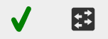
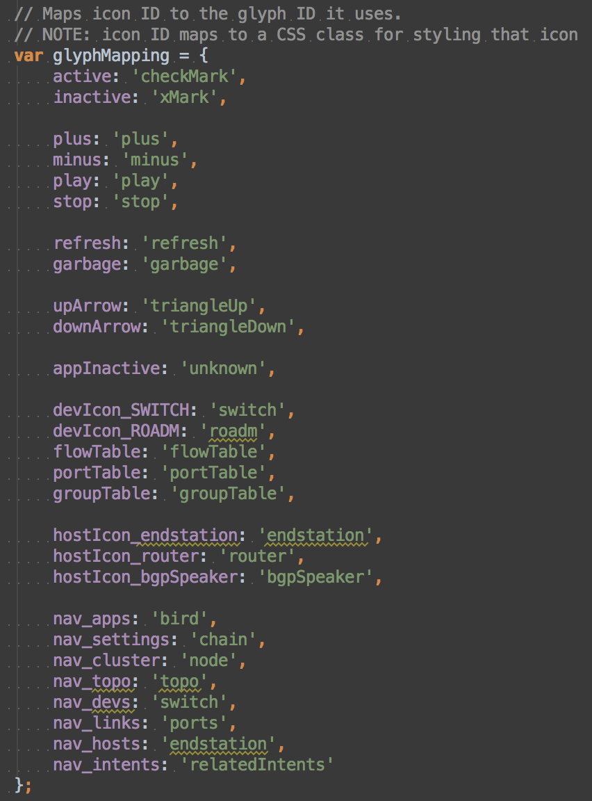

# UI Service - IconService

# IconService

The IconService is an [Angular Factory](https://docs.angularjs.org/guide/services) in the [SVG module](https://wiki.onosproject.org/display/ONOS/UI+View+-+Framework+Libraries) with the name `icon.js`. It provides an API to inject pre-installed icons (based on [glyphs](ui-service-glyphservice.md)) to be used in the client-side application. To use this API, see the documentation on [injecting Angular services](https://docs.angularjs.org/guide/di).

## What is an icon?

An icon is a higher level of abstraction for the [GlyphService](ui-service-glyphservice.md). It is used as a lookup for predefined glyphs to quickly create an [SVG element](http://www.w3schools.com/svg/svg_inhtml.asp). Icons are used in an [HTML attribute](http://www.w3schools.com/html/html_attributes.asp) in a directive to quickly insert dynamic icons into the GUI. There is also an API to quickly insert icons via the IconService instead of going through the [GlyphService](ui-service-glyphservice.md).

Icons are in the [Device View](../../../administrator-guide/interacting-with-onos/the-onos-web-gui/gui-device-view.md). Below is a checkmark icon and a device switch icon as examples.



Notice how these are still SVG glyphs. The only difference is that they were inserted using the IconService via an icon directive.

## API Functions

| Name | Summary |
| --- | --- |
| `loadIcon` | Creates an icon with the given *glyph ID*. |
| `loadIconByClass` | Create an icon with the given *icon lookup*. This function provides more options than `loadEmbeddedIcon`. |
| `loadEmbeddedIcon` | Create an icon with the given *icon lookup*. |
| `addDeviceIcon` | Adds a device icon to the given element. |
| `addHostIcon` | Adds a host icon to the given element. |
| `iconConfig` | Returns the configuration for device and host icons in the [Topology View](../../../administrator-guide/interacting-with-onos/the-onos-web-gui/gui-topology-view.md). |
| `sortIcons` | Returns an API (used in [Tabular views](../../../administrator-guide/interacting-with-onos/the-onos-web-gui/gui-tabular-view.md)) for adding ascending and descending icons, and removing them. |
| `registerIconMapping` | Registers an icon-to-glyph mapping. |

## Directive

| Name | Other Attributes | Summary |
| --- | --- | --- |
| `icon` | icon-id, icon-size | Creates an icon in the HTML element with the given ID of the given size. |

# Function Descriptions

## loadIcon

Loads an SVG icon into the given div using a glyph ID instead of an [icon lookup](#UIServiceIconService-IconLookup).

| Example Usage | Arguments | Default Parameters | Return Value |
| --- | --- | --- | --- |
| is.loadIcon(**`div`**, **`glyphId`**, **`size`**, **`installGlyph`**, **`svgClass`**); | **`div`** - [d3 selection](https://github.com/mbostock/d3/wiki/Selections) of the div where the icon should be loaded  **`glyphId`** - string of the glyph ID of the glyph you would like to have as the icon  `size` - number in pixels that represents one side's length of the icon (a square)  `installGlyph` - a truthy value will load the icon into the [glyph defs element](ui-service-glyphservice.md)  `svgClass` - string of a CSS class to identify the SVG layer | If any of the following values are undefined, they will be given the following default values.  `glyphID` - 'unknown'  `size` - 20  `installGlyph` - false  `svgClass` - 'embeddedIcon' | an icon will be created in the given div, no return value |

## loadIconByClass

Loads an SVG icon into the given div using an [icon lookup](#UIServiceIconService-IconLookup). This calls the loadIcon function. The main difference is that the SVG group element will have **`iconCls`** as a class.

| Example Usage | Arguments | Default Parameters | Return Value |
| --- | --- | --- | --- |
| is.loadIconByClass(**`div`**, **`iconCls`**, **`size`**, **`installGlyph`**, **`svgClass`**); | **`div`** - [d3 selection](https://github.com/mbostock/d3/wiki/Selections) of the div where the icon should be loaded  **`iconCls`** - string of the icon lookup that maps to a glyph ID  `size` - number in pixels that represents one side's length of the icon (a square)  `installGlyph` - a truthy value will load the icon into the [glyph defs element](ui-service-glyphservice.md)  `svgClass` - string of a CSS class to identify the SVG layer | If any of the following values are undefined, they will be given the following default values.  `iconCls` - 'unknown' will be used if the icon lookup couldn't be found mapped to a glyph  `size` - 20  `installGlyph` - false  `svgClass` - 'embeddedIcon' | creates an icon, no return value |

## loadEmbeddedIcon

An abstraction of loadIconByClass – it always installs the glyph defs element.

| Example Usage | Arguments | Default Parameters | Return Value |
| --- | --- | --- | --- |
| is.loadEmbeddedIcon(**`div`**, **`iconCls`**, **`size`**); | **`div`** - [d3 selection](https://github.com/mbostock/d3/wiki/Selections) of the div where the icon should be loaded  **`iconCls`** - string of the icon lookup that maps to a glyph ID  `size` - number in pixels that represents one side's length of the icon (a square) | If any of the following values are undefined, they will be given the following default values.  `iconCls` - 'unknown' will be used if the icon lookup couldn't be found mapped to a glyph  `size` - 20 | creates an icon, no return value |

## addDeviceIcon

Shortcut function to add a device icon to the [Topology View](../../../administrator-guide/interacting-with-onos/the-onos-web-gui/gui-topology-view.md).

| Example Usage | Arguments | Return Value |
| --- | --- | --- |
| is.addDeviceIcon(`elem`, `glyphId`); | `elem` - [d3 selection](https://github.com/mbostock/d3/wiki/Selections) of the SVG element of where the icon should be  `glyphId` - string of the glyph ID to use | d3 selection of the [group element](https://developer.mozilla.org/en-US/docs/Web/SVG/Element/g) that contains the icon |

## addHostIcon

Shortcut function to add a host icon to the [Topology View](../../../administrator-guide/interacting-with-onos/the-onos-web-gui/gui-topology-view.md).

| Example Usage | Arguments | Return Value |
| --- | --- | --- |
| is.addHostIcon(`elem`, **`radius`**, `glyphId`); | `elem` - [d3 selection](https://github.com/mbostock/d3/wiki/Selections) of the SVG element of where the icon should be  `radius` - the radius of the circle that the host icon will be in  `glyphId` - string of the glyph ID to use | d3 selection of the [group element](https://developer.mozilla.org/en-US/docs/Web/SVG/Element/g) that contains the icon |

## iconConfig

Returns the configuration for device and host icons in the [Topology View](../../../administrator-guide/interacting-with-onos/the-onos-web-gui/gui-topology-view.md).

| Example Usage | Arguments | Return Value |
| --- | --- | --- |
| is.iconConfig(); | none | an object with icon configuration information for device and host icons – access these through the tags 'device' and 'host' |

## sortIcons

Returns an API to manipulate the sort icons used in the [Tabular Views](../../../administrator-guide/interacting-with-onos/the-onos-web-gui/gui-tabular-view.md) for sort direction.

| Example Usage | Arguments | Return Value |
| --- | --- | --- |
| var sortAPI = is.sortIcons(); | none | an object containing an API (see below) |
| Returned API Example Usage | Arguments | Return Value |
| sortAPI.sortAsc(`div`); | **`div`** - [d3 selection](https://github.com/mbostock/d3/wiki/Selections) of the div where the icon should be loaded | creates an up arrow for ascending sort direction, no return value |
| sortAPI.sortDesc(`div`); | **`div`** - [d3 selection](https://github.com/mbostock/d3/wiki/Selections) of the div where the icon should be loaded | creates a down arrow for ascending sort direction, no return value |
| sortAPI.sortNone(`div`); | **`div`** - [d3 selection](https://github.com/mbostock/d3/wiki/Selections) of the div that contains the icon that should be removed | removes the contents of `div`, no return value |

## registerIconMapping

Registers an icon-to-glyph mapping 

| Example Usage | Arguments | Return Value |
| --- | --- | --- |
| is.registerIconMapping(**`iconId`**, **`glyphId`**); | `iconId` - the new icon ID to be added to the map  `glyphId` - the ID of a glyph in the glyph library | None |

# Directive

## icon

Icons are also able to be loaded into HTML elements through an [Angular directive](https://docs.angularjs.org/guide/directive).

### Example Usage in HTML

```
<div icon icon-id="active" icon-size="36"></div>
```

The `icon` directive calls [loadEmbeddedIcon](#UIServiceIconService-loadEmbeddedIcon) for you. In this example, the "checkMark" glyph will be used, because it matches up to the "active" icon class.

Make sure the `icon` directive is inside a div that can have elements dynamically appended to it.

### Attributes Used

| Attribute | Description | Default Value |
| --- | --- | --- |
| `icon-id` (required) | the [icon lookup](#UIServiceIconService-IconLookup) to match icon to glyph | (there is no default) |
| `icon-size` (optional) | the size in pixels of one side of the icon (icons are square) | the Number 20 |

You can also have an [Angular interpolated value](https://docs.angularjs.org/api/ng/service/$interpolate) as the `icon-id`, and the icon glyph will be updated automatically. This approach is used in the [Tabular Views](../../../administrator-guide/interacting-with-onos/the-onos-web-gui/gui-tabular-view.md) to dynamically change the icon indicating active or inactive status. Below is an example from the [Device View](../../../administrator-guide/interacting-with-onos/the-onos-web-gui/gui-device-view.md):

```
<div icon icon-id="{{dev._iconid_available}}"></div>
```

# Icon Lookup

Below is a mapping of icon lookup keys to the glyph IDs they correspond to. Also see the [list of all glyphs](ui-service-glyphservice.md).


