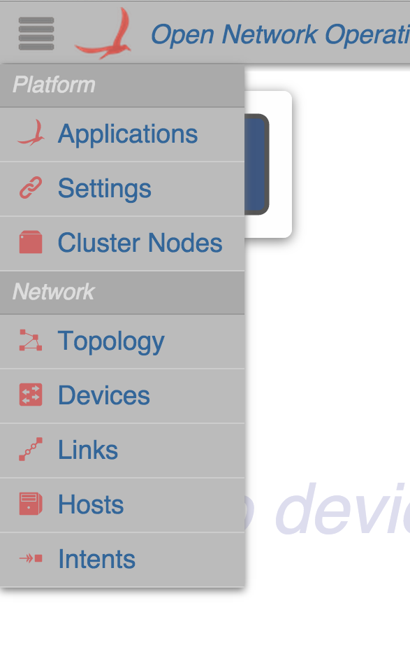

# UI Service - NavService

# NavService - Navigation Service

NavService is an [Angular Factory](https://docs.angularjs.org/guide/services) in the [Nav module](https://wiki.onosproject.org/display/ONOS/UI+View+-+Framework+Libraries) with the name `nav.js`. It provides functions to control the navigation pane and navigating between views. To use these functions, see the documentation on[injecting Angular services](https://docs.angularjs.org/guide/di).

ONOS Navigation Pane:

| Name | Summary |
| --- | --- |
| `showNav` | Show the navigation pane. |
| `hideNav` | Hide the navigation pane. |
| `toggleNav` | Toggle the navigation pane between shown and hidden. |
| `hideIfShown` | Hides the navigation if it is shown. |
| `navTo` | Navigate to the given path with optional query parameters. |

# Function Descriptions

## showNav

Show the navigation pane.

| Example Usage | Arguments | Return Values |
| --- | --- | --- |
| ns.showNav(); | none | none |

## hideNav

Hide the navigation pane.

| Example Usage | Arguments | Return Values |
| --- | --- | --- |
| ns.hideNav(); | none | none |

## toggleNav

Toggle the navigation pane between shown and hidden. If the navigation pane is shown, then the pane will toggle to hidden, and vice versa.

| Example Usage | Arguments | Return Values |
| --- | --- | --- |
| ns.toggleNav(); | none | none |

## hideIfShown

Hides the navigation pane if it is shown.

| Example Usage | Arguments | Return Values |
| --- | --- | --- |
| ns.hideIfShown(); | none | **true** - if the pane was changed to hidden  **false** - if the pane was already hidden |

## navTo

Navigate to the given path (within the ONOS GUI views) with optional query parameters.

| Example Usage | Arguments | Return Values |
| --- | --- | --- |
| ns.navTo(**`path`**, **`params`**); | **`path`** - the path to navigate to (without the first slash)  **`params`** - an object with a list of the query parameters you want in the URL | none, but the page will navigate to the new GUI view |

For example, to navigate to the Foo View with a query parameter of bar:

`ns.navTo('foo', { bar: baz });`

This will navigate to the URL: *http://<DOMAIN>:<PORT>/onos/ui/index.html#/**foo**?**bar**=**baz***
