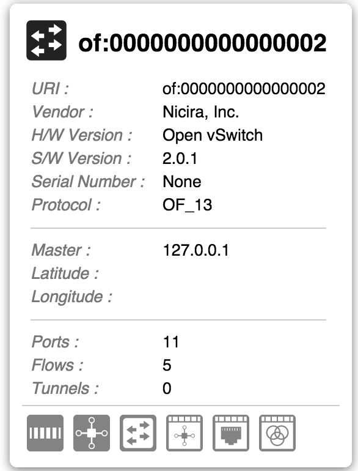

# UI Service - PanelService

PanelService is an [Angular Factory](https://docs.angularjs.org/guide/services) in the [Layer module](https://wiki.onosproject.org/display/ONOS/UI+View+-+Framework+Libraries) with the name `panel.js`. It allows you to create and control floating panels on the view. To use these functions, see the documentation on [injecting Angular services](https://docs.angularjs.org/guide/di).

An example of a panel is the details panel on [Topology View](../../../administrator-guide/interacting-with-onos/the-onos-web-gui/gui-topology-view.md).



| Name | Summary |
| --- | --- |
| `init` | Initializes the PanelService. |
| `createPanel` | Creates a panel with specified name and options. |
| `destroyPanel` | Destroys panel with the given name. |

# Function Descriptions

## init

Initializes the PanelService. You probably won't have to call this, since it is initialized when the UI starts.

| Example Usage | Arguments | Return Value |
| --- | --- | --- |
| ps.init(); | none | none |

## createPanel

Creates a panel with specified name and options.

| Example Usage | Arguments | Return Value |
| --- | --- | --- |
| var panel = ps.createPanel(`id`, `opts`); | `id` - string with a unique ID to be used to identify the panel  `opts` - object with options for how the panel should be created (see below) | an object with an API that contains actions that can be performed on the panel |
| Returned API Example Usage | Arguments | Return Value |
| panel.show(`cb`); | `cb` - (optional) a function reference to be executed after the panel is done animating into the shown position | none  The panel is now on the screen. |
| panel.hide(`cb`); | `cb` - (optional) a function reference to be executed after the panel is done animating into the hidden position | none  The panel is now off screen. If hideMargin was specified (see below) the panel will be visible for that pixel amount. |
| panel.toggle(`cb`); | `cb` - (optional) a function reference to be executed when the panel is done animating into the shown or hidden position | boolean of if the panel is currently showing  The panel will be on or off screen - the opposite of what it was before. |
| panel.empty(); | none | [d3 selection](https://github.com/mbostock/d3/wiki/Selections) of the panel element  The panel's contents are now empty. |
| panel.append(`what`); | `what` - string of the element tag to append to the panel. An example would be 'div'. | [d3 selection](https://github.com/mbostock/d3/wiki/Selections) of the panel element |
| panel.width(**`w`**); | `w` - (optional) Number value to set the panel's width to  This function is getter/setter. | if **`w`** is `undefined`, the panel's current width (as a number) is returned  if **`w`** is defined, no return value |
| panel.height(**`h`**); | `h` - (optional) Number value to set the panel's height to  This function is getter/setter. | if **`h`** is `undefined`, the panel's current height (as a number) is returned  if **`h`** is defined, no return value |
| panel.isVisible(); | none | boolean of if the panel currently showing |
| panel.classed(`cls`, `bool`); | `cls` - string of the class  `bool` - truthy value adds the class, falsy value removes the class | [d3 selection](https://github.com/mbostock/d3/wiki/Selections) of the panel element |
| panel.el(); | none | [d3 selection](https://github.com/mbostock/d3/wiki/Selections) of the panel element |

### Options for Creating a Panel

These are the default settings that are used in creating a panel. You can overwrite them by providing an object for `opts`.

```
var settings = {
	edge: 'right',          // edge of the screen the panel shows and hides from - top, bottom, left, right
	width: 200,             // width of the panel in pixels
	margin: 20,             // distance (pixels) from 'edge' to side of panel (when shown)
	hideMargin: 20,         // distance (pixels) from 'edge' to side of panel (when hidden)
									// negative numbers show the panel when it's "offscreen"
	xtnTime: 750,           // animation time for the panel to transition from shown to hidden
	fade: true              // whether the panel fades on and off screen in transition
};
// height is a setting you can also provide (there is no default height)
```

## destroyPanel

Destroys panel with the given name. You generally want to do this when the view changes.

| Example Usage | Arguments | Return Value |
| --- | --- | --- |
| ps.destroyPanel(`id`); | `id` - string of the unique ID of the panel that you want to destroy | none  the panel has been destroyed |
