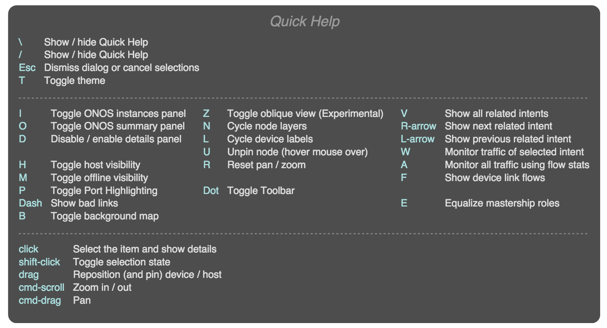

# UI Service - QuickHelpService

QuickHelpService is an [Angular Factory](https://docs.angularjs.org/guide/services) in the [Layer module](https://wiki.onosproject.org/display/ONOS/UI+View+-+Framework+Libraries) with the name `quickhelp.js`. It is used to create a quick help panel for the view via the [KeyService](ui-service-keyservice.md). To use these functions, see the documentation on [injecting Angular services](https://docs.angularjs.org/guide/di).

## What is the Quick Help Panel?

Below is a screenshot of the Quick Help Panel on the [Topology View](../../../administrator-guide/interacting-with-onos/the-onos-web-gui/gui-topology-view.md).

| Name | Summary |
| --- | --- |
| `initQuickHelp` | Initialize the QuickHelpService. |
| `showQuickHelp` | Show the Quick Help Panel with current key bindings. |
| `hideQuickHelp` | Hide the Quick Help Panel. |

# Function Descriptions

## initQuickHelp

Initialize the QuickHelpService. You can call this if you would like to change the custom settings.

| Example Usage | Arguments | Return Value |
| --- | --- | --- |
| qhs.initQuickHelp(opts); | opts - (optional) an object with custom settings:  fade: Number of how long the animation fade time should be | none |

## showQuickHelp

Show the Quick Help Panel with current key bindings. Currently, this is called in the [KeyService](ui-service-keyservice.md).

| Example Usage | Arguments | Return Values |
| --- | --- | --- |
| qhs.showQuickHelp(`bindings`); | `bindings` - an object. See the [KeyService Key Mappings](ui-service-keyservice.md) for the correct formatting. | if bad bindings were received, returns `null`  if the Quick Help Panel was already showing, will hide the panel and return true  otherwise, no return value and it will show the panel |

## hideQuickHelp

| Example Usage | Arguments | Return Value |
| --- | --- | --- |
| qhs.hideQuickHelp(); | none | true - if the Quick Help Panel was hidden  false - if the Quick Help Panel was already hidden when this was called |
