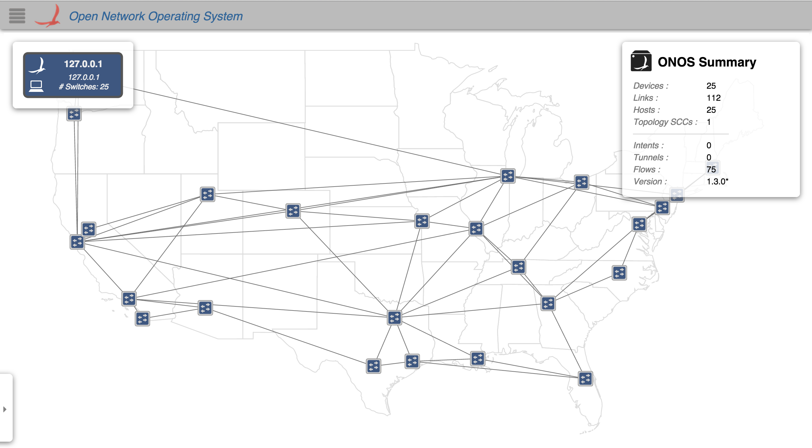
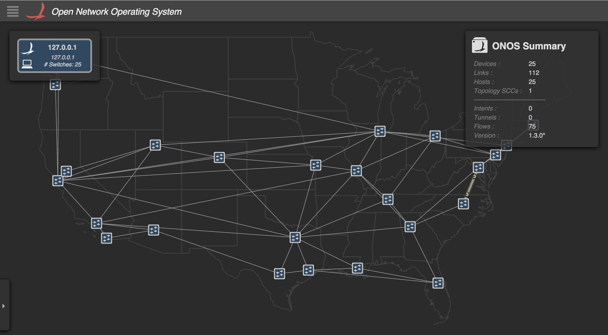

# UI Service - ThemeService

# ThemeService

ThemeService is an [Angular Factory](https://docs.angularjs.org/guide/services) in the [Util module](https://wiki.onosproject.org/display/ONOS/UI+View+-+Framework+Libraries) with the name `theme.js`. It provides an API to programmatically get and set the theme (color scheme) and to add theme listeners. To use these functions, see the documentation on [injecting Angular services](https://docs.angularjs.org/guide/di).

## Current Themes

The ONOS GUI currently has two themes that can be toggled between by pressing the T key on any view.

The Light Theme on the [Topology View](../../../administrator-guide/interacting-with-onos/the-onos-web-gui/gui-topology-view.md). The theme name is 'light'.

The Dark Theme on the [Topology View](../../../administrator-guide/interacting-with-onos/the-onos-web-gui/gui-topology-view.md). The theme name is 'dark'.

| Name | Summary |
| --- | --- |
| `init` | Initializes the ThemeService and sets the current theme. |
| `theme` | Gets or sets the current theme. |
| `toggleTheme` | Toggle the current theme to the next theme in the theme list. |
| `addListener` | Add a listener to a theme event. |
| `removeListener` | Remove a theme event listener. |

# Function Descriptions

## init

Initializes the ThemeService and sets the current theme. You probably won't have to call this because the ThemeService is initialized in onos.js.

| Example Usage | Arguments | Return Value |
| --- | --- | --- |
| ts.init(); | none | none |

## theme

Gets or sets the current theme. This function is getter/setter.

| Example Usage | Arguments | Return Value |
| --- | --- | --- |
| ts.theme(**`x`**); | `x` - `undefined` or a string of the name of theme you want to set the current theme to | if **`x`** is `undefined` - a string of the name of the current theme  if **`x`** is a string - no return value |

## toggleTheme

Toggle the current theme to the next theme in the theme list. Currently it toggles between the 'light' and 'dark' themes (see above).

| Example Usage | Arguments | Return Value |
| --- | --- | --- |
| ts.toggleTheme(); | none | the current theme that it was toggled to as a string |

## addListener

Add a listener to a theme event. Currently, the only theme event is "themeChange".

| Example Usage | Arguments | Return Value |
| --- | --- | --- |
| ts.addListener(`callback`); | `callback` - function reference to be executed on a theme event. The function is passed an object containing:  event: 'themeChange',  value: <the current theme as a string> | An object containing:  id: Number of which listener ID this is  cb: `callback`  error: 'No callback defined' (if there was a problem) |

## removeListener

Remove a theme event listener.

| Example Usage | Arguments | Return Value |
| --- | --- | --- |
| ts.removeListener(`lsnr`); | `lsnr` - the object that was returned from `addListener` | none, but removes the listener and callback from the themeChange event |
