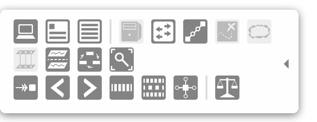

# UI Service - ToolbarService

# ToolbarService

ToolbarService is an [Angular Factory](https://docs.angularjs.org/guide/services) in the [Widget module](https://wiki.onosproject.org/display/ONOS/UI+View+-+Framework+Libraries) with the name `toolbar.js`. It allows you to create a basic toolbar with controls and buttons. To use these functions, see the documentation on [injecting Angular services](https://docs.angularjs.org/guide/di).

An example of a toolbar is on the [Topology View](../../../administrator-guide/interacting-with-onos/the-onos-web-gui/gui-topology-view.md).



| Name | Summary |
| --- | --- |
| `createToolbar` | Create a toolbar basic toolbar. |
| `destroyToolbar` | Destroy an already-created toolbar. |

# Function Descriptions

## createToolbar

Creates a toolbar panel that returns an API to add functionality to it.

| Example Usage | Arguments | Return Value |
| --- | --- | --- |
| var toolbar = tbs.createToolbar(**`id`**, **`opts`**); | **`id`** - string of a globally unique ID for the toolbar  **`opts`** - an object that can overwrite default settings \* for the toolbar | an object with an API that contains actions that can be performed on the toolbar |
| Returned API Example Usage | Arguments | Return Value |
| toolbar.addButton(`id`, `gid`, `cb`, `tooltip`); | This is a wrapper for ButtonService's [button function](ui-service-buttonservice.md). See the button service documentation for more information. | the button API object  creates a button and adjusts the toolbar's width to accommodate it |
| toolbar.addToggle(`id`, `gid`, `initState`, `cb`, `tooltip`); | This is a wrapper for ButtonService's [toggle function](ui-service-buttonservice.md). See the button service documentation for more information. | the toggle API object  creates a toggle and adjusts the toolbar's width to accommodate it |
| toolbar.addRadioSet(`id`, `rset`); | This is a wrapper for ButtonService's [radioSet function](ui-service-buttonservice.md). See the button service documentation for more information. | the radioSet API object  creates a radio button set and adjusts the toolbar's width to accommodate it |
| toolbar.addSeparator(); | none | none  creates a div styled to look like a line that separates buttons |
| toolbar.addRow(); | none | `null` if there are no elements in the current row of the toolbar  creates a new row in which to add buttons – call if you want another row other than the first one |
| toolbar.show(`cb`); | **`cb`** - (optional) a function reference to execute when the toolbar is done animating the "show" transition | none  shows the toolbar |
| toolbar.hide(**`cb`**); | **`cb`** - (optional) a function reference to execute when the toolbar is done animating the "hide" transition | none  hides the toolbar |
| toolbar.toggle(**`cb`**); | **`cb`** - (optional) a function reference to execute when the toolbar is done animating either the "show" or "hide" transition | none  toggles the toolbar from shown to hidden or vice versa |

\* The default settings for the toolbar are as follows:

```
defaultSettings = {
    edge: 'left',        // edge of the window the toolbar is on
    width: 20,           // default width of the toolbar with no buttons
    margin: 0,           // gap between the toolbar and the edge of the window
    hideMargin: -20,     // how much of the toolbar should be shown when the toolbar is hidden
    top: 'auto',         // 'top' CSS style for positioning
    bottom: '10px',      // 'bottom' CSS style for positioning
    fade: false,         // boolean of whether the toolbar will fade in and fade out
    shown: false         // boolean of whether the toolbar is shown initially
};
```

## destroyToolbar

Destroys the created toolbar. Should be called on clean up.

| Example Usage | Arguments | Return Value |
| --- | --- | --- |
| tbs.destroyToolbar(`id`); | `id` - the string ID of the toolbar you want to destroy | none |
