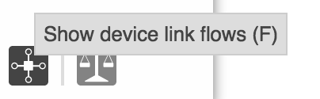

# UI Service - TooltipService

# TooltipService

TooltipService is an [Angular Factory](https://docs.angularjs.org/guide/services) in the [Widget module](https://wiki.onosproject.org/display/ONOS/UI+View+-+Framework+Libraries) with the name `tooltip.js`. It provides an API to install tooltips on elements as well as an [Angular directive](https://docs.angularjs.org/guide/directive) to install tooltips on HTML elements. To use these functions, see the documentation on [injecting Angular services](https://docs.angularjs.org/guide/di).

A tooltip is a short message that appears over HTML elements to help the user understand the button they are about to click on. An example of a tooltip is below:



## API Service Functions

| Name | Summary |
| --- | --- |
| `addTooltip` | Install a tooltip on an element. |
| `showTooltip` | Show an installed tooltip. |
| `cancelTooltip` | Hide an installed tooltip. |

## Directive

| Name | Other Required Attributes | Summary |
| --- | --- | --- |
| `tooltip` | tt-msg | Install a tooltip on an HTML element. |

# Function Descriptions

## addTooltip

Adds a tooltip to an element. This function will automatically call [showTooltip](#UIServiceTooltipService-showTooltip) on mouseover and call [cancelTooltip](#UIServiceTooltipService-cancelTooltip) on mouseout.

Generally you will only have to use this function, since it calls the others automatically. But if you want to show and hide tooltips on other events, you can use the other functions.

| Example Usage | Arguments | Return Value |
| --- | --- | --- |
| tts.addTooltip(`elem`, `tooltip`); | `elem` - [d3 selection](https://github.com/mbostock/d3/wiki/Selections) of the element you want the tooltip on  `tooltip` - string of the tooltip message to be displayed | none |

## showTooltip

Shows a tooltip.

| Example Usage | Arguments | Return Value |
| --- | --- | --- |
| tts.showTooltip(`el`, `msg`); | `el` - [d3 selection](https://github.com/mbostock/d3/wiki/Selections) of the element you want the tooltip on  `msg` - string of the tooltip message to be displayed | none |

## cancelTooltip

Cancels / hides a currently shown tooltip.

| Example Usage | Arguments | Return Value |
| --- | --- | --- |
| tts.cancelTooltip(**`el`**); | `el` - [d3 selection](https://github.com/mbostock/d3/wiki/Selections) of the element that currently has a tooltip on it | none |

# Directive Usage

## tooltip

Tooltips are also able to be used on HTML elements through an [Angular directive](https://docs.angularjs.org/guide/directive).

Example Usage in HTML:

```
 <div id="foo-div" tooltip tt-msg="fooTip"></div>
```

The `tooltip` directive calls [addTooltip](#UIServiceTooltipService-addTooltip) for you. The *tt-msg attribute is required* and its property must be the name of a property on the [$scope](https://docs.angularjs.org/api/ng/type/$rootScope.Scope) that holds your string message. For example the fooTip message should be defined in your [Angular controller](https://docs.angularjs.org/guide/controller) Javascript code as such:

```
$scope.fooTip = 'A really cool tooltip message';
```

This will create a tooltip that says "A really cool tooltip message" when you hover over the div with id "foo-div".
