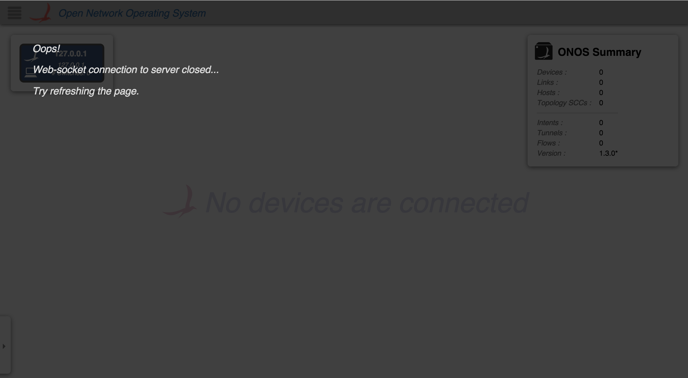

# UI Service - VeilService

VeilService is an [Angular Factory](https://docs.angularjs.org/guide/services) in the [Layer module](https://wiki.onosproject.org/display/ONOS/UI+View+-+Framework+Libraries) with the name `veil.js`. It allows you to show and hide the "Veil" – a GUI overlay that lets the user know the websocket connection was dropped. To use these functions, see the documentation on [injecting Angular services](https://docs.angularjs.org/guide/di).

## What is the Veil?

Below is a screenshot of the Veil when the websocket connection goes down on the [Topology View](../../../administrator-guide/interacting-with-onos/the-onos-web-gui/gui-topology-view.md).

| Name | Summary |
| --- | --- |
| `init` | Initialize the VeilService. |
| `show` | Show the Veil. |
| `hide` | Hide the Veil. |

# Function Descriptions

## init

Initialize the VeilService. This is already called, so you probably won't have to initialize it yourself.

| Example Usage | Arguments | Return Value |
| --- | --- | --- |
| vs.init(); | none | none |

## show

Show the Veil.

| Example Usage | Arguments | Return Value |
| --- | --- | --- |
| vs.show(`msg`); | `msg` - an array of strings, each array member is a paragraph | none, but shows the Veil and disables key bindings |

## hide

Hide the Veil.

| Example Usage | Arguments | Return Value |
| --- | --- | --- |
| vs.hide(); | none | none, but hides the Veil and enables key bindings |
