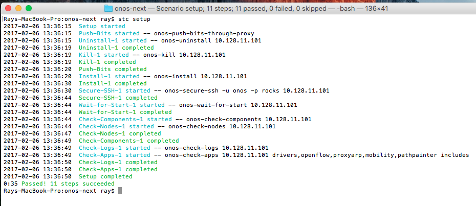
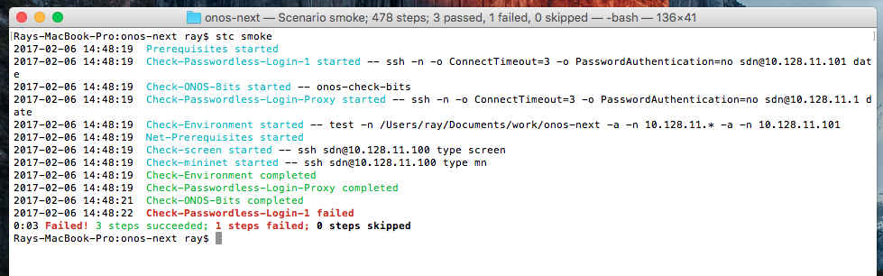
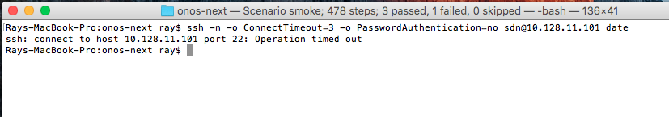
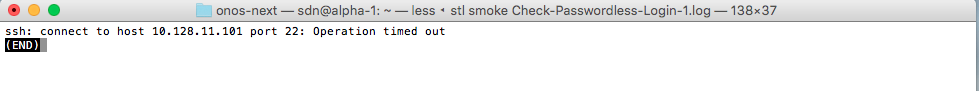

# Appendix G: Scenario Test Coordinator (STC)

STC is a developer oriented framework for testing and debugging running ONOS clusters. It allows modular definition and composition of test scenarios, as well as reuse of test modules. Developers can use scenarios in a semi-automated or fully automated manner. STC tracks dependencies between scenarios and allows parallel execution of steps that don't depend on each other to improve performance and to allow modeling concurrent activities like running a step on each node in a cluster. Larger scenarios can be built up from smaller scenarios allowing reuse of tests. STC is integrated into the cell framework and can be used to deploy and test on a cell.

# Key Concepts and Terminology

* **cell** - definition of a set of resources used to run an ONOS cluster
* **STC** - framework for execution and verification of scenarios
* **scenario** - a reusable logical grouping of steps to accomplish some task
* **step** - a single unit of execution within a scenario. A step can be a call to bash, python, or other executable. Steps define an action and an expected outcome.
* **group** - a collection of other groups and steps  used for grouping related sets of steps  and definition of shared dependencies

# Predefined Scenarios

STC comes with a set of predefined scenarios designed to test specific ONOS behavior. The most commonly used scenarios are:

* **stc setup** - pushes a build of ONOS from the host onto all nodes of the cell. Once the bits have been pushed, ONOS is started and STC verifies that all nodes are up and in their basic configuration, and that no errors occurred.
* **stc net-setup**- creates a mininet instance and standard topology on a running ONOS cluster
* **stc fast** - runs a set of smoke tests that complete quickly, testing reactive forwarding and basic connectivity
* **stc smoke** (or just **stc**) - runs a more involved set of smoke tests, testing intents, flows, flow objectives, drivers, and apps

# Running STC

STC is run from a command line shell. If you have a properly configured development environment and cell, stc will run the tests for you and display the results of the test run. Here is an example of how to run the fast smoke test on a cell with one controller and one mininet node.

# Diagnosing failures

STC will report failures by displaying a red line of text for the step that failed. If the environment variable *stcHaltOnError*is set to true, execution stops on the first error that is encountered. If this variable is undefined or set to some other value, execution continues as long as there are scenarios remaining that don't depend on failed steps. This behavior is useful for the clean up portion of scenarios. Here is an example of a failed STC run:

We can tell from this output that the *Check-Passwordless-Login-1*step failed. Looking back in the output stream, if we look at the started message for that step, we can see that at the time of the failure, STC was running the command `*ssh -n -o ConnectTimeout=3 -o PasswordAuthentication=no sdn@10.128.11.101 date*'. There are two ways we can diagnose this problem. Any time there is an error, you can always rerun the failed step by simply rerunning the command from the command line:

The output of the command is getting a timeout error, in this case because there is no cell set up on the given IP address. Another way to diagnose a failure is to look at the log files generated by execution of the command. STC keeps the log of each step as it executes, and you can retrieve the log using the *stl* command. *stl* takes the scenario name and the step name as arguments. Both arguments can be filled in using tab completion. In the case of previous error, since the test being run was *smoke* and the step was *Check-Passwordless-Login-1*, the command to fetch the log file is '*stl smoke Check-Passwordless-Login-1.log*'. It shows us the output of the failing command:

# Advanced Topics

If you want to learn more about STC, you can refer to the [STC Advanced Topics](appendix-g-scenario-test-coordinator-stc/stc-advanced-topics.md) page to find out more about STC internals, or the [Developing Your Own STC Test](appendix-g-scenario-test-coordinator-stc/developing-your-own-stc-test.md) to find out how to write a test scenario. You can also consult the [STC Reference Guide](appendix-g-scenario-test-coordinator-stc/stc-reference-guide.md) for detailed descriptions of each STC entity.

STC scripts - basic usage

Not interested in smoke testing? Looking for basic STC scripts to deploy ONOS target machines and your Mininet topology ? You can find info at [this page](development-environment-setup/development-workflow-options/cells-and-onos-test-scripts.md).
