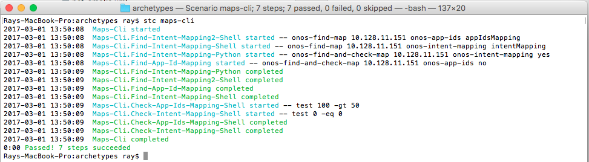

# Developing Your Own STC Test

# Work in progress

# Developing your own steps

A step in STC is a command that is executed by a shell. After execution of the command is complete, STC checks if the command returned the expected status. If the expected status is not returned, and error is generated and the enclosing test fails. Steps are the basic build blocks for STC scenarios.

A step may be written in any language, as long as it can be called from the shell command line and it can return a status using the exit() system call. Common choices for implementing STC steps are shell scripts and python programs.

# Basic step syntax

A step contains a name, a command to execute, an optional environment, and optional step names it depends on:

```
<step name="Cleanup-Mininet" exec="onos-mininet cleanup" requires="~Stop-Mininet,Setup-Network"/>
```

In this step, the *name* is "Cleanup-Mininet".The name is used to refer to this step in the dependency list of other steps, and is also used to display information about the step as it is executing. The *exec* attribute specifies the command to run, in this case "onos-mininet cleanup". The *requires* attribute Is a comma separated list of step names that must be complete before this step can execute. Specifying a tilde character before a step name ("~") indicates that this is a *soft dependency*, and the stop should execute regardless of the status of the dependent step. If no tilde is specified, this is a *hard dependency*, and the step will fail if the dependent step failed.

# Sample Step Using a Shell Script

As a sample STC test, we are going to write an STC scenario that tests the ONOS CLI "maps" command. The script will take as parameters the ONOS node to execute on, the name of a map, and an ID to use when returning data. More about returning data a little later.

**Sample Shell Script to Query "maps" Command**

```
#!/bin/bash

# -----------------------------------------------------------------------------
# Invokes the ONOS CLI and looks for a 'maps' entry with the given name
# -----------------------------------------------------------------------------

NODE=$1
MAP=$2
ID=$3

map_text=`( onos ${NODE} onos:maps ) | grep ${MAP}`

if [ $? -ne 0 ]; then
    exit 1
fi

map_size=`echo ${map_text} | sed s#^.*size=##`
echo "@stc ${ID}Size=${map_size}"
```

Scripts may return values to the calling step by using the special syntax '@stc name=value' in the standard output. STC parses these special tags and allows a step to interrogate the values to be sure that the data values are correct. In this script, we have added the ID string to the name portion of the tag so that the script can be invoked multiple times from the same scenario.

In our sample script, the ONOS CLI is called, grep is used to search for the given entry, and then the script returns the size of the map. If the grep fails to find the entry provided, the script returns an error and the calling step will fail. The ID we provided to the call is used to uniquely identify the results of this call so that we can check for correctness later.

Now to put it all together, we have to write a step to call the script, and then another step to test the value of the size of the map. Here is a section of a scenario that performs these operations:

**Steps to check the size of the onos-app-ids map**

```
<!-- Check map known to have at least 50 entries -->
<step name="Maps-Cli.Find-Intent-Mapping2-Shell"
      exec="onos-find-map ${OCI} onos-app-ids appIdsMapping"/>
<step name="Maps-Cli.Check-App-Ids-Mapping-Shell" requires="^"
      exec="test ${appIdsMappingSize} -gt 50"/>
```

The first step executes our script to find a map named 'onos-app-ids' and uses the tag ID 'appIdsMapping'. The second step makes sure that there are at least 50 items in the map by calling a shell to compare the variable 'appIdsMappingSize' which our script returned, to the literal value '50'. Note that the *requires* attribute on the second step indicates that it depends on the step before it. This prevents concurrent execution of the two steps.

# Sample Step Using a Python Script

Python programming offers much more flexibility than shell scripting, and the language includes libraries for making REST calls, parsing JSON, and other useful features that are difficult to do with a shell script. Step scripts can easily be written in Python. Here is an example of a Python program that implements a query similar to the one the shell script did in the previous example:

**Sample Python Script to Query "maps" Command**

```
 #!/usr/bin/env python

# -----------------------------------------------------------------------------
# Invokes the ONOS CLI and looks for a 'maps' entry with the given name
# -----------------------------------------------------------------------------

import subprocess
import json
import sys

if len(sys.argv) != 4:
    print "usage: onos-find-and-check-map onos-node map-name should-be-zero"
    sys.exit(1)

node = sys.argv[1]
mapName = sys.argv[2]
shouldBeZero = sys.argv[3]

cli = subprocess.Popen(["onos", node, "maps", "-j"], stdout=subprocess.PIPE)
json = json.loads(cli.communicate()[0])

for map in json:
    foundMapName = map["name"]
    foundMapSize = map["size"]

    print foundMapName
    print foundMapSize

    if foundMapName == mapName:
        if (shouldBeZero == 'yes' and foundMapSize == 0) or \
           (shouldBeZero != 'yes' and foundMapSize != 0):
            sys.exit(0)
        else:
            sys.exit(1)

sys.exit(1)
```

The script is similar to the shell implementation, except that it takes advantage of the ONOS CLI -j option to produce JSON output, and then uses the Python JSON parser to find the map with the given name. This script also takes an additional parameter to tell it if an empty size is expected or not. In this implementation, the check on the size of the map is done in the script, rather than in the calling step. It does not use the '@stc' special tags to return its output, it just returns an error status if the map size is incorrect. Using this methodology, we can check the map size using a single step:

**Steps to check the size of the onos-app-ids map**

```
<!-- Check map known to have more than 0 entries -->
<step name="Maps-Cli.Find-App-Id-Mapping"
      exec="onos-find-and-check-map ${OCI} onos-app-ids no"/>
```

# Scenario Using Our Step Scripts

Now that we have our two scripts written, we can put them together in a scenario. A scenario is a collection of steps and/or groups of steps that are run as a unit. Within a scenario, all steps can be run in parallel as long as their dependencies are satisfied. We can use the *requires*attribute of the steps to be sure that the dependencies are specified to make them run in the correct order.

Here is a scenario that will run both the shell and Python scripts and check the results of the scripts:

**Scenario to test maps CLI command**

```
<scenario name="maps-cli"
          description="maps CLI command test">
    <group name="Maps-Cli">

        <!-- Shell script based checks -->
        <!-- Check map known to have 0 entries -->
        <step name="Maps-Cli.Find-Intent-Mapping-Shell"
              exec="onos-find-map ${OCI} onos-intent-mapping intentMapping"/>
        <step name="Maps-Cli.Check-Intent-Mapping-Shell" requires="^"
              exec="test ${intentMappingSize} -eq 0"/>

        <!-- Check map known to have at least 50 entries -->
        <step name="Maps-Cli.Find-Intent-Mapping2-Shell"
              exec="onos-find-map ${OCI} onos-app-ids appIdsMapping"/>
        <step name="Maps-Cli.Check-App-Ids-Mapping-Shell" requires="^"
              exec="test ${appIdsMappingSize} -gt 50"/>

        <!-- Python based checks -->
        <!-- Check map known to have 0 entries -->
        <step name="Maps-Cli.Find-Intent-Mapping-Python"
              exec="onos-find-and-check-map ${OCI} onos-intent-mapping yes"/>
        <!-- Check map known to have more than 0 entries -->
        <step name="Maps-Cli.Find-App-Id-Mapping"
              exec="onos-find-and-check-map ${OCI} onos-app-ids no"/>

    </group>
</scenario>
```

The first element is the *scenario* element. You can specify a name and a longer description about what your scenario does.

The *group* element is a convenient way of keeping a series of steps together. ( Need more here )

Note that since an STC scenario is an XML document, we can add standard XML commenting using <!-- ... -->

The remainder of the scenario is the *step* declarations we saw earlier. These define the execution of the test and the checks that will be performed. Note the use of *requires* attributes to make sure that steps with dependencies are run in the proper order.

Once the scenario is written, we can run it using the *stc* driver:



Notice that the starting time of many of the steps is the same. This is because any steps that don't have *requires* dependencies can be started simultaneously. The entire scenario completes quickly because much of it is run in parallel.

The code for these examples may be found in the ONOS source tree in tools/test/scenarios/maps-cli.xml

Things to include:

* Setting debug=true env variables
* conditional attributes: if, unless
* Importing other scenarios
* Namespaces

#
