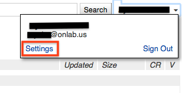
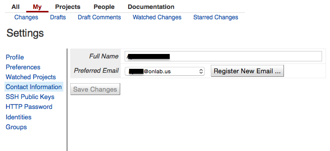
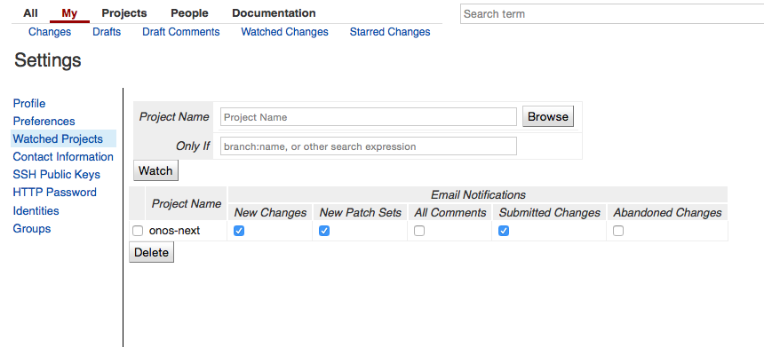
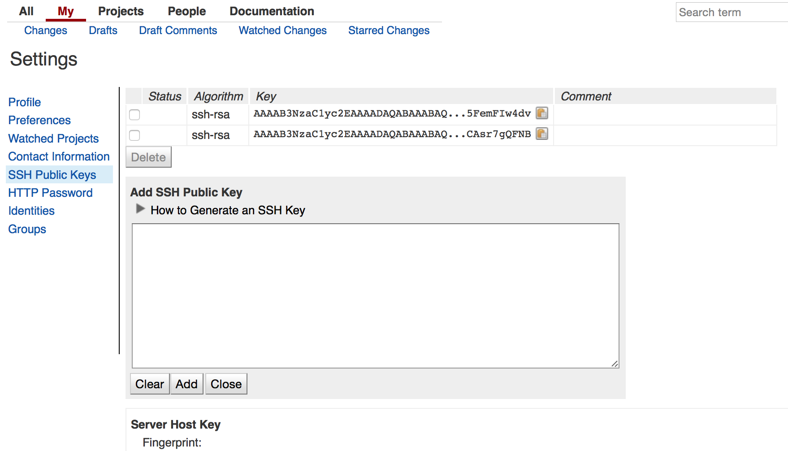
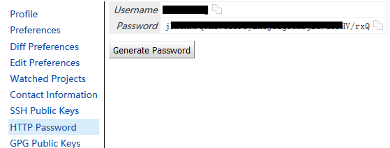

# Getting the ONOS core source code using git and Gerrit

The ONOS source code is stored at [gerrit.onosproject.org](http://gerrit.onosproject.org). Setting up `git` and Gerrit will allow you to easily fetch and test any version of ONOS, including releases, development versions, and patches that have been submitted for review. Setting up a Gerrit account and `ssh` access will also enable you to submit your own patches to ONOS and also to participate in the ONOS code review process.

### Read-only access to the ONOS source code via `git`

Make sure you've installed `git`, and then create a local clone of the source repository:

```
$ git clone https://gerrit.onosproject.org/onos
```

**If all you want to do is compile and run ONOS, you've got the code and are ready to do so**!

However, if you want to contribute code to ONOS, you need to configure git and Gerrit for `ssh` access, as described below.

Note

Generally, ssh is recommended if you want to contribute code. Anyway, you may be in some areas where access to ssh is restricted. If this is the case, please try to use https. The steps are similar, except that you'll need to enter your username and password each time you want to submit code.

### Optional: Read-write access to the ONOS source code via Gerrit, `ssh` and `git-review`

There are two ways to clone the code from Gerrit, `https://` or `ssh://`. Either way is fine for **reading** the code, but when it comes time to **contribute your own patches** the easiest and most secure way is to access Gerrit over SSH.

To make sure you're using the `ssh://` remote, first check the URLs of the remotes in your ONOS repository:

```
$ cd onos
$ git remote -v
origin  https://gerrit.onosproject.org/onos (fetch)
origin  https://gerrit.onosproject.org/onos (push)
```

If you see `ssh://` URLs, everything is fine and you can move on to the next step ([Configuring Gerrit](#GettingtheONOScoresourcecodeusinggitandGerrit-ConfiguringGerrit)). If you see https:// URLs, you should change them to ssh:// before continuing:

```
$ git remote set-url origin ssh://<username>@gerrit.onosproject.org:29418/onos
```

Substitute `<username>` with your Gerrit/Crowd username (the `<username>` must be specifically provisioned in Gerrit Profile for `git`)

You can double-check the URL on Gerrit by logging in, going to Projects -> List, then clicking on 'onos', On the grey bar, click 'SSH', then just underneath the grey bar will appear 'git clone ssh://...'. This is the URL you should set your remote to in your local git repository.

### Configuring Gerrit

Ensure `<username>` is configured in Settings->Profile->Username; the Username is **not** populated for new accounts by default.

Prospective contributors should configure their account to receive notifications about their code submissions. The Settings page is accessed from the user dropdown on the upper right of the page:



To configure contacts by going to**Contact Information**, and filling out the fields, and hitting *Save Changes*:



To subscribe to the project, go to **Watched Projects** and enter *onos-next*in the *Project Name* field of the page. Hitting **return** should add *onos-next*to a table under the search field:



As shown above, email notifications are also configured from here by checking off the types of notifications to receive.

### Uploading SSH Public Keys（only for ssh）

An SSH key should also be uploaded to the ONOS Gerrit server.

1. ***Generate a key.*** Keep the default file name and location. This will generate an *id\_rsa* and *id\_rsa.pub*file in*~/.ssh:*

   ```
   $ ssh-keygen -t rsa
   Generating public/private rsa key pair.
   Enter file in which to save the key (/home/onosuser/.ssh/id_rsa): 
   Enter passphrase (empty for no passphrase): 
   Enter same passphrase again: 
   Your identification has been saved in /home/onosuser/.ssh/id_rsa.
   Your public key has been saved in /home/onosuser/.ssh/id_rsa.pub.

   ...
   $ ls ~/.ssh
   id_rsa  id_rsa.pub  known_hosts
   ```
2. ***Upload the SSH public key.***After logging into the Gerrit account, go to ***Settings** > **SSH Public Keys***. Paste the contents of **id\_rsa.pub**into the "Add SSH Public Key" box and hit Add:  
     
   

A key must be uploaded per host if checking code out to multiple hosts with `git`.

### Generate Password（only for https）

1. After logging into the Gerrit account, go to ***Settings** > **HTTP Password,*** click ***Generate Password*** to generate the password which using when submitting code, if you forget the password just go to HTTP Password regenerate a new one.



### Configuring `git`

Developers planning to contribute code should configure git with their username and email.

```
git config --global user.name "firstname lastname"
git config --global user.email "email@domain.com"
```

### Configuring `git to remember password (only relevant for https, optional)`

When using https and password to authenticate, you may want to use git credential helper to remember password for you.

See article provided by github for instruction setting up git credential helper: <https://help.github.com/articles/caching-your-github-password-in-git/>
