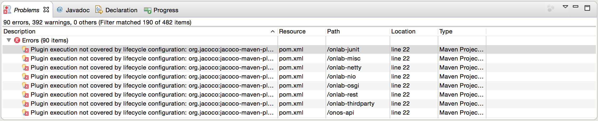
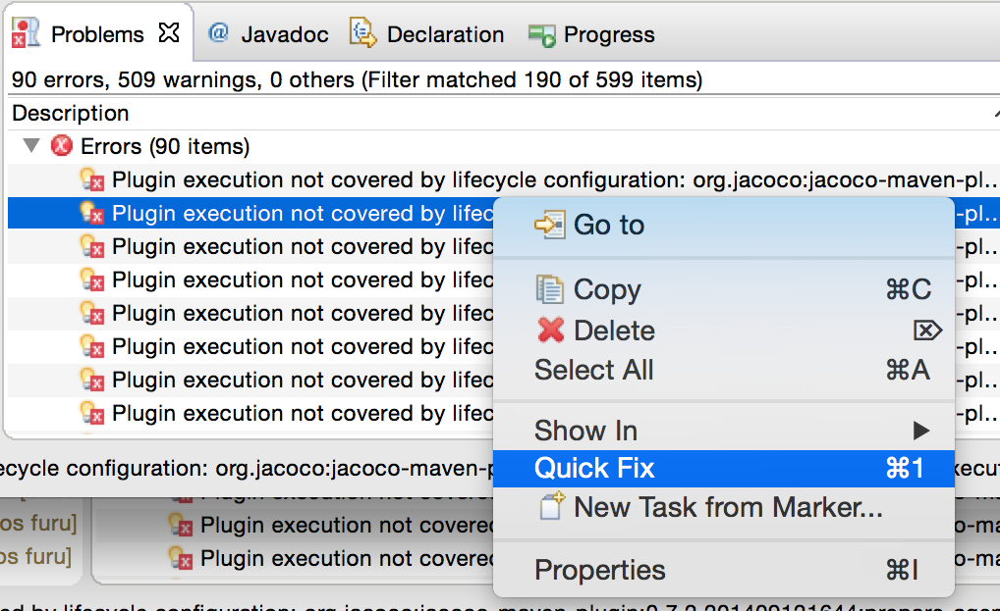
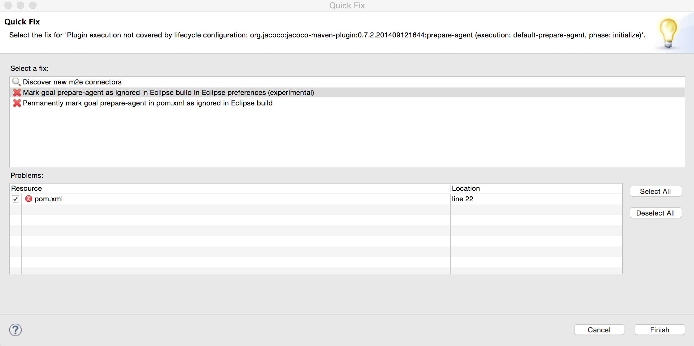
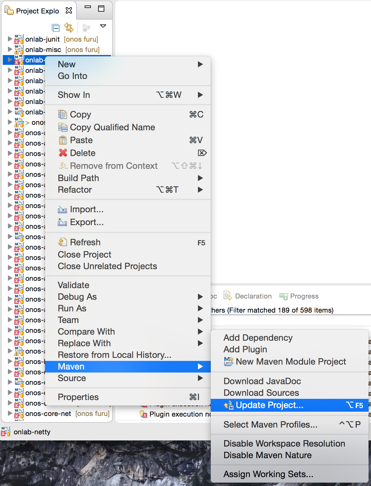
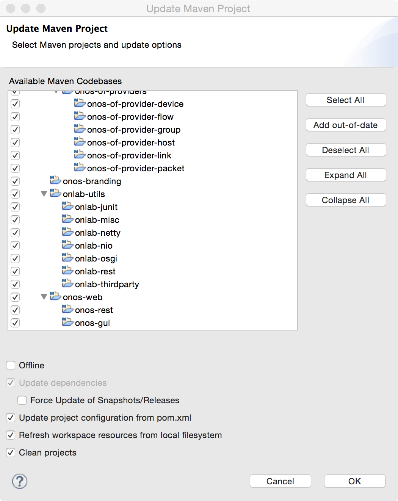
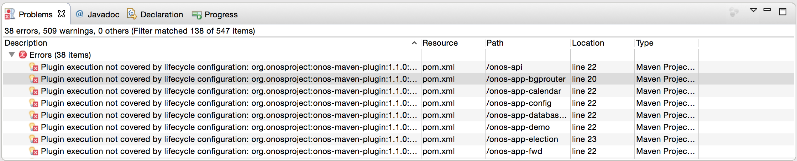

# Using an IDE with Maven (DEPRECATED)

Needs update

This page is kept here if you need to work on an older version of ONOS that used Maven.

Starting from ONOS 1.14 we use [Bazel to build and to import the project in the IntelliJ IDE](using-an-ide-with-onos-1.14-or-higher-bazel-build.md)

## IDE Setup

The project does not enforce the use of a specific IDE, but rather, a set of guidelines that can be configured in an IDE. The examples and documentation focus on IntelliJ IDEA, and include some help for Eclipse. For other IDEs, developers should consult the documentation for the IDE of choice for specific configuration steps.

To get the best support out of your IDE, ONOS should be imported as a ***Maven project***.

If you have no idea where to start, [here are some instructions on how to install IntelliJ.](http://www.hildeberto.com/2014/09/installing-intellij-idea-on-mac-and-ubuntu.html) The [ONOS Screencasts](../../../tutorials/screencasts/importing-onos-projects-into-intellij-idea-old.md) page provides helpful videos on importing, debugging, and developing ONOS with IntelliJ.

Importing the ONOS Source

A helpful screencast illustrating the entire import process can be found [here](https://wiki.onosproject.org/display/ONOS/Importing+ONOS+projects+into+IntelliJ+IDEA) (the link to the video is at the top of the page). Assuming you have [obtained the source code already](getting-the-onos-core-source-code-using-git-and-gerrit.md), the following steps can be followed to import ONOS into IntelliJ:

1. To import the ONOS project, simply open IntelliJ IDEA and select: *File… New… Project from Existing Sources*
2. If you are starting IDEA for the very first time and don’t have any existing projects, you can alternatively select: *Import Project…* from the initial options.
3. When presented with a file selection dialog, you should navigate to the top of the ONOS source tree and select the root *pom.xml* file. This will initiate the project import wizard.
4. On the first screen we only need to check Sources and Documentation and then press *Next*.
5. Select *Next* to bypass the Maven profiles.
6. Make sure that the *org.onosproject:onos* Maven project is selected and press *Next*.
7. After this select the JDK 8. If selecting JDK for the very first time, you may need to press the + sign to locate the JDK home directory. Press *Next* and then *Finish*.
8. At this point IntelliJ will complete the import process by building the project and indexing the source files.

## Importing the settings

While the project is being processed, we can go ahead and import the recommended IDEA settings. We do this by selecting *File… Import Settings…* and then navigating to the ONOS*tools/dev* directory and selecting the *idea-settings.jar* file. We can complete the process by pressing the *OK* button.

These settings have the JDK home setup for OS X (`/Library/Java/JavaVirtualMachines/jdk1.8.0_25.jdk/Contents/Home`). For Linux, select  *File... Project Structure...* *SDKs...* then edit the JDK home path for 1.8 to be `/usr/lib/jvm/java-8-oracle`. If IntelliJ is throwing errors such as "cannot resolve symbol string", the JDK home is likely incorrect.

If IntelliJ is throwing errors like "The package 'org.onosproject.cluster' is not exported by the bundle dependencies," go to *IntelliJ IDEA*->*Preferences*. On the sidebar, under the *Editor* dropdown section, select *Inspections*. From there, search *OSGi* and under the OSGi dropdown, uncheck *Package accessibility* inspections and press *OK*.

## Importing the Copyright header

Since ONOS is licensed under Apache 2 license, we need to make sure that all source files are properly decorated with the Apache 2 license header file.

To configure IntelliJ appropriately, we will locate the *header.txt* file under ONOS *tools/dev* directory and copy its contents. Then, from IntelliJ preferences, we will select Copyright section and add a new new copyright profile. We will call this profile ONOS and paste in the previously copied header text.

Then we will make sure that the newly created ONOS copyright profile is the default and we are done.

As ONOS is a multi-module project, it may appear as a collection of many (about 50 at the time of this writing) projects beginning with "onos-". This is normal for some IDEs such as Eclipse.

For a listing of the software modules that comprise ONOS, please refer to the [Javadocs](http://api.onosproject.org), or [Appendix C](../appendix-c-source-tree-organization.md) of this Guide.

"Plugin execution not covered ..." errors in Eclipse

If you're using Eclipse and see "Plugin execution not covered ..." errors about *jacoco-maven-plugin* and *onos-maven-plugin* after importing ONOS projects, follow these steps to eliminate those errors.

1. Select one of "Plugin execution not covered..." error and select "Quick Fix"

   Click here to expand...

   

   
2. Select "Mark the goal as ignored in Eclipse build in Eclipse preference" as the fix and "Finish" to apply the fix.

   Click here to expand...

   
3. Select one of the ONOS related project to open the "Update Project" dialog, then "Select All" projects and update all the projects.

   Click here to expand...

   

   

   It may take a while for Eclipse to rebuild all the project after refreshing project configuration.
4. By following the steps above, maven goal resolution errors for the same goal should disappear. (*jacoco-maven-plugin)*. Repeat the same step for remaining goal error. (*onos-maven-plugin*)

   Click here to expand...

   
