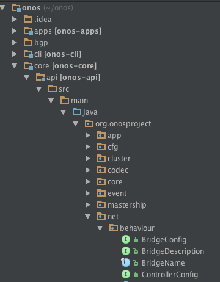
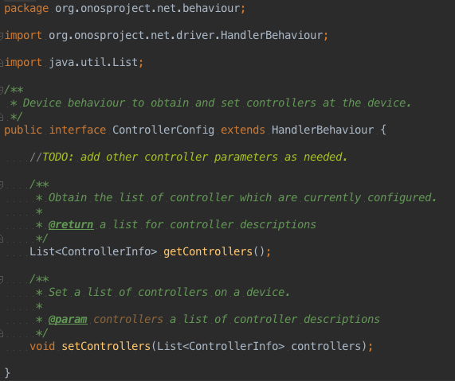
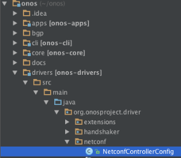
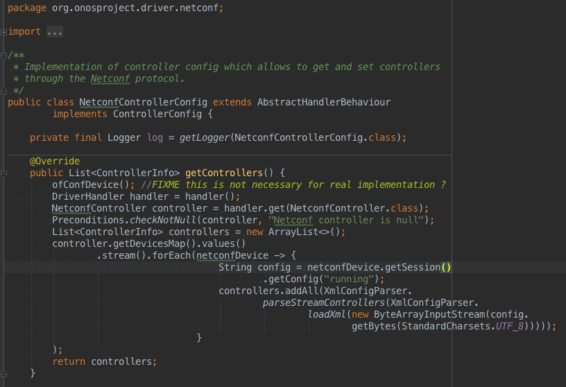

# Create an ONOS behavior interface from a YANG Model

The information on this page is deprecated.

## Task

Create an ONOS device behaviour interface and implementation from a YANG model. These classes enables app o CLI command to talk to the device and configure it.

## Execution

### Code generation

* Use yangtools package provided ( how do give the yangtools project and pom file ? )
* specify the input yang model folder at line 55 of *pom.xml*

  Example:

  ```
  <yangFilesRootDir>/Users/Andrea/yangBehavior/</yangFilesRootDir>
  ```
* specify output folder at line 62 of *pom.xml*  
  Example:

  ```
  <outputBaseDir> /Users/Andrea/yangBehavior </outputBaseDir>
  ```
* open a shell to the translator project folder
* execute 

  ```
  $ mvn generate-sources
  ```
* generated java files are in **<outputdir>/org/opendaylight/yang/gen/v1/<yang\_specified\_namespace>**

### **Code editing**

* take the interface relative to your device (in our example ControllerConfig.java) and import it into the onosproject module in Intellij and put it into **/core/api/src/main/java/org/onosproject/net/behaviour/**  
  ****
* open it and do these operations:

* + remove all the packages and the imports. Example:

    ```
    package org.opendaylight.yang.gen.v1.org.onosproget.driver.test.rev691231;
    import org.opendaylight.yangtools.yang.binding.ChildOf;
    import org.opendaylight.yang.gen.v1.org.onosproget.driver.test.rev691231. AbstractBehaviourData;
    import org.opendaylight.yangtools.yang.common.QName;
    import org.opendaylight.yangtools.yang.binding.Augmentable;
    ```

* + insert if not already present.

    ```
    package org.onosproject.net.behaviour; 
    import org.onosproject.net.driver.HandlerBehaviour;
    ```

* go to public interface <your\_interface\_name> extends, remove all code from ChildOf to { and add HandlerBehaviour after the keyword extends

  Example:

  ```
  public interface ControllerConfig
      extends
      ChildOf<ExampleBehaviourData>,
      Augmentable<org.opendaylight.yang.gen.v1.org.onosproget.driver.test.rev691231.ControllerConfig> {
  ```

  into

  ```
  public interface ControllerConfig
      extends HandlerBehaviour {
  ```
* remove 

  ```
  public static final QName QNAME = org.opendaylight…
  ```
* in case some of the method’s return type are different from what you need modify them.
* put Javadoc on your interface.

You class should now look something like this:

```
package org.onosproject.net.behaviour;
import org.onosproject.net.driver.HandlerBehaviour;
/**
* <...javadoc here..>
*/
public interface <your_interface_name> extends HandlerBehaviour {

<...methods here…>
  
}
```

Example:



The interface we just built should be the only class from the generated ones that you need, but if there is something more, take it from the generated classes folder and put it (where ?)

### Interface implementation

After the creation of the interface you have to implement the methods to operate on the device.

In order to do this you must create a class in **<onos\_base\_directory>/drivers/src/main/java/org/onosproject/driver/netconf/** 



with this declaration:

```
public class <your_class_name> extends AbstractHandlerBehaviour
      implements <your_interface_name> {
```

Now let IntelliJ autogenerate the body of the interface’s methods for you and then put your code in it.

Example:



For an example of the whole infrastructure you can take a look at the ControllerConfig.Java class and it’s implementation in NetconfControllerConfig.java

### Driver activation

In order to have your device recognized by ONOS you need to put the behavior and it's implementation in a *<driver></driver>* tag in **<onos\_home\_directory>/drivers/src/main/resources/onos-drivers.xml.**

Example:

```
<driver name="ovs-netconf"
        manufacturer="Nicira, Inc\." hwVersion="Open vSwitch" swVersion="2\..*">
    <behaviour api="org.onosproject.net.behaviour.ControllerConfig"
               impl="org.onosproject.driver.netconf.NetconfControllerConfig"/>
</driver>
```

See Also

[NETCONF](../../../administrator-guide/configuring-onos/southbound-protocols/netconf.md) : wiki page on how to use the present NETCONF infrastructure to talk to the device
