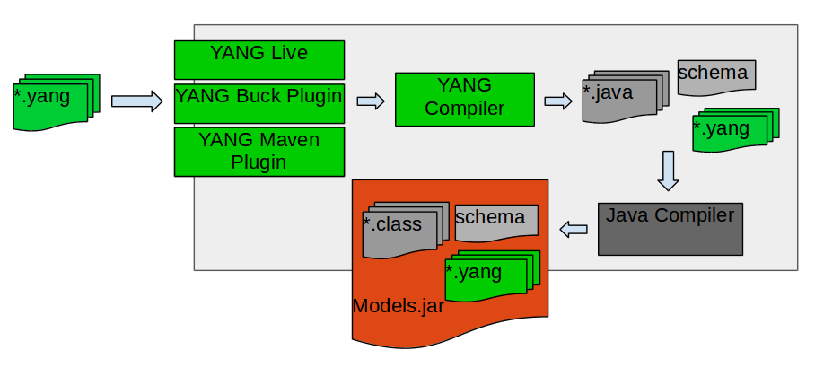

# YANG Compiler

## Team

| Name | Organization | Email |
| --- | --- | --- |
| Adarsh M | Huawei Technologies | [adarsh.m@huawei.com](mailto:adarsh.m@huawei.com) |
| Bharat Saraswal | Huawei Technologies | [bharat.saraswal@huawei.com](mailto:bharat.saraswal@huawei.com) |
| Gaurav Agrawal | Huawei Technologies | [gaurav.agrawal@huawei.com](mailto:gaurav.agrawal@huawei.com) |
| Janani B | Huawei Technologies | [janani.b@huawei.com](mailto:janani.b@huawei.com) |
| Sathish Kumar M | Huawei Technologies | [sathishkumar.m@huawei.com](mailto:sathishkumar.m@huawei.com) |
| Suchitra H N | Huawei Technologies | [suchitra.hn@huawei.com](mailto:suchitra.hn@huawei.com) |
| Vidyashree Rama | Huawei Technologies | [vidyashree.rama@huawei.com](mailto:vidyashree.rama@huawei.com) |
| Vinod Kumar S | Huawei Technologies | [vinods.kumar@huawei.com](mailto:vinods.kumar@huawei.com) |
| Shankara | Huawei Technologies | [shankara@huawei.com](mailto:shankara@huawei.com) |
| Mahesh Poojary S | Huawei Technologies | [mahesh.poojary@huawei.com](mailto:mahesh.poojary@huawei.com) |
| Rama Subba Reddy S | Huawei Technologies | [Rama.Subba.Reddy.S@huawei.com](mailto:Rama.Subba.Reddy.S@huawei.com) |
| Sonu Gupta | Huawei Technologies | [sonu.gupta@huawei.com](mailto:Rama.Subba.Reddy.S@huawei.com) |
| A U surya | Huawei Technologies | [A.u.surya@huawei.com](mailto:Rama.Subba.Reddy.S@huawei.com) |

## Overview

    YANG is a data modeling language used to model configuration & state data. Modeling languages such as SMI (SNMP), UML, XML Schema, and others already existed. However, none of these languages were specifically targeted to the needs of configuration management. They lacked critical capabilities like being easily read and understood by human implementers, and fell short in providing mechanisms to validate models of configuration data for semantics and syntax.

     YANG tools are the basic building block to achieve the final goal of abstracting the language based Syntax/Semantics processing by APPs.

 

The YANG modeled interfaces need to be implemented by corresponding application component. There are 2 parts in implementing the interface:

1. Syntax/semantics processing of the request/response being exchanged.
2. Business logic to compute the request.

We intend to abstract the applications from syntactic processing of information encoding with external world.We intend to provide a framework in which the applications only need to implement the business logic and seamlessly support any interface language like REST, NETCONF etc.    

## Steps to use YANG tools

### **Yang Buck Plugin :**

Step 1 : Create a test app and add yang dependency as shown below.

```
COMPILE_DEPS = [
  '//lib:CORE_DEPS',
  '//lib:onos-yang-model',
]
yang_osgi_jar(
  deps = COMPILE_DEPS,
  name = 'onos-apps-l3vpn-yangmodel',
  srcs = glob(['src/main/**/*.yang']),
  visibility = [
    'PUBLIC'
  ],
)
```

Step 2: Create a folder structure as “src/main/yang” in the test app folder and place your YANG files in it.

Step 3 : Build using buck build onos command. Generated java code will be placed in default directory or in desired destination folder configured by user.

### **Yang Maven Plugin :**

Step1 : Create a test app and add YANG tools maven plugin to pom file’s build section

```
<build>
  <plugins>
    <plugin>
      <groupId>org.onosproject</groupId>
      <artifactId>onos-yang-maven-plugin</artifactId>
      <version>1.9</version>
      <executions>
        <execution>
         <configuration>
             <classFileDir>src/main/java</classFileDir>
          </configuration>
          <goals>
            <goal>yang2java</goal>
          </goals>
        </execution>
      </executions>
    </plugin>
  </plugins>
</build>
```

Step 2 : Add dependency to pom file’s dependency section only if your yang file contains notification in it. You need to add dependencies for "onos-api".

Step 3 : Plugin configuration supported in YANG tools 

1. Create a folder structure as “src/main/yang” in the test app folder and place your YANG files in it. In case user want to give desired path for source YANG files and generated java files, the following configuration can be appended to the above pom.xml file. 

   ```
   <configuration>
       <yangFilesDir>DesiredYangFilesPath</yangFilesDir>
       <classFileDir>DesiredGeneratedJavaFilesPath</classFileDir> 
   </configuration>
   ```

Step 4 : Execution of application

Build using mvn clean install/ mvn install. Generated java code will be placed in default directory or in desired destination folder configured by user.

Code generated is as per ONOS coding guidelines.

**Note:**

1. If user does not provide any configurations for code generation , code will be generated in "target/generated-sources" folder. This folder conatains majorly,  
   i) Service interface for module.  
   ii) Module interface and its param class.  
   iii) Interfaces of child constructs of module and their default implementation class.
2. If a yang file contains only typedef/grouping nodes, there will not be any generation of service class only one interface will be generated.

## YANG tools constructs support/plan

| YANG Construct | Supported/Planned version |
| --- | --- |
| anyxml | Not planned |
| argument | Hummingbird(partial support) |
| augment | Goldeneye |
| uses-augment | Loon |
| base | Hummingbird |
| belongs-to | Goldeneye |
| bit | Hummingbird |
| case | Goldeneye |
| choice | Goldeneye |
| config | Falcon |
| contact | Goldeneye  Enhancement in Hummingbird |
| container | Falcon |
| default | Goldeneye  Enhancement in Humminbird |
| description | Goldeneye  Enhancement in Hummingbird |
| deviate | Not planned |
| deviation | Not planned |
| enum | Goldeneye |
| error-app-tag | Hummingbird |
| error-message | Hummingbird |
| extension | Hummingbird(partial support) |
| feature | Hummingbird |
| fraction-digits | Hummingbird |
| grouping | Goldeneye |
| identity | Hummingbird |
| if-feature | Hummingbird |
| import | Goldeneye  Enhancement in Hummingbird |
| include | Goldeneye  Enhancement in Hummingbird |
| input | Goldeneye |
| key | Goldeneye |
| leaf | Falcon |
| leaf-list | Falcon |
| length | Goldeneye |
| list | Falcon |
| mandatory | Falcon |
| max-elements | Goldeneye |
| min-elements | Goldeneye |
| module | Falcon |
| must | Hummingbird |
| namespace | Goldeneye |
| notification | Goldeneye |
| ordered-by | Not planned |
| organization | Goldeneye Enhancement in Hummingbird |
| output | Goldeneye |
| path | Hummingbird |
| pattern | Goldeneye |
| position | Goldeneye |
| prefix | Goldeneye |
| presence | Goldeneye |
| range | Goldeneye |
| reference | Goldeneye Enhancement in Hummingbird |
| refine | Not planned |
| require-instance | Hummingbird |
| revision | Goldeneye Enhancement in Hummingbird |
| revision-date | Goldeneye |
| rpc | Goldeneye |
| status | Goldeneye Enhancement in Hummingbird |
| submodule | Goldeneye |
| type | Goldeneye |
| typedef | Goldeneye |
| unique | Kingfisher |
| unknown | Kingfisher |
| units | Goldeneye |
| uses | Goldeneye  Enhancement in Hummingbird |
| value | Goldeneye |
| when | Hummingbird |
| yang-version | Goldeneye |
| yin-element | Not Planned |

**Built-in YANG data types support/plan**

|  |  |
| --- | --- |
| Binary | Goldeneye Enhancement in Hummingbird |
| Bits | Goldeneye Enhancement in Hummingbird |
| boolean | Goldeneye |
| decimal64 | Goldeneye Enhancement in Hummingbird |
| empty | Goldeneye |
| enumeration | Goldeneye |
| identityref | Hummingbird |
| instance-identifier | Hummingbird |
| int8 | Goldeneye |
| int16 | Goldeneye |
| int32 | Goldeneye |
| int64 | Goldeneye |
| leafref | Hummingbird |
| string | Falcon |
| uint8 | Goldeneye |
| uint16 | Goldeneye |
| uint32 | Goldeneye |
| uint64 | Goldeneye |
| union | Goldeneye |

## Generated JAVA Details

### Common behavior

#### Identifier

The identifier name of YANG constructs are taken, and are used in java by converting it to lower camel case. Identifier names are allowed to have three special characters such as “-”, ”\_”, “.”. Whereas, in java, we cannot use these special characters. These characters will be removed during conversion. Conversion takes place by following the below rules of lower camel case.

* The first letter of the identifier will be a small letter. If the three special characters occur alone or in group, they will be removed and the consecutive letter will be capitalized.

+ name-conversion will be mapped as nameConversion
+ yang-.\_constuct-generation will be mapped as yangConstuctGeneration

* When identifier name has a special character followed by a number, the following letter from the digits will be capitalized.

+ yang\_123construct will be mapped to yang123Construct

* In java file, class name or attribute name cannot have java keyword or start with digits. During the conversion into java, we add prefix to the identifier “yangAutoPrefix”, by default.

+ \_123date will be mapped to yangAutoPrefix123Date
+ const will be mapped to yangAutoPrefixConst

* As per camelcase conversion rules, no two consecutive letters will have capitalization and the last letter will also not be capitalized. 

  + - ca-l.e\_nder will be mapped to caLeNder
    - tric-.\_k will be mapped to trick
* If users input has capital case, the following will be the conversion methods.

+ TESTNAME will be mapped to testname
+ TEST-NAME will be mapped to testName
+ TestName will be mapped to testName
+ TEST3NAME will be mapped to test3Name

When the identifier has to be used as java class name, after the above conversion, the first letter will be capitalized and if consecutive capital letters are present, it will be corrected and assigned as java class name.

If an identifier for a construct contains java keywords, then it name will be prefixed with "yangAutoPrefix" in generated code.

#### Namespace

The namespace is a mandatory statement in the module. We define namespace for URL/URI and for folder structure of generated java code. Here in ONOS YANG plugin, namespace forms a folder structure which in turn will be the package name in java.

* The package will have “org.onosproject.yang.gen.v1.” by default in it. The namespace will be added to the above and the folder structure will also be formed respectively. This becomes the parent package. The conversion from YANG namespace to the java package will take place as below.

  + The complete namespace will be changed to lowercase letters. When special characters or a group of special characters are found, it replaces those characters by dot.
  - "<http://acme.example.com/system>" will be mapped as [org.onosproject.yang.gen.v1.http.acme.example.com](http://org.onosproject.yang.gen.v1.http.acme.example.com/).system.rev20160427+ In java the package cannot have folder name  which begins with digits or java keyword. Incase if found in YANG file these will be converted by adding prefix “yangautoprefix”.
  - <http://acme.123example.com/try>" will be mapped as [org.onosproject.yang.gen.v1.http.acme.yangautoprefix123example.com](http://org.onosproject.yang.gen.v1.http.acme.yangautoprefix123example.com/).yangautoprefixtry.rev20160427+ At the end of the package the revision in module will be added by the string rev<yyyymmdd>.If the revision does not exist in the YANG file current date will be appended to the package.
* When a node appears, with child node in it, a new package will be generated under the parent package, for that node. The new package is, parent package appended with the node name. The class for that node will be placed under this newly created package.

##### Example

**Input YANG file**

```
File : acme-system.yang
module acme-system {
     namespace "http://acme.example.com/system";
     prefix "acme";
     organization "ACME Inc.";
     contact "joe@acme.example.com";
     description
        "The module for entities implementing the ACME system.";
     revision 2007-06-09 {
         description "Initial revision.";
     }
     container system {
         container login {
             leaf message {
                 type string;
                 description
                     "Message given at start of login session";
             }
        }
    }
    .
    .
    .
}
```

**Generated Java files**

```
File : System.java
package org.onosproject.yang.gen.v1.http.acme.example.com.system.rev20070609.acmesystem; 

import org.onosproject.yang.gen.v1.http.acme.example.com.system.rev20070609.acmesystem.system.Login; 

/** 
 * Abstraction of an entity which represents the functionality of system. 
 */ 
public interface System { 

    /** 
     * Returns the attribute login. 
     * 
     * @return login value of login 
     */ 
    Login login(); 

    /** 
     * Sets the attribute login. 
     * 
     * @param login value of login 
     */ 
    void login(Login login); 

}
```

#### Javadocs

Currently Java doc will be generated as per ONOS javadoc guidelines.

### YANG statements

#### Module

##### Overview

The primary unit of YANG is module. The module statement groups all the statements that belong to module together. The module statement argument is name of the module followed by sub-statements. 

##### JAVA mapping

Module statement is mapped to

1. Service interface    
   It includes:  
   a) java methods corresponding to the YANG RPC (Refer RPC section for more details)  
   b) If module contains notification, generated service interface will extend listener service (refer notification for more details).The name of service interface is <module\_name>Service.java .  
   c) If module contains augment the get and setter for augmented module will be generated.

   Service file will be generated only if RPC/Notification is present.
2. Interface and implementation class (Note: for module implementation class will have name xxxxOpParam.java)

##### Example

**Input YANG file**

```
File : network.yang
  module network { 
     yang-version 1; 
     namespace "urn:TBD:params:xml:ns:yang:nodes"; 
     prefix nd; 
 
     organization "TBD"; 
     contact 
       "WILL-BE-DEFINED-LATER"; 
     description 
       "This module defines a common base model for a collection 
        of nodes in a network. Node definitions s are further used 
        in network topologies and inventories."; 
 
     revision 2014-03-09 { 
       description 
         "Initial revision."; 
       reference "draft-clemm-i2rs-yang-network-topo-04"; 
     } 
      
     list networklist { 
       key "network-id"; 
 
       leaf network-id { 
         type string; 
       } 
 
       leaf server-provided { 
         type boolean; 
         config false; 
       } 
     } 
     rpc rpc-test { 
      input { 
        container cont { 
            leaf lf { 
                type string; 
            } 
        } 
      } 
    }  
}
```

**Generated Java files**

```
File : NetworkService.java

package org.onosproject.yang.gen.v1.urn.tbd.params.xml.ns.yang.nodes.rev20140309; 

import org.onosproject.yang.gen.v1.urn.tbd.params.xml.ns.yang.nodes.rev20140309.network.rpctest.RpcTestInput; 

/** 
 * Abstraction of an entity which represents the functionality of network. 
 */ 
public interface NetworkService { 
    /** 
     * Service interface of rpcTest. 
     * 
     * @param inputVar input of service interface rpcTest 
     */ 
    void rpcTest(RpcTestInput inputVar); 

}


File : Network.java
 
package org.onosproject.yang.gen.v1.urn.tbd.params.xml.ns.yang.nodes.rev20140309; 

import java.util.List; 
import org.onosproject.yang.gen.v1.urn.tbd.params.xml.ns.yang.nodes.rev20140309.network.Networklist; 

/** 
 * Abstraction of an entity which represents the functionality of network. 
 */ 
public interface Network { 

    /** 
     * Returns the attribute networklist. 
     * 
     * @return networklist list of networklist 
     */ 
    List<Networklist> networklist(); 
 
    /** 
     * Sets the attribute networklist. 
     * 
     * @param networklist list of networklist 
     */ 
    void networklist(List<Networklist> networklist); 

    /** 
     * Adds to the list of networklist. 
     * 
     * @param addTo value of networklist 
     */ 
    void addToNetworklist(Networklist addTo); 

}
 
File: NetworkOpParam.java

package org.onosproject.yang.gen.v1.urn.tbd.params.xml.ns.yang.nodes.rev20140309; 

import com.google.common.base.MoreObjects; 
import java.util.ArrayList; 
import java.util.List; 
import java.util.Map; 
import java.util.Objects; 
import org.onosproject.yang.gen.v1.urn.tbd.params.xml.ns.yang.nodes.rev20140309.network.Networklist; 
import org.onosproject.yang.model.InnerModelObject; 

/** 
 * Represents the implementation of network. 
 * 
 * <p> 
 * valueLeafFlags identify the leafs whose value are explicitly set 
 * Applicable in protocol edit and query operation. 
 * </p> 
 */ 
public class NetworkOpParam extends InnerModelObject implements Network { 
    protected List<Networklist> networklist; 

    @Override 
    public List<Networklist> networklist() { 
        return networklist; 
    } 

    @Override 
    public void networklist(List<Networklist> networklist) { 
        this.networklist = networklist; 
    } 

    @Override 
    public void addToNetworklist(Networklist addTo) { 
        if (networklist == null) { 
            networklist = new ArrayList<>(); 
        } 
        networklist.add(addTo); 
    } 


    @Override 
    public int hashCode() { 
        return Objects.hash(networklist); 
    } 

    @Override 
    public boolean equals(Object obj) { 
        if (this == obj) { 
            return true; 
        } 
        if (obj instanceof NetworkOpParam) { 
            NetworkOpParam other = (NetworkOpParam) obj; 
            return 
                Objects.equals(networklist, other.networklist); 
        } 
        return false; 
    } 

    @Override 
    public String toString() { 
        return MoreObjects.toStringHelper(getClass()) 
            .omitNullValues() 
            .add("networklist", networklist) 
            .toString(); 
    } 

    /** 
     * Creates an instance of networkOpParam. 
     */ 
    public NetworkOpParam() { 
    } 


    @Override 
    public void addAugmentation(InnerModelObject obj) { 
    } 

    @Override 
    public void removeAugmentation(InnerModelObject obj) { 
    } 

    @Override 
    public Map<Class<? extends InnerModelObject>, InnerModelObject> augmentations() { 

        return null; 
    } 

    @Override 
    public <T extends InnerModelObject> T augmentation(Class<T> c) { 

        return null; 
    } 
}
```

#### Sub Module

##### Overview

The “submodule” groups all the statements that belongs to the submodule together. The "submodule" statement's argument is the name of the submodule, followed by a block of sub statements.

##### JAVA mapping

Submodule mapping to java is same as module and files with be generated in module’s namespace.

##### Example

**Input YANG files**

```
File : acme-system.yang
module acme-system {
    namespace "http://yang-central.org/ns/example/acme";
    prefix acme;
    include "acme-types";
 
    container access {
        leaf id {
            type uint32;
        }
        
    }
}
File : acme-types.yang
submodule acme-types {
    yang-version 1;
    belongs-to "acme-system" {
        prefix "acme";
    }
    
    container access {
        leaf access-timeout {
            type uint32;
        }
        leaf retries {
            type uint8;
        }
    }
}
```

Code generation will be same as module.

#### Prefix

##### Overview

Prefix is used to define prefix associated with module. It is used as a hint to other module developers when they import our module.

##### JAVA mapping

There is no java mapping for prefix statement.

##### Example

```
module dhcp {
  namespace "http://yang-central.org/ns/example/dhcp";
  prefix dhcp;

 import ietf-yang-types { prefix yang; }
 import ietf-inet-types { prefix inet; }
}
```

Note the prefixes above. In order to refer to the yang-module from now on, we use the prefix, e.g. the statement:

type yang:date-and-time;

refers to the date-and-time type defined in the yang-types module.

We use the prefix defined in the module itself, e.g. in the yang-types module, the prefix is defined as yang. You can use which prefix you want in your import, as long as it is unique within the module, but by using the prefix from the module, your module will be easier to read for others.

#### Import

##### Overview

A module can import definitions from other module or submodule by using import statement. It takes an argument, the name of the module or submodule followed by sub statements prefix and revision statement. Multiple import statements may be specified to import from different modules. Prefix statement inside import is mandatory and its scope is within the imported module or sub-module.

##### JAVA mapping

When imported YANG file is used in any of the nodes in current YANG file, then Java code will genereted for imported YANG file. If it is imported YANG file is not used in any of the node in current YANG file then Java code for imported file will not be genereted.

##### Example

**Input YANG files**

```
File : flow-classifier.yang
module flow-classifier {
    yang-version 1;
    namespace "sfc.flowclassifier";
    prefix "flow-classifier";
    import "ietf-yang-types" {
        prefix "yang";
    } 
    
    organization "ON-LAB";
    description "This submodule defines for flow classifier.";
    revision "2016-05-24" {
        description "Initial revision.";
    }
   
    leaf id {
        type yang:uuid;
    }
}

File : ietf-yang-types.yang
module ietf-yang-types {

     namespace "urn:ietf:params:xml:ns:yang:ietf-yang-types";
     prefix "yang";

     organization
      "IETF NETMOD (NETCONF Data Modeling Language) Working Group";

     contact
      "WG Web:   <http://tools.ietf.org/wg/netmod/>
       WG List:  <mailto:netmod@ietf.org>

       WG Chair: David Kessens
                 <mailto:david.kessens@nsn.com>

       WG Chair: Juergen Schoenwaelder
                 <mailto:j.schoenwaelder@jacobs-university.de>

       Editor:   Juergen Schoenwaelder
                 <mailto:j.schoenwaelder@jacobs-university.de>";

     description
      "This module contains a collection of generally useful derived
       YANG data types.

       Copyright (c) 2013 IETF Trust and the persons identified as
       authors of the code.  All rights reserved.

       Redistribution and use in source and binary forms, with or
       without modification, is permitted pursuant to, and subject
       to the license terms contained in, the Simplified BSD License
       set forth in Section 4.c of the IETF Trust's Legal Provisions
       Relating to IETF Documents
       (http://trustee.ietf.org/license-info).

       This version of this YANG module is part of RFC 6991; see
       the RFC itself for full legal notices.";

     revision 2013-07-15 {
       description
        "This revision adds the following new data types:
         - yang-identifier
         - hex-string
         - uuid
         - dotted-quad";
       reference
        "RFC 6991: Common YANG Data Types";
     }

     revision 2010-09-24 {
       description
        "Initial revision.";
       reference
        "RFC 6021: Common YANG Data Types";
     }

     typedef uuid {
       type string {
         pattern '[0-9a-fA-F]{8}-[0-9a-fA-F]{4}-[0-9a-fA-F]{4}-'
               + '[0-9a-fA-F]{4}-[0-9a-fA-F]{12}';
       }
       description
        "A Universally Unique IDentifier in the string representation
         defined in RFC 4122.  The canonical representation uses
         lowercase characters.

         The following is an example of a UUID in string representation:
         f81d4fae-7dec-11d0-a765-00a0c91e6bf6
         ";
       reference
        "RFC 4122: A Universally Unique IDentifier (UUID) URN
                   Namespace";
     }
}
```

**Generated Java files**

```
File : Uuid.java
package org.onosproject.yang.gen.v1.urn.ietf.params.xml.ns.yang.ietf.yang.types.rev20100924.ietfyangtypes;
import java.util.Objects;
import com.google.common.base.MoreObjects;

public final class Uuid {
    private String string;

    private Uuid() {
    }

    public Uuid(String value) {
        this.string = value;
    }

    public static Uuid of(String value) {
        return new Uuid(value);
    }

    public String string() {
        return string;
    }

    @Override
    public int hashCode() {
        return Objects.hash(string);
    }

    @Override
    public boolean equals(Object obj) {
        if (this == obj) {
            return true;
        }
        if (obj instanceof Uuid) {
            Uuid other = (Uuid) obj;
            return
                 Objects.equals(string, other.string);
        }
        return false;
    }

    @Override
    public String toString() {
        return MoreObjects.toStringHelper(getClass())
            .add("string", string)
            .toString();
    }

    public static Uuid fromString(String valInString) {
        try {
            String tmpVal = (valInString);
            return of(tmpVal);
        } catch (Exception e) {
        }
        return null;
    }
}
 
File : DefaultCont1.java

package org.onosproject.yang.gen.v1.sfc.flowclassifier.rev20160524.flowclassifier; 

import com.google.common.base.MoreObjects; 
import java.util.BitSet; 
import java.util.Objects; 
import org.onosproject.yang.gen.v1.urn.ietf.params.xml.ns.yang.ietf.yang.types.rev20130715.ietfyangtypes.Uuid; 
import org.onosproject.yang.model.InnerModelObject; 

/** 
 * Represents the implementation of cont1. 
 * 
 * <p> 
 * valueLeafFlags identify the leafs whose value are explicitly set 
 * Applicable in protocol edit and query operation. 
 * </p> 
 */ 
public class DefaultCont1 extends InnerModelObject implements Cont1 { 
    protected Uuid id; 
    protected BitSet valueLeafFlags = new BitSet(); 

    @Override 
    public Uuid id() { 
        return id; 
    } 

    @Override 
    public BitSet valueLeafFlags() { 
        return valueLeafFlags; 
    } 

    @Override 
    public void id(Uuid id) { 
        valueLeafFlags.set(LeafIdentifier.ID.getLeafIndex()); 
        this.id = id; 
    } 

    @Override 
    public int hashCode() { 
        return Objects.hash(id, valueLeafFlags); 
    } 

    @Override 
    public boolean equals(Object obj) { 
        if (this == obj) { 
            return true; 
        } 
        if (obj instanceof DefaultCont1) { 
            DefaultCont1 other = (DefaultCont1) obj; 
            return 
                Objects.equals(id, other.id) && 
                Objects.equals(valueLeafFlags, other.valueLeafFlags); 
        } 
        return false; 
    } 

    @Override 
    public String toString() { 
        return MoreObjects.toStringHelper(getClass()) 
            .omitNullValues() 
            .add("id", id) 
            .add("valueLeafFlags", valueLeafFlags) 
            .toString(); 
    } 


    /** 
     * Creates an instance of defaultCont1. 
     */ 
    public DefaultCont1() { 
    } 


    @Override 
    public boolean isLeafValueSet(LeafIdentifier leaf) { 
        return valueLeafFlags.get(leaf.getLeafIndex()); 
    } 

}
```

#### Include

##### Overview

A module uses a include statement to include sub-module that belongs to module. The argument is the name of sub-module. Modules are only allowed to include sub-module that belongs to module, as defined by belongs-to statement. When a module includes a submodule, it incorporates the contents of the submodule into the node hierarchy of the module.

##### JAVA mapping

There is no java mapping for include statement.

##### Example

Please refer submodule example

#### Organization

##### Overview

   The "organization" statement defines the party responsible for this module.  The argument is a string that is used to specify a textual description of the organization(s) under whose auspices this module was developed.

##### JAVA mapping

 Organization will be used as javadoc in generated java code in Hummingbird release version. Currently it is not used in generated java code.

##### Example

Please refer module example section

#### Contact

##### Overview

  The "contact" statement provides contact information for the module. The argument is a string that is used to specify contact information for the person or persons to whom technical queries concerning this  module should be sent, such as their name, postal address, telephone number, and electronic mail address.

##### JAVA mapping

 Contact information will be used as javadoc in generated java code in Hummingbird release version. Currently it is not used in generated java code.

##### Example

Please refer module example section

#### Belongs to

##### Overview

The "belongs-to" statement specifies the module to which the submodule belongs.  The argument is an identifier that is the name of the module. A submodule must only be included by the module to which it belongs, or by another submodule that belongs to that module.

##### JAVA mapping

No java mapping for belongs to statement in generated code.

##### Example

Please refer submodule example section.

#### Leaf

##### Overview

A leaf is an atomic element in YANG. It has value, but does not have child. It is used for defining the scalar variable of a built-in type or a derived type.

##### Java mapping

In java leaf is converted to define variable with its respective java built-in type or derived type.

##### Example

**Input YANG file**

```
File : acme-system.yang
module acme-system {
     namespace "http://acme.example.com/system";
     prefix "acme";
     organization "ACME Inc.";
     contact "joe@acme.example.com";
     description
        "The module for entities implementing the ACME system.";
     revision 2007-06-09 {
         description "Initial revision.";
     }
     container system {
            leaf host-name {
                type string;
                description "Hostname for this system";
           }
     }
    .
    .
    .
}
```

  

**Generated Java files**

```
File: System.java
package org.onosproject.yang.gen.v1.http.acme.example.com.system.rev20070609.acmesystem; 

import java.util.BitSet; 

/** 
 * Abstraction of an entity which represents the functionality of system. 
 */ 
public interface System { 

    /** 
     * Identify the leaf of System. 
     */ 
    public enum LeafIdentifier implements org.onosproject.yang.model.LeafIdentifier{ 
        /** 
         * Represents hostName. 
         */ 
        HOSTNAME(1); 

        private int leafIndex; 

        public int getLeafIndex() { 
            return leafIndex; 
        } 

        LeafIdentifier(int value) { 
            this.leafIndex = value; 
        } 
    } 
 
    /** 
     * Returns the attribute hostName. 
     * 
     * @return hostName value of hostName 
     */ 
    String hostName(); 

    /** 
     * Returns the attribute valueLeafFlags. 
     * 
     * @return valueLeafFlags value of valueLeafFlags 
     */ 
    BitSet valueLeafFlags(); 

    /** 
     * Sets the attribute hostName. 
     * 
     * @param hostName value of hostName 
     */ 
    void hostName(String hostName); 


    /** 
     * Checks if the leaf value is set. 
     * 
     * @param leaf leaf whose value status needs to checked 
     * @return result of leaf value set in object 
     */ 
    boolean isLeafValueSet(LeafIdentifier leaf); 
}


File : DefaultSystem.java

package org.onosproject.yang.gen.v1.http.acme.example.com.system.rev20070609.acmesystem; 

import com.google.common.base.MoreObjects; 
import java.util.BitSet; 
import java.util.Objects; 
import org.onosproject.yang.model.InnerModelObject; 

/** 
 * Represents the implementation of system. 
 * 
 * <p> 
 * valueLeafFlags identify the leafs whose value are explicitly set 
 * Applicable in protocol edit and query operation. 
 * </p> 
 */ 
public class DefaultSystem extends InnerModelObject implements System { 
    protected String hostName; 
    protected BitSet valueLeafFlags = new BitSet(); 

    @Override 
    public String hostName() { 
        return hostName; 
    } 

    @Override 
    public BitSet valueLeafFlags() { 
        return valueLeafFlags; 
    } 

    @Override 
    public void hostName(String hostName) { 
        valueLeafFlags.set(LeafIdentifier.HOSTNAME.getLeafIndex()); 
        this.hostName = hostName; 
    } 

    @Override 
    public int hashCode() { 
        return Objects.hash(hostName, valueLeafFlags); 
    } 

    @Override 
    public boolean equals(Object obj) { 
        if (this == obj) { 
            return true; 
        } 
        if (obj instanceof DefaultSystem) { 
            DefaultSystem other = (DefaultSystem) obj; 
            return 
                Objects.equals(hostName, other.hostName) && 
                Objects.equals(valueLeafFlags, other.valueLeafFlags); 
        } 
        return false; 
    } 

    @Override 
    public String toString() { 
        return MoreObjects.toStringHelper(getClass()) 
            .omitNullValues() 
            .add("hostName", hostName) 
            .add("valueLeafFlags", valueLeafFlags) 
            .toString(); 
    } 


    /** 
     * Creates an instance of defaultSystem. 
     */ 
    public DefaultSystem() { 
    } 


    @Override 
    public boolean isLeafValueSet(LeafIdentifier leaf) { 
        return valueLeafFlags.get(leaf.getLeafIndex()); 
    } 

}
```

#### Leaf-list

##### Overview

A leaf-list is also used for defining scalar variable, like leaf, but in an array of a particular type. The type of the variable can be either built-in type or a derived type.

##### Java mapping

In java leaf-list is stored in List, with respect to, java built-in type or derived type.

##### Example

**Input YANG file**

```
File : acme-system.yang
module acme-system {
     namespace "http://acme.example.com/system";
     prefix "acme";
     organization "ACME Inc.";
     contact "joe@acme.example.com";
     description
        "The module for entities implementing the ACME system.";
     revision 2007-06-09 {
         description "Initial revision.";
     }
     container system {
             leaf-list domain-search {
                 type string;
                 description "List of domain names to search";
             }
     }
    .
    .
    .
}
```

 

**Generated Java files**

```
File : System.java
package org.onosproject.yang.gen.v1.http.acme.example.com.system.rev20070609.acmesystem; 

import java.util.BitSet; 
import java.util.List; 

/** 
 * Abstraction of an entity which represents the functionality of system. 
 */ 
public interface System { 

    /** 
     * Identify the leaf of System. 
     */ 
    public enum LeafIdentifier implements org.onosproject.yang.model.LeafIdentifier{ 
        /** 
         * Represents domainSearch. 
         */ 
        DOMAINSEARCH(1); 

        private int leafIndex; 
 
        public int getLeafIndex() { 
            return leafIndex; 
        } 

        LeafIdentifier(int value) { 
            this.leafIndex = value; 
        } 
    } 

    /** 
     * Returns the attribute domainSearch. 
     * 
     * @return domainSearch list of domainSearch 
     */ 
    List<String> domainSearch(); 

    /** 
     * Returns the attribute valueLeafFlags. 
     * 
     * @return valueLeafFlags value of valueLeafFlags 
     */ 
    BitSet valueLeafFlags(); 

    /** 
     * Sets the attribute domainSearch. 
     * 
     * @param domainSearch list of domainSearch 
     */ 
    void domainSearch(List<String> domainSearch); 

    /** 
     * Adds to the list of domainSearch. 
     * 
     * @param addTo value of domainSearch 
     */ 
    void addToDomainSearch(String addTo); 


    /** 
     * Checks if the leaf value is set. 
     * 
     * @param leaf leaf whose value status needs to checked 
     * @return result of leaf value set in object 
     */ 
    boolean isLeafValueSet(LeafIdentifier leaf); 
}

File : DefaultSystem.java

package org.onosproject.yang.gen.v1.http.acme.example.com.system.rev20070609.acmesystem; 

import com.google.common.base.MoreObjects; 
import java.util.ArrayList; 
import java.util.BitSet; 
import java.util.List; 
import java.util.Objects; 
import org.onosproject.yang.model.InnerModelObject; 

/** 
 * Represents the implementation of system. 
 * 
 * <p> 
 * valueLeafFlags identify the leafs whose value are explicitly set 
 * Applicable in protocol edit and query operation. 
 * </p> 
 */ 
public class DefaultSystem extends InnerModelObject implements System { 
    protected List<String> domainSearch; 
    protected BitSet valueLeafFlags = new BitSet(); 

    @Override 
    public List<String> domainSearch() { 
        return domainSearch; 
    } 

    @Override 
    public BitSet valueLeafFlags() { 
        return valueLeafFlags; 
    } 

    @Override 
    public void domainSearch(List<String> domainSearch) { 
        valueLeafFlags.set(LeafIdentifier.DOMAINSEARCH.getLeafIndex()); 
        this.domainSearch = domainSearch; 
    } 

    @Override 
    public void addToDomainSearch(String addTo) { 
        if (domainSearch == null) { 
            domainSearch = new ArrayList<>(); 
        } 
        domainSearch.add(addTo); 
    } 


    @Override 
    public int hashCode() { 
        return Objects.hash(domainSearch, valueLeafFlags); 
    } 

    @Override 
    public boolean equals(Object obj) { 
        if (this == obj) { 
            return true; 
        } 
        if (obj instanceof DefaultSystem) { 
            DefaultSystem other = (DefaultSystem) obj; 
            return 
                Objects.equals(domainSearch, other.domainSearch) && 
                Objects.equals(valueLeafFlags, other.valueLeafFlags); 
        } 
        return false; 
    } 

    @Override 
    public String toString() { 
        return MoreObjects.toStringHelper(getClass()) 
            .omitNullValues() 
            .add("domainSearch", domainSearch) 
            .add("valueLeafFlags", valueLeafFlags) 
            .toString(); 
    } 


    /** 
     * Creates an instance of defaultSystem. 
     */ 
    public DefaultSystem() { 
    } 


    @Override 
    public boolean isLeafValueSet(LeafIdentifier leaf) { 
        return valueLeafFlags.get(leaf.getLeafIndex()); 
    } 

}
```

#### Container

##### Overview

Container is a holder that can hold many nodes within it. It is used for logically grouping certain set of nodes.

##### Java mapping

In java, container acts as a class which can hold information contained within. A class of the container is formed only when container has nodes in it. In addition to that, container's parent holder will have container class’s information.

Container statement is mapped to java as                  

1. Interface File  
   It includes:  
   a) Getters for the attributes.   
   b) Builder interface which contains getters/setters and build method.  
   c) If container contains a leaf then one LeafIdentifier enum will be generated in interface.
2. Default implementation Class File  
   It includes:  
   a) Builder class which is the implementation of builder interface defined in interface file.  
   b) Impl class which is the implementation of interface file.   
   c) hashCode(), equals(), toString() methods overridden in it.

##### Example

**Input YANG file**

```
File : acme-system.yang
File : acme-system.yang
module acme-system {
     namespace "http://acme.example.com/system";
     prefix "acme";
     organization "ACME Inc.";
     contact "joe@acme.example.com";
     description
        "The module for entities implementing the ACME system.";
     revision 2007-06-09 {
         description "Initial revision.";
     }
     container system {
            leaf host-name {
                type string;
                description "Hostname for this system";
           }
     }
    .
    .
    .
}
```

 

**Generated Java files**

```
File: System.java
package org.onosproject.yang.gen.v1.http.acme.example.com.system.rev20070609.acmesystem; 

import java.util.BitSet; 

/** 
 * Abstraction of an entity which represents the functionality of system. 
 */ 
public interface System { 

    /** 
     * Identify the leaf of System. 
     */ 
    public enum LeafIdentifier implements org.onosproject.yang.model.LeafIdentifier{ 
        /** 
         * Represents hostName. 
         */ 
        HOSTNAME(1); 

        private int leafIndex; 

        public int getLeafIndex() { 
            return leafIndex; 
        } 

        LeafIdentifier(int value) { 
            this.leafIndex = value; 
        } 
    } 

    /** 
     * Returns the attribute hostName. 
     * 
     * @return hostName value of hostName 
     */ 
    String hostName(); 

    /** 
     * Returns the attribute valueLeafFlags. 
     * 
     * @return valueLeafFlags value of valueLeafFlags 
     */ 
    BitSet valueLeafFlags(); 

    /** 
     * Sets the attribute hostName. 
     * 
     * @param hostName value of hostName 
     */ 
    void hostName(String hostName); 


    /** 
     * Checks if the leaf value is set. 
     * 
     * @param leaf leaf whose value status needs to checked 
     * @return result of leaf value set in object 
     */ 
    boolean isLeafValueSet(LeafIdentifier leaf); 
}


File : DefaultSystem.java

package org.onosproject.yang.gen.v1.http.acme.example.com.system.rev20070609.acmesystem; 

import com.google.common.base.MoreObjects; 
import java.util.BitSet; 
import java.util.Objects; 
import org.onosproject.yang.model.InnerModelObject; 

/** 
 * Represents the implementation of system. 
 * 
 * <p> 
 * valueLeafFlags identify the leafs whose value are explicitly set 
 * Applicable in protocol edit and query operation. 
 * </p> 
 */ 
public class DefaultSystem extends InnerModelObject implements System { 
    protected String hostName; 
    protected BitSet valueLeafFlags = new BitSet(); 

    @Override 
    public String hostName() { 
        return hostName; 
    } 

    @Override 
    public BitSet valueLeafFlags() { 
        return valueLeafFlags; 
    } 

    @Override 
    public void hostName(String hostName) { 
        valueLeafFlags.set(LeafIdentifier.HOSTNAME.getLeafIndex()); 
        this.hostName = hostName; 
    } 

    @Override 
    public int hashCode() { 
        return Objects.hash(hostName, valueLeafFlags); 
    } 

    @Override 
    public boolean equals(Object obj) { 
        if (this == obj) { 
            return true; 
        } 
        if (obj instanceof DefaultSystem) { 
            DefaultSystem other = (DefaultSystem) obj; 
            return 
                Objects.equals(hostName, other.hostName) && 
                Objects.equals(valueLeafFlags, other.valueLeafFlags); 
        } 
        return false; 
    } 

    @Override 
    public String toString() { 
        return MoreObjects.toStringHelper(getClass()) 
            .omitNullValues() 
            .add("hostName", hostName) 
            .add("valueLeafFlags", valueLeafFlags) 
            .toString(); 
    } 


    /** 
     * Creates an instance of defaultSystem. 
     */ 
    public DefaultSystem() { 
    } 


    @Override 
    public boolean isLeafValueSet(LeafIdentifier leaf) { 
        return valueLeafFlags.get(leaf.getLeafIndex()); 
    } 

}
```

#### List

##### Overview

List is also like container that can hold many nodes by logically grouping. The only difference is, list can have multiple instances whereas container has only one instance.

##### Java mapping

    In java, list acts as a class which can hold information contained within. A class of the list is formed only when list has nodes in it. In addition to that, list's parent holder will have list information by creating the list information in java List so that many instances of the class can be stored in it.

   The list statement mapping in java is as same as container for the generation of java (refer container to know what files are generated).

   In the below example the list holder is also a list with the same name. In such cases the complete path is defined for attribute in parent, in order to make sure that they are not referring to themselves. This case is same for any class generating YANG constructs.

Example

**Input YANG file**

```
File : acme-system.yang
module acme-system {
    namespace "http://acme.example.com/system";
    prefix "acme";
    organization "ACME Inc.";
    contact "joe@acme.example.com";
    description
        "The module for entities implementing the ACME system.";
    revision 2007-06-09 {
        description "Initial revision.";
    }
    list login {
        key "name";
        list login {
            key "name";
            leaf name {
                type string;
            }
            leaf full-name {
                type string;
            }
            leaf class {
                type string;
            }
        }
        leaf name {
            type string;
        }
    }
    .
    .
    .
}
```

**Generated Java files**

```
Note: Qualified name is used for child node "login".  
 
File : Login.java
package org.onosproject.yang.gen.v1.http.acme.example.com.system.rev20070609.acmesystem; 

import java.util.BitSet; 
import java.util.List; 

/** 
 * Abstraction of an entity which represents the functionality of login. 
 */ 
public interface Login { 

    /** 
     * Identify the leaf of Login. 
     */ 
    public enum LeafIdentifier implements org.onosproject.yang.model.LeafIdentifier{ 
        /** 
         * Represents name. 
         */ 
        NAME(1); 

        private int leafIndex; 

        public int getLeafIndex() { 
            return leafIndex; 
        } 

        LeafIdentifier(int value) { 
            this.leafIndex = value; 
        } 
    } 

    /** 
     * Returns the attribute name. 
     * 
     * @return name value of name 
     */ 
    String name(); 

    /** 
     * Returns the attribute valueLeafFlags. 
     * 
     * @return valueLeafFlags value of valueLeafFlags 
     */ 
    BitSet valueLeafFlags(); 

    /** 
     * Returns the attribute login. 
     * 
     * @return login list of login 
     */ 
    List<org.onosproject.yang.gen.v1.http.acme.example.com.system.rev20070609.acmesystem.login.Login> login(); 

    /** 
     * Sets the attribute name. 
     * 
     * @param name value of name 
     */ 
    void name(String name); 

    /** 
     * Sets the attribute login. 
     * 
     * @param login list of login 
     */ 
    void login(List<org.onosproject.yang.gen.v1.http.acme.example.com.system.rev20070609.acmesystem.login 
            .Login> login); 

    /** 
     * Adds to the list of login. 
     * 
     * @param addTo value of login 
     */ 
    void addToLogin(org.onosproject.yang.gen.v1.http.acme.example.com.system.rev20070609.acmesystem.login 
            .Login addTo); 


    /** 
     * Checks if the leaf value is set. 
     * 
     * @param leaf leaf whose value status needs to checked 
     * @return result of leaf value set in object 
     */ 
    boolean isLeafValueSet(LeafIdentifier leaf); 
}

File : DefaultLogin.java

package org.onosproject.yang.gen.v1.http.acme.example.com.system.rev20070609.acmesystem; 

import com.google.common.base.MoreObjects; 
import java.util.ArrayList; 
import java.util.BitSet; 
import java.util.List; 
import java.util.Objects; 
import org.onosproject.yang.model.InnerModelObject; 
import org.onosproject.yang.model.MultiInstanceObject; 

/** 
 * Represents the implementation of login. 
 * 
 * <p> 
 * valueLeafFlags identify the leafs whose value are explicitly set 
 * Applicable in protocol edit and query operation. 
 * </p> 
 */ 
public class DefaultLogin extends InnerModelObject 
        implements Login, MultiInstanceObject<LoginKeys> { 
    protected String name; 
    protected BitSet valueLeafFlags = new BitSet(); 
    protected List<org.onosproject.yang.gen.v1.http.acme.example.com.system.rev20070609.acmesystem.login 
            .Login> login; 

    @Override 
    public String name() { 
        return name; 
    } 

    @Override 
    public BitSet valueLeafFlags() { 
        return valueLeafFlags; 
    } 

    @Override 
    public List<org.onosproject.yang.gen.v1.http.acme.example.com.system.rev20070609.acmesystem 
            .login.Login> login() { 
        return login; 
    } 

    @Override 
    public void name(String name) { 
        valueLeafFlags.set(LeafIdentifier.NAME.getLeafIndex()); 
        this.name = name; 
    } 

    @Override 
    public void login(List<org.onosproject.yang.gen.v1.http.acme.example.com.system.rev20070609.acmesystem 
            .login.Login> login) { 
        this.login = login; 
    } 

    @Override 
    public void addToLogin(org.onosproject.yang.gen.v1.http.acme.example.com.system.rev20070609.acmesystem 
            .login.Login addTo) { 
        if (login == null) { 
            login = new ArrayList<>(); 
        } 
        login.add(addTo); 
    } 


    @Override 
    public int hashCode() { 
        return Objects.hash(name, valueLeafFlags, login); 
    } 

    @Override 
    public boolean equals(Object obj) { 
        if (this == obj) { 
            return true; 
        } 
        if (obj instanceof DefaultLogin) { 
            DefaultLogin other = (DefaultLogin) obj; 
            return 
                Objects.equals(name, other.name) && 
                Objects.equals(valueLeafFlags, other.valueLeafFlags) && 
                Objects.equals(login, other.login); 
        } 
        return false; 
    } 

    @Override 
    public String toString() { 
        return MoreObjects.toStringHelper(getClass()) 
            .omitNullValues() 
            .add("name", name) 
            .add("valueLeafFlags", valueLeafFlags) 
            .add("login", login) 
            .toString(); 
    } 


    /** 
     * Creates an instance of defaultLogin. 
     */ 
    public DefaultLogin() { 
    } 


    @Override 
    public boolean isLeafValueSet(LeafIdentifier leaf) { 
        return valueLeafFlags.get(leaf.getLeafIndex()); 
    } 

}
 
 
File : LoginKeys.java

package org.onosproject.yang.gen.v1.http.acme.example.com.system.rev20070609.acmesystem;
import java.lang.String;
import org.onosproject.yang.model.KeyInfo;
import java.util.Objects;
/**
 * Represents the implementation of login.
 */
public class LoginKeys implements KeyInfo<DefaultLogin> {
    protected String name;
    /**
     * Returns the attribute name.
     *
     * @return name value of name
     */
    public String name() {
        return name;
    }
    /**
     * Sets the value to attribute name.
     *
     * @param name value of name
     */
    public void name(String name) {
        this.name = name;
    }

    @Override
    public int hashCode() {
        return Objects.hash(name);
    }
    @Override
    public boolean equals(Object obj) {
        if (this == obj) {
            return true;
        }
        if (obj instanceof LoginKeys) {
            LoginKeys other = (LoginKeys) obj;
            return
                Objects.equals(name, other.name);
        }
        return false;
    }
}


 
```

#### Grouping and uses

##### Overview

Grouping the nodes together, for reusing them at many places, can be done in YANG. Grouping the nodes is done by grouping statement and using those grouped nodes at different places is done by uses statement.

##### Java mapping

During YANG to java conversion, the contents of grouping is copied wherever uses statement is used and code will be generated for nodes inside grouping's generated package. 

Note: if a yang file only contains grouping then for that module no service interface will be generated. one interface will be generated but there will not be any OpParam file for module. For other nodes code generation will be same.

##### Example

**Input YANG file**

```
module Test {
    namespace "http://test.example.com/";
    prefix "test";
    organization "ACME Inc.";
    grouping endpoint { 
        leaf address {
            type int32; 
        } 
        leaf port {
            type int8; 
        }
    }
    container connection { 
        container source {
            uses endpoint;
        }
        container destination {
            uses endpoint;
        }
    }
    .
    .
    .
}
```

**Generated Java files**

```
File : Connection.java
package org.onosproject.yang.gen.v1.http.test.example.com.test; 

import org.onosproject.yang.gen.v1.http.test.example.com.test.connection.Destination; 
import org.onosproject.yang.gen.v1.http.test.example.com.test.connection.Source; 

/** 
 * Abstraction of an entity which represents the functionality of connection. 
 */ 
public interface Connection { 

    /** 
     * Returns the attribute source. 
     * 
     * @return source value of source 
     */ 
    Source source(); 

    /** 
     * Returns the attribute destination. 
     * 
     * @return destination value of destination 
     */ 
    Destination destination(); 

    /** 
     * Sets the attribute source. 
     * 
     * @param source value of source 
     */ 
    void source(Source source); 

    /** 
     * Sets the attribute destination. 
     * 
     * @param destination value of destination 
     */ 
    void destination(Destination destination); 

}
```

#### Choice and case

##### Overview

The choice statement defines a set of alternatives, only one of which may exist at any one time. The argument is an identifier, followed by a block of sub-statements that holds detailed choice information.

A choice consists of a number of branches, defined with the “case” substatement. Each branch contains a number of child nodes. The nodes from at most one of the choice's branches exist at the same time.  
The case statement is used to define branches of the choice. It takes identifier as an argument, followed by a block of sub-statements that holds detailed case information.

##### JAVA mapping

Choice is mapped to interface(marker interface).

Case statement are mapped to the JAVA interfaces 

It includes

1. Interface file which extends choice marker interface
2. Builder class which implements the builder interface and impl class which implements the interface
3. Impl class includes overridden methods, hashcode, equals, toString methods.

##### Example

**Input YANG file**

```
File : link.yang
module link {
    yang-version 1;
    namespace http://huawei.com;
    prefix Ant;
    container link {
        choice interfaceType {
            case ethernerType {
                leaf ethernet { type string; }
            }
            case p2pType {
               leaf p2p { type string; }
            }
        }
     }
}
```

**Generated Java files**

```
File : InterfaceType.java

package org.onosproject.yang.gen.v1.http.huawei.com.link.link; 

/** 
 * Abstraction of an entity which represents the functionality of interfaceType. 
 */ 
public interface InterfaceType { 
}


File : EthernerType.java
package org.onosproject.yang.gen.v1.http.huawei.com.link.link.interfacetype; 

import java.util.BitSet; 
import org.onosproject.yang.gen.v1.http.huawei.com.link.link.InterfaceType; 

/** 
 * Abstraction of an entity which represents the functionality of ethernerType. 
 */ 
public interface EthernerType extends InterfaceType  { 

    /** 
     * Identify the leaf of EthernerType. 
     */ 
    public enum LeafIdentifier implements org.onosproject.yang.model.LeafIdentifier{ 
        /** 
         * Represents ethernet. 
         */ 
        ETHERNET(1); 

        private int leafIndex; 

        public int getLeafIndex() { 
            return leafIndex; 
        } 

        LeafIdentifier(int value) { 
            this.leafIndex = value; 
        } 
    } 

    /** 
     * Returns the attribute ethernet. 
     * 
     * @return ethernet value of ethernet 
     */ 
    String ethernet(); 

    /** 
     * Returns the attribute valueLeafFlags. 
     * 
     * @return valueLeafFlags value of valueLeafFlags 
     */ 
    BitSet valueLeafFlags(); 

    /** 
     * Sets the attribute ethernet. 
     * 
     * @param ethernet value of ethernet 
     */ 
    void ethernet(String ethernet); 


    /** 
     * Checks if the leaf value is set. 
     * 
     * @param leaf leaf whose value status needs to checked 
     * @return result of leaf value set in object 
     */ 
    boolean isLeafValueSet(LeafIdentifier leaf); 
}


File : DefaultEthernerType.java
package org.onosproject.yang.gen.v1.http.huawei.com.link.link.interfacetype; 

import com.google.common.base.MoreObjects; 
import java.util.BitSet; 
import java.util.Objects; 
import org.onosproject.yang.gen.v1.http.huawei.com.link.link.InterfaceType; 
import org.onosproject.yang.model.InnerModelObject; 

/** 
 * Represents the implementation of ethernerType. 
 * 
 * <p> 
 * valueLeafFlags identify the leafs whose value are explicitly set 
 * Applicable in protocol edit and query operation. 
 * </p> 
 */ 
public class DefaultEthernerType extends InnerModelObject implements EthernerType { 
    protected String ethernet; 
    protected BitSet valueLeafFlags = new BitSet(); 

    @Override 
    public String ethernet() { 
        return ethernet; 
    } 

    @Override 
    public BitSet valueLeafFlags() { 
        return valueLeafFlags; 
    } 

    @Override 
    public void ethernet(String ethernet) { 
        valueLeafFlags.set(LeafIdentifier.ETHERNET.getLeafIndex()); 
        this.ethernet = ethernet; 
    } 

    @Override 
    public int hashCode() { 
        return Objects.hash(ethernet, valueLeafFlags); 
    } 

    @Override 
    public boolean equals(Object obj) { 
        if (this == obj) { 
            return true; 
        } 
        if (obj instanceof DefaultEthernerType) { 
            DefaultEthernerType other = (DefaultEthernerType) obj; 
            return 
                Objects.equals(ethernet, other.ethernet) && 
                Objects.equals(valueLeafFlags, other.valueLeafFlags); 
        } 
        return false; 
    } 

    @Override 
    public String toString() { 
        return MoreObjects.toStringHelper(getClass()) 
            .omitNullValues() 
            .add("ethernet", ethernet) 
            .add("valueLeafFlags", valueLeafFlags) 
            .toString(); 
    } 


    /** 
     * Creates an instance of defaultEthernerType. 
     */ 
    public DefaultEthernerType() { 
    } 


    @Override 
    public boolean isLeafValueSet(LeafIdentifier leaf) { 
        return valueLeafFlags.get(leaf.getLeafIndex()); 
    } 

}
```

#### RPC

##### Overview

RPCs are modeled with RPC statement. The input statement is used to define input parameters to the RPC and output statement is used to define output parameters to the RPC.

##### JAVA mapping

Rpc statement is mapped to a method in module manager class and service interface.

The generated method will depends on the sub statements input and output. Input and Output will have there own java classes and RPC method will contain Output class's object as return type and Input class's object will be input for the method. If no output node is present , return type will be "void". Same way if no input is present , there will be no input parameter for the method.

Rpc node is an non operation type node so all the nodes under it will not contain operationType, processSubTreeFiltereing, select leaf flags in their generated code.

##### Example

**Input YANG file**

```
File: sfc.yang
module Sfc {
    yang-version 1;
    namespace http://huawei.com;
    prefix Ant;
    rpc SFP {
        input {
            leaf port {
                type string;
            }
          }
          output {
            leaf path {
                type string;
            }
          }
    }
}
```

**Generated Java files**

```
File : SfcService.java
package org.onosproject.yang.gen.v1.http.huawei.com; 

import org.onosproject.yang.gen.v1.http.huawei.com.sfc.sfp.SfpInput; 
import org.onosproject.yang.gen.v1.http.huawei.com.sfc.sfp.SfpOutput; 

/** 
 * Abstraction of an entity which represents the functionality of sfc. 
 */ 
public interface SfcService { 
    /** 
     * Service interface of sfp. 
     * 
     * @param inputVar input of service interface sfp 
     * @return sfpOutput output of service interface sfp 
     */ 
    SfpOutput sfp(SfpInput inputVar); 

}

File : SfpInput.java
package org.onosproject.yang.gen.v1.http.huawei.com.sfc.sfp; 

import java.util.BitSet; 

/** 
 * Abstraction of an entity which represents the functionality of sfpInput. 
 */ 
public interface SfpInput { 

    /** 
     * Identify the leaf of SfpInput. 
     */ 
    public enum LeafIdentifier implements org.onosproject.yang.model.LeafIdentifier{ 
        /** 
         * Represents port. 
         */ 
        PORT(1); 

        private int leafIndex; 

        public int getLeafIndex() { 
            return leafIndex; 
        } 

        LeafIdentifier(int value) { 
            this.leafIndex = value; 
        } 
    } 

    /** 
     * Returns the attribute port. 
     * 
     * @return port value of port 
     */ 
    String port(); 

    /** 
     * Returns the attribute valueLeafFlags. 
     * 
     * @return valueLeafFlags value of valueLeafFlags 
     */ 
    BitSet valueLeafFlags(); 

    /** 
     * Sets the attribute port. 
     * 
     * @param port value of port 
     */ 
    void port(String port); 


    /** 
     * Checks if the leaf value is set. 
     * 
     * @param leaf leaf whose value status needs to checked 
     * @return result of leaf value set in object 
     */ 
    boolean isLeafValueSet(LeafIdentifier leaf); 
}


File : DefaultSfpInput.java
package org.onosproject.yang.gen.v1.http.huawei.com.sfc.sfp; 

import com.google.common.base.MoreObjects; 
import java.util.BitSet; 
import java.util.Objects; 
import org.onosproject.yang.model.InnerModelObject; 

/** 
 * Represents the implementation of sfpInput. 
 */ 
public class DefaultSfpInput extends InnerModelObject implements SfpInput { 
    protected String port; 
    protected BitSet valueLeafFlags = new BitSet(); 

    @Override 
    public String port() { 
        return port; 
    } 

    @Override 
    public BitSet valueLeafFlags() { 
        return valueLeafFlags; 
    } 

    @Override 
    public void port(String port) { 
        valueLeafFlags.set(LeafIdentifier.PORT.getLeafIndex()); 
        this.port = port; 
    } 

    @Override 
    public int hashCode() { 
        return Objects.hash(port, valueLeafFlags); 
    } 

    @Override 
    public boolean equals(Object obj) { 
        if (this == obj) { 
            return true; 
        } 
        if (obj instanceof DefaultSfpInput) { 
            DefaultSfpInput other = (DefaultSfpInput) obj; 
            return 
                Objects.equals(port, other.port) && 
                Objects.equals(valueLeafFlags, other.valueLeafFlags); 
        } 
        return false; 
    } 

    @Override 
    public String toString() { 
        return MoreObjects.toStringHelper(getClass()) 
            .omitNullValues() 
            .add("port", port) 
            .add("valueLeafFlags", valueLeafFlags) 
            .toString(); 
    } 


    /** 
     * Creates an instance of defaultSfpInput. 
     */ 
    public DefaultSfpInput() { 
    } 


    @Override 
    public boolean isLeafValueSet(LeafIdentifier leaf) { 
        return valueLeafFlags.get(leaf.getLeafIndex()); 
    } 

}


File : Sfpoutput.java

package org.onosproject.yang.gen.v1.http.huawei.com.sfc.sfp; 

import java.util.BitSet; 

/** 
 * Abstraction of an entity which represents the functionality of sfpOutput. 
 */ 
public interface SfpOutput { 

    /** 
     * Identify the leaf of SfpOutput. 
     */ 
    public enum LeafIdentifier implements org.onosproject.yang.model.LeafIdentifier{ 
        /** 
         * Represents path. 
         */ 
        PATH(1); 

        private int leafIndex; 

        public int getLeafIndex() { 
            return leafIndex; 
        } 

        LeafIdentifier(int value) { 
            this.leafIndex = value; 
        } 
    } 

    /** 
     * Returns the attribute path. 
     * 
     * @return path value of path 
     */ 
    String path(); 

    /** 
     * Returns the attribute valueLeafFlags. 
     * 
     * @return valueLeafFlags value of valueLeafFlags 
     */ 
    BitSet valueLeafFlags(); 

    /** 
     * Sets the attribute path. 
     * 
     * @param path value of path 
     */ 
    void path(String path); 


    /** 
     * Checks if the leaf value is set. 
     * 
     * @param leaf leaf whose value status needs to checked 
     * @return result of leaf value set in object 
     */ 
    boolean isLeafValueSet(LeafIdentifier leaf); 
}


File : DefaultSfpOutput.java

package org.onosproject.yang.gen.v1.http.huawei.com.sfc.sfp; 

import com.google.common.base.MoreObjects; 
import java.util.BitSet; 
import java.util.Objects; 
import org.onosproject.yang.model.InnerModelObject; 

/** 
 * Represents the implementation of sfpOutput. 
 */ 
public class DefaultSfpOutput extends InnerModelObject implements SfpOutput { 
    protected String path; 
    protected BitSet valueLeafFlags = new BitSet(); 

    @Override 
    public String path() { 
        return path; 
    } 

    @Override 
    public BitSet valueLeafFlags() { 
        return valueLeafFlags; 
    } 

    @Override 
    public void path(String path) { 
        valueLeafFlags.set(LeafIdentifier.PATH.getLeafIndex()); 
        this.path = path; 
    } 

    @Override 
    public int hashCode() { 
        return Objects.hash(path, valueLeafFlags); 
    } 

    @Override 
    public boolean equals(Object obj) { 
        if (this == obj) { 
            return true; 
        } 
        if (obj instanceof DefaultSfpOutput) { 
            DefaultSfpOutput other = (DefaultSfpOutput) obj; 
            return 
                Objects.equals(path, other.path) && 
                Objects.equals(valueLeafFlags, other.valueLeafFlags); 
        } 
        return false; 
    } 

    @Override 
    public String toString() { 
        return MoreObjects.toStringHelper(getClass()) 
            .omitNullValues() 
            .add("path", path) 
            .add("valueLeafFlags", valueLeafFlags) 
            .toString(); 
    } 


    /** 
     * Creates an instance of defaultSfpOutput. 
     */ 
    public DefaultSfpOutput() { 
    } 


    @Override 
    public boolean isLeafValueSet(LeafIdentifier leaf) { 
        return valueLeafFlags.get(leaf.getLeafIndex()); 
    } 

}
 
 
File : DefaultRpcHandler.java
 
package org.onosproject.yang.gen.v1.http.huawei.com;
import java.util.concurrent.ExecutorService;
import java.util.concurrent.Executors;
import org.onosproject.config.RpcHandler;
import org.onosproject.config.RpcCommand;
import org.onosproject.config.RpcInput;
/**
 * Represents the implementation of RPC handler.
 */
public class DefaultRpcHandler implements RpcHandler {
    private ExecutorService executor;
    @Override
    public void executeRpc(Integer msgId, RpcCommand cmd, RpcInput input) {
        executor = Executors.newSingleThreadExecutor();
        executor.execute(new RpcExecuter(msgId, (RpcExtendedCommand) cmd, input));
    }
    /**
     * Runnable capable of invoking the appropriate RPC command's execute method.
     */
    public class RpcExecuter implements Runnable {
        Integer msgId;
        RpcExtendedCommand cmd;
        RpcInput input;
        /**
         * Constructs a RPC executor for the given msg id, RPC command and
         * RPC input.
         *
         * @param msgId msgId of the RPC message to be executed
         * @param cmd RPC command to be executed
         * @param input input data to the RPC command
         */
        public RpcExecuter(Integer msgId, RpcExtendedCommand cmd, RpcInput input) {
            this.msgId = msgId;
            this.cmd = cmd;
            this.input = input;
        }
        @Override
        public void run() {
            cmd.execute(input, msgId);
        }
    }
}
 
 
File : RegisterRpc.java
 
package org.onosproject.yang.gen.v1.http.huawei.com;
import org.onosproject.yang.gen.v1.http.huawei.com.sfc.SfpCommand;
import java.util.LinkedList;
import java.util.List;
import org.onosproject.config.RpcCommand;
import org.onosproject.config.RpcHandler;
import org.onosproject.config.DynamicConfigService;
import org.onosproject.yang.model.ModelConverter;
/**
 * Represents the implementation of register RPC.
 */
public class RegisterRpc {
    private List<RpcCommand> rpcCommands;
    private RpcHandler rpcHandler;
    private DynamicConfigService storeService;
    private ModelConverter modelConverter;
    private SfcService sfcService;
    /**
     * Constructs a register rpc for the given store service, mode converter and
     * application service.
     *
     * @param store dynamic config service
     * @param modelConverter model converter for convertion
     * @param allService application service
     */
    public RegisterRpc(DynamicConfigService store, ModelConverter modelConverter, SfcService sfcService) {
        this.rpcCommands = new LinkedList<RpcCommand>();
        this.rpcHandler = new DefaultRpcHandler();
        this.storeService = store;
        this.modelConverter = modelConverter;
        this.sfcService = sfcService;
    }
    /**
     * Registers RPC handler with dynamic config service.
     */
    public void registerRpc() {
        createRpcCommands();
        for (RpcCommand rpcCommand : rpcCommands) {
            storeService.registerHandler(rpcHandler, rpcCommand);
        }
    }
    /**
     * Creates RPC command for all the RPC.
     */
    public void createRpcCommands() {
        RpcCommand sfp = new SfpCommand(storeService, modelConverter, sfcService);
        rpcCommands.add(sfp);
    }
}
 
 
File : RpcExtendedCommand.java
 
package org.onosproject.yang.gen.v1.http.huawei.com;
import org.onosproject.yang.model.ResourceId;
import org.onosproject.config.RpcInput;
import org.onosproject.config.RpcCommand;
/**
 * Abstract implementation of an RPC extended command.
 */
public abstract class RpcExtendedCommand extends RpcCommand {
    /**
     * Creates an instance of RPC extended command.
     *
     * @param cmdId of RPC command
     */
    public RpcExtendedCommand(ResourceId cmdId) {
        super(cmdId);
    }
    /**
     * Executes the RPC command.
     *
     * @param input input data to the RPC command
     * @param msgId of the RPC message to be executed
     */
    public abstract void execute(RpcInput rpcInput, int msgId);
}
 
 
File : SfpCommand.java
 
package org.onosproject.yang.gen.v1.http.huawei.com.sfc;
import org.onosproject.yang.gen.v1.http.huawei.com.RpcExtendedCommand;
import org.onosproject.yang.gen.v1.http.huawei.com.SfcService;
import org.onosproject.yang.gen.v1.http.huawei.com.sfc.sfp.DefaultSfpOutput;
import org.onosproject.yang.gen.v1.http.huawei.com.sfc.sfp.SfpInput;
import org.onosproject.yang.model.ModelConverter;
import org.onosproject.yang.model.ResourceId;
import org.onosproject.config.RpcInput;
import org.onosproject.config.RpcOutput;
import org.onosproject.config.DynamicConfigService;
import org.onosproject.yang.model.ResourceData;
import org.onosproject.yang.model.ModelObjectData;
import org.onosproject.yang.runtime.DefaultResourceData;
import org.onosproject.yang.model.DefaultModelObjectData;
import static org.onosproject.config.RpcOutput.Status.RPC_SUCCESS;
/**
 * Represents the implementation of sfp.
 */
public class SfpCommand extends RpcExtendedCommand {
    private ModelConverter modelConverter;
    private SfcService sfcService;
    private DynamicConfigService storeService;
    /**
     * Constructs a sfp command for the given cmd id, model converter,
     * application service.
     *
     * @param cmdId identifier of RPC command
     * @param modelConverter model converter for convertion
     * @param allService application service
     */
    public SfpCommand(DynamicConfigService store, ModelConverter modelConverter, SfcService sfcService) {
        super(getResourceId());
        this.storeService = store;
        this.modelConverter = modelConverter;
        this.sfcService = sfcService;
    }
    @Override
    public void execute(RpcInput rpcInput) {
    }
    /**
     * Executes the RPC command.
     *
     * @param rpcInput input data to the RPC command
     * @param msgId msgId of the RPC message to be executed
     */
    public void execute(RpcInput rpcInput, int msgId) {
        ResourceData inputData = DefaultResourceData.builder()
                .resourceId(getResourceId())
                .addDataNode(rpcInput.input()).build();
        ModelObjectData inputMo = modelConverter.createModel(inputData);
        SfpInput inputObject = ((SfpInput) inputMo.modelObjects().get(0));
        DefaultSfpOutput outputObject = (DefaultSfpOutput) sfcService.sfp(inputObject);
        ModelObjectData outputMo = DefaultModelObjectData.builder()
                .addModelObject(outputObject).build();
        ResourceData outputData = modelConverter.createDataNode(outputMo);
        RpcOutput output = new RpcOutput(RPC_SUCCESS, outputData.dataNodes().get(0));
        storeService.rpcResponse(msgId, output);
    }
    private static ResourceId getResourceId() {
        return new ResourceId.Builder().addBranchPointSchema("/", null)
                .addBranchPointSchema("SFP", "http://huawei.com").build();
    }
}
```

#### Notification

##### Overview

The "notification" statement is used to define a notification.  It takes one argument, which is an identifier, followed by a block of substatements that holds detailed notification information.

##### JAVA mapping

Notification is mapped to events and event listeners in ONOS. Events are used by Managers to notify its listeners about changes in the network or topology etc, and by Stores to notify their peers of events in a distributed setting. An Event is comprised of a event type and a subject built of model objects.

When notification statement is present in YANG, an event class , event subject class, event listener interface and notification interface  and builder will be generated.

When multiple notifications are present event class include the an enum with types of events for all notification  like DEVICE\_ADDED, DEVICE\_REMOVED and it extends AbstractEvent with event type and event subject class. It is used to notify EventListeners about the event.

xxxEvent Subject class will have all the objects of events for multiple notifications and getters and setters for the events.

xxxEvent Listener is interface which extends EventListener.

Notification is an non operation type node so all the nodes under it will not contains operation type, process sub tree filtering and select leaf flag in generated code.

##### Example

**Input YANG files**

```
File : ospf.yang
module ospf {
    namespace "http://example.com/ospf";
    prefix "ospf";

    notification test {
           leaf event-class {
              type string;
           }
           leaf severity {
              type string;
           }
    }
}
```

**Generated Java files**

```
File : OspfService.java

package org.onosproject.yang.gen.v1.http.example.com.ospf; 

import org.onosproject.event.ListenerService; 
import org.onosproject.yang.gen.v1.http.example.com.ospf.ospf.OspfEvent; 
import org.onosproject.yang.gen.v1.http.example.com.ospf.ospf.OspfEventListener; 

/** 
 * Abstraction of an entity which represents the functionality of ospf. 
 */ 
public interface OspfService extends ListenerService<OspfEvent, OspfEventListener> { 
}


File : OspfEvent.java

package org.onosproject.yang.gen.v1.http.example.com.ospf.ospf; 

import org.onosproject.event.AbstractEvent; 

/** 
 * Represents event implementation of ospf. 
 */ 
public class OspfEvent extends AbstractEvent<OspfEvent.Type, OspfEventSubject> { 

    public enum Type { 

        /** 
         * Represents test. 
         */ 
        TEST 
    } 

    /** 
     * Creates OspfEventSubject event with type and subject. 
     * 
     * @param type event type 
     * @param subject subject OspfEventSubject 
     */ 
    public OspfEvent(Type type, OspfEventSubject subject) { 
        super(type, subject); 
    } 

    /** 
     * Creates OspfEventSubject event with type, subject and time. 
     * 
     * @param type event type 
     * @param subject subject OspfEventSubject 
     * @param time time of event 
     */ 
    public OspfEvent(Type type, OspfEventSubject subject, long time) { 
        super(type, subject, time); 
    } 

}


File : OspfEventSubject.java

package org.onosproject.yang.gen.v1.http.example.com.ospf.ospf; 
/** 
 * Represents the implementation of ospf. 
 */ 
public class OspfEventSubject { 

    protected Test test; 
    /** 
     * Returns the attribute test. 
     * 
     * @return test value of test 
     */ 
    public Test test() { 
        return test; 
    } 

    /** 
     * Sets the value to attribute test. 
     * 
     * @param test value of test 
     */ 
    public void test(Test test) { 
        this.test = test; 
    } 

}


File : OspfEventListener.java

package org.onosproject.yang.gen.v1.http.example.com.ospf.ospf; 

import org.onosproject.event.EventListener; 

/** 
 * Abstraction for event listener of ospf. 
 */ 
public interface OspfEventListener extends EventListener<OspfEvent> { 
}


File : Test.java

package org.onosproject.yang.gen.v1.http.example.com.ospf.ospf; 

import java.util.BitSet; 

/** 
 * Abstraction of an entity which represents the functionality of test. 
 */ 
public interface Test { 

    /** 
     * Identify the leaf of Test. 
     */ 
    public enum LeafIdentifier implements org.onosproject.yang.model.LeafIdentifier{ 
        /** 
         * Represents eventClass. 
         */ 
        EVENTCLASS(1), 
        /** 
         * Represents severity. 
         */ 
        SEVERITY(2); 

        private int leafIndex; 

        public int getLeafIndex() { 
            return leafIndex; 
        } 
 
        LeafIdentifier(int value) { 
            this.leafIndex = value; 
        } 
    } 

    /** 
     * Returns the attribute eventClass. 
     * 
     * @return eventClass value of eventClass 
     */ 
    String eventClass(); 

    /** 
     * Returns the attribute severity. 
     * 
     * @return severity value of severity 
     */ 
    String severity(); 

    /** 
     * Returns the attribute valueLeafFlags. 
     * 
     * @return valueLeafFlags value of valueLeafFlags 
     */ 
    BitSet valueLeafFlags(); 

    /** 
     * Sets the attribute eventClass. 
     * 
     * @param eventClass value of eventClass 
     */ 
    void eventClass(String eventClass); 

    /** 
     * Sets the attribute severity. 
     * 
     * @param severity value of severity 
     */ 
    void severity(String severity); 


    /** 
     * Checks if the leaf value is set. 
     * 
     * @param leaf leaf whose value status needs to checked 
     * @return result of leaf value set in object 
     */ 
    boolean isLeafValueSet(LeafIdentifier leaf); 
}


File : DefaultTest.java

package org.onosproject.yang.gen.v1.http.example.com.ospf.ospf; 

import com.google.common.base.MoreObjects; 
import java.util.BitSet; 
import java.util.Objects; 
import org.onosproject.yang.model.InnerModelObject; 

/** 
 * Represents the implementation of test. 
 */ 
public class DefaultTest extends InnerModelObject implements Test { 
    protected String eventClass; 
    protected String severity; 
    protected BitSet valueLeafFlags = new BitSet(); 

    @Override 
    public String eventClass() { 
        return eventClass; 
    } 

    @Override 
    public String severity() { 
        return severity; 
    } 

    @Override 
    public BitSet valueLeafFlags() { 
        return valueLeafFlags; 
    } 

    @Override 
    public void eventClass(String eventClass) { 
        valueLeafFlags.set(LeafIdentifier.EVENTCLASS.getLeafIndex()); 
        this.eventClass = eventClass; 
    } 

    @Override 
    public void severity(String severity) { 
        valueLeafFlags.set(LeafIdentifier.SEVERITY.getLeafIndex()); 
        this.severity = severity; 
    } 

    @Override 
    public int hashCode() { 
        return Objects.hash(eventClass, severity, valueLeafFlags); 
    } 

    @Override 
    public boolean equals(Object obj) { 
        if (this == obj) { 
            return true; 
        } 
        if (obj instanceof DefaultTest) { 
            DefaultTest other = (DefaultTest) obj; 
            return 
                Objects.equals(eventClass, other.eventClass) && 
                Objects.equals(severity, other.severity) && 
                Objects.equals(valueLeafFlags, other.valueLeafFlags); 
        } 
        return false; 
    } 

    @Override 
    public String toString() { 
        return MoreObjects.toStringHelper(getClass()) 
            .omitNullValues() 
            .add("eventClass", eventClass) 
            .add("severity", severity) 
            .add("valueLeafFlags", valueLeafFlags) 
            .toString(); 
    } 


    /** 
     * Creates an instance of defaultTest. 
     */ 
    public DefaultTest() { 
    } 


    @Override 
    public boolean isLeafValueSet(LeafIdentifier leaf) { 
        return valueLeafFlags.get(leaf.getLeafIndex()); 
    } 

}
```

#### Augment

##### Overview

Augment means “make (something) greater by adding to it; increase.” in YANG augment adds some information in target node. Here in YANG, container, list, choice, case, input, output, or notification node can come as a target node.

As the child node of augment node only "container", "leaf", "list", "leaf-list", "uses", and "choice" can come. If augment comes under a module or submodule.

If a target node is a choice node the "case" statement, or a case shorthand statement can be come as a child node of augment node.

If a target node is from some other YANG file than a mandatory node which is is one of:

* A leaf, choice, or anyxml node with a "mandatory" statement with   the value "true".
* A list or leaf-list node with a "min-elements" statement with a value greater than zero.
* A container node without a "presence" statement, which has at least one mandatory node as a child.

should not come as a child node of augment node.

A augment node can't add the same augmented info to an augmented node multiple times.

##### Java mapping

For a given augment node in the YANG file one interface file and one builder class file will be generated. Generated files will be having attributes, getters and setters for augment node's child nodes and leaf or leaf-list.

For augment we have given one interface named as "YangAugmentedInfo” as part of YANG tools plugin.

File generated for augment node will be implementing AugmentedInfo class.

Node in data model tree which can be augmented as per the YANG rules for them we have given 3 methods , which are :

```
 public void addAugmentedInfo(YangAugmentedInfo value, Class classObject) {
        yangAugmentedInfoMap.put(classObject, value);
    }

    public YangAugmentedInfo getAugmentedInfo(Class classObject) {
        return yangAugmentedInfoMap.get(classObject);
    }

    public Map<Class<?>, YangAugmentedInfo> getYangAugmentedInfoMap() {
        return yangAugmentedInfoMap;
    }
```

these methods will be providing augmentation functionalities for augmentable nodes. These class will be storing augmentedInfo , which is nothing but a augment node which are augmenting this node. Also we have provides one code snippet in OpParam file which checks if augmented info is set or not in IsFilterMatchMethod().

OpParam file will extend "YangAugmentedOpParamInfo" interface provides by Yangtools.

##### Example

**Input YANG file**

```
File : Test.yang
module Test {
     yang-version 1;
     namespace "http://huawei.com";
     prefix Ant;
     description "Interval before a route is declared invalid";

     container interface {
          leaf ifType {
                type string;
          }
     }

     augment "/interface" {
          leaf ds0ChannelNumber {
               type int16;
         }
    }
}
```

**Generated Java files**

```
 
File : AugmentedInterface.java

package org.onosproject.yang.gen.v1.http.huawei.com.test.yangautoprefixinterface; 

import java.util.BitSet; 

/** 
 * Abstraction of an entity which represents the functionality of augmentedInterface. 
 */ 
public interface AugmentedInterface { 

    /** 
     * Identify the leaf of AugmentedInterface. 
     */ 
    public enum LeafIdentifier implements org.onosproject.yang.model.LeafIdentifier{ 
        /** 
         * Represents ds0ChannelNumber. 
         */ 
        DS0CHANNELNUMBER(1); 

        private int leafIndex; 

        public int getLeafIndex() { 
            return leafIndex; 
        } 

        LeafIdentifier(int value) { 
            this.leafIndex = value; 
        } 
    } 

    /** 
     * Returns the attribute ds0ChannelNumber. 
     * 
     * @return ds0ChannelNumber value of ds0ChannelNumber 
     */ 
    short ds0ChannelNumber(); 

    /** 
     * Returns the attribute valueLeafFlags. 
     * 
     * @return valueLeafFlags value of valueLeafFlags 
     */ 
    BitSet valueLeafFlags(); 

    /** 
     * Sets the attribute ds0ChannelNumber. 
     * 
     * @param ds0ChannelNumber value of ds0ChannelNumber 
     */ 
    void ds0ChannelNumber(short ds0ChannelNumber); 


    /** 
     * Checks if the leaf value is set. 
     * 
     * @param leaf leaf whose value status needs to checked 
     * @return result of leaf value set in object 
     */ 
    boolean isLeafValueSet(LeafIdentifier leaf); 
}


File : DefaultAugmentedInterface.java
package org.onosproject.yang.gen.v1.http.huawei.com.test.yangautoprefixinterface; 

import com.google.common.base.MoreObjects; 
import java.util.BitSet; 
import java.util.Objects; 
import org.onosproject.yang.model.InnerModelObject; 

/** 
 * Represents the implementation of augmentedInterface. 
 * 
 * <p> 
 * valueLeafFlags identify the leafs whose value are explicitly set 
 * Applicable in protocol edit and query operation. 
 * </p> 
 */ 
public class DefaultAugmentedInterface extends InnerModelObject implements AugmentedInterface { 
    protected short ds0ChannelNumber; 
    protected BitSet valueLeafFlags = new BitSet(); 

    @Override 
    public short ds0ChannelNumber() { 
        return ds0ChannelNumber; 
    } 

    @Override 
    public BitSet valueLeafFlags() { 
        return valueLeafFlags; 
    } 

    @Override 
    public void ds0ChannelNumber(short ds0ChannelNumber) { 
        valueLeafFlags.set(LeafIdentifier.DS0CHANNELNUMBER.getLeafIndex()); 
        this.ds0ChannelNumber = ds0ChannelNumber; 
    } 

    @Override 
    public int hashCode() { 
        return Objects.hash(ds0ChannelNumber, valueLeafFlags); 
    } 

    @Override 
    public boolean equals(Object obj) { 
        if (this == obj) { 
            return true; 
        } 
        if (obj instanceof DefaultAugmentedInterface) { 
            DefaultAugmentedInterface other = (DefaultAugmentedInterface) obj; 
            return 
                Objects.equals(ds0ChannelNumber, other.ds0ChannelNumber) && 
                Objects.equals(valueLeafFlags, other.valueLeafFlags); 
        } 
        return false; 
    } 

    @Override 
    public String toString() { 
        return MoreObjects.toStringHelper(getClass()) 
            .omitNullValues() 
            .add("ds0ChannelNumber", ds0ChannelNumber) 
            .add("valueLeafFlags", valueLeafFlags) 
            .toString(); 
    } 


    /** 
     * Creates an instance of defaultAugmentedInterface. 
     */ 
    public DefaultAugmentedInterface() { 
    } 


    @Override 
    public boolean isLeafValueSet(LeafIdentifier leaf) { 
        return valueLeafFlags.get(leaf.getLeafIndex()); 
    } 

}
```

#### Type

##### Overview

The "type" statement takes as an argument a string that is the name of a YANG built-in type or a derived type, followed by an optional block of sub statements that are used to put further restrictions on the type.

##### Java mapping

| **YANG** | **Description** | **JAVA** |
| --- | --- | --- |
| binary | Any binary data | byte[] |
| bits | A set of bits or flags | BitSet in container class (A enum class for bits leaf) |
| boolean | "True" or "false" | boolean |
| decimal64 | 64-bit    signed decimal number | ```                BigDecimal ``` |
| empty | A leaf that does not have any value | boolean |
| enumeration | Enumerated strings | Enum class will be generated |
| identityref | A reference to an abstract identity | To be implemented |
| instance-identifier | References a data tree node | String |
| int8 | 8-bit signed integer | byte |
| int16 | 16-bit signed integer | short |
| int32 | 32-bit signed integer | int |
| int64 | 64-bit signed integer | long |
| leafref | A reference to a leaf instance | The type of referenced leaf/leaf-list will be used |
| string | Human-readable string | String |
| uint8 | 8-bit unsigned integer | short |
| uint16 | 16-bit unsigned integer | int |
| uint32 | 32-bit unsigned integer | long |
| uint64 | 64-bit unsigned integer | BigInteger |
| union | Choice of member types | Union  class will be generated |

##### Example

**Input YANG file**

```
leaf one {                         
    type string;
}

leaf two {                           
    type int32;
}

leaf-list three {
    type boolean;
}

leaf-list four {            
    type int16;
}
leaf mybits {
    type bits {
        bit disable-nagle {
            position 0;
        }
        bit auto-sense-speed {
            position 1;
        }
        bit Mb-only {
            position 2;
        }
    }
    default "auto-sense-speed";
}
```

**Generated Java file**

```
File : Test.java

package org.onosproject.yang.gen.v1.http.huawei.com;

import java.util.BitSet;
import java.util.List;

/**
 * Abstraction of an entity which represents the functionality of test.
 */
public interface Test {

    /**
     * Identify the leaf of Test.
     */
    public enum LeafIdentifier implements org.onosproject.yang.model.LeafIdentifier{
        
        ONE(1),
        /**
         * Represents two.
         */
        TWO(2),
        /**
         * Represents mybits.
         */
        MYBITS(3),
        /**
         * Represents three.
         */
        THREE(4),
        /**
         * Represents four.
         */
        FOUR(5);

        private int leafIndex;

        public int getLeafIndex() {
            return leafIndex;
        }

        LeafIdentifier(int value) {
            this.leafIndex = value;
        }
    }

    /**
     * Returns the attribute one.
     *
     * @return one value of one
     */
    String one();

    /**
     * Returns the attribute two.
     *
     * @return two value of two
     */
    int two();

    /**
     * Returns the attribute mybits.
     *
     * @return mybits value of mybits
     */
    BitSet mybits();

    /**
     * Returns the attribute three.
     *
     * @return three list of three
     */
    List<Boolean> three();

    /**
     * Returns the attribute four.
     *
     * @return four list of four
     */
    List<Short> four();

    /**
     * Returns the attribute valueLeafFlags.
     *
     * @return valueLeafFlags value of valueLeafFlags
     */
    BitSet valueLeafFlags();

    /**
     * Sets the attribute one.
     *
     * @param one value of one
     */
    void one(String one);

    /**
     * Sets the attribute two.
     *
     * @param two value of two
     */
    void two(int two);

    /**
     * Sets the attribute mybits.
     *
     * @param mybits value of mybits
     */
    void mybits(BitSet mybits);

    /**
     * Sets the attribute three.
     *
     * @param three list of three
     */
    void three(List<Boolean> three);

    /**
     * Sets the attribute four.
     *
     * @param four list of four
     */
    void four(List<Short> four);

    /**
     * Adds to the list of three.
     *
     * @param addTo value of three
     */
    void addToThree(Boolean addTo);

    /**
     * Adds to the list of four.
     *
     * @param addTo value of four
     */
    void addToFour(Short addTo);


    /**
     * Checks if the leaf value is set.
     *
     * @param leaf leaf whose value status needs to checked
     * @return result of leaf value set in object
     */
    boolean isLeafValueSet(LeafIdentifier leaf);
}


File : TestOpParam

package org.onosproject.yang.gen.v1.http.huawei.com;

import com.google.common.base.MoreObjects;
import java.util.ArrayList;
import java.util.BitSet;
import java.util.List;
import java.util.Map;
import java.util.Objects;
import org.onosproject.yang.model.InnerModelObject;

/**
 * Represents the implementation of test.
 *
 * <p>
 * valueLeafFlags identify the leafs whose value are explicitly set
 * Applicable in protocol edit and query operation.
 * </p>
 */
public class TestOpParam extends InnerModelObject implements Test {
    protected String one;
    protected int two;
    protected BitSet mybits;
    protected List<Boolean> three;
    protected List<Short> four;
    protected BitSet valueLeafFlags = new BitSet();

    @Override
    public String one() {
        return one;
    }

    @Override
    public int two() {
        return two;
    }

    @Override
    public BitSet mybits() {
        return mybits;
    }

    @Override
    public List<Boolean> three() {
        return three;
    }

    @Override
    public List<Short> four() {
        return four;
    }

    @Override
    public BitSet valueLeafFlags() {
        return valueLeafFlags;
    }

    @Override
    public void one(String one) {
        valueLeafFlags.set(LeafIdentifier.ONE.getLeafIndex());
        this.one = one;
    }

    @Override
    public void two(int two) {
        valueLeafFlags.set(LeafIdentifier.TWO.getLeafIndex());
        this.two = two;
    }

    @Override
    public void mybits(BitSet mybits) {
        valueLeafFlags.set(LeafIdentifier.MYBITS.getLeafIndex());
        this.mybits = mybits;
    }

    @Override
    public void three(List<Boolean> three) {
        valueLeafFlags.set(LeafIdentifier.THREE.getLeafIndex());
        this.three = three;
    }

    @Override
    public void four(List<Short> four) {
        valueLeafFlags.set(LeafIdentifier.FOUR.getLeafIndex());
        this.four = four;
    }

    @Override
    public void addToThree(Boolean addTo) {
        if (three == null) {
            three = new ArrayList<>();
        }
        three.add(addTo);
    }


    @Override
    public void addToFour(Short addTo) {
        if (four == null) {
            four = new ArrayList<>();
        }
        four.add(addTo);
    }


    @Override
    public int hashCode() {
        return Objects.hash(one, two, mybits, three, four, valueLeafFlags);
    }

    @Override
    public boolean equals(Object obj) {
        if (this == obj) {
            return true;
        }
        if (obj instanceof TestOpParam) {
            TestOpParam other = (TestOpParam) obj;
            return
                Objects.equals(one, other.one) &&
                Objects.equals(two, other.two) &&
                Objects.equals(mybits, other.mybits) &&
                Objects.equals(three, other.three) &&
                Objects.equals(four, other.four) &&
                Objects.equals(valueLeafFlags, other.valueLeafFlags);
        }
        return false;
    }

    @Override
    public String toString() {
        return MoreObjects.toStringHelper(getClass())
            .omitNullValues()
            .add("one", one)
            .add("two", two)
            .add("mybits", mybits)
            .add("three", three)
            .add("four", four)
            .add("valueLeafFlags", valueLeafFlags)
            .toString();
    }

    /**
     * Creates an instance of testOpParam.
     */
    public TestOpParam() {
    }


    @Override
    public boolean isLeafValueSet(LeafIdentifier leaf) {
        return valueLeafFlags.get(leaf.getLeafIndex());
    }


    @Override
    public void addAugmentation(InnerModelObject obj) {
    }

    @Override
    public void removeAugmentation(InnerModelObject obj) {
    }

    @Override
    public Map<Class<? extends InnerModelObject>, InnerModelObject> augmentations() {

        return null;
    }

    @Override
    public <T extends InnerModelObject> T augmentation(Class<T> c) {

        return null;
    }
}
```

#### Typedef

##### Overview

Typedef is user defined type for his implementation. It has the base type which is must for typedef. To give more information about the typedef there should be sub statements to describe it. Unit statement is optional for typedef which give info about the unit of the type. Default is like a value which will be assigned to the typedef if no value is given.default value should follow all restriction defined for the base-type.

##### Java mapping

For a given typedef node one class file will be generated which will have an attribute with the base type of typedef. There will be a constructor and a getter method, of method and implementation of hashcode, equals and toString methods.

##### Example

**Input YANG file**

```
File : test.yang

module test {

    yang-version 1;
    namespace "http://huawei.com";
    prefix "test";

    typedef percent {
        type uint8;
           description "Percentage";
    }

    leaf completed {
        type percent;
    }
}
```

**Generated Java file**

```
File : Percent.java
package org.onosproject.yang.gen.v1.http.huawei.com.test;

import java.util.Objects;

/**
 * Represents the implementation of percent.
 */
public final class Percent {

    private short uint8;

    /**
     * Creates an instance of percent.
     */
    private Percent() {
    }

    /**
     * Creates an instance of uint8.
     *
     * @param uint8 value of uint8
     */
    public Percent(short uint8) {
        this.uint8 = uint8;
    }

    /**
     * Returns the object of percent for type uint8.
     *
     * @param value value of percent for type uint8
     * @return percent for type uint8
     */
    public static Percent of(short value) {
        return new Percent(value);
    }

    /**
     * Returns the attribute uint8.
     *
     * @return uint8 value of uint8
     */
    public short uint8() {
        return uint8;
    }
    /**
     * Sets the attribute uint8.
     *
     * @param uint8 value of uint8
     */
    public void uint8(short uint8) {
        this.uint8 = uint8;
    }

    @Override
    public int hashCode() {
        return Objects.hash(uint8);
    }

    @Override
    public boolean equals(Object obj) {
        if (this == obj) {
            return true;
        }
        if (obj instanceof Percent) {
            Percent other = (Percent) obj;
            return
                Objects.equals(uint8, other.uint8);
        }
        return false;
    }

    @Override
    public String toString() {
        return String.valueOf(uint8);
    }
    /**
     * Returns the object of percent fromString input String percent.
     *
     * @param valInString value of input String
     * @return percent
     */
    public static Percent fromString(String valInString) {
        try {
            short tmpVal = Short.parseShort(valInString);
            return of(tmpVal);
        } catch (Exception e) {
            throw new IllegalArgumentException("not a valid input element");
        }
    }
}
```

#### Enumeration

##### Overview

Enum statement only can come when a leaf is of type enumeration. Each enum has one string then should be unique . The string must not be empty string and must not have white spaces. Enum can have sub statements, value statement will give the info about its value. If the enum statement in enumeration has no value statement then its value is considered as zero and subsequently incremented by one for next values.

##### Java mapping

For a given enumeration node one enum file will be generated which will have all the enum as its attributes. There will be a constructor and a getter method for the values.

##### Example

**Input YANG file**

```
File: test.yang
module Test {

    yang-version 1;
    namespace "http://huawei.com";
    prefix Ant;
    description "Interval before a route is declared invalid";

    leaf  packetType {
         type enumeration {
             enum "unbounded";
             enum ZERO;
           enum two;
             enum four;
         }         
       }
}
```

**Generated Java files**

```
File : PacketTypeEnum.java

package org.onosproject.yang.gen.v1.http.huawei.com.test;

/**
 * Represents ENUM data of packetTypeEnum.
 */
public enum PacketTypeEnum {

    /**
     * Represents unbounded.
     */
    UNBOUNDED(0, "unbounded"),

    /**
     * Represents zERO.
     */
    ZERO(1, "ZERO"),

    /**
     * Represents two.
     */
    TWO(2, "two"),

    /**
     * Represents four.
     */
    FOUR(3, "four");

    private int packetTypeEnum;
    private String schemaName;

    /**
     * Creates an instance of packetTypeEnum.
     *
     * @param packetTypeEnum value of packetTypeEnum
     */
     PacketTypeEnum(int packetTypeEnum, String schemaName) {
        this.packetTypeEnum = packetTypeEnum;
        this.schemaName = schemaName;
    }

    /**
     * Returns the object of packetTypeEnum for.
     *
     * @param value value of packetTypeEnum for
     * @return packetTypeEnum for
     */
    public static PacketTypeEnum of(int value) {
        switch (value) {
            case 0:
                return PacketTypeEnum.UNBOUNDED;
            case 1:
                return PacketTypeEnum.ZERO;
            case 2:
                return PacketTypeEnum.TWO;
            case 3:
                return PacketTypeEnum.FOUR;
            default :
                throw new IllegalArgumentException("not a valid input element");
        }
    }
    /**
     * Returns the object of packetTypeEnum for.
     *
     * @param value value of packetTypeEnum for
     * @return packetTypeEnum for
     */
    public static PacketTypeEnum of(String value) {
        switch (value) {
            case "unbounded":
                return PacketTypeEnum.UNBOUNDED;
            case "ZERO":
                return PacketTypeEnum.ZERO;
            case "two":
                return PacketTypeEnum.TWO;
            case "four":
                return PacketTypeEnum.FOUR;
            default :
                throw new IllegalArgumentException("not a valid input element");
        }
    }
    /**
     * Returns the attribute packetTypeEnum.
     *
     * @return packetTypeEnum value of packetTypeEnum
     */
    public int packetTypeEnum() {
        return packetTypeEnum;
    }


    @Override
    public String toString() {
        return schemaName;
    }
}
```

#### Union

##### Overview

Union is a built in type which represents its member types. Union can have multiple member types. To use union there must be a type statement. Except empty and leafref all types can come under union.

When a value comes for union , which can match to multiple member types of union, then in that case to whichever type value matches from the member types defined in union value, will be taken from union as the values type.

##### Java mapping

For a given union node one class file will be generated which will have all the an attribute with the type union is having. There will be a constructor , getter method, of method, fromString, HashCode, equals and ToString methods for the values.

##### Example

**Input YANG file**

```
File : test.yang
module test {
    yang-version 1;
    namespace "http://huawei.com";
    prefix "test";

    typedef ip-address {
        type union {
            type int32;
            type uint32;
        }
    }
}
```

**Generated java files**

```
File : IpAddressUnion.java
package org.onosproject.yang.gen.v1.http.huawei.com.test.ipaddress;

import java.util.Objects;
import java.util.BitSet;

/**
 * Represents the implementation of ipAddressUnion.
 */
public final class IpAddressUnion {
    private int int32;
    private long uint32;
    private BitSet setValue = new BitSet();

    /**
     * Creates an instance of ipAddressUnion.
     */
    private IpAddressUnion() {
    }

    /**
     * Creates an instance of int32.
     *
     * @param int32 value of int32
     */
    public IpAddressUnion(int int32) {
        setValue.set(0);
        this.int32 = int32;
    }

    /**
     * Creates an instance of uint32.
     *
     * @param uint32 value of uint32
     */
    public IpAddressUnion(long uint32) {
        setValue.set(1);
        this.uint32 = uint32;
    }

    /**
     * Returns the object of ipAddressUnion for type int32.
     *
     * @param value value of ipAddressUnion for type int32
     * @return ipAddressUnion for type int32
     */
    public static IpAddressUnion of(int value) {
        return new IpAddressUnion(value);
    }

    /**
     * Returns the object of ipAddressUnion for type uint32.
     *
     * @param value value of ipAddressUnion for type uint32
     * @return ipAddressUnion for type uint32
     */
    public static IpAddressUnion of(long value) {
        return new IpAddressUnion(value);
    }

    /**
     * Returns the attribute int32.
     *
     * @return int32 value of int32
     */
    public int int32() {
        return int32;
    }
    /**
     * Returns the attribute uint32.
     *
     * @return uint32 value of uint32
     */
    public long uint32() {
        return uint32;
    }
    /**
     * Sets the attribute int32.
     *
     * @param int32 value of int32
     */
    public void int32(int int32) {
        this.int32 = int32;
    }
    /**
     * Sets the attribute uint32.
     *
     * @param uint32 value of uint32
     */
    public void uint32(long uint32) {
        this.uint32 = uint32;
    }

    @Override
    public int hashCode() {
        return Objects.hash(int32, uint32);
    }

    @Override
    public boolean equals(Object obj) {
        if (this == obj) {
            return true;
        }
        if (obj instanceof IpAddressUnion) {
            IpAddressUnion other = (IpAddressUnion) obj;
            return
                Objects.equals(int32, other.int32) &&
                Objects.equals(uint32, other.uint32);
        }
        return false;
    }

    @Override
    public String toString() {
        if (setValue.get(0)) {
            return String.valueOf(int32);
        }
        if (setValue.get(1)) {
            return String.valueOf(uint32);
        }
        return null;
    }
    /**
     * Returns the object of ipAddressUnion fromString input String ipAddressUnion.
     *
     * @param valInString value of input String
     * @return ipAddressUnion
     */
    public static IpAddressUnion fromString(String valInString) {
        try {
            int tmpVal = Integer.parseInt(valInString);
            return of(tmpVal);
        } catch (Exception e) {
        }
        try {
            long tmpVal = Long.parseLong(valInString);
            return of(tmpVal);
        } catch (Exception e) {
            throw new IllegalArgumentException("not a valid input element");
        }
    }
}
```

When there are two types with same java mapping. for resolving this conflict we will be checking the range of the value and then we will assign it to the right attribute. Order will be taken care of while code generation and conflict range validation . for example : if union have type int32 followed by uint16, then range validation will be done on basis of int32 , in other case range will be validated on basis of uint16.

**Input YANG file**

```
File : test.yang
module test {
    yang-version 1;
    namespace "http://huawei.com";
    prefix "test";

    typedef ip-address {
        type union {
            type int32;
            type uint16;
            type int64;
            type uint32;
            type string;
        }
    }
}
```

**Generated java files**

```
File : IpAddressUnion.java

package org.onosproject.yang.gen.v1.http.huawei.com.test.ipaddress;

import java.math.BigInteger;
import java.util.BitSet;
import java.util.Objects;

/**
 * Represents the implementation of ipAddressUnion.
 */
public final class IpAddressUnion {
    private static final int INT32_MIN_RANGE = -2147483648;
    private static final int INT32_MAX_RANGE = 2147483647;
    private static final BigInteger INT64_MIN_RANGE = new BigInteger("-9223372036854775808");
    private static final BigInteger INT64_MAX_RANGE = new BigInteger("9223372036854775807");
    private int int32;
    private int uint16;
    private long int64;
    private long uint32;
    private String string;
    private BitSet setValue = new BitSet();

    /**
     * Creates an instance of ipAddressUnion.
     */
    private IpAddressUnion() {
    }

    /**
     * Creates an instance of string.
     *
     * @param string value of string
     */
    public IpAddressUnion(String string) {
        setValue.set(4);
        this.string = string;
    }

    /**
     * Creates an instance of int32.
     *
     * @param int32 value of int32
     */
    public IpAddressUnion(int int32) {
        setValue.set(0);
        if (validateRange(INT32_MIN_RANGE, INT32_MAX_RANGE, int32)) {
            this.int32 = int32;
        } else {
            this.uint16 = int32;
    }
        }

    /**
     * Creates an instance of int64.
     *
     * @param int64 value of int64
     */
    public IpAddressUnion(long int64) {
        setValue.set(2);
        if (validateRange(INT64_MIN_RANGE, INT64_MAX_RANGE, int64)) {
            this.int64 = int64;
        } else {
            this.uint32 = int64;
    }
        }

    /**
     * Returns the object of ipAddressUnion for type string.
     *
     * @param value value of ipAddressUnion for type string
     * @return ipAddressUnion for type string
     */
    public static IpAddressUnion of(String value) {
        return new IpAddressUnion(value);
    }

    /**
     * Returns the object of ipAddressUnion for type int32.
     *
     * @param value value of ipAddressUnion for type int32
     * @return ipAddressUnion for type int32
     */
    public static IpAddressUnion of(int value) {
        return new IpAddressUnion(value);
    }

    /**
     * Returns the object of ipAddressUnion for type int64.
     *
     * @param value value of ipAddressUnion for type int64
     * @return ipAddressUnion for type int64
     */
    public static IpAddressUnion of(long value) {
        return new IpAddressUnion(value);
    }

    /**
     * Returns the attribute int32.
     *
     * @return int32 value of int32
     */
    public int int32() {
        return int32;
    }
    /**
     * Returns the attribute int64.
     *
     * @return int64 value of int64
     */
    public long int64() {
        return int64;
    }
    /**
     * Returns the attribute string.
     *
     * @return string value of string
     */
    public String string() {
        return string;
    }
    /**
     * Sets the attribute int32.
     *
     * @param int32 value of int32
     */
    public void int32(int int32) {
        this.int32 = int32;
    }
    /**
     * Sets the attribute uint16.
     *
     * @param uint16 value of uint16
     */
    public void uint16(int uint16) {
        this.uint16 = uint16;
    }
    /**
     * Sets the attribute int64.
     *
     * @param int64 value of int64
     */
    public void int64(long int64) {
        this.int64 = int64;
    }
    /**
     * Sets the attribute uint32.
     *
     * @param uint32 value of uint32
     */
    public void uint32(long uint32) {
        this.uint32 = uint32;
    }
    /**
     * Sets the attribute string.
     *
     * @param string value of string
     */
    public void string(String string) {
        this.string = string;
    }

    @Override
    public int hashCode() {
        return Objects.hash(int32, uint16, int64, uint32, string);
    }

    @Override
    public boolean equals(Object obj) {
        if (this == obj) {
            return true;
        }
        if (obj instanceof IpAddressUnion) {
            IpAddressUnion other = (IpAddressUnion) obj;
            return
                Objects.equals(int32, other.int32) &&
                Objects.equals(uint16, other.uint16) &&
                Objects.equals(int64, other.int64) &&
                Objects.equals(uint32, other.uint32) &&
                Objects.equals(string, other.string);
        }
        return false;
    }

    @Override
    public String toString() {
        if (setValue.get(0)) {
            return String.valueOf(int32);
        }
        if (setValue.get(1)) {
            return String.valueOf(uint16);
        }
        if (setValue.get(2)) {
            return String.valueOf(int64);
        }
        if (setValue.get(3)) {
            return String.valueOf(uint32);
        }
        if (setValue.get(4)) {
            return string;
        }
        return null;
    }
    /**
     * Returns the object of ipAddressUnion fromString input String ipAddressUnion.
     *
     * @param valInString value of input String
     * @return ipAddressUnion
     */
    public static IpAddressUnion fromString(String valInString) {
        try {
            int tmpVal = Integer.parseInt(valInString);
            return of(tmpVal);
        } catch (Exception e) {
        }
        try {
            long tmpVal = Long.parseLong(valInString);
            return of(tmpVal);
        } catch (Exception e) {
        }
        try {
            String tmpVal = (valInString);
            return of(tmpVal);
        } catch (Exception e) {
            throw new IllegalArgumentException("not a valid input element");
        }
    }
    /**
     * Validates if value is in given range.validateRange.
     *
     * @param minRange value of minRange
     * @param minRange value of maxRange
     * @return  true if value is in range
     */
    private boolean validateRange(int minRange, int maxRange, int value) {
        return value >= minRange && value <= maxRange;
    }
    /**
     * Validates if value is in given range.validateRange.
     *
     * @param minRange value of minRange
     * @param minRange value of maxRange
     * @return  true if value is in range
     */
    private boolean validateRange(BigInteger minRange, BigInteger maxRange, long value) {
        BigInteger bigInteger = new BigInteger(" " + value);
        return bigInteger.compareTo(minRange) == 1 && bigInteger.compareTo(maxRange) == 1;
    }
}
```

#### Leafref

##### Overview

The leafref type is used to reference a particular leaf instance in the data tree. Path statement must be present for leafref type. The path under leafref must refer to existing leaf or leaf-list. The leaf or leaf-list with leafref will use the instance of the referred leaf or leaf-list.

If leafref comes under grouping and typedef, it will be resolved where it is used. It will not be resolved where it is defined.

 

##### Java mapping

The leaf or leaf-list with type leafref, will copy the type of referred leaf or leaf-list, during java file generation. If leaf-ref is directly inside grouping then the generated return type of that leaf will be Object.

##### Example

**input YANG file**

```
File : ietf-network.yang
module ietf-network {
    yang-version 1;
    namespace "urn:ietf:params:xml:ns:yang:ietf-network";
    prefix nd;

    container networks {
        description
            "Serves as top-level container for a list of
            networks.";
        leaf id {
            type uint8;
            description
            "Identifies a network.";
        }
        container network {
            leaf network-id {
                type leafref {
                    path "/nd:networks/nd:id";
                }
            }
        }
        uses network-id;
    }
    grouping network-id {
        description
            "Serves as top-level container for a list of
            networks.";
        leaf network-id {
            type leafref {
                path "/nd:networks/nd:id";
            }
        }
    }
}
```

**Generated java files**

```
File : Networks.java
package org.onosproject.yang.gen.v1.urn.ietf.params.xml.ns.yang.ietf.network.ietfnetwork;

import java.util.BitSet;
import org.onosproject.yang.gen.v1.urn.ietf.params.xml.ns.yang.ietf.network.ietfnetwork.networks.Network;

/**
 * Abstraction of an entity which represents the functionality of networks.
 */
public interface Networks {

    /**
     * Identify the leaf of Networks.
     */
    public enum LeafIdentifier implements org.onosproject.yang.model.LeafIdentifier{
        /**
         * Represents id.
         */
        ID(1),
        /**
         * Represents networkId.
         */
        NETWORKID(2);

        private int leafIndex;

        public int getLeafIndex() {
            return leafIndex;
        }

        LeafIdentifier(int value) {
            this.leafIndex = value;
        }
    }

    /**
     * Returns the attribute id.
     *
     * @return id value of id
     */
    short id();

    /**
     * Returns the attribute networkId.
     *
     * @return networkId value of networkId
     */
    Object networkId();

    /**
     * Returns the attribute valueLeafFlags.
     *
     * @return valueLeafFlags value of valueLeafFlags
     */
    BitSet valueLeafFlags();

    /**
     * Returns the attribute network.
     *
     * @return network value of network
     */
    Network network();

    /**
     * Sets the attribute id.
     *
     * @param id value of id
     */
    void id(short id);

    /**
     * Sets the attribute networkId.
     *
     * @param networkId value of networkId
     */
    void networkId(Object networkId);

    /**
     * Sets the attribute network.
     *
     * @param network value of network
     */
    void network(Network network);


    /**
     * Checks if the leaf value is set.
     *
     * @param leaf leaf whose value status needs to checked
     * @return result of leaf value set in object
     */
    boolean isLeafValueSet(LeafIdentifier leaf);
}


File : Networks.java
package org.onosproject.yang.gen.v1.urn.ietf.params.xml.ns.yang.ietf.network.ietfnetwork.networks;

import java.util.BitSet;

/**
 * Abstraction of an entity which represents the functionality of network.
 */
public interface Network {

    /**
     * Identify the leaf of Network.
     */
    public enum LeafIdentifier implements org.onosproject.yang.model.LeafIdentifier{
        /**
         * Represents networkId.
         */
        NETWORKID(1);

        private int leafIndex;

        public int getLeafIndex() {
            return leafIndex;
        }

        LeafIdentifier(int value) {
            this.leafIndex = value;
        }
    }

    /**
     * Returns the attribute networkId.
     *
     * @return networkId value of networkId
     */
    short networkId();

    /**
     * Returns the attribute valueLeafFlags.
     *
     * @return valueLeafFlags value of valueLeafFlags
     */
    BitSet valueLeafFlags();

    /**
     * Sets the attribute networkId.
     *
     * @param networkId value of networkId
     */
    void networkId(short networkId);


    /**
     * Checks if the leaf value is set.
     *
     * @param leaf leaf whose value status needs to checked
     * @return result of leaf value set in object
     */
    boolean isLeafValueSet(LeafIdentifier leaf);
}
```

#### Identity

##### Overview

The identity is used to define a new globally unique, abstract, and untyped identity. Its only purpose is to denote its name, semantics, and existence. An identity can iether be defined from scratch or derived from a base identity. The base statement, which is optional, takes as an argument a string that is the name of an existing identity, from which the new identity is derived.

##### Java mapping

For a given identity one abstract class file will be generated.

##### Example

**input YANG file**

```
File : ietf-network.yang
module ietf-network {
    yang-version 1;
    namespace "urn:ietf:params:xml:ns:yang:ietf-network";
    prefix nd;

    identity tunnel-type {
      description  "Base identity from which specific tunnel types are derived.";
    }

}
```

**Generated java files**

```
File : TunnelType.java

package org.onosproject.yang.gen.v1.urn.ietf.params.xml.ns.yang.ietf.network.ietfnetwork;
/**
 * Represents the implementation of tunnelType.
 */
public abstract class TunnelType {

    /**
     * Returns the attribute tunnel-type.
     *
     * @return tunnel-type value of tunnel-type
     */
    public static String tunnelTypeToString() {
        return "tunnel-type";
    }

    /**
     * Returns the object of tunnelType fromString input String tunnelType.
     *
     * @param valInString value of input String
     * @return tunnelType
     */
    public static Class fromString(String valInString) {
        if (valInString.equals("tunnel-type")) {
            return TunnelType.class;
        }
        throw new IllegalArgumentException("not a valid input element");
    }
}
```

**Identityref**

##### Overview

The identityref type is used to reference an existing identity. Base statement, which is a substatement to the type statement,  must be present if the type is identityref. The base under identityref must refer to existing identity.

If identityref comes under grouping and typedef, it will be resolved where it is used. It will not be resolved where it is defined.

Java mapping

The leaf or leaf-list with type identityref, will referred to identity, during java file generation.

##### Example

**input YANG file**

```
File : ietf-network.yang
module ietf-network {
    yang-version 1;
    namespace "urn:ietf:params:xml:ns:yang:ietf-network";
    prefix nd;

    identity tunnel-type {
      description  "Base identity from which specific tunnel types are derived.";
    }

    container network-id {
        description "Serves as top-level container for a list of networks.";
        leaf leaf-network-id {
            type identityref {
                base tunnel-type;
            }
        }
    }

}
```

**Generated java files**

```
File : TunnelType.java

package org.onosproject.yang.gen.v1.urn.ietf.params.xml.ns.yang.ietf.network.ietfnetwork;
/**
 * Represents the implementation of tunnelType.
 */
public abstract class TunnelType {

    /**
     * Returns the attribute tunnel-type.
     *
     * @return tunnel-type value of tunnel-type
     */
    public static String tunnelTypeToString() {
        return "tunnel-type";
    }

    /**
     * Returns the object of tunnelType fromString input String tunnelType.
     *
     * @param valInString value of input String
     * @return tunnelType
     */
    public static Class fromString(String valInString) {
        if (valInString.equals("tunnel-type")) {
            return TunnelType.class;
        }
        throw new IllegalArgumentException("not a valid input element");
    }
}
 
File : NetworkId.java

package org.onosproject.yang.gen.v1.urn.ietf.params.xml.ns.yang.ietf.network.ietfnetwork;

import java.util.BitSet;

/**
 * Abstraction of an entity which represents the functionality of networkId.
 */
public interface NetworkId {

    /**
     * Identify the leaf of NetworkId.
     */
    public enum LeafIdentifier implements org.onosproject.yang.model.LeafIdentifier{
        /**
         * Represents leafNetworkId.
         */
        LEAFNETWORKID(1);

        private int leafIndex;

        public int getLeafIndex() {
            return leafIndex;
        }

        LeafIdentifier(int value) {
            this.leafIndex = value;
        }
    }

    /**
     * Returns the attribute leafNetworkId.
     *
     * @return leafNetworkId value of leafNetworkId
     */
    Class<? extends TunnelType> leafNetworkId();

    /**
     * Returns the attribute valueLeafFlags.
     *
     * @return valueLeafFlags value of valueLeafFlags
     */
    BitSet valueLeafFlags();

    /**
     * Sets the attribute leafNetworkId.
     *
     * @param leafNetworkId value of leafNetworkId
     */
    void leafNetworkId(Class<? extends TunnelType> leafNetworkId);


    /**
     * Checks if the leaf value is set.
     *
     * @param leaf leaf whose value status needs to checked
     * @return result of leaf value set in object
     */
    boolean isLeafValueSet(LeafIdentifier leaf);
}
```

**Bits**

##### **Overview**

The bits built-in type represents a bit set.  That is, a bits value is a set of flags identified by small integer position numbers starting at 0.

The "bit" statement, which is a substatement to the "type" statement, MUST be present if the type is "bits". It is repeatedly used to specify each assigned named bit of a bits type. It takes as an argument a string that is the assigned name of the bit. All assigned names in a bits type MUST be unique.

The "position" statement, which is optional, takes as an argument a non-negative integer value that specifies the bit's position.

##### **Java mapping**

Container BitSet is used to store bits during code generation.

##### **Example**

**input YANG file**

```
File : test.yang
module Test {
    yang-version 1;
    namespace http://huawei.com;
    prefix Ant;
    typedef MyBits {
        type bits {
             bit disable-nagle {
                 position 0;
             }
             bit auto-sense-speed {
                 position 1;
             }
             bit Mb-only {
                 position 2;
             }
         }
    }
}
```

 

**bits generated enum**

```
File : Bits.java

package org.onosproject.yang.gen.v1.http.huawei.com.test.mybits;

import java.util.BitSet;
import java.util.regex.Pattern;

/**
 * Represents ENUM data of bits.
 */
public enum Bits {

    /**
     * Represents disable-nagle.
     */
    DISABLE_NAGLE(0, "disable-nagle"),

    /**
     * Represents auto-sense-speed.
     */
    AUTO_SENSE_SPEED(1, "auto-sense-speed"),

    /**
     * Represents mb-only.
     */
    MB_ONLY(2, "Mb-only");

    private int bits;
    private String schemaName;

    /**
     * Creates an instance of bits.
     *
     * @param bits value of bits
     */
     Bits(int bits, String schemaName) {
        this.bits = bits;
        this.schemaName = schemaName;
    }

    /**
     * Returns the object of bits for.
     *
     * @param value value of bits for
     * @return bits for
     */
    public static Bits of(int value) {
        switch (value) {
            case 0:
                return Bits.DISABLE_NAGLE;
            case 1:
                return Bits.AUTO_SENSE_SPEED;
            case 2:
                return Bits.MB_ONLY;
            default :
                throw new IllegalArgumentException("not a valid input element");
        }
    }
    /**
     * Returns the object of bits for.
     *
     * @param value value of bits for
     * @return bits for
     */
    public static Bits of(String value) {
        switch (value) {
            case "disable-nagle":
                return Bits.DISABLE_NAGLE;
            case "auto-sense-speed":
                return Bits.AUTO_SENSE_SPEED;
            case "Mb-only":
                return Bits.MB_ONLY;
            default :
                throw new IllegalArgumentException("not a valid input element");
        }
    }
    /**
     * Returns the attribute bits.
     *
     * @return bits value of bits
     */
    public int bits() {
        return bits;
    }

    /**
     * Returns the object of bits fromString input String bits.
     *
     * @param valInString value of input String
     * @return bits
     */
    public static BitSet fromString(String valInString) {
        BitSet tmpVal = new BitSet();
        String[] bitNames = valInString.trim().split(Pattern.quote(" "));
        for (String bitName : bitNames) {
            Bits bits = of(bitName);
            if (bits != null) {
                tmpVal.set(bits.bits());
            }
        }
        if (tmpVal.isEmpty()) {
            throw new IllegalArgumentException("not a valid input element");
        }
        return tmpVal;
    }
    public static String toString(BitSet bits) {
        StringBuilder sBuild = new StringBuilder("");
        if (bits.get(Bits.DISABLE_NAGLE.bits())) {
            sBuild.append("disable-nagle");
            sBuild.append(" ");
        }
        if (bits.get(Bits.AUTO_SENSE_SPEED.bits())) {
            sBuild.append("auto-sense-speed");
            sBuild.append(" ");
        }
        if (bits.get(Bits.MB_ONLY.bits())) {
            sBuild.append("Mb-only");
            sBuild.append(" ");
        }
        return sBuild.toString();
    }
}
 
 
File: MyBits.java

package org.onosproject.yang.gen.v1.http.huawei.com.test;

import java.util.BitSet;
import org.onosproject.yang.gen.v1.http.huawei.com.test.mybits.Bits;
import java.util.Objects;

/**
 * Represents the implementation of myBits.
 */
public final class MyBits {

    private BitSet bits;

    /**
     * Creates an instance of myBits.
     */
    private MyBits() {
    }

    /**
     * Creates an instance of bits.
     *
     * @param bits value of bits
     */
    public MyBits(BitSet bits) {
        this.bits = bits;
    }

    /**
     * Returns the object of myBits for type bits.
     *
     * @param value value of myBits for type bits
     * @return myBits for type bits
     */
    public static MyBits of(BitSet value) {
        return new MyBits(value);
    }

    /**
     * Returns the attribute bits.
     *
     * @return bits value of bits
     */
    public BitSet bits() {
        return bits;
    }
    /**
     * Sets the attribute bits.
     *
     * @param bits value of bits
     */
    public void bits(BitSet bits) {
        this.bits = bits;
    }

    @Override
    public int hashCode() {
        return Objects.hash(bits);
    }

    @Override
    public boolean equals(Object obj) {
        if (this == obj) {
            return true;
        }
        if (obj instanceof MyBits) {
            MyBits other = (MyBits) obj;
            return
                Objects.equals(bits, other.bits);
        }
        return false;
    }

    @Override
    public String toString() {
        return Bits.toString(bits);
    }
    /**
     * Returns the object of myBits fromString input String myBits.
     *
     * @param valInString value of input String
     * @return myBits
     */
    public static MyBits fromString(String valInString) {
        try {
            BitSet tmpVal = Bits.fromString(valInString);
            return of(tmpVal);
        } catch (Exception e) {
            throw new IllegalArgumentException("not a valid input element");
        }
    }
}
 
```

**Binary**

##### **Overview**

The binary built-in type represents any binary data, i.e., a sequence of octets.

A binary can be restricted with the "length" statement. The length of a binary value is the number of octets it contains.

Binary values are encoded with the base64 encoding scheme.

##### **Java mapping**

Byte array is used to store decoded binary during code generation.

##### **Example**

**input YANG file**

```
File : test.yang
module Test {
   yang-version 1;
   namespace http://huawei.com;
   prefix Ant;

   typedef MyBinary {
      type binary {
         length "4";
      }
   }
}
```

 

**Generated java files**

```
File: MyBinary.java
package org.onosproject.yang.gen.v1.http.huawei.com.rev20160718.test;
import java.util.Objects;
import com.google.common.base.MoreObjects;
import java.util.Base64;

public final class MyBinary {
   private byte[] binary;
   private MyBinary() {
   }

   public MyBinary(byte[] value) {
      this.binary = value;
   }

   public static MyBinary of(byte[] value) {
      return new MyBinary(value);
   }
 
   public byte[] binary() {
      return binary;
   }
 
   @Override
   public int hashCode() {
      return Objects.hash(binary);
   }
 
   @Override
   public boolean equals(Object obj) {
      if (this == obj) {
         return true;
      }
      if (obj instanceof MyBinary) {
         MyBinary other = (MyBinary) obj;
         return Objects.equals(binary, other.binary);
      }
      return false;
   }
 
   @Override
   public String toString() {
      return Base64.getEncoder().encodeToString(binary);
   }
 
   public static MyBinary fromString(String valInString) {
      try {
         byte[] tmpVal = Base64.getDecoder().decode(valInString);
         return of(tmpVal);
      } catch (Exception e) {
      }
      return null;
   }
}
```

**Decimal64**

Overview

The decimal64 type represents a subset of the real numbers, which can be represented by decimal numerals.

A decimal64 type can be restricted with the "range" statement.

The "fraction-digits" statement, which is a substatement to the "type" statement, MUST be present if the type is "decimal64".  It takes as an argument an integer between 1 and 18, inclusively. It controls the size of the minimum difference between values of a decimal64 type.

The Minimum and Maximum decimal64 value table for each fraction-digit value.

| fraction-digits | min | max |
| --- | --- | --- |
| 1 | -922337203685477580.8 | 922337203685477580.7 |
| 2 | -92233720368547758.08 | 92233720368547758.07 |
| 3 | -9223372036854775.808 | 9223372036854775.807 |
| 4 | -922337203685477.5808 | 922337203685477.5807 |
| 5 | -92233720368547.75808 | 92233720368547.75807 |
| 6 | -9223372036854.775808 | 9223372036854.775807 |
| 7 | -922337203685.4775808 | 922337203685.4775807 |
| 8 | -92233720368.54775808 | 92233720368.54775807 |
| 9 | -9223372036.854775808 | 9223372036.854775807 |
| 10 | -922337203.6854775808 | 922337203.6854775807 |
| 11 | -92233720.36854775808 | 92233720.36854775807 |
| 12 | -9223372.036854775808 | 9223372.036854775807 |
| 13 | -922337.2036854775808 | 922337.2036854775807 |
| 14 | -92233.72036854775808 | 92233.72036854775807 |
| 15 | -9223.372036854775808 | 9223.372036854775807 |
| 16 | -922.3372036854775808 | 922.3372036854775807 |
| 17 | -92.23372036854775808 | 92.23372036854775807 |
| 18 | -9.223372036854775808 | 9.223372036854775807 |

##### Java mapping

BigDecimal is used to store decimal64 value during code generation.

##### Example

**input YANG file**

```
File : test.yang
module Test {
    yang-version 1;
    namespace http://huawei.com;
    prefix Ant;

    typedef MyDecimal {
        type decimal64 {
            fraction-digits 2;
            range "1 .. 3.14 | 10 | 20..max";
        }
    }
}
```

**Generated java files**

```
File: MyDecimal.java
package org.onosproject.yang.gen.v1.http.huawei.com.rev20160718.test;
import java.math.BigDecimal;
import java.util.Objects;
import com.google.common.base.MoreObjects;

public final class MyDecimal {
    private BigDecimal decimal64;

    private MyDecimal() {
    }

    public MyDecimal(BigDecimal value) {
        this.decimal64 = value;
    }

    public static MyDecimal of(BigDecimal value) {
        return new MyDecimal(value);
    }

    public BigDecimal decimal64() {
        return decimal64;
    }

    @Override
    public int hashCode() {
        return Objects.hash(decimal64);
    }

    @Override
    public boolean equals(Object obj) {
        if (this == obj) {
            return true;
        }
        if (obj instanceof MyDecimal) {
            MyDecimal other = (MyDecimal) obj;
            return
                 Objects.equals(decimal64, other.decimal64);
        }
        return false;
    }

    @Override
    public String toString() {
        return MoreObjects.toStringHelper(getClass())
            .add("decimal64", decimal64)
            .toString();
    }

    public static MyDecimal fromString(String valInString) {
        try {
            BigDecimal tmpVal = new BigDecimal(valInString);
            return of(tmpVal);
        } catch (Exception e) {
        }
        return null;
    }
}
 
```

#### **Unknown Statement**

##### Overview

If a YANG compiler does not support a particular extension, which appears in a YANG module as an unknown-statement,

the entire unknown-statement is ignored by the onos-yang-tools and it is logged.

Golden Eye Demo 

Link:  <https://www.youtube.com/watch?v=ipbu0x0LcDk>

Presentation: [YANG Demo.pptx](../../../../../assets/yang-demo.pptx)

#### Note :

In case of typedef or identity when both have same name, But follow different typographical conventions is supported in compilation (It is limited to only one pair of identity and typedef naming conflict), other then that any name conflict is not supported as of now.

## References

RFC6020 - <https://tools.ietf.org/html/rfc6020>
