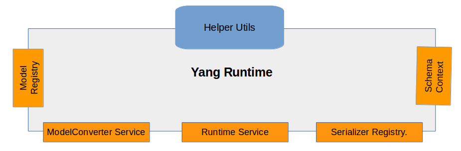
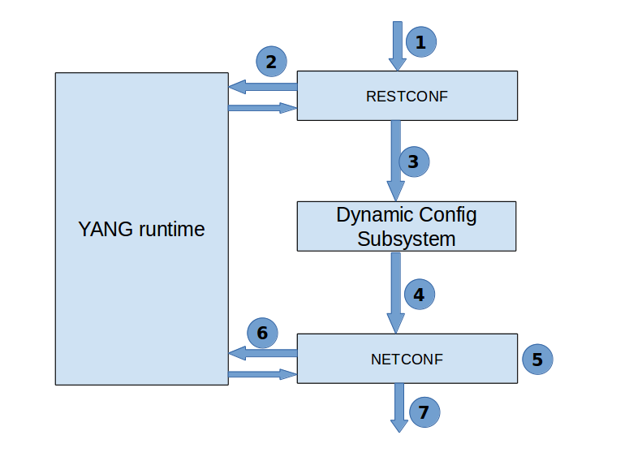
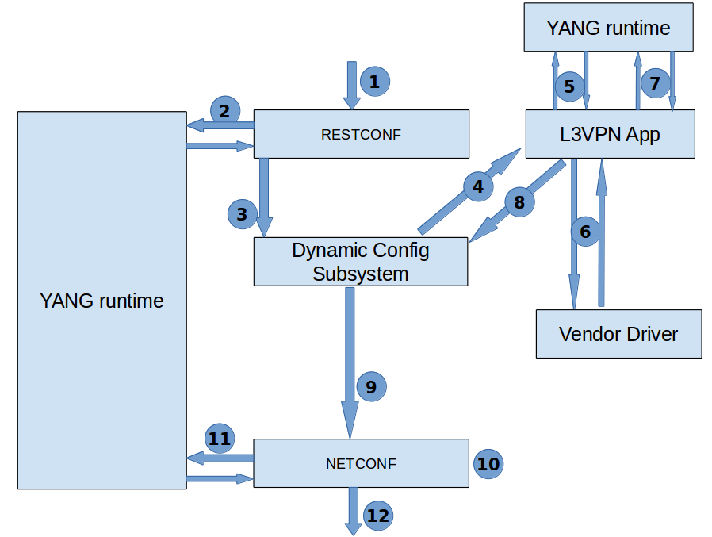

# YANG Runtime

# Team

| Name | Organization | Email |
| --- | --- | --- |
| Patrick Liu | Huawei Technologies | [partick.Liu@huawei.com](mailto:partick.Liu@huawei.com) |
| Thomas Vachuska | OnLab | [tom@onlab.us](mailto:tom@onlab.us) |
| Gaurav Agrawal | Huawei Technologies | [gaurav.agrawal@huawei.com](mailto:gaurav.agrawal@huawei.com) |
| Bharat Saraswal | Huawei Technologies | [bharat.saraswal@huawei.com](mailto:bharat.saraswal@huawei.com) |
| Sonu Gupta | Huawei Technologies | [sonu.gupta@huawei.com](mailto:sonu.gupta@huawei.com) |
| Janani B | Huawei Technologies | [janani.b@huawei.com](mailto:janani.b@huawei.com) |
| Vidyashree Rama | Huawei Technologies | [vidyashree.rama@huawei.com](mailto:vidyashree.rama@huawei.com) |
| Vinod Kumar S | Huawei Technologies | [vinods.kumar](mailto:vidyashree.rama@huawei.com)[@huawei.com](mailto:adarsh.m@huawei.com) |
| Adarsh M | Huawei Technologies | [adarsh.m@huawei.com](mailto:adarsh.m@huawei.com) |
| KalyankumarAsangi | Huawei Technologies | [kalyana@huawei.com](mailto:kalyana@huawei.com) |
| A U Surya | Huawei Technologies | [a.u.surya@huawei.com](mailto:a.u.surya@huawei.com) |

# Overview

ONOS dynamic configuration subsystem is developed with a purpose to allow service providers to access the configuration capabilities of various devices as prescribed by their YANG models and similarly to allow the service providers to define YANG models for their own network services. The system should be composed in a modular fashion and using isolated and reusable components to assure proper separation of concerns among them. YANG runtime is one of its component.YANG runtime serves as a registry of various YANG models in the system and its primary purpose is serialization and deserialization from various external formats (XML, JSON, Kryo) and their internal Java representations (based on DataNode base-class). Users (and applications) should be able to register new models and new serializers at runtime.

The YANG runtime must remain independent from any transport protocols (e.g. RESTCONF,NETCONF) and any storage or messaging mechanisms. Implementations of outward-facing protocols should depend on the YANG runtime to serialize and deserialize their payloads, and the Dynamic Config subsystem will depend on the YANG runtime to serialize these objects for distribution and persistence. However, none of these outward facing or storage concerns should permeate into the YANG runtime. It should be deployable in a standalone JVM, OSGi, or ONOS environment. Schema agnostic application will act upon the ModelObject based on YANG compiler's generated code. YANG runtime enables the model conversion between the DataNode and POJO.

Moreover YANG runtime is also a schema context provider which can be used by other applications/dynamic config subsystem components to obtain a specific schema context.

# YANG Runtime Architecture

The runtime serves as a registry of various YANG models in the system and its primary purpose is serialization and deserialization from various external formats (XML, JSON, Kryo) and their internal Java representations (based on DataNode base-class).

Users (and applications) should be able to register new models and new serializers at runtime.

The YANG runtime is independent from any transport protocols (e.g. RESTCONF, NETCONF) and any storage or messaging mechanisms.

Implementations of outward-facing protocols depend on the YANG runtime to serialize and deserialize their payloads and the dynamic Config subsystem will depend on the YANG runtime to serialize these objects for distribution and persistence.



# Serializer Registry

This service is used for registering and unregistering the available data format serializers. YANG App activation registers the default XML/JSON serializers. User can override the existing registration or can register new data formats. In case of multiple registrations of same data format, last one will take into effect.

The YangSerializerRegistry interface provides 2 API's:

**To register a new serializer or overwrite if the serializer for a particular data format already exists.**

```
void registerSerializer(YANGSerializer serializer)
```

**To unregister the specified serializer**

```
void unregisterSerializer(YANGSerializer serializer)
```

# Model Registry

This API is used by schema aware application to register YANG model. Example:L3VPN application and also live compiler.

Example: When L3VPN application wants to register L3VPN service model it has to extend the AbstractYangModelRegistrator which allows the application to attach endpoints to the respective service model.

**Code Snippet**

```
public class L3VpnModelRegistrator extends AbstractYangModelRegistrator {
    /**
     * Creates L3VPN model registrator.
     */
    public L3VpnModelRegistrator() {
        super(IetfL3VpnSvc.class, getAppInfo());
    }
    private static Map<YangModuleId, AppModuleInfo> getAppInfo() {
        Map<YangModuleId, AppModuleInfo> appInfo = new HashMap<>();
        appInfo.put(new DefaultYangModuleId("ietf-inet-types", "2013-00-15"),
                    new DefaultAppModuleInfo(IetfInetTypes.class, null));
        appInfo.put(new DefaultYangModuleId("ietf-l3vpn-svc", "2016-00-30"),
                    new DefaultAppModuleInfo(IetfL3VpnSvc.class, null));
        appInfo.put(new DefaultYangModuleId("ietf-yang-types", "2013-00-15"),
                    new DefaultAppModuleInfo(IetfYangTypes.class, null));
        appInfo.put(new DefaultYangModuleId("l3vpn-svc-ext", "2016-00-30"),
                    new DefaultAppModuleInfo(L3VpnSvcExt.class, null));
        return ImmutableMap.copyOf(appInfo);
    }
}
```

The YangModelRegistry interface provides the following methods: 

**Register a new model with parameters specifying any additional information provided by the application.**

```
void registerModel(ModelRegistrationParam param)
```

**Unregister the specified model with parameters specifying any addtional information provided by the applciation.**

```
 void unregisterModel(ModelRegistrationParam param)
```

Each model or application will have a unique identifier known as model-Id, which can be used to get YANG model for an application.

# Runtime Service

It is a service for encoding and decoding between internal and external model representation.

The decode method decodes the external representation of a configuration model from the specified composite stream into an in-memory representation. Resource identifier stream will get decoded to data node.

Protocols like NETCONF may opt only to have resource data without resource identifier, which implies the data node construction from logical root resource("/").

Also protocols like NETCONF will have decorations around the input stream which will be reported back to protocol in output. Produced annotations will be in order of pre-order traversal.

```
CompositeData decode(CompositeStream external, RuntimeContext context)
```

The encode method encodes the internal in-memory representation of a configuration model to an external representation consumable from the resulting input stream.Resource identifier in composite data will get encoded to resource data stream.

Logical root node "/" will be removed during encoding and will not be part of either resource identifier or data node.

Protocols like NETCONF may opt only to have data node with resource identifier as null in order to only get complete output in form of body without URI.

Also protocols like NETCONF would like to provide additional decorations for the node. The decoration should be in pre-order traversal order.

```
CompositeStream encode(CompositeData internal, RuntimeContext context)
```

# ModelConverter Service

Model converter provides a mechanism for converting between DataNode and Model Object instances. It is capable of constructing model POJO objects from the DataNode,including any augmentations which may be present in the DataNode structure and creating immutable tree structure from a given POJO. This API mainly gives the following methods:

**Produces a mutable POJO backed by the specified data node**

```
ModelObject createModel(DataNode)
```

**Produces an immutable tree structure rooted at the returned DataNode using the supplied model POJO object**

```
DataNode createDataNode(ModelObject)
```

# SchemaContext Provider

It returns an entity that provides schema context corresponding to a given resource identifier.

**If the model is not registered the implementation returns null else it returns schema context corresponding to a given resource identifier.**

```
SchemaContext getSchemaContext(ResourceId id)
```

# Helper Utils

* ### Runtime Helper

  Represents utility for runtime.These utilities can be used by the application to get the YANG model for the application and also it can be used by the runtime to get the YANG Node for the given YANG model.  
  Examples API's :

  **To obtain YANG model for given generated class:**

  ```
   YANGModel getModel(Class<?> aClass)
  ```

  **To get YANG node for given YANG model**

  ```
   Set<YANGNode> getNodes(YANGModel model)
  ```

  **To get interface class name of the schema node**

  ```
   String getInterfaceClassName(YANGSchemaNode schemaNode)
  ```

* ### Serializer Helper

  These set of utilities are used by Serializer to build the data node and resource identifier without obtaining schema.

  Example API's:

  **To add to resource identifier builder used by applications which are not aware about the schema name association with key's value.This api will also carry out necessary schema related validations.**

  ```
   ResourceId.Builder addToResourceId(ResourceId.Builder builder, String name, String namespace, List<String> value)
  ```

  **To add a data node to a given data node builder. This API will also carry out necessary schema related validations.**

  ```
  Builder addDataNode(Builder builder, String name, String namespace, String value, DataNode.Type type)
  ```

  **To get the resource identifier for a given data node. This API will be used by serializer to obtain the resource identifier in the scenario when an annotation is associated with a given data node.**

  ```
  ResourceId getResourceId(Builder builder)
  ```

# Use Case Scenarios Of YANG Runtime

* ## Device Configuration

    

  Control Flow:

  Prerequisite : Onos NB registers the device YANG model with YANG Runtime

  Step 1: User/Application sends device configuration data in JSON/XML format to RESTCONF.

  Step 2: RESTCONF sends the data to YANG runtime for it to decode the data to DN(data nodes) and then return them back.

  Step 3: RESTCONF pushes the decoded data to Dynamic configuration subsystem.

  Step 4: Dynamic configuration subsystem then sends a notification to NETCONF.

  Step 5: NETCONF removes the additional metadata information and then send it to YANG runtime.

  Step 6: YANG runtime encodes the data to JSON/XML format and send it back to NETCONF.

  Step 7: NETCONF send the encoded data to the SB devices.
* ## Service configuration

    

  Control Flow:

  Step 1: Restconf receives the data from user/application in JSON/XML format.

  Step 2: It sends this data to YANG runtime which uses serializer to decode it into DN(data nodes).

  Step 3: Restconf pushes the encoded data to Dynamic Configuratation subsystem.

  Step 4: Dynamic Configuration sends notification to L3VPN application.

  Step 5: After receiving the data, it sends it to YANG runtime for a model conversion from DN to POJO and then sends that back to L3VPN application.

  Step 6: The L3VPN application creates a Standard device model and sends it to vendor.The vendor modifies it accordingly and creates a vendor specific device model and then sends this to L3VPN application .

  Step 7: L3VPN application sends it to YANG runtime for a model conversion from POJO to DN.

  Step 8: L3VPN application pushes the vendor model to Dynamic Configuration subsystem.

  Step 9: Dynamic configuration subsystem sends notification to Netconf.

  Step 10: NETCONF removes the additional metadata information

  Step 11: NETCONF sends the data to YANG runtime which enoded it to JSON/XML format and then return the same to NETCONF.

  Step 12: Finally NETCONF sends the data to the SB devices.
