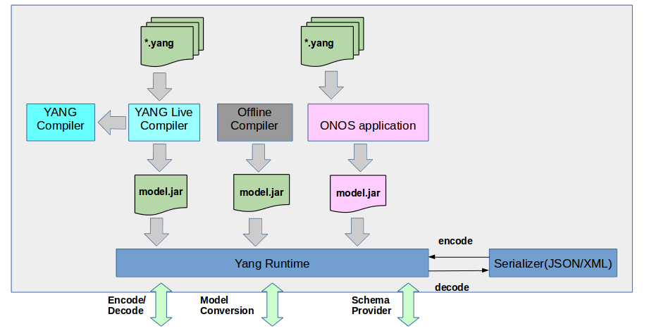
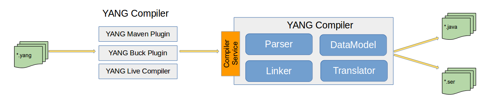
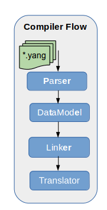
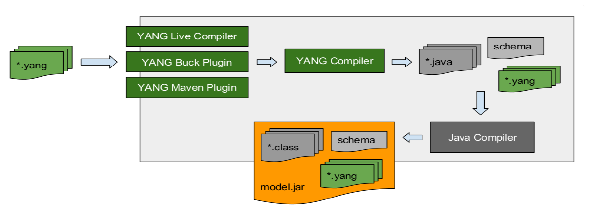
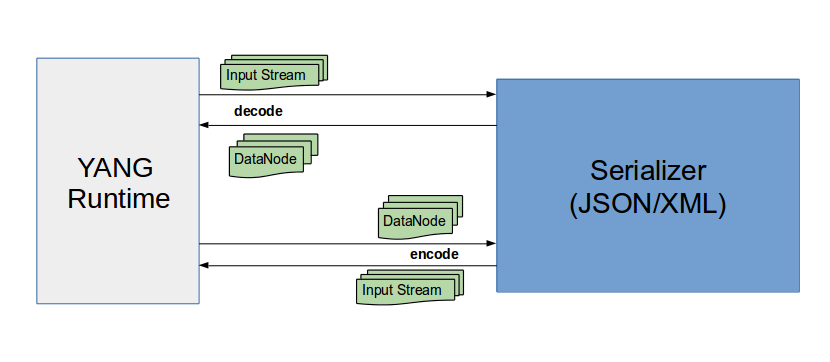

# YANG Tools

# Team

| Name | Organization | Email |
| --- | --- | --- |
| Adarsh M | Huawei Technologies | [adarsh.m@huawei.com](mailto:adarsh.m@huawei.com) |
| Bharat Saraswal | Huawei Technologies | [bharat.saraswal@huawei.com](mailto:bharat.saraswal@huawei.com) |
| Brian O'Connor | OnLab | [bocon@onlab.us](mailto:tom@onlab.us) |
| Gaurav Agrawal | Huawei Technologies | [gaurav.agrawal@huawei.com](mailto:gaurav.agrawal@huawei.com) |
| Janani B | Huawei Technologies | [janani.b@huawei.com](mailto:janani.b@huawei.com) |
| Patrick Liu | Huawei Technologies | [Partick.Liu@huawei.com](mailto:Partick.Liu@huawei.com) |
| Ray Milkey | OnLab | [ray@onlab.us](mailto:tom@onlab.us) |
| Sathish Kumar M | Huawei Technologies | [sathishkumar.m@huawei.com](mailto:sathishkumar.m@huawei.com) |
| Shankara | Huawei Technologies | [shankara@huawei.com](mailto:shankara@huawei.com) |
| Sonu Gupta | Huawei Technologies | [sonu.gupta@huawei.com](mailto:Rama.Subba.Reddy.S@huawei.com) |
| Suchitra H N | Huawei Technologies | [suchitra.hn@huawei.com](mailto:suchitra.hn@huawei.com) |
| Thomas Vachuska | OnLab | [tom@onlab.us](mailto:tom@onlab.us) |
| Vidyashree Rama | Huawei Technologies | [vidyashree.rama@huawei.com](mailto:vidyashree.rama@huawei.com) |
| Vinod Kumar S | Huawei Technologies | [vinods.kumar@huawei.com](mailto:vinods.kumar@huawei.com) |

# YANG Tools Overview

YANG is a data modeling language used to model configuration & state data. Modeling languages such as SMI (SNMP), UML, XML Schema, and others already existed. However, none of these languages were specifically targeted to the needs of configuration management. They lacked critical capabilities like being easily read and understood by human implementers, and fell short in providing mechanisms to validate models of configuration data for semantics and syntax.

YANG tools are the basic building block to achieve the final goal of abstracting the language based Syntax/Semantics processing by APPs.

The YANG modeled interfaces need to be implemented by corresponding application component. There are 2 parts in implementing the interface:

1. 1. Syntax/semantics processing of the request/response being exchanged.
   2. Business logic to compute the request.

YANG Tools is a infrastructure project aiming to develop necessary tool chain and libraries providing support of NETCONF and YANG for Java(JVM-language based) projects and applications.

We intend to abstract the applications from syntactic processing of information encoding with external world.

We intend to provide a framework in which the applications only need to implement the business logic and seamlessly support any interface language like REST, NETCONF etc. 



In ONOS, YANG is being used as a general purpose modeling language.

There are four entities which drive this:

1. 1. Model
   2. YangCompiler
   3. YangSerializer
   4. YangRunTime

# Model

Base Models will be used by different YANG components. It includes following:

##### DataNode

Provides a basis for holding information in a tree whose structure corresponds to a set of YANG models (base & augmentations).

* Is immutable.
* Provides a mechanism for mutation (Builder pattern, etc.)
* Understands the schema that was used to construct it.
* Store will be based on DataNode.

      Data node is categorized in two sub-type:

* Inner node represents container and list.
* Leaf node represents leaf and leaf-list.

##### ResourceId

Resource identifier, Its list of node key to drive path till the resource, where key is contains the local node name and the corresponding module namespace. 

* Is immutable.
* Provides a mechanism for mutation (Builder pattern, etc.)
* Used to operate on a given resource.

##### ModelObject

Provides a common basis for all POJOs which are generated from a YANG model.

* It is mutable.
* The binding between ModelObject POJO and DataNode is performed by the YANG Runtime.  
    
  Each model or application will have a unique identifier, which can be configured using buck or maven as shown below :

  **To config mode-ld using maven**

  ```
  <configuration>
      <modelId>xml</modelId>
  </configuration>
  ```

  **To config model-Id using buck**

  ```
  yang_model(
      app_name = 'example.application',
      model_id = 'example_id'
  )
  ```

  In-case model-id is not configured then artifact-Id will be configured as model-Id for that particular application.

# YANG Compiler



The compiler consists of YANG language parser and Java code generator(linker & translator).

Its purpose is to take YANG models as input and produce Java source code.

This component does not dependent on any specific build frameworks (e.g. Buck, Maven, Ant) and it is deployable in a standalone JVM or OSGi framework environment.

The compiler produce Java classes whose fields can be accessed in generic ways as well as in type-safe specific ways via class-casting.

The generic access needs to be available to allow model-agnostic information processing.

For example, DataNode (the base type) allow an application to call a method to enumerate the String names of fields in the model and another method to get the DataNode associated with each of the fields by name.

Alternatively, applications also be able to cast the DataNode to its specific runtime type, where it can access each field via specific method and get specific types in return.

The DataNode derived classes and any other generated code not depend (directly or otherwise) on the ONOS API or other third-party libraries other than the standard Java SDK.

There is Maven and Buck plug-ins made available as minimalistic separate entities that will serve the purpose of shuttling information from the build frameworks to the YANG compiler.

These plug-ins are useful for producing Java source code that can be used to compile applications against various YANG models. 

Various components of YANG compiler which helps yang compiler to compiles YANG files and generates the required code with serialized metadata.

# Parser

Parse the input YANG file and produces DataModel. It compiles Yang files against the YANG grammar version 1.0 using ANTLR tool and updates the data model tree.

# DataModel

Abstract representation of YANG in JAVA tree format, it is later serialized and used by YANG runtime to understand the schema information.

# Linker

Links the various Intra File/Inter-File/ Inter-JAR YANG constructs dependencies. For ex: grouping and uses linking, typedef and type linking. Import, imclude depencency.

# Translator

Generates Java code corresponding to Data model.



For more information please refer   
[https://wiki.onosproject.org/display/ONOS/YANG+utils](yang-runtime.md)

In a nutshell, the process takes a set of YANG files and compiles them into a set of Java classes along with the compiled schema meta-data and packages them into a JAR, with manifest annotated as an OSGi bundle and a single-jar ONOS application.

The original YANG files will be included as resources as well.

The process will be codified as a Maven plug-in, Buck plug-in and a run-time component providing on-the-fly compilation capabilities.

The following depicts the compilation process:



For more information please refer

[https://wiki.onosproject.org/display/ONOS/YANG+Compiler](yang-compiler.md)

# YANG Live Compiler

Allows on-the-fly compilation & registration of YANG models.

To be updated later...

# YANG Serializers

Serializers is an entity capable of encoding and decoding arbitrary structures(Data Node),   
which are in-memory representations of YANG models, to and from various external representations, e.g. XML, JSON.

It decodes the external representation of a configuration model from the specified composite stream into an in-memory representation.   
Resource identifier stream "URI" will get decoded to resource identifier and resource data stream will get decoded to data node.

It encodes the internal in-memory representation of a configuration model to an external representation consumable from the resulting input stream.   
Resource identifier in composite data will get encoded to resource identifier stream and data node will be encoded to resource data stream.



Facilities to convert Input stream to DataNode and vice versa.

Following serializers are required:

1) JSON Serializer: Convert to/from JSON to DataNode.

2) XML Serializer: Convert to/from XML to DataNode

# YANG Runtime

The runtime serves as a registry of various YANG models in the system and its primary purpose is serialization and deserialization from various external formats (XML, JSON, Kryo) and their internal Java representations (based on DataNode base-class).

Users (and applications) should be able to register new models and new serializers at runtime.

The YANG runtime is independent from any transport protocols (e.g. RESTCONF, NETCONF) and any storage or messaging mechanisms.

Implementations of outward-facing protocols depend on the YANG runtime to serialize and deserialize their payloads and the dynamic Config subsystem will depend on the YANG runtime to serialize these objects for distribution and persistence.

However, none of these outward facing or storage concerns should permeate into the YANG runtime; it is deployable in a standalone JVM, OSGi, or ONOS environment.

For more information please refer

[https://wiki.onosproject.org/display/ONOS/YANG+Runtime](yang-runtime.md)

# Reference of Applications

Schema Aware Applications:

Applications who are aware about the YANG data structure and operates on that.

Example: L3VPN, PCE, SFC

Schema Un-aware Applications:

Applications who are not aware about the YANG data structure and wanted to operate in schema agnostic way.

Example: RESTCONF, NETCONF, Store

# Enhancement with YANG 2.0

|  |  |  |
| --- | --- | --- |
|  | **YANG Tools (1.11) + YMS** | **YANG Tools (2.0) + Dynamic Config** |
| **Generated Classes** | Tied to YMS; no common basis between models | Common ancestor for all models;  model-agnostic and model-specific access;  friendly API for apps |
| **Storage** | Ad hoc; models serialized and stored at the discretion of application | Any and all models in a single store |
| **Protocols** | RESTCONF and NETCONF are tightly coupled and integrated with YMS | RESTCONF and NETCONF can be maintained independently;  new protocols (e.g. gNMI are easier to add) |
| **New Models** | Applications must be made aware of all models at compilation time;  cannot be stored by YMS | Applications can interact with new models or  augmentations at runtime using the model-agnostic interface |
| **Live Compilation** | Not available; introduction of new models requires recompilation | YANG models can be introduced and compiled at runtime (e.g. from a device) |
| **Modularity and Maintainability** | YMS and onos-yang-tools are tightly coupled making maintenance  difficult and usage is brittle | YANG tools, dynamic config manager and store are implemented in a modular fashion;  they can be evolved and maintained independently from one another;  generated classes are not tied to the dynamic config store |

# Reference

```
https://wiki.onosproject.org/display/ONOS/YANG+Compiler
```

```
https://wiki.onosproject.org/display/ONOS/YANG+Runtime
```

```
https://wiki.onosproject.org/display/ONOS/YANG+utils
```

```
https://wiki.onosproject.org/display/ONOS/L3VPN
```

# Future

To be planned:  
1) YANG 1.1 version.

2) OpenConfig YANG integration to ONOS.

3) YANG Library based on RFC 7895.

4) YANG GUI enhancement for live compilation.

5) Sub-module support.
