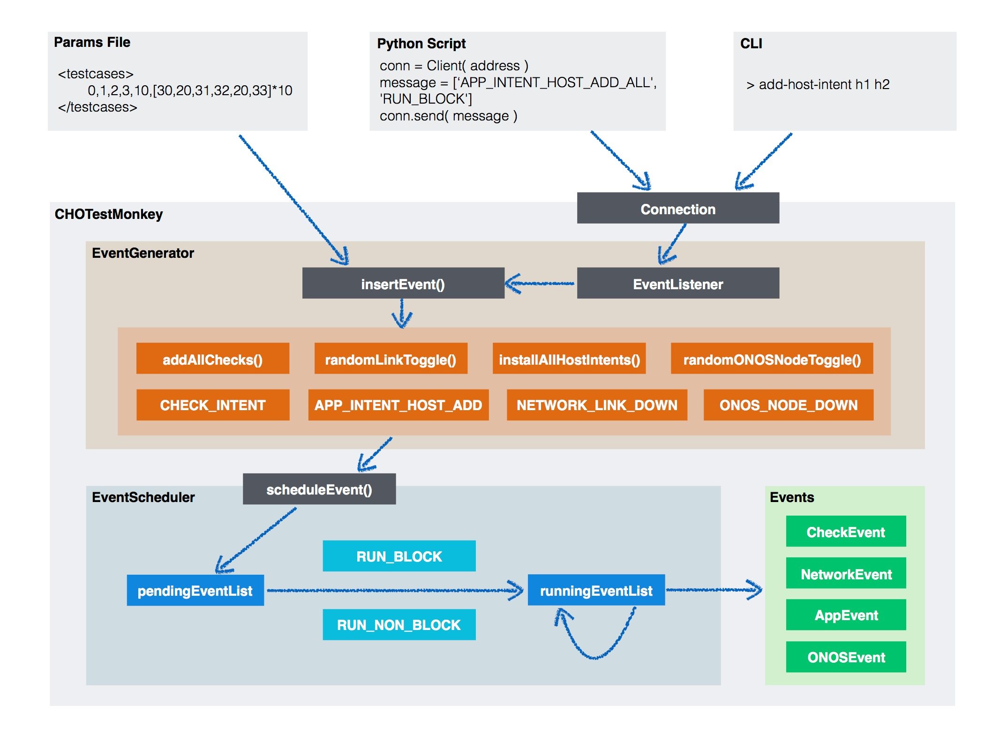

# CHO Test Tutorial

**Table of Contents**

- [Summary](#CHOTestTutorial-Summary)

- [Background](#CHOTestTutorial-Background)

- [CHOTestMonkey Framework](#CHOTestTutorial-Framework)

- [How to Run CHOTestMonkey](#CHOTestTutorial-Run)

- [How to Contribute to CHOTestMonkey](#CHOTestTutorial-Contribute)

### **Summary**

CHO (Continuous Hours of Operation) test runs on an experimental framework called CHOTestMonkey inside TestON. Instead of running a predefined sequence of test cases, CHOTestMonkey breaks test cases into atomic test logics called events and provides a highly customizable way to organize and execute these events. With CHOTestMonkey, it becomes much easier and more flexible to maintain various pieces of test logic and assemble them in different ways for different test purposes.

For instance, one can start CHOTestMonkey without any predefined test logic, and then trigger various events from an external python script. A pseudo code for the python script looks like:

```
# Add a host intent between h1 and h2
triggerEvent('APP_INTENT_HOST_ADD', 'h1', 'h2')
# Randomly bring down a link
triggerEvent('NETWORK_LINK_DOWN', 'random')
# Verify network topology
triggerEvent('CHECK_TOPO')
# Pause the test
triggerEvent('TEST_PAUSE')
```

In this way, one can easily customize the test logic with much less efforts.

CHOTestMonkey also provides a CLI which is especially useful when debugging:

```
CHO> add-host-intent h1 h2
CHO> link-down random
CHO> check-topo
CHO> pause-test
```

More details of CHOTestMonkey are provide below. Please continue reading if you are interested in our new test framework.

### **Background**

CHO test focuses on testing ONOS longevity. In previous versions of CHO test, we loop a predefined sequence of test cases (e.g. intents installation/withdrawal, link down/up, verify network topology, etc.) which fully follows current TestON structure and logic. However, as the existing CHO test becomes mature, we have come to realize its limitation and consider a redesign of the CHO test with two main goals:

1. Simulating a long time running of ONOS in practical networks;
2. Improving debuggability of CHO test.

Goal-1 requires at least two changes: first, we need a new way to organize and execute test cases (or logic inside test cases). A predefined sequence of test logic is not a good simulation of user/network behaviors in practical networks. Second, we should allow running multiple test cases in parallel, e.g. installing intents when network failure happens. For Goal-2, since CHO test is expected to run for several days or longer, it becomes much more difficult for debugging due to not only large log files but also not being able to interact with the test while running (e.g. change test configurations or even test logic in real time). Besides, reproduction of failures in CHO test is always costly.

To address these issues, we propose to build a new experimental test framework inside TestON for CHO, which we call CHOTestMonkey. The suffix "Monkey" implies both the Chaos Monkey style testing and the year of the Monkey 2016. CHOTestMonkey has the following core ideas:

* First, we break test cases into smaller blocks of test logic which we call **events**. Each event is an atomic operation to the SDN network, e.g. installing one intent, bringing down one link, verifying onos status, etc. Test cases can be built by assembling different events, which makes CHOTestMonkey backwards compatible.
* Second, we introduce an **event generator** which accepts a list of event generation rules as input and outputs events generated. For instance, it can be called to generate a random link down event, or a host-to-host intent event according to some network models.
* Third, an **event scheduler** is designed to flexibly execute events according to different strategies. Normally events can be executed in parallel, while some events may require to be executed after other events. For example, intent installations can run in different threads, but a topology check event should wait until all pending topology events end. In conclusion, event scheduler ensures all events generated run efficiently without conflict with each other.
* At last, besides automatically generating events inside CHO, we also allow CHO accepts commands from outside for event generation by setting up a connection between CHO and any third party python script. Based on this feature, we implement a CLI for CHOTestMonkey which accepts user-friendly commands such as "add-host-intent h1 h2" and "check-topo" and then triggers event generation inside CHO test. With the help of the CHO CLI, testers can easily pause/resume CHO test at anytime and check network status or change test logic by inserting any events into the test in real time.

By realizing the above ideas, we greatly improve the flexibility and debuggability of CHO test.

### **CHOTestMonkey Framework**



#### Overview

The figure above demonstrates the framework of CHOTestMonkey. We abstracted all the test logics in the old CHO test into different types of events. Each event stands for an atomic test logic such as installing an intent, bringing down a link, check ONOS status and so on. We have several ways to inject the events into the test. We can still specify a list of events to run from the params file, or we can inject arbitrary events from external scripts or CLI at any time during the test (see the following section for details). Under the hood we have a listener for the event triggers from outside, which will then trigger the generation of events in the eventGenerator. All the generated events will go to the eventScheduler, transit from a pending event to a running event. We can implement different scheduling methods. We may want to run some events in parallel, or block some events until others finish. For example, we may want to finish all the checks before injecting the next failure event. And we can also reschedule the events when they fail.

#### CHO Test Events

Currently we classify all events into five event families:

* CheckEvent is for all events that checks current status of the test, e.g. events to check intents, flows, network topologies, end-to-end connectivity, onos status and so on;
* NetworkEvent is for southbound events and currently includes events that bring down/up Mininet links and devices;
* AppEvent is for northbound events and currently includes intent and flow related operations;
* ONOSEvent is for events related to ONOS itself, such as stop/restart ONOS nodes, set specific ONOS configurations or trigger a specific ONOS function like balance masters of devices;
* TestEvent is for changing CHO test configurations in real time, which currently includes events to make CHO test paused/resumed/sleeping, or change specific configurations (WIP).

In addition, the events above (which we call individual events) can be grouped into group events. For example, addAllChecks includes all check events, and randomLinkToggle will randomly tear down one Mininet link and then bring it back.

#### Event Generator

The role of EventGenerator is to produce all kinds of events mentioned above either automatically according to some event generation algorithms or manually from outside. Once an event is generated, it will be inserted to the tail of the EventScheduler.

EventGenerator has a listener which listens on local port 6000. It allows connections from outside to trigger the generation of events inside CHOTestMonkey. With this functionality, more flexibility can be achieved via a complete separation of event triggering and scheduling. One can run multiple processes on local or even remote machines as different sources of events without worrying about the scheduling of all events triggered. For more information about how this can be done, please take a look at the next "How to" section.

#### Event Scheduler

There are two main data structures in EventScheduler: pendingEventList and runningEventList. All events generated first go to pendingEventList and wait until being scheduled. Currently we provide two scheduling methods which divide all events into blocking events and non-blocking events. Blocking events can only run in sequence while non-blocking events can run in parallel. Scheduled events go to runningEventList, and will be re-scheduled upon failure with configurable rerun time and interval.

### **How to Run CHOTestMonkey**

Basically CHOTestMonkey runs the same way as other tests:

```
$ ./cli.py run CHOTestMonkey
```

For now we have the following three ways to configure the events that will be generated and scheduled after CHO starts:

#### .Params

We can still specify the test logic in [.params](https://github.com/opennetworkinglab/OnosSystemTest/blob/master/TestON/tests/CHOTestMonkey/CHOTestMonkey.params) file. However, this backward compatible method only shows a subset of CHOTestMonkey's potentials since the logic of test cases are fixed and they still run in sequence.

Example:

```
<PARAMS>
	# 0. Initialize CHOTestMonkey
	# 10. Run all enabled checks
	# 20. Bring down/up links and check topology and ping
	# 30. Install host intents and check intent states and ping
	# 40. Randomly bring down one ONOS node
	<testcases>0,30,20,40,10</testcases>
...
```

Our recent update introduces a test case 70 which randomly generates and triggers various types of events with different arguments, which offers an easier way towards "Chaos Monkey" style testing. Please take a look at [CHOTestMonkey.py](https://github.com/opennetworkinglab/OnosSystemTest/blob/master/TestON/tests/CHOTestMonkey/CHOTestMonkey.py) for more details.

Besides, we also offer test case 80 which reads one log file from previous CHOTestMonkey runs and then replays all the events recorded in that log. The replay functionality helps to reproduce issues encountered in previous CHO test especially when CHO events are randomly generated and thus cannot be replicated unless recorded into the log.

#### Python Script

To generate events from outside of CHOTestMonkey, one way is to write a simple python script which connects to the EventListener on local port 6000 and then sends a request message which contains the event name, schedule method and arguments.

Example:

```
from multiprocessing.connection import Client
 
address = ( "localhost", 6000 )
conn = Client( address )
request = [ 1, 'NETWORK_LINK_DOWN', 'RUN_BLOCK', 's1', 's2' ]
conn.send( request )
response = conn.recv()
conn.close()
```

The script above will trigger a link down event between switch s1 and s2, and the event will be scheduled as a "blocking event", which means it won't be scheduled util all other running events finish, and at the same time it will block all following events from running before it finishes.

The first element of the request list indicates the message type: 1 means normal message and 2 means debug message. The only difference is that when EventScheduler reaches the upper limit of its "pendingEventsCapacity" (which is configurable via the params file), only debug messages can still be inserted to the tail of the pending event list. For normal messages, EventGenerator will return a message saying that the request is denied. For more information of the message types exchanged between the two sides, please take a look at [EventGenerator.py](https://github.com/opennetworkinglab/OnosSystemTest/blob/master/TestON/tests/CHOTestMonkey/dependencies/EventGenerator.py).

In addition, [EventTrigger.py](https://github.com/opennetworkinglab/OnosSystemTest/blob/master/TestON/tests/CHOTestMonkey/dependencies/EventTrigger.py) provides a more complicated way to interact with the EventGenerator in CHOTestMonkey using custom python scripts.

#### CLI

[cli.py](https://github.com/opennetworkinglab/OnosSystemTest/blob/master/TestON/tests/CHOTestMonkey/dependencies/cli.py) provides a pseudo CLI tool which connects to the EventListener in the same way as described above while at the same time reads inputs from command line interface. "help" command prints a list of commands that are currently supported. The CLI tool can be quite helpful when debugging CHO test.

Example:

```
CHOTestMonkey> link-down s1 s2
CHOTestMonkey> debug
CHOTestMonkey-debug> pause-test
```

The first command above triggers a link down event between switch s1 and s2. The second command above enters the debug mode, which means all messages sent to CHOTestMonkey will be set to debug messages (explained above) by default. For instance, the third command above will insert a pause-test event into the event pending list by force no matter how many pending events there are.(Note: currently all events inserted will go to the tail of the pending event list, we are working on an update to make it possible to insert events into other positions of the list.)

### **How to Contribute to CHOTestMonkey**

CHOTestMonkey is still experimental and there are many TODOs. Any contribution to CHOTestMonkey framework is welcomed.

Specifically, adding more events into the framework can be the first step to contribute ([this page](../../../system-test-plans-and-results/test-plans/test-plan-cho-test-cho/plan-chotestmonkey.md) lists all the events that are currently implemented in CHOTestMonkey). CHOTestMonkey is designed to be extensible, and as a result, only two steps are needed to add a new event:

1. Put related information e.g. event name, type, status, etc. into .params file, and
2. Write a new class for the event

For example, to add a new event which checks onos logs for errors, first we need to put the following information into CHOTestMonkey.params file:

```
<LogCheck>
	<status>on</status>
	<typeIndex>15</typeIndex>
	<typeString>CHECK_LOG</typeString>
	<CLI>check-log</CLI>
	<CLIParamNum>0</CLIParamsNum>
	<rerunInterval>5</rerunInterval>
	<maxRerunNum>5</maxRerunNum>
</LogCheck>
```

"LogCheck" is the name of the class which contains all logics of the event. The "status" tag devices whether this event is enabled in the test or not. "TypeIndex" and "TypeString" are identifiers of the event inside CHOTestMonkey. It is suggested to start typeString with the "event family", namely CHECK, NETWORK, APP, ONOS and TEST, and also to aggregate typeIndex (e.g. 10 <= typeIndex < 20 for all check events). "CLI" and "CLIParamNum" tags indicate the CLI command string to trigger this event and the number of arguments it takes. Finally, "rerunInterval" and "maxRerunNum" are used to configure retry intervals and numbers upon event failures. Besides, it is also encouraged to add other event specific parameters here.

The rest of the work is to implement the check logic. As described above, events belong to individual events or group events. We make LogCheck an individual event since it makes sense to regard it as an atomic operation in CHOTestMonkey. Therefore, we suggest adding "LogCheck" class into CheckEvent.py since it belongs to the check event family.

The class should look like:

```
class LogCheck( CheckEvent ):
	def __init__( self ):
		CheckEvent.__init__( self )
		self.typeString = main.params[ 'EVENT' ][ self.__class__.__name__ ][ 'typeString' ]
		self.typeIndex = int( main.params[ 'EVENT' ][ self.__class__.__name__ ][ 'typeIndex' ] )
 
	def startCheckEvent( self, args=None ):
		checkResult = EventStates().PASS
		# Put your check logic here
		return checkResult
```

All check logics go to startCheckEvent function, which returns EventStates().PASS on success, EventStates().FAIL on failure and EventStates().ABORT otherwise. Please refer to [CheckEvent.py](https://github.com/opennetworkinglab/OnosSystemTest/blob/master/TestON/tests/CHOTestMonkey/dependencies/events/CheckEvent.py) for more implementation details.

Group events should be added into EventGenerator.py where it needs to be broken down into multiple individual events. Please check [EventGenerator.py](https://github.com/opennetworkinglab/OnosSystemTest/blob/master/TestON/tests/CHOTestMonkey/dependencies/EventGenerator.py) (e.g. installAllHostIntents class) for more details.
