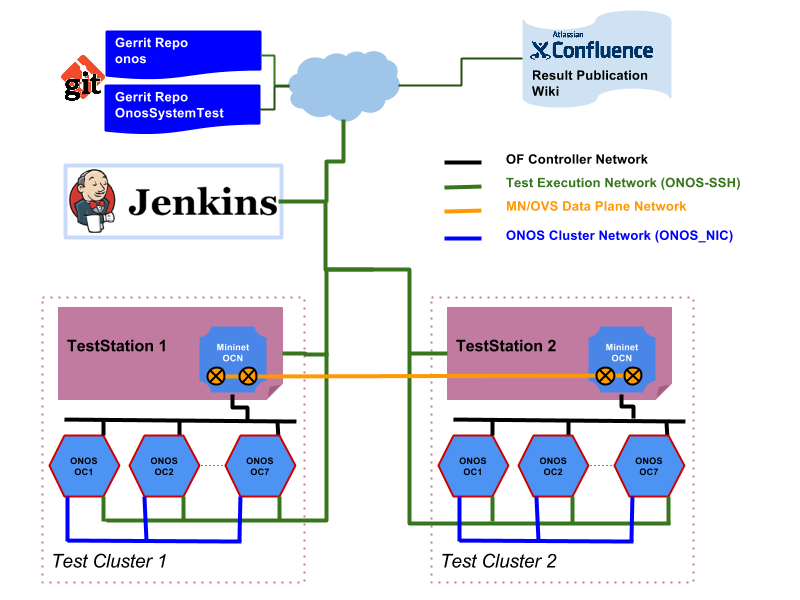

# System Test Setup Overview



## Components in this Setup:

* **Jenkins CI system** (Optional - if you need to have automated build job set up; else, all the test cases can be driven from TestStation.);
* **Wiki** (Atlassian Confluence), or other publishing services (Optional - if you don't need to publish test results);
* **Gerrit Repo** - [gerrit.onosproject.org](http://gerrit.onosproject.org); this is the git repository for both onos and OnosSystemTest;
* **TestStation** - runs "OnosSystemTest/TestON"; optionally onos Bench and Mininet. *Required: "OC" environment variables are configure in the host to run test scripts.*
* **ONOS cells** - each cell is a node running ONOS - the number of cells needed depending on your test cases;
* **SDN network** - this is either a Mininet-emulated network, or physical network.

## Example Test Setup Procedure:

This guide will help you install TestON, configure your environment, and run a sample test with a three node cluster.

Requirements: ONOS 1.3 or higher (recommended) must be correctly installed. Follow this [guide](../administrator-guide/installing-and-running-onos.md) to install ONOS.

**Clone Mininet to TestStation and run the install script**

```
$ cd ~
$ git clone https://github.com/jhall11/mininet.git	    # Clone the repository
$ cd mininet
$ git branch -v -a									    # Show all the remote repositories
$ git checkout -b dynamic_topo origin/dynamic_topo		# Checkout the dynamic_topo repository
$ cd util
$ sudo ./install.sh -3fvn								# Install OpenFlow 1.3, Open Vswitch and Mininet dependencies
```

NOTE: If you have a different repo of Mininet, we recommend removing it and re-cloning the one listed above. You will also need to remove these packages from your home dir: pox, loxigen, openflow, flop, oftest, openvswitch, and any other package that mininet installs. Refer to this page if you any questions <http://mininet.org/download/>.

**Clone "OnosSystemtest" to TestStation**

```
$ git clone https://gerrit.onosproject.org/OnosSystemTest
```

**Install TestON**

Please follow [TestON installation guide](https://wiki.onosproject.org/x/To8g) to install TestON.

**Set your cell. The sample test requires a 3-node cell. Follow this [guide](../developer-guide/development-environment-setup/development-workflow-options/cells-and-onos-test-scripts.md) if you are having trouble setting your cell.**

NOTE: The cell needs OC1-3 defined, OCN to point to your bench test station, and OCI to point to OC1.

```
$ cell <cell name>
```

NOTE: Make sure ONOS is update-to-date and you build it before running the test.

**Run the sample test.**

```
$ cd ~/OnosSystemTest/TestON/bin/
$ ./cli.py run SAMPstartTemplate_1node
```
