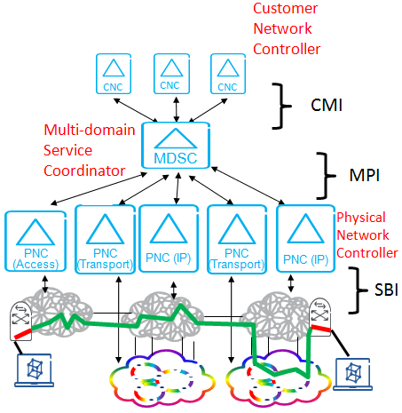
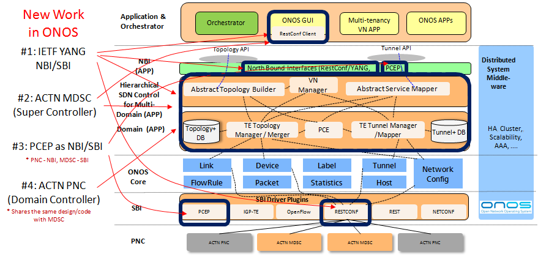
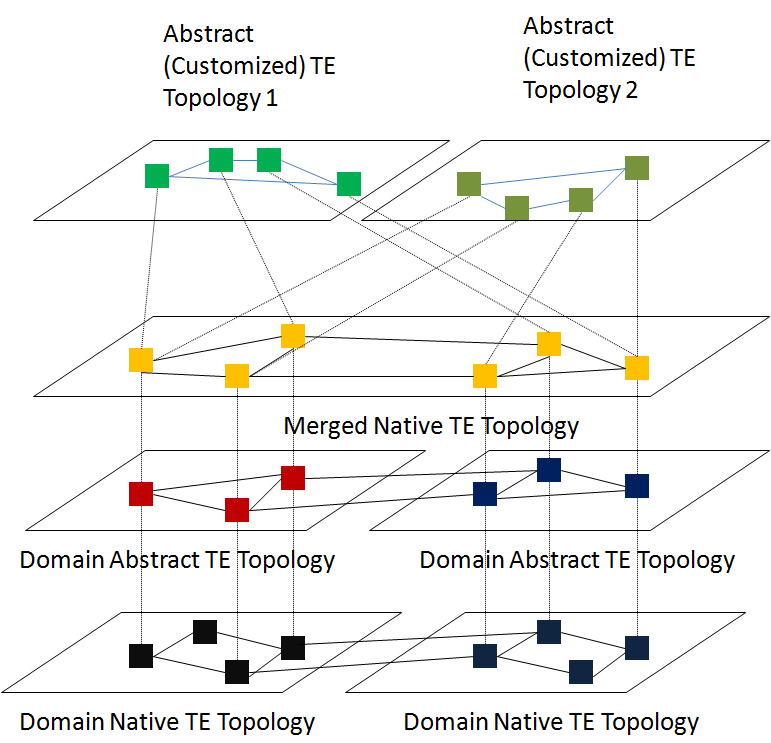
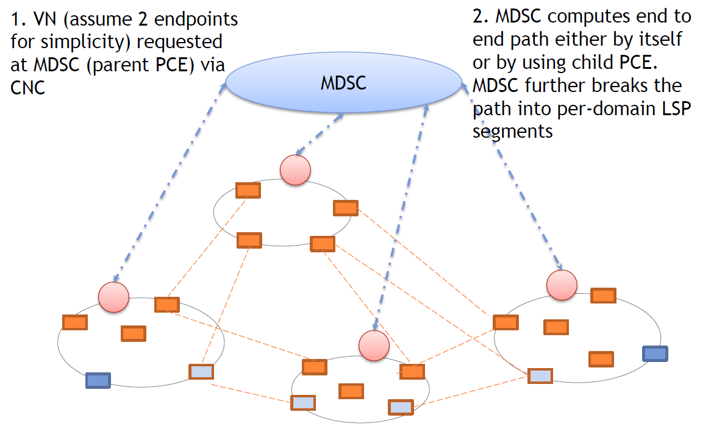
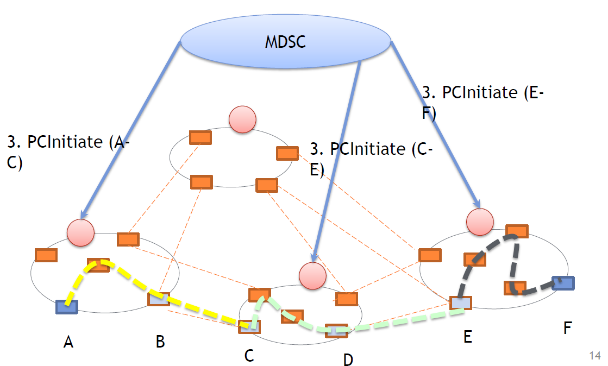
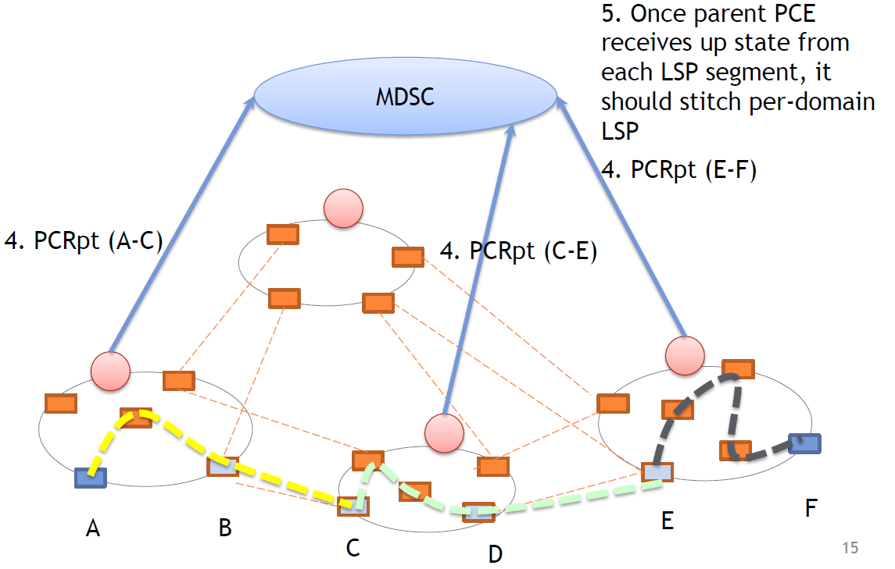
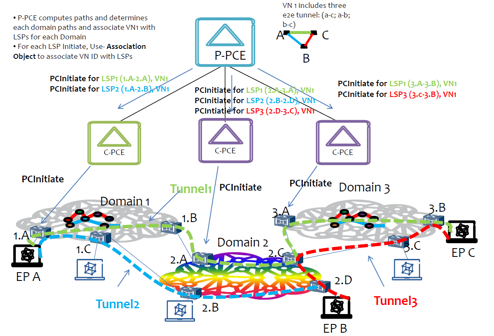

# ACTN (Abstraction and Control of TE networks)

### **Contributors**

| Name | Organization | Email |
| --- | --- | --- |
| Aihua Guo (point of Contact) | Huawei Technologies | [aihuaguo@huawei.com](mailto:aihuaguo@huawei.com) |
| Satish K | Huawei Technologies | [satishk@huawei.com](mailto:satishk@huawei.com) |
| Dhruv Dhody | Huawei Technologies | dhruv.dhody@huawei.com |
| Young Lee | Huawei Technologies | leeyoung@huawei.com |
| Haomian Zheng | Huawei Technologies | [zhenghaomian@huawei.com](mailto:zhenghaomian@huawei.com) |
| Kalyana | Huawei Technologies | [kalyana@huawei.com](mailto:kalyana@huawei.com) |
| Tao Liu | Huawei Technologies | liutao61@huawei.com |
| Fan Cheng | Huawei Technologies | chengfan2@huawei.com |
| Yixiao Chen | Huawei Technologies | [yixiao.chen@huawei.com](mailto:yixiao.chen@huawei.com) |
| Patrick Liu | Huawei Technologies | [Patrick.Liu@huawei.com](mailto:Patrick.Liu@huawei.com) |
| Jongyoon Shin | SK Telecom | [jongyoon.shin@sk.com](mailto:jongyoon.shin@sk.com) |
| Junhee Lee | SK Telecom | [ok0315@sk.com](mailto:ok0315@sk.com) |
| Bin Yeong Yoon | ETRI | [byyun@etri.re.kr](mailto:byyun@etri.re.kr) |
| ChunglaeCho | ETRI | [clcho@etri.re.kr](mailto:clcho@etri.re.kr) |
| TaeyoungKim | S & T Soft | [kty@sntsoft.co.kr](mailto:kty@sntsoft.co.kr) |
| Peter Park | KT | [peter.park@kt.com](mailto:peter.park@kt.com) |
| TaehyunKwon | ETRI | [thkwon@etri.re.kr](mailto:thkwon@etri.re.kr) |
| ChansungPark | ETRI | [chansung18@etri.re.kr](mailto:chansung18@etri.re.kr) |

### Overview

ACTN refers to the set of virtual network operations needed to  
orchestrate, control and manage large-scale multi-domain TE networks  
so as to facilitate network programmability, automation, efficient  
resource sharing, and end-to-end virtual service aware connectivity  
and network function virtualization services.

These operations are summarized as follows:

- Abstraction and coordination of underlying network resources  
to higher-layer applications and customers, independent of how  
these resources are managed or controlled, so that these  
higher-layer entities can dynamically control virtual  
networks. Where control includes creating, modifying,  
monitoring, and deleting virtual networks.

- Multi-domain and multi-tenant virtual network operations via  
hierarchical abstraction of TE domains that facilitates  
multi-administration, multi-vendor, and multi-technology  
networks as a single virtualized network. This is achieved by  
presenting the network domain as an abstracted topology to the  
customers via open and programmable interfaces. Which allows  
for the recursion of controllers in a customer-provider  
relationship.

- Orchestration of end-to-end virtual network services and  
applications via allocation of network resources to meet  
specific service, application and customer requirements.

- Adaptation of customer requests (made on virtual resources) to  
the physical network resources performing the necessary  
mapping, translation, isolation and, policy that allows  
conveying, managing and enforcing customer policies with  
respecttotheservicesby the network to said customer.

- Provision of a computationschemeandvirtualcontrol  
capability via a data model to customers who request virtual  
network services. Note that these customers could, themselves,  
be service providers.

ACTN solutions buildson, and extend, existing TE constructs and  
TE mechanisms wherever possible and appropriate.

### Framework

```
      . CNC - Customer Network Controller - 
      . MDSC - Multi Domain Service Coordinator -  
      . PNC - Physical Network Controller -
```



**Customer Network Controller**

A Virtual Network Service is instantiated by the Customer Network  
Controller via the CMI (CNC-MDSC Interface). As the Customer Network  
Controller directly interfaces the application stratum, it  
understands multiple application requirements and their service  
needs. It is assumed that the Customer Network Controller and the  
MDSC have a common knowledge on the end-point interfaces based on  
their business negotiation prior to service instantiation. End-point  
interfaces refer to customer-network physical interfaces that  
connect customer premise equipment to network provider equipment.  
In addition to abstract networks, ACTN allows to provide the CNC  
with services. Example of services include connectivity between one  
of the customer's end points with a given set of resources in a data  
center from the service provider.

**Multi Domain Service Coordinator**

The MDSC (Multi Domain Service Coordinator) sits between the CNC  
(the one issuing connectivity requests) and the PNCs (Physical  
Network Controllersr - the ones managing the physical network  
resources). The MDSC can be collocated with the PNC, especially in  
those cases where the service provider and the network provi  
der arethesameentity.

The MDSC istheonlybuildingblock of thearchitecturethatisa  
ble to implement all the four ACTN main functionalities, i.e. multi  
domain coordination function, virtualization/abstraction function,  
customer mapping function and virtual service coordination. The key  
point of the MDSC and the whole ACTN framework is detaching the  
network and service control from underlying technology and help  
customer express the network as desired by business needs. The MDSC  
envelopes the instantiation of right technology and network control  
to meet business criteria. In essence it controls and manages the  
primitives to achieve functionalities as desired by CNC  
A hierarchy of MDSCs can be foreseen for scalability and  
administrative choices. In order to allow for a hierarchy of MDSC,  
the interface between the parent MDSC and a child MDSC must be th  
e same as the interface between the MDSC and the PNC. This does not  
introduce any complexity as it is transparent from the perspec  
tive of the CNCs and the PNCs and it makes use of the same interfac  
e model and its primitives as the CMI and MPI.  
  
A key requirement for allowing recursion of MDSCs is that a single  
interface needs to be defined both for the north and the south  
bounds. In order to allow for multi-domain coordination a   
1:N relationship must be allowed between MDSCs and between MDSCs and PNCs   
(i.e. 1 parent MDSC and N child MDSC or 1 MDSC and   
N PNCs). In addition to that it could be possible to have also a M:1 relationship   
between MDSC and PNC to allow for network resource partitioning/   
sharing among different customers not necessarily connected to the   
same MDSC (e.g.differentserviceproviders).

**Physical Network Controller**

The PhysicalNetworkControlleris the one in charge of configuring  
the network elements, monitoring the physical topology of the  
networkandpassing it, either raworabstracted, to the MDSC.

The PNC, in addition to being in charge of controlling thephysical  
network, is able to implement two of the four ACTN main  
functionalities: multi domain coordination function and  
virtualization/abstraction function  
A hierarchy of PNCs can be foreseen for scalability and  
administrativechoices.

**IETF ACTN architecture, YANG models and PCE-P protocols for NBI**

* ACTN Requirements [http](https://datatracker.ietf.org/doc/draft-ietf-teas-actn-requirements/)[s://datatracker.ietf.org/doc/draft-ietf-teas-actn-requirements/](https://datatracker.ietf.org/doc/draft-ietf-teas-actn-requirements/)
* ACTN Framework <https://datatracker.ietf.org/doc/draft-ietf-teas-actn-framework/>
* TE Topology YANG model <https://datatracker.ietf.org/doc/draft-ietf-teas-yang-te-topo/>
* TE Tunnel YANG model <https://datatracker.ietf.org/doc/draft-ietf-teas-yang-te/>
* Service YANG model <https://datatracker.ietf.org/doc/draft-zhang-teas-transport-service-model/>
* OTN Service YANG model <https://datatracker.ietf.org/doc/draft-sharma-ccamp-otn-service-model/>
* WSON YANG model <https://datatracker.ietf.org/doc/draft-ietf-ccamp-wson-yang/>
* Stateful PCE <https://datatracker.ietf.org/doc/draft-ietf-pce-stateful-pce/>
* LSP State Synchronization for Stateful PCE <https://datatracker.ietf.org/doc/draft-ietf-pce-stateful-sync-optimizations/>
* Hierarchical PCE <https://datatracker.ietf.org/doc/draft-ietf-pce-hierarchy-extensions/>
* PCEP-LS extensions <https://datatracker.ietf.org/doc/draft-dhodylee-pce-pcep-ls/>
* PCEP-VN extensions <https://datatracker.ietf.org/doc/draft-leedhody-pce-vn-association/>

**ACTN Project Development Overview**

****

**Hierarchical Topology Abstractions via Standard NBIs**

****

**VN (Virtual Network) Creation via PCEP**

****

****

****

**S****upporting VN o****perat****io****n****s in PCEP**

****

**JIRA Tickets**

IETF YANG NBI/SBI**[ONOS-4840](https://jira.onosproject.org/browse/ONOS-4840)
-
Getting issue details...
STATUS**

ACTN MDSC Controller  **[ONOS-4874](https://jira.onosproject.org/browse/ONOS-4874)
-
Getting issue details...
STATUS**
