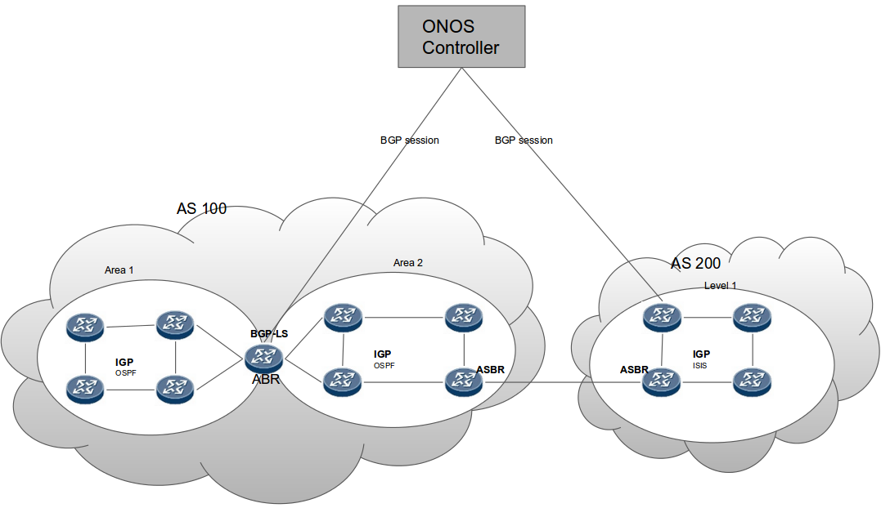

# BGP protocol with Link-State Distribution

### **Team**

| Name | Organization | Email |
| --- | --- | --- |
| Patrick Liu | Huawei Techonologies | [Partick.Liu@huawei.com](mailto:Partick.Liu@huawei.com) |
| Satish K | Huawei Techonologies | [satishk@huawei.com](mailto:satishk@huawei.com) |
| ShashiKanth | Huawei Techonologies | [shashikanth.vh@huawei.com](mailto:shashikanth.vh@huawei.com) |
| VidyaShree | Huawei Techonologies | [vidyashree.rama@huawei.com](mailto:vidyashree.rama@huawei.com) |
| Priyanka | Huawei Techonologies | [priyanka.b@huawei.com](mailto:priyanka.b@huawei.com) |
| Thejaswi | Huawei Techonologies | [thejaswik@huawei.com](mailto:thejaswik@huawei.com) |

**Overview**

This project adds Border Gateway Protocol with Link State Distribution extension (BGP LS), flow specification and its extension to support route policy distribution as a southbound plug-in in ONOS controller.

**Link State Distribution extension:**Collects the topology information of the network. This network topology can be used by some applications like PCE would benefit from visibility outside one area or Autonomous System (AS) in order  to make better decisions for path computation.

**Flow specification:** Propagate filtering rules to mitigate attack(DDOS) scenario.

**Route policy distribution:** Distribute route to modify the routes based on routing policy.

**Proposed work**

* Add BGP LS South Bound plugin to learn the Linkstate topology of the network and update ONOS core’s Node and Link subsystem along with the TE information.
* Implement BGP protocol handler, which acts as a BGP speaker to listen on BGP port 179 if user run ONOS as root user in linux otherwise listen on port 1790 to establish and manage session with BGP peers of the network. A channel handler will be created for each BGP session to maintain the state machine and state of each Peer.
* Implement BGP message handler, which will encode and decode BGP messages between ONOS BGP SBI and BGP peer on network. Currently the messages supported are open, KeepAlive, update, Notification and BGP Multiprotocol message with Link state descriptions and its attributes.
* Implement BGP LS topology provider to update Node and Link subsystem of ONOS core when any node or link gets added/deleted or modified. All communication between BGP Linkstate provider and ONOS Core uses Provider Service interface.

**Usage:**  
    Pre configurations required to learn network topology using BGP-LS in ONOS

   1. Enable BGP app:

```
app activate org.onosproject.bgp
```

   2. Configure remote BGP peer in ONOS using below JSON, it uses network config service

```
{
    "apps": {
        "org.onosproject.provider.bgp.cfg": {
	    	"bgpapp": {
                "routerId": "1.1.1.1",
                "localAs": 100,
                "maxSession": 20,
                "lsCapability": true,
                "holdTime": 180,
                "largeAsCapability": false,
                "flowSpecCapability": "IPV4",
                "bgpPeer":[ {"peerIp": "2.2.2.2", "remoteAs": 100, "peerHoldTime": 120, "connectMode":"active"}]
            }
        }
    }
}
```

**Parameters:**

**routerId** Local IP address.  
                               **localAs** Local AS number  
                               **maxSession** Max number of session BGP ONOS can maintain.  
                               **lsCapability** BGP-LS capability  
                               **holdTime** Hold Time  
                               **largeAsCapability** 4-octet AS capability  
                               **flowSpecCapability** flowspec capability  
                               **bgpPeer** Remote BGP peer information  
                               **peerIp** Remote BGP peer IP  
                               **remoteAs** Remote BGP AS number  
                               **peerHoldTime** Remote peer hold time (Depricated)  
                               **connectMode** Session initiation, active or passive. In case of passive mode BGP is in listen mode.

   3. On network side, enable router to establish BGP session with ONOS using link state capability. Multiple routers can connect to ONOS for reliability purpose.

   4. On successful session establishement BGP export link-state topology information obtained using IGP protocol to ONOS.

   5. verify topology using commands devices/links or GUI respectively.

**Figure:** ONOS, BGP and IGP relation.

                                   

                                                                        

### **Update 1: IPv6 Support**

(Contributed by Ankur Aggarwal, ankur.aggarwal@hsc.com, Hughes Systique Pvt. Ltd.)

Initially, BGP LS South Bound only supported IPv4 addresses. Support for IPv6 has been added and is available since **ONOS-2.3** release. For this, a new parameter has been added in the configuration:

```
{
    "apps": {
        "org.onosproject.provider.bgp.cfg": {
            "bgpapp": {
                "routerId": "192.168.251.240",
                "localAs": 200,
                "maxSession": 20,
                "lsCapability": true,
                "holdTime": 180,
                "largeAsCapability": true,
                "flowSpecCapability": "IPV4",
                "connectionType": "IPV4_IPV6",
                "bgpPeer":[ {"peerIp": "2.2.2.2", "remoteAs": 100, "peerHoldTime": 120, "connectMode":"active"}]
            }
        }
    }
}
```

**Parameter added:**

**connectionType** : Specifies the connection type to be used for connecting to the BGP peer. It takes three values:

* IPV4 : For connecting to IPv4 addresses only.
* IPV6 : For connecting to IPv6 addresses only.
* IPV4\_IPV6 : Can connect to both IPv4 and v6 addresses.

This parameter has been made optional with a default value "IPV4", thus all previous json config files will still work.

### **Update 2: Route Refresh Support**

(Contributed by Ankur Aggarwal, [ankur.aggarwal@hsc.com](mailto:ankur.aggarwal@hsc.com), Hughes Systique Pvt. Ltd.)

[RFC 2918](https://tools.ietf.org/html/rfc2918) defines the Route Refresh capability for BGP. The support for the same has been added and is available since **ONOS-2.4**.

The new config json is of the form :

```
{
    "apps": {
        "org.onosproject.provider.bgp.cfg": {
            "bgpapp": {
                "routerId": "192.168.251.240",
                "localAs": 200,
                "maxSession": 20,
                "lsCapability": true,
                "holdTime": 180,
                "largeAsCapability": true,
                "flowSpecCapability": "IPV4",
                "connectionType": "IPV6",
                "routeRefreshEnabled": true,
                "rrPeriodicTimer": 300,
                "rrWarmupTimer": 10,
                "rrCooldownTimer":30,
                "bgpPeer":[ {"peerIp": "2001:db7:1:3:5054:ff:fe99:2e65", "remoteAs": 200, "peerHoldTime": 120, "connectMode":"active"}]
            }
        }
    }
}
```

**Parameters added:**

* **routeRefreshEnabled** : Depics if route refresh messages are to be sent or not. Boolean, can take values "true"/"false". Default is "false"
* **rrPeriodicTimer** : Periodic timer value in seconds. Integer. Default value is 300.
* **rrWarmupTimer** : Warmuptimer value in seconds. Integer. Default value is 10.
* **rrCooldownTimer** : Cooldownvalue in seconds. Integer. Default value is 30.

To see how these timers work, check the discussion on [ONOS-8074](https://jira.onosproject.org/browse/ONOS-8074). Note that these parameters are made optional, so if no value is provided, route refresh messages will not be sent. Also, all older JSONs will work as they worked previously.
