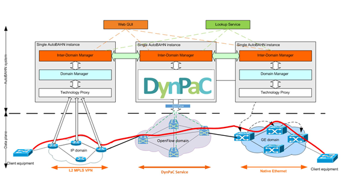
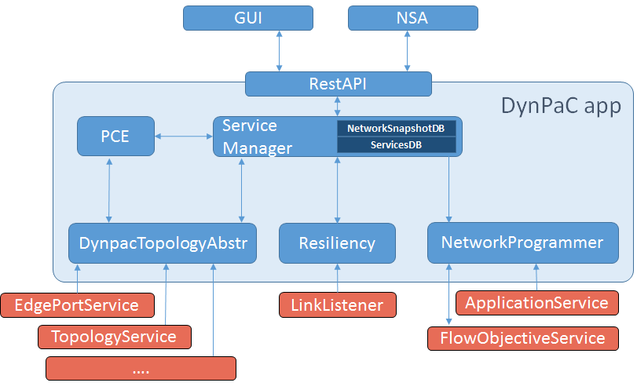

# BoD DynPac application

Bandwidth on Demand services are already a reality in most NRENs, including Géant, where AutoBAHN allows end-user to request multi-domain services with a guaranteed bandwidth during a period of time. AutoBAHN provides the BoD service across multiple domains through the NSI CS v2 protocol and it currently does not support SDN domains. However, since the NSI CS multi-domain protocol aims to be technology agnostic, the Géant 4 SDN-based BoD use case is developing the DynPaC framework as an application within ONOS, to serve as the Domain Manager for SDN domains, as depicted in Figure 1.

Figure 1. DynPaC integration in Géant BoD

# DynPaC (The Dynamic Path Computation Framework)

DynPaC is an advanced bandwidth reservation system that allows to provide resilient VLAN-based L2 services taking into consideration bandwidth constraints.

*Features*

• Compute the best possible path between 2 end-points taking into account:

• Available bandwidth

• Minimum hop count

• Path stability

• Optimize network resources’ utilization

• Flow relocation mechanism

• Flow disaggregation mechanism

• Resiliency

• Rate limiting

• Automated network programming

# DynPaC architecture

Figure 2 depicts the DynPaC architecture as it has been integrated in ONOS.

Figure 2. DynPaC architecture

## Module description

### Service Manager

• Coordinates the workflow between the different elements.

• Holds the information about the reserved services and the networks snapshots.

• Network snapshots are used to represent the network during a specific period of time with a specific combination of concurrent services. They hold information about the different combination of paths that allow the coexistance of the services in the network.

### PCE

• Computes all the posible paths between all the possible src/dst node pairs.

• Once a service is requested, it computes the best path (and an associated backup if requested by the user) during its entire lifetime. The service is accepted only if there are enough available resources in the network during its entire lifetime.

### DynpacTopologyAbstractor

• Retrieves the topology and abstracts it to ease the path computation

• Generates an undirected graph

• Filters edge nodes

### NetworkProgrammer

• Uses the FlowObjectiveService to install the flow entries in all the nodes that conform the path assigned to a given service at its start time and to remove the flow entries at its end time.

### Resiliency

• Listens to topology events and reacts upon link/node failures by installing the backup paths of the affected services.
