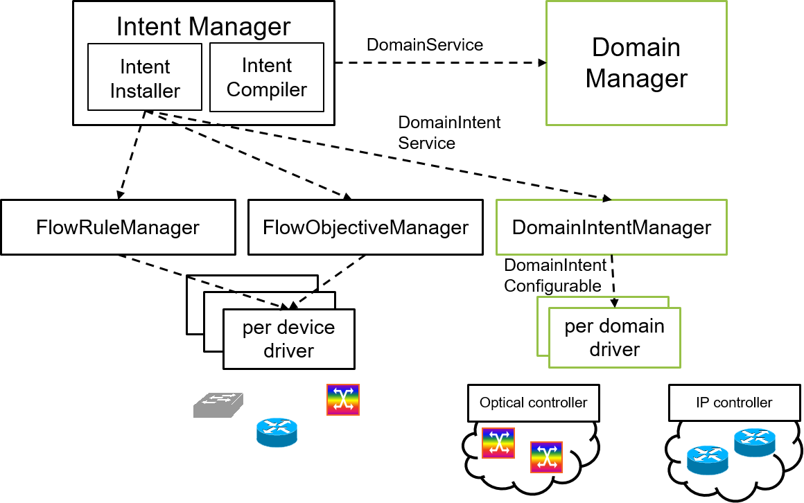

# Domain Intent

# Overview

The ONOS Intent Framework translates high-level policies called intents into installable forwarding rules, which are essentially actionable operations for the network environment. The installation process performs the configuration of each device directly involved in the operations. ONOS is mostly device-based (i.e., OpenFlow oriented and “per device” configuration) and does not support the management of technological domains controlled by vendor-specific solutions such as proprietary controllers or Network Management Systems (NMS). Typically, such controllers provide a “service” scope provisioning interface to provision a complete path, instead of single configurations for individual devices.

The goal of the domain intent is to provide an extension of the Intent Framework to produce, as a compilation result, a high-level description of the policy to be applied in the network (i.e., intent). This allows ONOS to provide not only the installation of intent leveraging flowrule and flowobjective, but also the installation of domain intents targeting for example a vendor-specific controllers. The flowrule-specific and flowobjective-specific intents are installed by generating requests for each device. In contrast, the domain intent is installed as a single request for the entire domain.

The development activities began during the hackathon at the [ONOS Build 2016](http://onosproject.org/2017/01/13/community-blog-series-onos-build-hackathon-winners-team-roll-the-control/) to support  [ACINO](http://www.acino.eu/), GEANT and [ICONA](icona-inter-cluster-onos-network-application.md) use cases.

# Team

| Name | Organization | Email |
| --- | --- | --- |
| Michele Santuari | FBK CREATE-NET | [msantuari@fbk.eu](mailto:msantuari@fbk.eu) |
| Andreas Papazois | GRNET S.A & University of Patras |  |
| Francesco Lucrezia | Politecnico di Torino |  |
| Thomas Szyrkowiec | ADVA Optical Networking |  |

# High level architecture

The new components added by the Domain Intent are:

* The *DomainIntentManager* contains the logic to translate the abstracted DomainIntent into configurations to be submitted in the driver subsystem. The interface which interacts with the driver is called *DomainIntentConfigurable* behavior. The Domain Intents are submitted via the *DomainIntentService* interface.
* The *DomainManager* provides the queries for domain-specific network objects (currently devices, but in the future could be extended to support links, hosts belonging to a specific domain) via the *DomainService* interface. The domains are exposed by the controller-specific driver, but the implementation is generic enough to be easily extend to support other configurations (e.g., add domain via northbound interface).

To support the Domain Intent, we need to modify the Intent Framework. Firstly, the intent compiler must be able to recognize when the path involves different domains and, consequently, to generate one Domain Intent for each domain. Secondly, the Intent Framework must be able to compile intents into different type of objects, specifically FlowRules/FlowObjectives for those devices that can be directly configured by ONOS (e.g., OpenFlow, routers), and Domain Intents for the domains controlled via domain-specific controllers.

The identification of a domain is managed by the driver, so that the devices belonging to a specific domain are annotated (i.e., "domainId"="domainName").
