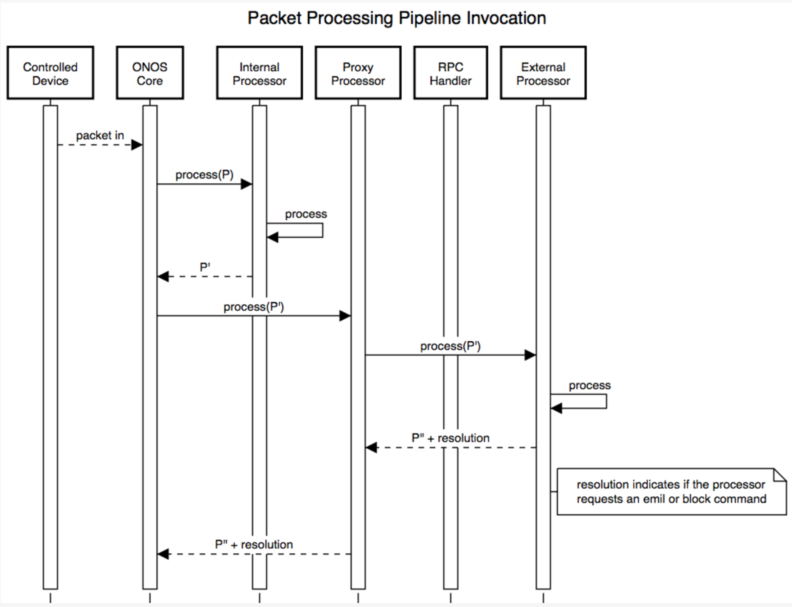

# Externalization of Packet Processing (EPP)

# Overview

This project proposes a method by which packet processing can be handled externally to the main ONOS process, i.e. by other processes or µ-services. It is a primary goal of this project to maintain the semantics of the existing packet processing pipeline as described by Thomas on the `onos-discuss` email list:

> The packet processors are lined-up in three buckets, advisors, directors, observers, in that order. Within each bucket, they are ordered in terms of relative priority. Regardless of the fate of the packet, everyone gets to see it. Advisors have the benefit of getting to see it first and get to comment on it before it is handled in any way. Directors get to emit or block, each of which is final and marks the packet as handled. Once handled, it can no longer be emitted or blocked in another way. Observers get to see it last, but they have the benefit of seeing its final fate.

Further, it should be possible to support both internal and external packet processors.

# Technique

A new remote (REST/gRPC) API would be added which can be used by external clients to add their processor into the pipeline. When this API is invoked a "proxy" processor would be added internally to ONOS that contains information about how to send packets to the external packet processor. This proxy would maintain the current semantics while wrapping requests to the external processors; including waiting for responses from the external processors indicating processing of the packet is complete and the modified packet.

# Concerns

Because packet modification requires a remote send and receive of a packet to the external packet processor it is possible that significant latency is introduced as packets are encoded / decoded and transferred between processes. Depending on the protocol this latency could trigger protocol drops or time outs.

# Alternatives

As an alternative to having the ONOS core pass processing off to a packet processor and awaiting a response, packet processors could be modified such that when a packet processor is invoked it is passed the stack of processors that are to be called, then when the packet processor is complete it passes control to the next processor, which in some cases might be back to the ONOS process for "internal" packet processors. This mechanism would eliminate one remote call but comes with some drawbacks, including increasing the complexity of the system and creating a failure situation where if a single processor fails to pass on the packet the system no longer functions correctly. Controlling the flow central, which introducing additional latency allows for managing failed or slow requests for packet processing. If the central control does include too much latency, this alternative approach might be considered.

# Diagrams

## Processor Registration

### 

## Processor Invocation

