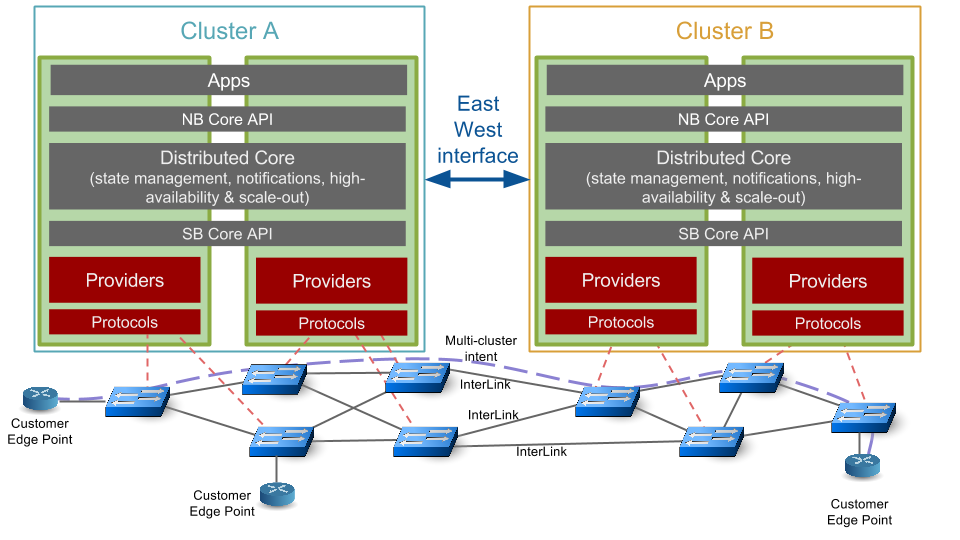
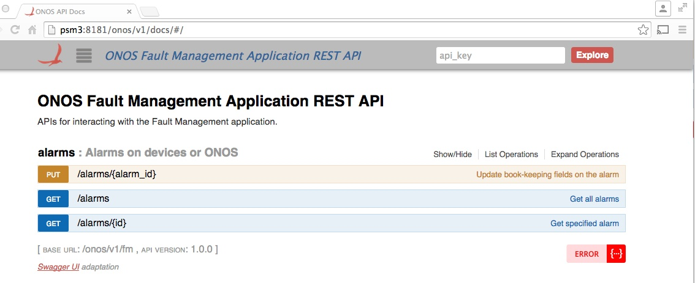
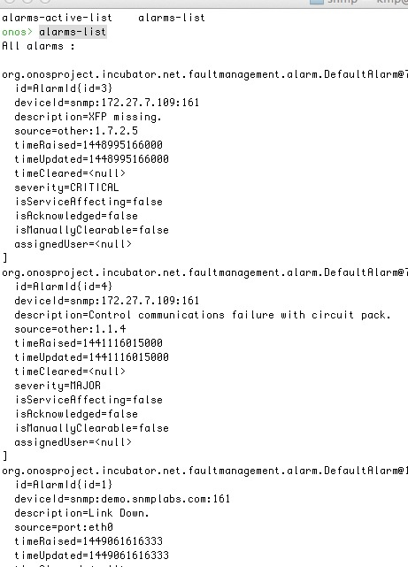
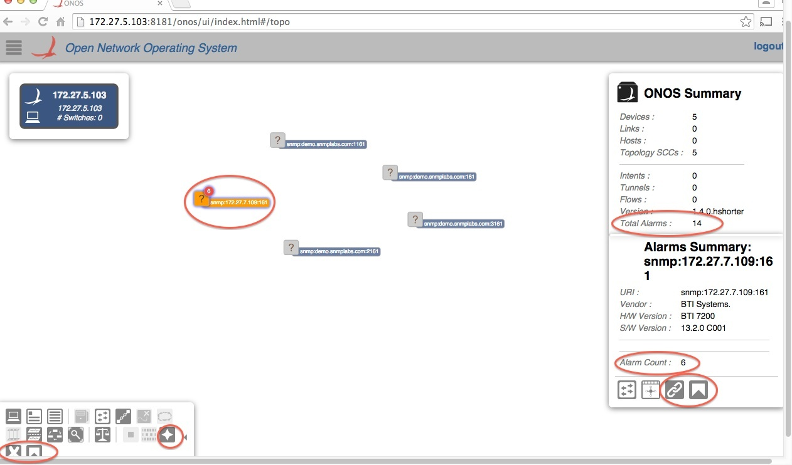
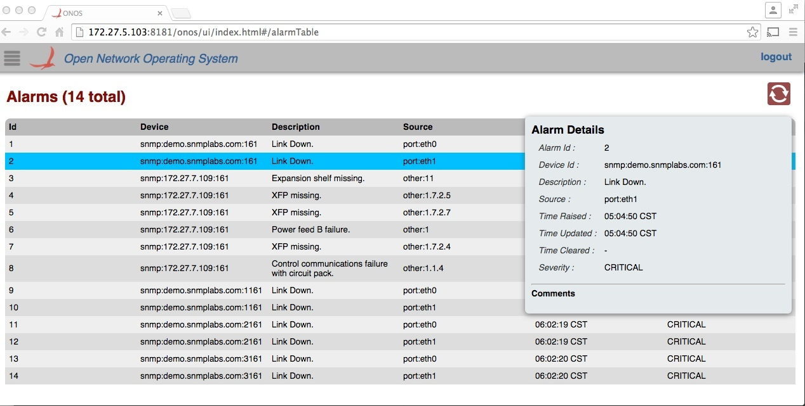

# Fault Management

OUTDATED

This page is outdate, please refer to javadoc of latest ONOS master

# Team

| ­Name | Organization | Email |
| --- | --- | --- |
| Damian O'Neill | BTI  Systems | [doneill@btisystems.com](mailto:doneill@btisystems.com) |
| Kieran McPeake | BTI  Systems | [kmcpeake@btisystems.com](mailto:kmcpeake@btisystems.com) |
| Hayden Shorter | BTI  Systems | [hshorter@btisystems.com](mailto:hshorter@btisystems.com) |

# Overview

This project adds Fault Management of Network Elements (NEs) to ONOS.

When a fault or event occurs, a NE will typically send a notification to the network operator via [SNMP](https://en.wikipedia.org/wiki/Simple_Network_Management_Protocol "Simple Network Management Protocol"). The network operator may also (or alternatively) poll the NE to retrieve this information. An alarm is a persistent indication of a fault that clears only when the triggering condition has been resolved. This proposal outlines a solution so that ONOS will provide support for such alarms.

For information on Fault Management as it pertains to NETCONF, refer to [NETCONF Fault Management](fault-management/netconf-fault-management.md).

# Proposed work

Fault Management is in ONOS terms: [a service](../guides/architecture-and-internals-guide/system-components.md), i.e. "a unit of functionality that is comprised of multiple components that create a vertical slice through the tiers as a software stack"

Two layers are will be updated to provide fault management:

* (New) SNMP Provider - SNMP interaction with NEs
* (New) Fault Management Application -  stores NE's alarm state and makes them alarms externally

For context, the following diagram taken from [ONOS design wiki](icona-inter-cluster-onos-network-application/design.md), illustrates the relationship between the ONOS layers.



## Usage

1) Use normal steps for [Installing and running ONOS](../guides/administrator-guide/installing-and-running-onos.md) locally or remotely as required.

2) Deploy the relevant applications. (Example below shows ONOS running as a standalone instance on to remote host)

> ```
> [sdn@psm3 ~]$/opt/onos/bin/onos-service   
> onos> app activate org.onosproject.snmp  
> onos> app activate org.onosproject.faultmanagement
> ```

3) SNMP devices are seeded via config file. The default seed file contains connection details for devices (SNMP agents) available via internet e.g. demo.snmplabs.com

> ```
> cp /opt/onos/apache-karaf-3.0.3/etc/samples/org.onosproject.provider.snmp.device.impl.SnmpDeviceProvider.cfg   /opt/onos/apache-karaf-3.0.3/etc/
> ```

4) ONOS will poll these SNMP devices and store their alarms.

5) User will be able to manipulate the alarms via

* REST e.g. http://<onos>:8181/onos/v1/fm/alarms. See
* CLI via various "alarm-\*” commands
* In UI with an Alarms Overlay.

More details on each of these interfaces in sections below.

## SNMP Provider

A new SNMP southbound provider will be available.

A new generic provider provides SNMP communication with NEs. It is a southbound plugin handling SNMP *2c* bi-directional interaction with NEs. It uses strongly-typed APIs generated automatically from NEs' SNMP MIB files. It has a core based on SNMP4J (Reference #1) At runtime, ONOS uses this, plus additional NE-specific automatically-generated jar libraries to provide the strongly-typed NE-specific programmatic interface. It is deployed as a Java OSGi application with bundles for

* device/   
  + Device discovery details are seeded from config (similar to existing Netconf provider).
    - Default configuration file will include a SNMP MIB-II agent available via public internet so `real` SNMP interaction may be demonstrated easily.
  + Details read from NE's SNMP MIB-II tree and registered in ONOS Device Service
  + Handles SNMP non-alarm traps (if supported by NE). This is a future requirement.
* alarm/   
  + Interrogates device when required via SNMP GET/GETBULK. It   
    - Reacts to Device Service events e.g. device added, updated, etc for relevant (i.e. SNMP) devices.
    - Scheduled polling
    - External request (from application)
  + Handles SNMP alarm traps (if supported by NE). This is a future requirement.
  + Uses an appropriate mechanism for that device to retrieve or calculate current alarm state
  + Informs listeners that have registered an interest in Alarm events

Some NEs use an SNMP trap-based mechanism to communicate occurrence of NE database changes to a SNMP manager to reduce amount of SNMP polling required.

SNMP SETs are supported so the solution can support NEs which support SNMP SETs as a registration/deregistration mechanism for their SNMP trap listeners.

Note: trap notifications (whether fault or configuration related) are an optimisation: using them, ONOS can receive faults before its next poll interval, but polling is the only guaranteed mechanism to have a correct picture of the NEs’ faults - in particular when faults pre-date management by ONOS or when the ONOS or network goes offline temporarily. Usually alarm-polling will be implemented first for a NE variant.

A set of standard MIB specific libraries will be supplied by default (allowing SNMP interaction with e.g. MIB-II compliant NEs).

In addition a mechanism will be provided to allow management of other NEs (with either standards-based or vendor-specific MIBs). A mechanism will be provided to allow generation of a Java library for such NEs in an offline step.

## Fault Management (FM) Application

A new ONOS (Fault Management) app will track the state of alarms on a device.

It will register its interest in alarms with the Alarm Provider mentioned above. It is abstracted from provider implementation details i.e. is not aware of SNMP.

In future it is expected the NETCONF provider will also be updated to support alarm retrieval/events (but that is not in scope of current work). The Alarm Provider (e.g. SNMP variant) hides for a particular NE type the MIB/Vendor-specific mappings from fault tables and fault notifications. All communication between SNMP provider and ONOS Core (Fault Management) uses the Provider Service interface.

It will include ‘recently cleared’ alarms but these will get purged regularly.  A NE will also have its alarms purged if it is deleted from ONOS i.e. undiscovered.

The Fault Management  application provides several mechanisms to access and update its stored NE alarms -

* REST
* CLI
* ONOS GUI integration

### [REST API](../guides/developer-guide/appendix-b-rest-api.md)

Users may retrieving current alarms with various query parameters and update some attributes.

* + HTTP GET `/alarms`
    - User can retrieve current alarms, for either a specified single NE or for all NEs with various query parameters e.g. active-only, specific NE, specific severity.
    - In a future release, it will be possible to query alarm counts.
    - In a future release, other query params will also be supported e.g. alarms affecting a specific ONOS flow or ONOS link.
  + HTTP GET `/alarms/{alarmId}`
  + HTTP PUT `/alarms/{alarmId}`
    - Update book-keeping fields on the alarm
  + It will also provide a way for an application to register to be notified about changes via REST or (later) SNMP notifications.

Here is the swagger REST document for alarms API.



### CLI

* Aforementioned REST API interactions also available via CLI.

Here is a CLI example:



### GUI

#### Topology View

To enable an alarms overlay in the topology view, enable the 'Alarm Overlay' button. It is highlighted in bottom left in screenshot below.

This adds Total Alarm Count for all devices and for Individual Devices Alarm Counts.

A device mouse-action tool-tip can be enabled via a keyboard shortcut to show individual alarm count for the decorated devices.

If a device is clicked, a popup with Alarms Summary for that device will appear in bottom right corner. That popup will have extra buttons to navigate to 'All' or 'Device-specific' alarm tabular views.

Only total counts currently shown, but counts-by-severity may be added later.



#### Tabular Alarm View

Tabular view showing all alarms may be accessed via buttons mentioned above or the main ONOS menu.

If launched from topo view's device specific button, the list will be filtered for the required device.

Selecting a row gives a popup dialog with more details on select alarm, as shown below.



A screen cast of the User Interface updates can be viewed [here](https://dl.dropboxusercontent.com/u/6164051/Fault-Management_Setup_DeviceDiscovery_RestResources_UIOverlaysAndAlarmTable.m4v).

### Alarms Model

The persisted alarms model is as follows:

| Field | Notes |
| --- | --- |
| Id | Unique alarm identifier allocated by ONOS. |
| Acknowledged? | Set to true if a ONOS-user has acknowledged this alarm. Default is false. |
| Description | From NE e.g. `“Equipment Missing”` or generated by ONOS internally, e.g. `"NE is unreachable"` |
| Device identify | DeviceId |
| Source | AlarmEntityId. An entity within the context of this alarm's device.E.g. port:1/11/2/1  Optional - since not used if deviceId sufficiently identifies the location. |
| Is Service Affecting? | As defined by ITU recommendation X.733. |
| Severity | As specified in ITU recommendation X.733, i.e.  `indeterminate/critical/major/minor/warning/cleared.` |
| Time Raised | The time when raised (if supplied on NE) else time when fault discovered (either by poll or notification) |
| Time Updated | Returns time at which the alarm was updated most recently, due to some change in the device, or ONOS.  If the alarm has been cleared, this is the time at which the alarm was cleared. |
| Time Cleared | If applicable. |
| Raising Notification Id | If applicable. Not applicable if discovered by poll. |
| Clearing Notification Id | As above. |
| User Assigned | ONOS-user (if any) to whom this alarm has been assigned. |

A future FM release may support persisting faults over longer timeframes (including those related to NEs that are no longer managed) so that historical data is made available. Support for historical data mining is excluded from this release.

# Project Plan

* First End-to-end version will be available for push to gerrit  Early Dec/2015

# Terminology

There are many resources online giving overview and definitions for fault management. We will use same definitions as the IETF Alarm MIB [RFC 3877](https://tools.ietf.org/html/rfc3877); whilst do not want to repeat that document the following extract may be a helpful.

* *Error - A deviation of a system from normal operation.*
* *Fault - Lasting error or warning condition.*
* *Event - Something that happens which may be of interest. A fault, a change in status, crossing a threshold, or an external input to the system, for example.*
* *Notification - Unsolicited transmission of management information.*
* *Alarm - Persistent indication of a fault.*
* *Alarm State - A condition or stage in the existence of an alarm. As a minimum, alarms states are raise and clear. They could also include severity information such as defined by perceived severity in the International Telecommunications Union (ITU) model [[M.3100](https://tools.ietf.org/html/rfc3877#ref-M.3100)] - cleared, indeterminate, critical, major, minor and warning.*
* *Alarm Raise - The initial detection of the fault indicated by an alarm or any number of alarm states later entered, except clear.*
* *Alarm Clear - The detection that the fault indicated by an alarm no longer exists.*
* *Active Alarm - An alarm which has an alarm state that has been raised, but not cleared.*
* *Alarm Detection Point - The entity that detected the alarm.*
* *Perceived Severity - The severity of the alarm as determined by the alarm detection point using the information it has available.*

Other terminology used in this proposal:

* *NE – Network Element, i.e. managed device.*

# References

1.     <http://www.snmp4j.org/> SNMP4J is an enterprise class free open source and state-of-the-art SNMP implementation for Java™ SE 1.4 or later\*. SNMP4J supports command generation (managers) as well as command responding (agents). Its clean object oriented design is inspired by SNMP++, which is a well-known SNMPv1/v2c/v3 API for C++
