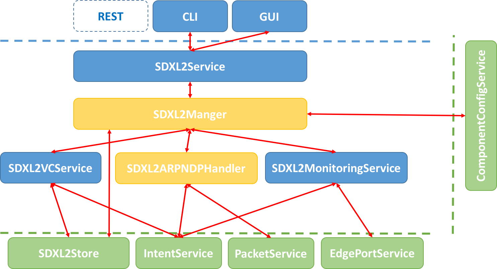
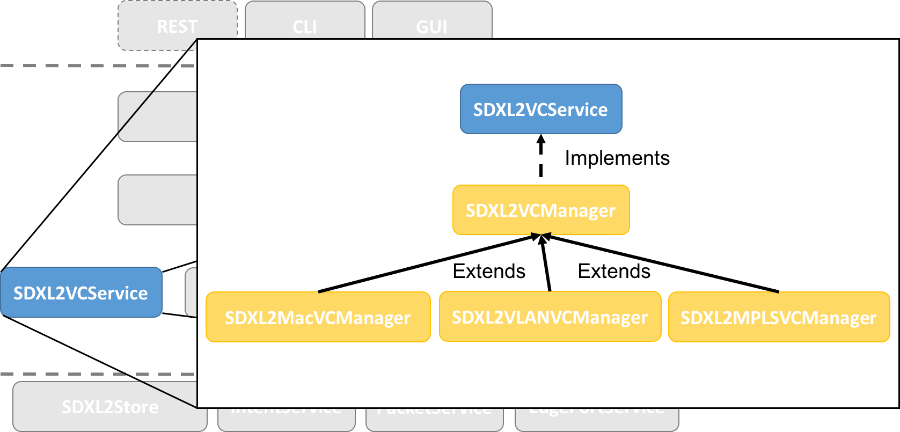
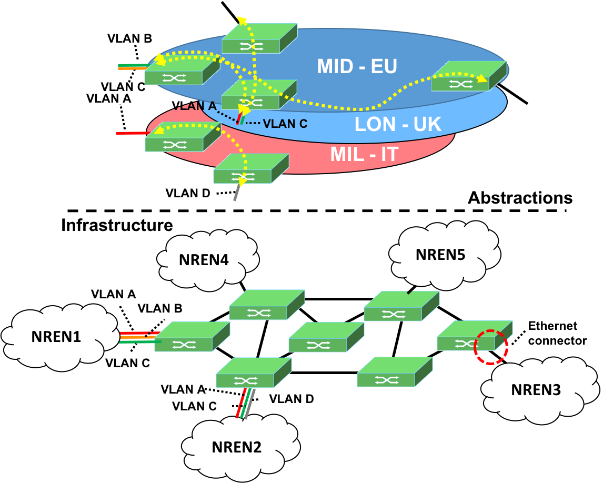
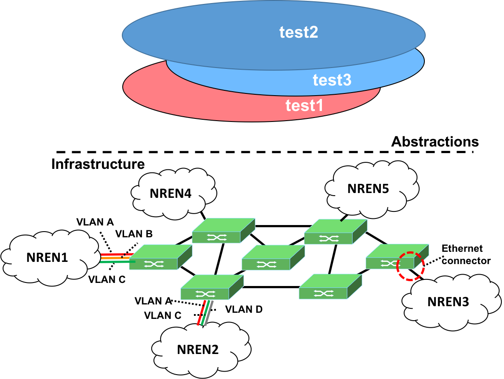
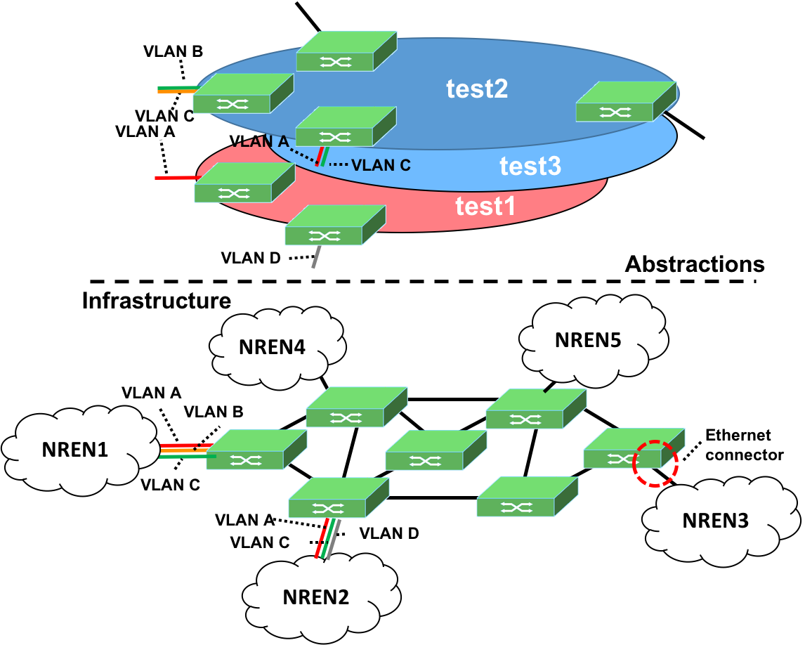
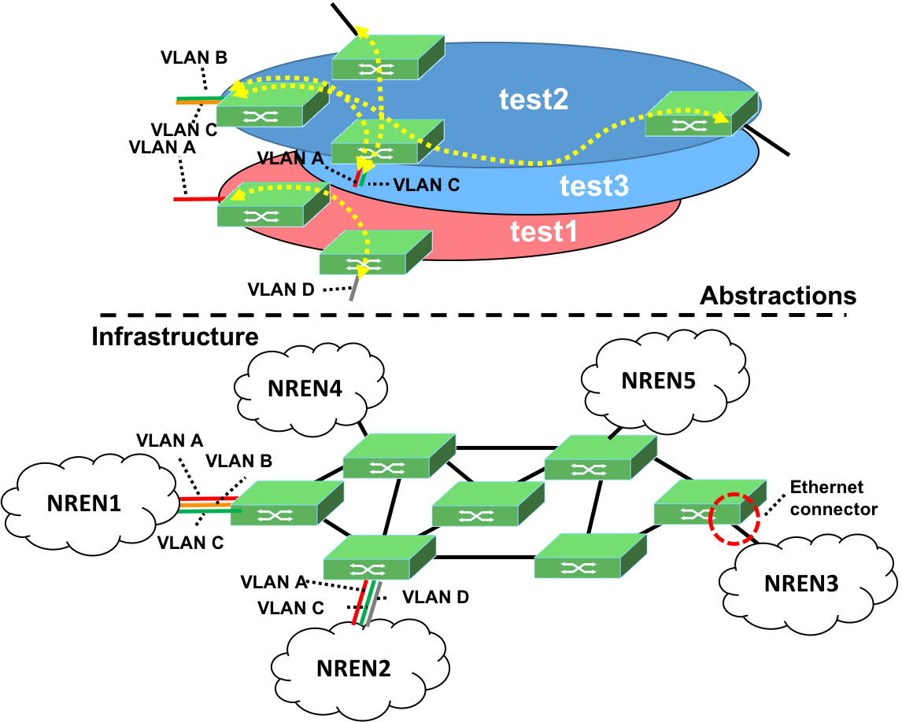

# SDX-L2 application

With the term L2 – SDX, we mean a general service able to create multi-domain Ethernet Circuits between endpoints which can be physical Ethernet interfaces or VLANs. In general, the offered layer 2 services belong to the class of IP Virtual Leased Line services (IP VLL). These services meet the specialized needs of the research and education communities and they are often referred as “near term” or pure connectivity SDXs.

# Description

SDX-L2 is a new ONOS application meant to support the above workflow. It provides automated provisioning of Layer 2 Tunnels between Endpoints, which belongs to the class of the IP-Virtual Leased Line (IP over something). It is implemented as callable services, in this way other ONOS subsystems can use its services. The application offers also a Monitoring component to track the operation of the system: i) Status of the connectors; ii) Status of the virtual circuits. By design the application is Flexible, SDX-L2 can run in several ONOS deployment and Large – scale SDX can be controlled by multiple SDX-L2 instances;

SDX-L2 provides users with high level APIs:

* Operators see the abstraction of managing virtual SDXs;
* An SDX contains edge connectors (physical or virtual);
* Connectors can be interconnected through virtual circuits;

SDX-L2 implements several mechanisms to avoid conflicts between L2 services. In this way SDXs are isolated entities, Circuits cannot cross different virtual SDXs and Edge connectors cannot collide. Finally, Circuits can be of different grain: Single flows (physical port or one VLAN) or Multiple customer flows (multiple VLANs).

# High level architecture

The following images provide an high level view of the architecture:

            

 

# Example scenario and tutorial

The following image provide a big picture of the example scenario. Let us consider a number of SDN switches interconnected by a set of links. At edge of the network a number of National Research and Education Networks (NRENs) request the establishment of Layer 2 Circuits to support the needs of their customers:



### Create three SDX-L2s:

```
        onos> sdxl2-add test1
        onos> sdxl2-add test2
        onos> sdxl2-add test3
        onos> sdxl2-list

        SDXL2
        --------------
        test1
        test2
        test3
```



### Create two CPs and list brief and detailed info:

```
        onos> sdxl2:sdxl2cp-add -ce_mac 00:00:00:00:00:01 test1 of:0000000000000003/2 Sw3P2 5,15-17
        onos> sdxl2:sdxl2cp-add -ce_mac 00:00:00:00:00:02 test1 of:0000000000000002/1 Sw2P1 6,19-21

        onos> sdxl2:sdxl2cp-list

        Status		SDXL2 Connection Point
        -----------------------------------------------
        ONLINE		Sw2P1
        ONLINE		Sw3P2

        onos> sdxl2:sdxl2cp Sw2P1

        Status		Connection Point		Name		Vlan IDs		CE Mac Address
        -------------------------------------------------------------------------------------------------------------
        ONLINE		of:0000000000000002/1		Sw2P1		[6, 19, 20, 21]		00:00:00:00:00:02
```



### Create a VC connecting the two CPs and get its details:

```
        onos> sdxl2:sdxl2vc-add test1 Sw2P1 Sw3P2
        onos> sdxl2:sdxl2vc-list

        Status		Virtual Circuit
        -----------------------------------------------
        ONLINE		Sw2P1-Sw3P2
```

```
        onos> sdxl2:sdxl2vc test1:Sw2P1-Sw3P2

        Status		Connection Point		Name		Vlan IDs		CE Mac Address
        -------------------------------------------------------------------------------------------------------------
        ONLINE		of:0000000000000002/1		Sw2P1		[6, 19, 20, 21]		00:00:00:00:00:02
        ONLINE		of:0000000000000003/2		Sw3P2		[5, 15, 16, 17]		00:00:00:00:00:01
```

```
        Status		Intent
        --------------------------------------------
        ONLINE		test1:Sw2P1-Sw3P2,4
        ONLINE		test1:Sw3P2-Sw2P1,3
        ONLINE		test1:Sw3P2-Sw2P1,1
        ONLINE		test1:Sw3P2-Sw2P1,4
        ONLINE		test1:Sw3P2-Sw2P1,2
        ONLINE		test1:Sw2P1-Sw3P2,1
        ONLINE		test1:Sw2P1-Sw3P2,2
        ONLINE		test1:Sw2P1-Sw3P2,3
```



### Remove VC and check it exists no longer:

```
        onos> sdxl2:sdxl2vc-remove test1:Sw2P1-Sw3P2
        onos> sdxl2:sdxl2vc-list
```

### Remove CPs and check they exist no longer:

```
        onos> sdxl2:sdxl2cp-remove Sw2P1
        onos> sdxl2:sdxl2cp-remove Sw3P2
        onos> sdxl2:sdxl2cp-list
```

### Remove SDX-L2 and check they do not exist anymore:

```
        onos> sdxl2:sdxl2-remove test1
        onos> sdxl2:sdxl2-remove test2
        onos> sdxl2:sdxl2-remove test3
        onos> sdxl2:sdxl2-list
```

# Links

* Currently the code of application can be found in the ONOS sample application repository: <https://github.com/opennetworkinglab/onos-app-samples>;
