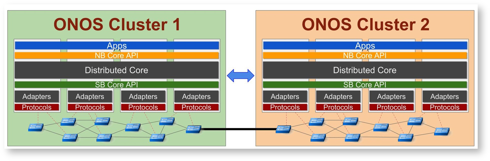

# ICONA (Inter Cluster ONOS Network Application)

## Proposed name for the project

ICONA (Inter Cluster ONOS Network Application)

## Project type

**feature/enhancement**

## Project Description

To summarize the objective of this feature project in a sentence, we can say that it enables multiple ONOS clusters to share information about their networks, using an East-West interface. Moreover, it allows an application, running on top of a specific cluster, to configure, via the NB Core API, routes crossing different data plane devices, not under the control of that cluster.

In order to achieve this goal, the ICONA provider will be responsible of:

* exposing the local topology to remote clusters
* handling the topologies exposed by remote clusters
* configure (add/modify/remove) intents coming from and towards remote clusters

Icona is designed for a multi-domain scenario primarily, which is characterized by the presence of networks under control of different authorities (domains). The main difference with a single domain scenario consists in the fact that there is no trust among different authorities. For instance a domain would not expose everything to another domain who does not trust, it might instead want to hide some topology details such as hosts or links.

This is why the provider is policy-oriented, to guarantee, through policies configuration, the compliance to the agreements between different authorities.

In order to provide a policy-based approach, ICONA should allow an operator to configure at runtime different parameters:

* the peering clusters allowed to access the local information
* the maximum number of intents settable by each remote cluster
* the weight of each interlink (the link between the local and remote cluster)
* the preferred path for specific classes of traffic (based on L2 and L3 fields)
* the link speed (bandwidth)
* the type of connection
* ...

Moreover each cluster exposes to peers an abstraction of its local topology which allows flexibility in a policy-based approach.

Currently ICONA only exposes a big switch, with several ports, as the representation of the local topology. Each port can represent both a customer edge point (e.g. the boundary between the managed infrastructure and remote networks) or an interconnection with other managed clusters. The figure below (Fig.1) shows a possible abstraction of cluster topologies.

Fig.1

In the future ICONA will share with remote clusters also the cross-connection matrix (not all the ports can be reached from a source port, in case of link failures) and related metric information (hop-counts and link bandwidth).

The final goal is to support more detailed types of topologies other than the big switch one. An example could be a full-mesh topology, a way to expose the full local topology.

## [Project Design](icona-inter-cluster-onos-network-application/design.md)

See the [Project Design page](icona-inter-cluster-onos-network-application/design.md).

## Project point of contact

| Name | Company | Email |
| --- | --- | --- |
| Matteo Gerola | Create-Net | [matteo.gerola@create-net.org](mailto:matteo.gerola@create-net.org) |

## Project contributors

| Name | Company | Email |
| --- | --- | --- |
| Michele Santuari | Create-Net | [michele.santuari@create-net.org](mailto:michele.santuari@create-net.org) |
| Bruno Boscia | University of Trento | [bruno.boscia-1@studenti.unitn.it](mailto:bruno.boscia-1@studenti.unitn.it) |
| Francesco Lucrezia | Netgroup - Polito | francesco.lucrezia@polito.it |
| Rafat Jahan | Tata Consultancy Services | [rafat.jahan@tcs.com](mailto:rafat.jahan@tcs.com) |

## [Meeting Minutes](icona-inter-cluster-onos-network-application/meeting-minutes.md)

## JIRA ticket

  

[ONOS](https://jira.onosproject.org/browse/ONOS) / [ONOS-3639](https://jira.onosproject.org/browse/ONOS-3639)
