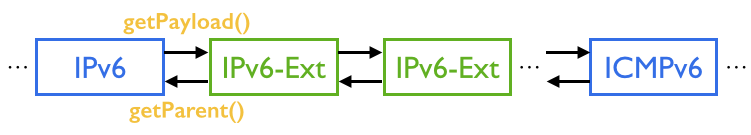

# IPv6

# **Project Contributors (Alphabetical)**

| Name | Organization | Role | Email |
| --- | --- | --- | --- |
| **Charles Chan** | **ON.Lab** | **Dev Contact** | **charles@onlab.us** |
| Dusan Pajin | AMRES | Dev / Test | dusan.pajin@amres.ac.rs |
| Hari Krishna | ON.Lab (inactive) | QA | hari@onlab.us |
| Kunihiro Ishiguro |  | Dev | kunihiroishiguro@gmail.com |
| Pavlin Radoslavov | ON.Lab (inactive) | Dev | pavlin@onlab.us |
| Suibin Zhang | ON.Lab (inactive) | QA | suibin@onlab.us |
| Syed Zubair Ahmed | Criterion Networks | Test | syedzubair@criterionnetworks.com |

Please feel free to add your name here if you are willing to contribute to this project.

# **Overview**

This project aims at supporting IPv6 in ONOS, including

* Support IPv6 at Java API, REST and CLI level
* Support IPv6 matching and forwarding
* Support IPv6 routing information exchange in SDN-IP use case

This document summarizes all IPv6-related tasks and guide the way to related files. Hope this can help others to easily get involved.

# **How to Enable IPv6**

IPv6 is an experimental feature and have been disabled by default. Currently, the following IPv6-related features have been implemented.

### IPv6 Host Discovery

Enabling this feature allows ONOS Host Subsystem to track the location of IPv6 hosts.

```
onos> cfg set org.onosproject.provider.host.impl.HostLocationProvider ipv6NeighborDiscovery true
```

### IPv6-to-MAC Address Resolution

Enabling this feature allows Proxy ARP application to take care of NDP (Neighbor Discovery Protocol) used by IPv6. This cfg setting assumes *proxyarp*app*(org.onosproject.proxyarp)*isalreadyenabled in ONOS.

```
onos> cfg set org.onosproject.proxyarp.ProxyArp ipv6NeighborDiscovery true
```

### IPv6 Reactive Forwarding

Enabling this feature allows Reactive Forwarding application to forward IPv6 packets. This cfg setting assumes *fwd* app*(org.onosproject.fwd)*isalreadyenabled in ONOS.

```
onos> cfg set org.onosproject.fwd.ReactiveForwarding ipv6Forwarding true
onos> cfg set org.onosproject.fwd.ReactiveForwarding matchIpv6Address true
```

### IPv6 Routes for SDN-IP Use Case

Currently, there is no explicit configuration to enable IPv6 routes for the SDN-IP Use Case. BGP-originated IPv6 routes are received in BGP Multiprotocol Extension Capabilities from any BGP peer that advertises them. Such IPv6 routes are handled and processed similarly to the IPv4.  
  
The receiving of BGP IPv6 routes (BGP UPDATEs) has been tested only over IPv4 BGP peering sessions. Such sessions might have to be explicitly configured for such purpose.  
Below is a sample configuration file for the Quagga BGP  implementation:

```
hostname bgp2e
password xxxxxx
router bgp 65002
  bgp router-id 10.0.0.2
  bgp scan-time 5
  timers bgp 10 30
  neighbor 10.0.0.1 remote-as 65001
  neighbor 10.0.0.1 timers connect 3
  neighbor 10.0.0.1 advertisement-interval 3
  network 12.0.0.0/24
  address-family ipv6
  network 2001:db8:1:2::/64
  neighbor 10.0.0.1 activate
  neighbor 10.0.0.1 route-map ipv6-nexthop out
  exit-address-family
route-map ipv6-nexthop permit 10
  set ipv6 next-hop global 2012::2
log stdout
```

# **Design**

Most of the IPv6 functionalities are extended from existing IPv4 design. The only worth-mentioned new design is the extension header structure.  
The following figure shows the packet structure of IPv6 with extension header(s), which are treated as upper layer headers.  
A for loop is required if you want to find the parent IPv6 header of a ICMPv6 packet since there might be 0+ extension header in between.  
 

# **Completed Tasks**

### Packet Serialization/Deserialization

Objective: To parse IPv6-related packet headers  
JIRA: 508, 510, 511, 512, 1011, 1201  
Related Classes:   
org.onlab.packet.{IPv6, ICMP6}  
org.onlab.packet.ipv6.{Authentication, BaseOptions, DestinationOptions, EncapSecurityPayload, Fragment, HopByHopOptions, IExtensionHeader, Routing}  
org.onlab.packet.ndp.{NeighborAdvertisement, NeighborSolicitation, NeighborDiscoveryOptions, RouterAdvertisement, RouterSolicitation, Redirect}

### **Extend Criteria, Selector and Treatment**

Objective: Support IPv6-related matching and action fields  
JIRA: 509  
Related Classes:   
org.onosproject.net.flow.criteria.{Criterion, Criteria}  
org.onosproject.net.flow.{DefaultTrafficSelector, TrafficSelector, TrafficTreatment, Instructions, L3ModificationInstruction}  
org.onosproject.provider.of.flow.impl.{FlowEntryBuilder, FlowModBuilder, FlowModBuilderVer10, FlowModBuilderVer13}  
org.onosproject.codec.impl.CriteriaCodec  
org.onosproject.store.serializers.KryoNamespaces

### **Track the location of IPv6 hosts**

Objective: Track the location of IPv6 hosts such that the topology service can know where to deliver the packets  
JIRA: 507, 635, 637  
Related Classes:   
org.onosproject.provider.host.impl.{HostLocationProvider, HostMonitor}

### **Proxy NDP**

Objective: Use proxy NDP instead of flooding  
JIRA: 924, 1010, 1015, 1021  
Related Classes:    
org.onosproject.proxyarp.ProxyArp  
org.onosproject.net.proxyarp.ProxyArpService  
org.onosproject.net.proxyarp.impl.ProxyArpManager

### **Upper Layer Checksum**

Objective: According to RFC 2460, the upper layer checksum should include the pseudo-header when using IPv6  
JIRA: 1009, 1012, 1013  
Related Classes:    
org.onlab.packet.{ICMP6, TCP, UDP}

### **Reactive Forwarding**

Objective: Support basic forwarding of IPv6-related packets  
JIRA: 506  
Related Classes:    
org.onosproject.fwd.ReactiveForwarding

### **SDN-IP**

Objective:Support IPv6 routing information exchange in SDN-IP use case  
JIRA: 422, 636, 638, 639, 640, 693, 783   
Related Classes:   
org.onosproject.sdnip.{PeerConnectivityManager, IntentSynchronizer, RouteEntry, Router, SdnIp, SdnIpService}  
org.onosproject.sdnip.bgp.{BgpConstants, BgpMessage, BgpOpen, BgpSession, BgpSessionManager, BgpUpdate, BgpRouteEntry, BgpRouteSelector}  
org.onosproject.routing.cli.{BgpNeighborListCommand, BgpRoutesListCommand}  
tools/tutorials/sdnip/\*

### REST

Objective: Support IPv6 at REST level  
JIRA: 1269  
Related Classes:  
As per March 18, 2015 git master, there is no REST-related code that needs to be updated for IPv6

### **CLI**

Objective: Support IPv6 at CLI level  
JIRA: 1268  
Related Classes:   
shell-config.xml  
org.onosproject.cli.net.{ConnectivityIntentCommand, ExtHeader, ExtHeaderCompleter, Icmp6Code, Icmp6CodeCompleter, Icmp6Type, Icmp6TypeCompleter}

### QA / System Test

ONOS-1277 Q/A: Run the IPv6 system tests as part of the Q/A daily tests  
ONOS-1275 Update SDN-IP system test to test receiving of IPv6 routes over IPv4 and IPv6 BGP peering  
ONOS-1274 Q/A: Implement the IPv6 system test plan  
ONOS-1273 Q/A: Write IPv6 system test plan

### Dev / Unit Test

ONOS-641 Update IP-related unit tests to include IPv6 as well  
ONOS-1271 Add missing IPv6-related unit tests  
ONOS-1270 IPv6 and SDN-IP: Verify the receiving of IPv6 routes over IPv6 BGP peering
