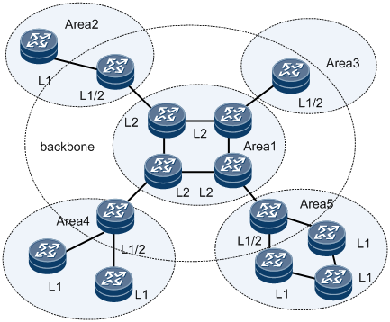
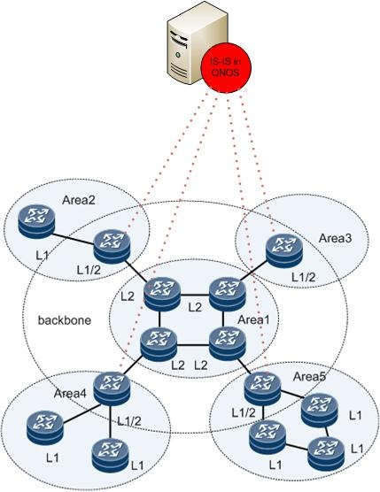

# ISIS as SBI

### **Team**

| Name | Email |
| --- | --- |
| Dhruv Dhody | [dhruv.dhody@huawei.com](mailto:dhruv.dhody@huawei.com) |
| KalyankumarAsangi | [kalyana@huawei.com](mailto:kalyana@huawei.com) |
| TejeshwerDegala | [Tejeshwer.Degala@cognizant.com](mailto:Tejeshwer.Degala@cognizant.com) |
| Kiran Ramachandra | [Kiran.Ramachandra@cognizant.com](mailto:Kiran.Ramachandra@cognizant.com) |

### **Overview**

This project adds Integrated System Integrated System (IS-IS) Protocol as a southboundplug-inin ONOS controller to collect the topology information of the network. This network topology can be used by other applications like PCE.

### 

### **Demo Video**

### **Proposed work**

Add ISIS South Bound plugin to learn the Link state topology of the network and update ONOS "L3 topology" system along with the TE information. Implement ISIS Controller, which acts as an ISIS Router to listen to the Link State PDU (LSP) being exchanged between the various routers in the network. A channel handler will be created for each ISIS Interface session to maintain the state machine and state of each neighboring router. Implement ISIS message handler, which will encode and decode ISIS messages between ONOS ISIS SBI and ISIS Neighbor on network. Currently the Point-to-Point and Broadcast networks will be supported. Support for multi-level (Level 1, Level 2) will be provided. Implement ISIS topology provider to update "L3 topology" system when any node or link gets added/deleted or modified. All communication between ISIS Link State Provider and ONOS Core/App uses Provider Service interface.

### Information on ISIS

The IS-IS (Intermediate System - Intermediate System) protocol is one of a family of IP Routing protocols, and is an Interior Gateway Protocol (IGP) for the Internet, used to distribute IP routing information throughout a single Autonomous System (AS) inan IP network.

IS-IS is a link-state routing protocol, which means that the routers exchange topology information with their nearest neighbors. The topology information is flooded throughout the AS, so that every router within the AS has a complete picture of the topology of the AS. This picture is then used to calculate end-to-end paths through the AS, normally using a variant of the Dijkstra algorithm. Therefore, in a link-state routing protocol, the next hop address to which data is forwarded is determined by choosing the best end-to-end path to the eventual destination.

IS-IS was originally devised as a routing protocol for CLNP, but it has been extended to include IP routing; the extended version is sometimes referred to as Integrated IS-IS.

Each IS-IS router distributes information about its local state (usable interfaces and reachable neighbors, and the cost of using each interface) to other routers using a Link State PDU (LSP) message. Each router uses the received messages to build up an identical database that describes the topology of the AS.

From this database, each router calculates its own routing table using a Shortest Path First (SPF) or Dijkstra algorithm. This routing table contains all the destinations the routing protocol knows about, associated with a next hop IP address andoutgoing interface.

* The protocol recalculates routes whennetwork topology changes, using the Dijkstra algorithm, and minimizes the routing protocol traffic that it generates.
* It provides support for multiple paths of equal cost.
* It provides a multi-level hierarchy (two-level for IS-IS) called "area routing," so that information about the topology within a defined area of the AS is hidden from routers outside this area. This enables an additional level of routing protection and a reduction in routing protocol traffic.
* All protocol exchanges can be authenticated so that only trusted routers can join in the routing exchanges for the AS.  
    
    

  To support large-scale routing networks, IS-IS adopts a two-level structure in a routing domain. A large domain is divided into areas. The entire backbone area covers all Level-2 devices in area 1 and Level-1-2 devices in other areas.

   Further Traffic engineering (TE) extension to IS-IS are described in RFC 5305.

  IS-IS can also act as an SBI for SDN controller and can be quite useful in some scenarios

  -       Passive learning of topology

  + Including learning of topology change
  + Link down
  + etc

  -       Populating TE data base

  + Node, Links , Bandwidth etc

  -       Learning Segment Routing information

  -       Router Capability Discovery

  -       Flowspec

  -       Other opaque information with IS-IS as a mechanism to flood it

  It should be noted that IS-IS on ONOS (SDN controller) doesn’t need to be a full IS-IS implementation as needed by a router (as per RFC 1142).

  -       Support for configuration and display IS-IS system id

  + IS-IS enabled on interfaces with level/area information
  + Suitable display information

  -       Support for following network types

  + P2P, Broadcast

  -       Formation of IS-IS peer

  + IS-IS FSM
    - LSDB Synchronization
    - Designated Intermediate System (DIS) Handling
  + Packet processing
  + Interface Handling
  + Neighbor Handling
  + Flooding
  + Aging

  -       Self Generation of LSP

  -      Learning all LSP and Maintain Link State DB(LSDB)

  -

        Support multiple area/level

  + But NO ABR / inter-area handling is required

  -       Support for extended IS and IP reach ability

  + TE population
    - Including mechanism to easily extend for SR, GMPLS, WSON, Flowspec etc

  -       Support for three way handshake for P2P as per RFC5303

  -       ISIS should be as per ISO-10589(MUST BE the 2002 version in which version, some bugs like purge checksum error LSP have been fixed)

  -       Stopping the ONOS to be transit node: ONOS ISIS MUST support set/un-set overload bit for its self LSP

Following document outlines the procedure to run ISIS as SBI and connect with the routers that support ISIS.

[ISIS\_user\_manual.docx](../../assets/isis_user_manual_v2.docx)

Link to the c program -> <https://github.com/nickadlakha/isis_ospf>
