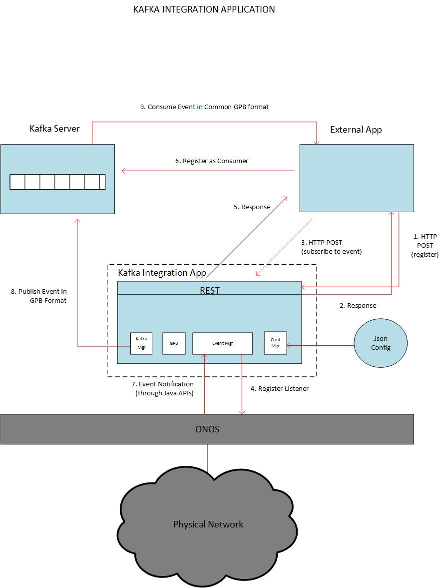
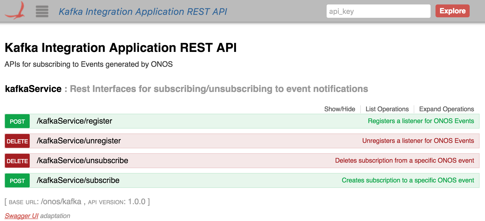
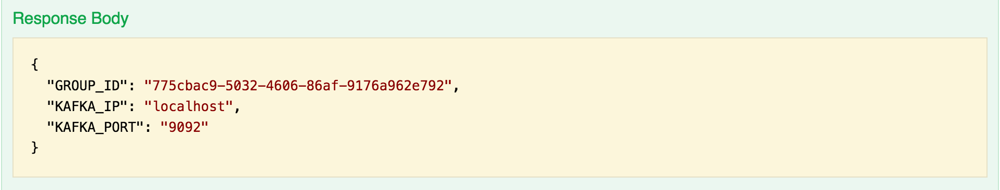

# Kafka Integration

# Team

| Name | Organization | Email |
| --- | --- | --- |
| Shravan Ambati | Calix Inc | [shravan.ambati@calix.com](mailto:shravan.ambati@calix.com) |
| Sanjana Agarwal | ON.Lab | [sanjana@onlab.us](mailto:shravan.ambati@calix.com) |

## OVERVIEW

SDN Applications wanting to receive notifications from ONOS must be written as native ONOS Java Application.

Applications written using any other programming language must use the REST APIs of ONOS.

This project aims to provide the same level of visibility to external non java applications,

there by ONOS will be opened up to a wide number of non-Java Applications and significantly expanding the scope of control of ONOS. 

This feature will enable ONOS to publish events to a Kafka topic for all other applications subscribing to that topic.

The contribution will be in the form of an App called Kafka Integration Application.

The Application will subscribe to events via Java APIs on ONOS and publish those events to a Kafka Server.

Apache Kafka is a distributed messaging system that supports a pub/sub mechanism among other messaging models.

More information about Apache Kafka can be found here - <http://kafka.apache.org/documentation.html> .

## SYSTEM ARCHITECTURE

The diagram below shows the overall architecture of the system.



* 1. The External Application registers for KafkaService. It makes POST call with the application name.
  2. The response could contain server Ip, port etc, needed for connectivity along with the consumer group id generated for this app.
  3. The External Application makes a POST REST call to the Kafka Integration App. This time to subscribe for an event.  
     The contents of the REST call could be - App name, Event Type and the allocated consumer group-id.
  4. If there is no listener for this event type the Event Manager module within the App will register a listener for the specific event with ONOS.   
     If there is a listener already, the event manager will not create a listener.
  5. The response for the POST will be 200 ok instead of 201 created. This is because the resource is created on an  
     external entity. The response could contain the Kafka Topic information or just a plain message.
  6. The external app would then use this information to connect to the Kafka server and register itself as a consumer for the topic it had registered earlier.
  7. At some later point in time we receive our first event from ONOS. The Event Manager module will pick up the event.   
     It will convert the data format to the common GPB format and Marshall the data using the GPB library. The Data is then passed along to the Kafka Manager.
  8. The Kafka Manager module will publish the event to the topic.
  9. The external app will receive the event in GPB defined message format.

## REST APIs

1. POST (register) - This will be used by non native apps to register for the Kafka service.
2. POST (subscribe) - This will be used by non native apps to subscribe for a sepcific event type.
3. GET - Return the list of event types supported by the Kafka Integration App
4. DELETE (subscribe) - This will be used by non native apps to deregister for a specific event type.
5. DELETE (register) - This will be used by non native apps to deregister for a kafka service.

## CONFIGURATION

The Application loads a json config file at start up. This config file will have Kafka config information.

## CLUSTERING SUPPORT

1. We will be using a Distributed Work Queue(DWQ) as the primitive.
2. There will be Leadership elections for two separate topics – WORK\_QUEUE\_PUBLISHER, WORK\_QUEUE\_CONSUMER.
3. The Leader for WORK\_QUEUE\_PUBLISHER will publish events to DWQ.
4. The Leader for WORK\_QUEUE\_CONSUMER will consume events from DWQ and send it to KafkaServer.
5. In case of failure of one of the Leaders and the Leader has failed to mark the task consumed from DWQ as complete, the task(in our case event) will be returned to the DWQ. The new Leader will pick this up from DWQ.
6. There is a rare possibility that the Leader for publisher failed before it can queue the event to DWQ. This will result in a loss of event.
7. Since there is only one consumer from DWQ FIFO ordering of events is guaranteed.

## DESIGN DECISIONS

1. There will be one topic per event type. Each external app will be given a unique consumer groupId.
2. Event subscription by external apps is a two step process - They must first register and then subscribe to a specific event call.
3. As a first step we will only export Device Events  and Link Events to consumers and worry about Packet Ins and Packet Out later.
4. Once the framework is in place it should be relatively easy to add support for other event types.
5. In the scenario where the external app loses connectivity with the Kafka server, and does not come back up within the retention period (the time duration for which Kafka will retain messages)  the onus is on the non native app to rebuild its current view of the network state via existing ONOS REST APIs.

## DEVELOPER'S GUIDE

The following steps will walk you through connecting your app to ONOS and listening to specific ONOS events.

1. **Build and run ONOS.**This [how-to screencast](https://youtu.be/B9PlKvTqjKQ?list=PL81XNiHUXTja8J7qohgWQ57nqmdrSSoig) is a good starting point to build and run ONOS locally on your development machine, for any other information please refer to the [ONOS Developer Guide](../guides/developer-guide.md).

   Important! Build using Maven

   Do not build using BUCK as the app currently does not support BUCK build. Use 'maven clean install' or mci (for the lazy ones like me).

   ```
   $ mci
   ```
2. **Activate Zookeeper and the Kafka server.** Download Kafka version and un-tar it. You can follow the Step 1 of the Quick start guide on this page: <http://kafka.apache.org/documentation.html#quickstart>

   Activate Zookeeper and the Kafka server (in this order) in separate terminals.

   ```
   $ bin/zookeeper-server-start.sh config/zookeeper.properties
   ```

   ```
   $ bin/kafka-server-start.sh config/server.properties
   ```

   Once, both have been activated successfully, you can proceed to the next steps.
3. **Activate the Kafka integration app.**This will activate all the modules of the app. In the ONOS command line, type:

   ```
   $ app activate org.onosproject.kafkaintegration
   ```
4. **Check that RPC services and the ONOS Protobuf models have been activated too.**

   ```
   $ apps -s -a
   ```

   You should see an output similar to this (depending on your defined startup apps in $ONOS\_APPS) :

   ```
   *  18 org.onosproject.drivers              1.7.0.SNAPSHOT Default Device Drivers
   *  27 org.onosproject.openflow-base        1.7.0.SNAPSHOT OpenFlow Provider
   *  28 org.onosproject.hostprovider         1.7.0.SNAPSHOT Host Location Provider
   *  29 org.onosproject.lldpprovider         1.7.0.SNAPSHOT LLDP Link Provider
   *  30 org.onosproject.openflow             1.7.0.SNAPSHOT OpenFlow Meta App
   *  41 org.onosproject.fwd                  1.7.0.SNAPSHOT Reactive Forwarding App
   *  44 org.onosproject.incubator.rpc        1.7.0.SNAPSHOT ONOS inter-cluster RPC service
   *  45 org.onosproject.incubator.protobuf   1.7.0.SNAPSHOT ONOS ProtoBuf models
   *  51 org.onosproject.kafkaintegration     1.7.0.SNAPSHOT Kafka Integration Application
   *  58 org.onosproject.mobility             1.7.0.SNAPSHOT Host Mobility App
   *  81 org.onosproject.proxyarp             1.7.0.SNAPSHOT Proxy ARP/NDP App
   ```
5. **Register your app using Swagger API.**You will want to register your app to listen to specific ONOS events using Swagger API.  
   The link to Swagger UI is: <http://127.0.0.1:8181/onos/v1/docs/#/> and the username and password, both are: karaf  
     
   You have to select 'Kafka Integration Application REST API' from the selection menu on the top which is default set on 'ONOS Core REST API.'  
   The following image displays what POST and GET operations will be available for your use.  
     
     
   In the **register** POST operation, input the name of your app, and hit on 'Try it out!'
6. **The Response Body consists of the JSON generated from the call**. It consists of the GROUP\_ID, KAFKA\_IP and KAFKA\_PORT.   
   It would look something like this:   
   The KAFKA\_IP and the KAFKA\_PORT are to be passed as a parameter to the "bootstrap.servers" Kafka property of your app.  
   Use the GROUP\_ID to subscribe for ONOS events using the Swagger UI.   
     
   
7. **Subscribe for ONOS events.**In the subscribe POST operation, create a subscription to a specific ONOS event. A model schema exists on the right-hand side of the call.   
   The appName would be the same name of the app, with which you registered. The groupId would be the groupId you get as a response after registering your app and the eventType would be the type of the ONOS events you want to register for (LINK and DEVICE events for now).

   Errors with Swagger responses

   There is a possibility that the Swagger UI might give wrong responses, like 'No response from server.' In such cases, please check your log to be sure of the correct response. To print your log, you can use the following command in a new Terminal window.

   ```
   $ tl
   ```

   For a successful subscription you should get a 'Subscription for DEVICE event by forwardingApp successful' message.
8. **Successfully receive the specific ONOS events.**After your event subscription is completed, you should receive the specific ONOS events successfully.

## FAQ

1. Is it possible that before Kafka Integration App tries to create a topic, the external app can try to subscribe to that topic?   
   Yes, this is possible. In such a scenario Kafka will automatically create the topic. This is similar to the case where the  
   producer tries to publish a message to a non existent topic. Kafka will create a topic automatically.
2. What is the purpose of having a Group Id and App name info in the POST REST call?   
   GroupId is necessary to make sure there is no conflict among multiple external apps. When the external apps tries to consume data  
   each app should be in a separate consumer group. This way the message is delivered to all the external apps from a single topic. The  
   App name is primarily for keeping track of which apps have registered. May be we could have a GET REST call to show the current registered apps.
3. How does the external app know what event types are supported ?  
   A GET REST API will be provided to show the list of events supported
4. How does the external app know how many partitions were created for the topic?  
   This I am thinking will be sent as part of the response to the POST call. The external  
   app needs this information, so it can spin up appropriate number of threads.   
   (Num of Consumer Threads = Num of Partitions)
5. What is the topic name that gets created?  
   The topic name is the same as event type.
