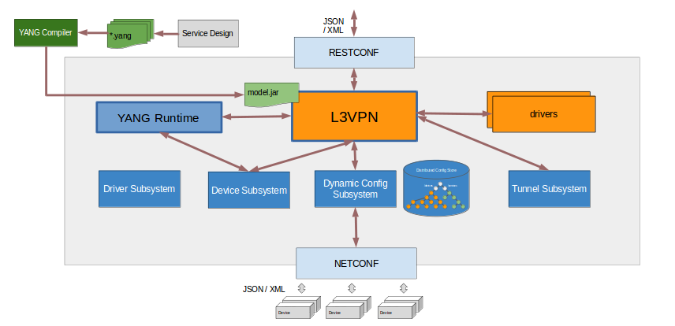
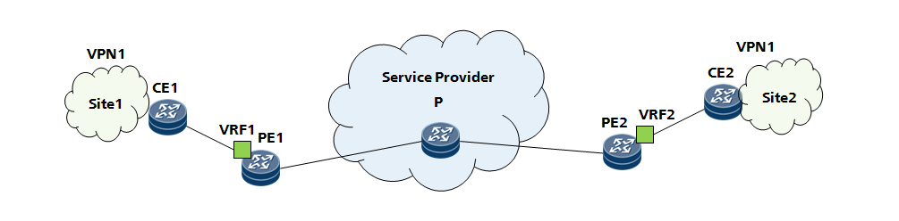
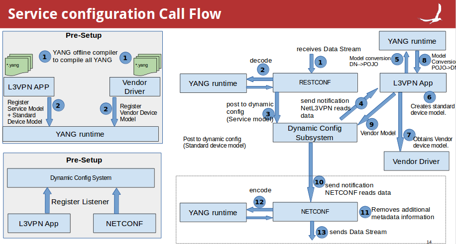

# L3VPN

# Team

| Name | Organization | Email |
| --- | --- | --- |
| Patrick Liu | Huawei Techonologies | [Partick.Liu@huawei.com](mailto:Partick.Liu@huawei.com) |
| (Lucius)Lu Kai | Huawei Techonologies | [lukai1@huawei.com](mailto:lukai1@huawei.com) |
| Xu Shiping | Huawei Techonologies | [xushiping7@huawei.com](mailto:xushiping7@huawei.com) |
| Adarsh M | Huawei Techonologies | [adarsh.m@huawei.com](mailto:adarsh.m@huawei.com) |
| Bharat Saraswal | Huawei Techonologies | [bharat.saraswal@huawei.com](mailto:bharat.saraswal@huawei.com) |
| Gaurav Agrawal | Huawei Techonologies | [gaurav.agrawal@huawei.com](mailto:gaurav.agrawal@huawei.com) |
| Janani B | Huawei Techonologies | [janani.b@huawei.com](mailto:janani.b@huawei.com) |
| Sonu Gupta | Huawei Techonologies | [sonu.gupta@huawei.com](mailto:sonu.gupta@huawei.com) |
| Vidyashree Rama | Huawei Techonologies | [vidyashree.rama@huawei.com](mailto:vidyashree.rama@huawei.com) |
| Vinod Kumar S | Huawei Techonologies | [vinods.kumar@huawei.com](mailto:vinods.kumar@huawei.com) |

# What is L3VPN

Layer 3 Virtual Private Networks (l3vpn): L3VPN is a technology based on PE. It uses MPLS to forward VPN packets over service provider backbones.

L3VPN comprises the following types of devices:

            Customer edge (CE) device—A CE resides on a customer network and has one or more interfaces directly connected to service provider networks. It can be a router, a switch, or a host. 

·           Provider edge (PE) device—A PE resides at the edge of a service provider network and connects one or more CEs. On an MPLS network, all VPN services are processed on the PEs.

·           Provider (P) device—A P device is a core device on a service provider network. It is not directly connected to any CE. It has only basic MPLS forwarding capability.

# Introduction

This project in ONOS implements the L3VPN creation requests from App. It provides a Rest Api for north app to use. When getting creation requests , the L3VPN component prepares the configuration informations and downloads the configuration informations into PE devices.

The Project is primarily driven by Yang Model.

# Architecture

The architecture of L3VPN as below:



Basic Network diagram for L3VPN model:

                                      

# Call Flow



# What we do

## NetL3VPN manager

It's a application.

* Provide REST services.
* Provide distributed store for L3VPN instances.
* Provide Resource Allocation for L3VPN instance.

## How we do

* Build onos and start onos cli session.
* Activate the below necessary apps in cli

  Applications to activate

  app activate org.onosproject.yang  
  app activate org.onosproject.config  
  app activate org.onosproject.restconf  
  app activate org.onosproject.protocols.restconfserver  
  app activate org.onosproject.netconf  
  app activate org.onosproject.netconfsb  
  app activate org.onosproject.l3vpn  
  app activate org.onosproject.drivers.huawei
* Configure all the necessary pre-configuration on the device to establish a netconf connection and then connect to the devices by following [NETCONF#ConnectyourowndevicetoONOS](../guides/administrator-guide/configuring-onos/southbound-protocols/netconf.md)
* Configure L3VPN instance by sending via json.

  **URI : [http://127.0.0.1:8181/onos/restconf/data](http://127.0.0.1:8181/onos/restconf/data)**

  ```
  {       
  		"ietf-l3vpn-svc:l3vpn-svc":{
  			"vpn-services":{
              	"vpn-svc":[{
                  	"vpn-id":"vpna",
                  	"customer-name":"jan"
              	}]
          	}
  		}
  }
  ```

  **URI : [http://127.0.0.1:8181/onos/restconf/data/ietf-l3vpn-svc:l3vpn-svc](http://127.0.0.1:8181/onos/restconf/data/ietf-l3vpn-svc:l3vpn-svc)**

  ```
  {
  	"ietf-l3vpn-svc:sites":{
              	"site":[
                  	{
                  	"site-id":"100",
                  	"site-network-accesses":{
                  	    "site-network-access":[
                      	    {
                      	        "site-network-access-id":"500",
                          	    "bearer":{
                          	        "l3vpn-svc-ext:bearer-attachment": {
                          	            "pe-mgmt-ip":"172.16.11.12"
                          	        },
                          	        "requested-type":{
                          	            "l3vpn-svc-ext:requested-type-profile": {
                          	                "physical":{
                          	                    "physical-if":"Ethernet3/0/0"
                          	                }
                          	            }
                          	        }
                          	    },
                             
                          	    "vpn-attachment":{
                          	        "vpn-id":"vpna",
                          	        "site-role" :"any-to-any-role"
                          	    },
                             
                              	"ip-connection":{
                                  	"ipv4":{
                                  	"addresses":{
                                  	    "provider-address":"50.1.1.1",
                                  	    "mask":"24"
                                  	}
                                  	}
                              	}
                          	},
                          	{
                          	    "site-network-access-id":"501",
                          	    "bearer":{
                          	        "l3vpn-svc-ext:bearer-attachment": {
                          	            "pe-mgmt-ip":"172.16.11.13"
                          	        },
                          	        "requested-type":{
                          	            "l3vpn-svc-ext:requested-type-profile": {
                          	                "physical":{
                          	                    "physical-if":"Ethernet3/0/0"
                          	                }
                          	            }
                          	        }
                          	    },
                              
                             	 	"vpn-attachment":{
                             	    	"vpn-id":"vpna",
                             	    	"site-role" :"any-to-any-role"
                             	 	},
                             	 
                             		"ip-connection":{
                             	    	"ipv4":{
                             	    		"addresses":{
                             	        		"provider-address":"50.1.1.2",
                             	        		"mask":"24"
                             	     		}
                             	    	}
                             	 	}
                          	}
                          ]
                  	}
                  }
  			]
  		}
  }
  ```
