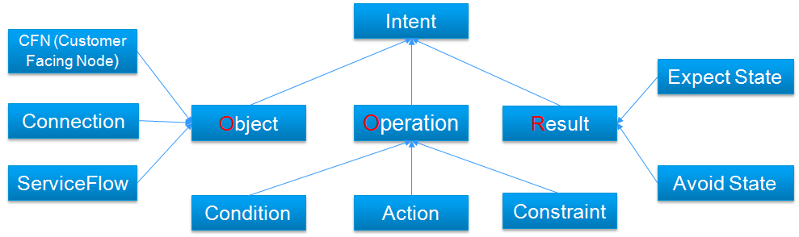
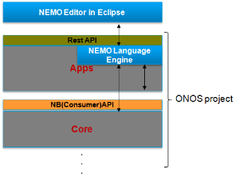
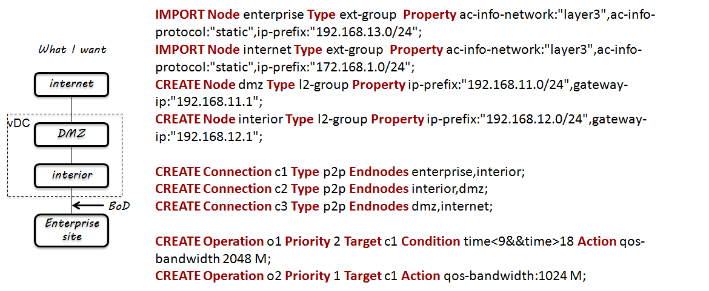

# NEMO Language

### Team

| Name | Organization | Email |
| --- | --- | --- |
| Tianran Zhou | Huawei Technologies | [zhoutianran@huawei.com](mailto:satishk@huawei.com) |
| Zhigang Ji | Huawei Technologies | [jizhigang@huawei.com](mailto:jizhigang@huawei.com) |
| Yali Zhang | Huawei Technologies | [zhangyali369@huawei.com](mailto:leeyoung@huawei.com) |
| Shixing Liu | Huawei Technologies | [liushixing@huawei.com](mailto:zhenghaomian@huawei.com) |
| Yinben Xia | Huawei Technologies | [xiayinben@huawei.com](mailto:dhruv.dhody@huawei.com) |

### Overview

NEMO language is a domain specific language (DSL) based on abstraction of network models and conclusion of operation patterns. It provides NBI fashion in the form of language. Instead of tons of abstruse APIs, with limited number of key words and expressions, NEMO language enables network users/applications to describe their demands for network resources, services and logical operations in an intuitive way.  And finally the NEMO language description can be explained and executed by a language engine.

NEMO has the following features:

* User/application centric abstraction: To simply the operation, applications or users can use NEMO directly to describe their requirements for the network without taking care of the implementation. All the parameters without user concern will be concealed by the NBI.
* Consistent NBI model and pattern: While existing NBIs are proposed by use cases (e.g. virtual network, QoS, traffic engineering, service chaining), NEMO with consistent model and pattern is promising as easier to use and to extend for future proof applications.
* Intuitive to use: The expression of NEMO is human-friendly and can be easily understood by network developers. Using a language style NBI is more like the application talks to the network. Another advantage to use language is that its flexibility for northbound application developer.
* Platform independent: With NEMO, the application or user can describe network demands in a generic way, so that any platform or system can get the identical knowledge and consequently execute to the same result. Any low-level and device/vendor specific configurations and dependencies can be avoided. Any technology related network solution can be concealed.

### NEMO Model

In order that the SDN controller can understand the intent requests, formalize models are required for intent expression. Let’s firstly conclude the intent expression from our real life. There will be two expression patterns:

* The Operation expression, expresses what I want to do.
* The Result expression, expresses the expected final state.

We can also find the following network domain intents:

* I want to CREATE a Network for HR (Customer Facing Node)
* I want to BLOCK the http flow (Flow)
* I want to ADJUST the bandwidth (Connection) to 10G
* I want to AVOID the bandwidth utilization on the connection greater than 80%. (Result)

We can generate the following OOR (Object-Operation-Result) model for the intent expression according to above network examples.

There are two patterns for intent expression: the Object+Operation and the Object+Result. On the network service layer:

* Object, includes: Customer Facing Node (CFN), Connection, and Service Flow.
* Operation, describes the expected behavior. It can be generally formalized with “on condition, do action, with the constraint”.
* Result, describes the expected state. We can use the clause “expect to achieve the state” or “avoid the state”.

### Implementation Framework

To impellent this feature in ONOS, we need to develop two modules.

One is the NEMO editor in Eclipse. It can implemented as an external application. It will provide functions like syntax check, and auto complete. It also encapsulates the NEMO script into the REST API.

The other one is NEMO language engine. It will be a new internal application in ONOS platform. It parses the NEMO script and interacts with the ONOS core, and call the core APIs to execute network control.

### Hybrid Cloud Example

This is an example of using NEMO language to create a hybrid cloud.

The user wants to create DMZ and interior in the vDC. On one hand, they want to access the internet. On the other hand, they want to connect to the existing enterprise site. And they want to enable the BoD capability on the connection between the interior and the existing site, so that the bandwidth can augment at night for backup traffic.

* We can use NEMO language to capture this intent.
* We import the enterprise site information
* Import the internet access information
* And we create the DMZ and the interior
* Then we generate connections among all the nodes
* Finally, we apply operations on the connections

### Release Plan

Road Map（H release）：

|  |  |
| --- | --- |
| Date | Goal |
| Jun.   15, 2016 | Finish   release planning |
| Jun.   30, 2016 | Finish   requirement analysis and architecture and model design |
| Jul.   15, 2016 | Finish   the development of NEMO model and API |
| Jul.   22, 2016 | Finish   NEMO language compiler development |
| Aug.   1, 2016 | Finish   NEMO storage module |
| Aug.   12, 2016 | Finish   NEMO UI development |
| Aug.   15, 2016 | Feature   integration freeze |
| Aug.   26, 2016 | Finish   test and bug fix |
| Aug.   31, 2016 | Hummingbird   release |

Road Map（I release）：

|  |  |
| --- | --- |
| Date | Goal |
| Sep.   9, 2016 | Finish   release planning |
| Sep.   16, 2016 | Finish   requirement analysis and architecture design |
| Sep.   23, 2016 | Finish   the development of tenant space management module |
| Oct.   17, 2016 | Finish   NEMO intent resolver development |
| Oct.   28, 2016 | Finish   VTN and SFC drivers |
| Nov.   12, 2016 | Finish   integration test with VTN and SFC applications |
| Nov.   15, 2016 | Feature   integration freeze |
| Nov.   25, 2016 | Finish   test and bug fix |
| Nov.   30, 2016 | I   release |

H Release：

Implement five functions of NEMO engine: NEMO model and API, NEMO language compiler, NEMO storage and NEMO UI.

I Release：

Implement the rest of the functions of NEMO engine, including tenant space management, NEMO intent resolver and VTN and SFC drivers.

Implement the complete demonstration of VTN + SFC scenario.
