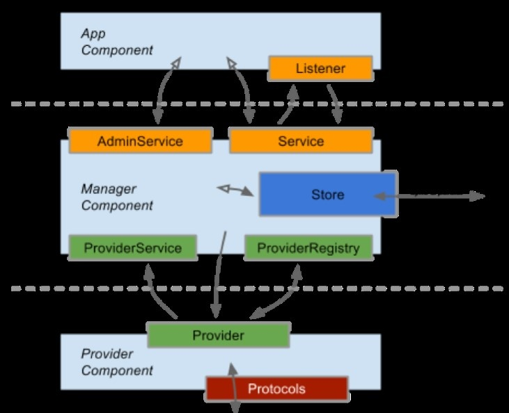
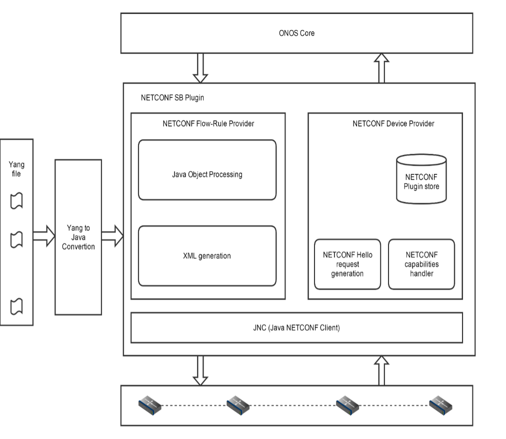
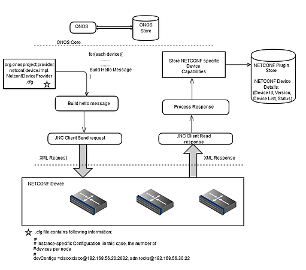
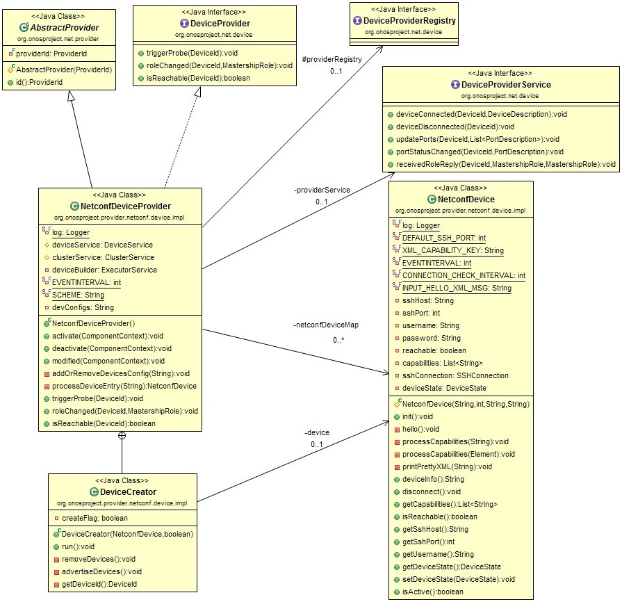
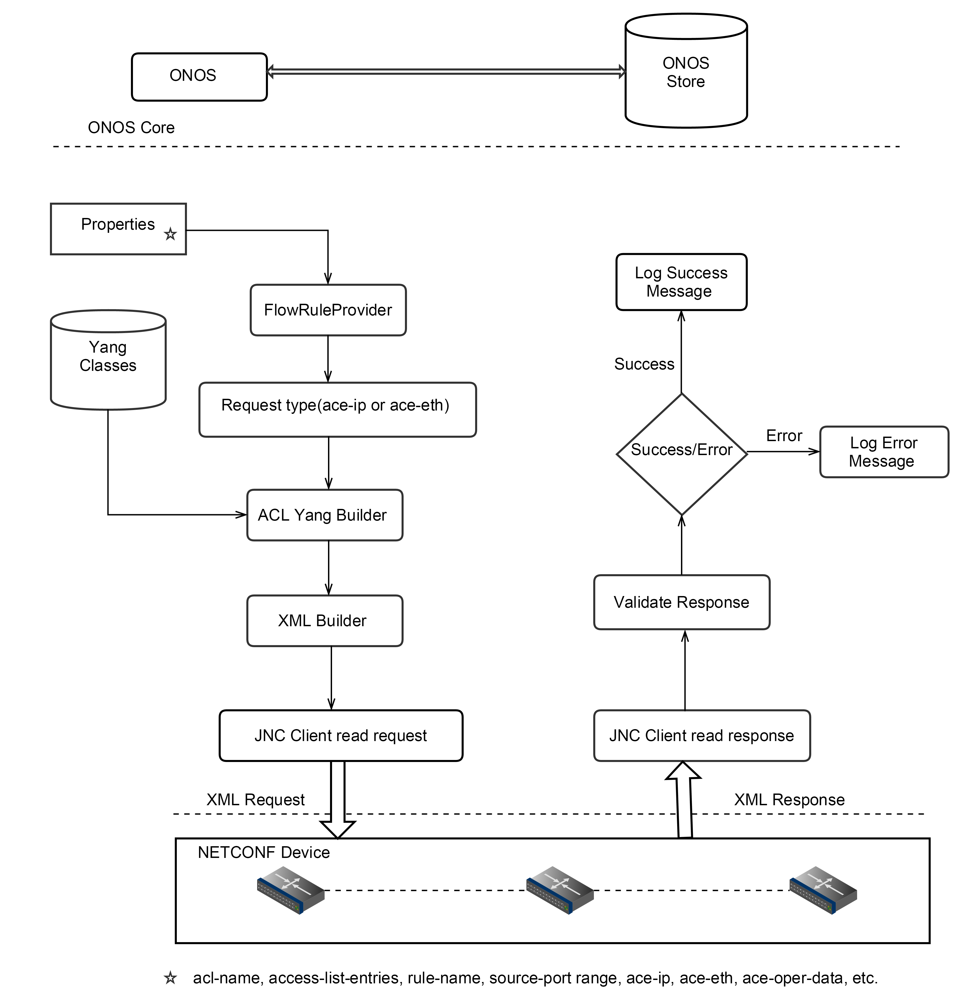
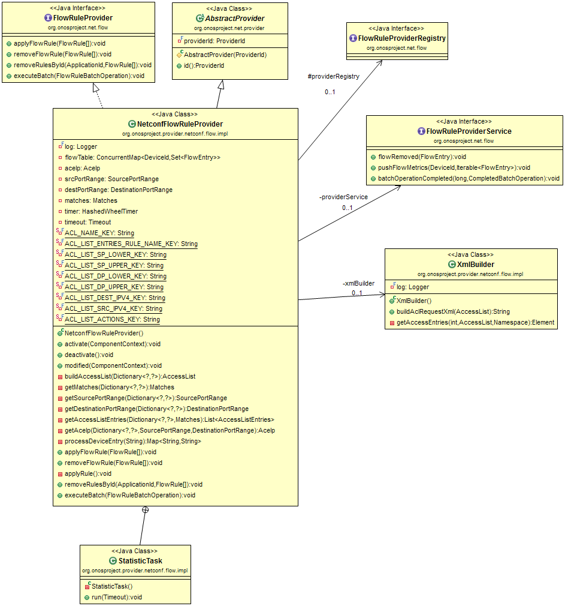
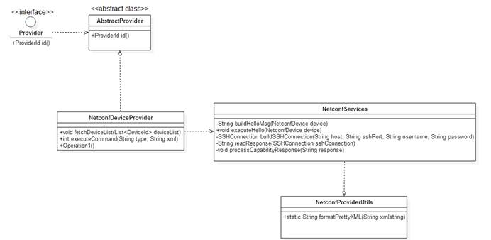
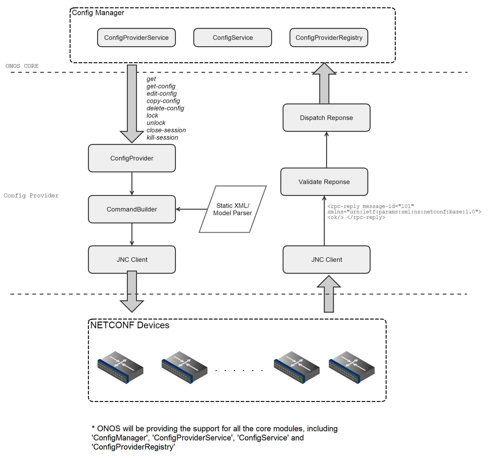

# Design Document

# Table of Contents

# Introduction

This document defines the NETCONF plugin on South bound interface of ONOS operating system. It defines high level architecture of the plugin which can be used to understand, develop and test the plugin.

# What is ONOS?

ONOS is an open source SDN operation system.

It is used as a Central Network Management Controller to view, manage and program network devices. ONOS architecture is unique. It enables the operating system to modularize different components and also gives compatibility to add more protocols and user-defined data models in future.



One of the protocol which ONOS supports in South bound tier is NETCONF.

# What is NETCONF?

Network Configuration Protocol, in short NETCONF is a standard protocol used by major network device providers in their devices. It allows network administrators to view, modify, delete and manage configurations on network devices.

NETCONF uses simple XML based data encoding and is used over a remote procedure call.

# NETCONF plugin for ONOS

Netconf Provider Plugin will help ONOS to connect and manage devices supporting NETCONF protocol. The plugin handles protocol related funtionalities and help them to discover the device and it's capabilities. This plugin is used by ONOS Applications to communicate with NETCONF enabled devices.

# NETCONF Plugin Architecture



As part of Basic Architecture there are 3 main components that will define the functionality of NETCONF South Bound Plugin.

* **Netconf Device Provider:** This will be responsible building, parsing, sending and processing NETCONF Messages. JNC client library is used for sending request and processing the response from the device. One of the main functionality of this component is to process ‘Device Capabilities’. At the time of initialization plugin will fetch the details of all the NETCONF Devices. For each device NETCONF Processor will build a ‘Netconf Hello Message’ and send it to the Device and as a response each device will send a ‘list of Capabilities’. The capability response for each device will be fetched and stored in the NETCONF Plugin Store.
* **Flow Rule Provider:** This will be responsible for handling abstraction between ONOS core and Plugin layers. This provider will support standard NETCONF commands as API's and ONOS core can use the same API's to execute the NETCONF commands. This will use 'CommandBuilder' to build the NETCONF request xml and finally JNC client is used to send the request xml on to the device.
* **Store:** This will be an in-memory store within NETCONF Plugin which will store NETCONF device information as:

|  |  |  |  |  |
| --- | --- | --- | --- | --- |
| **DeviceId** | **NETCONF Version** | **Capabilities List** | **Login Information (SSH Key)** | **Status** |

# NETCONF Device Provider

## **Flow Diagram**

When the NETCONF Plugin comes up, it will try to fetch the device details like, username, password, hostIp and port information from the configuration file and for each device information it will build a NetconfDevice Object and send a Hello Message to the device. The same NetconfDevice object will receive the response from the device, retrieve Capability list and persist the same in the Plugin Store.Once the NETCONF capabilities are successfully discovered, the Provider will use ‘deviceConnected’ api to persist the information on the core.The corresponding flow is shown in the diagram below:



## **Class Diagram**

****

**Description :**

|  |  |
| --- | --- |
| Class | NetconfDeviceProvider |
| Purpose | Provider which will try to fetch the details of NETCONF devices from the core and run a capability discovery on each of the device. |
| Implements | DeviceProvider |
| Extends | AbstractProvider |
| Properties |  |
| <log><Logger> | Logger instance to log application messages. |
| <deviceService><DeviceService> | Service for interacting with the inventory of infrastructure devices. |
| <clusterService><ClusterService> | Service for obtaining information about the individual nodes within the controller cluster. |
| <deviceBuilder><ExecutorService> | The Executors class provides factory methods for the executor services provided in this package. |
| <int><EVENTINTERVAL> | Delay between events. |
| <String><SCHEME> | URI scheme, in our case  NETCONF. |
| <String><devConfigs> | Configuration parameter key. |
|  |  |
| Methods |  |
| <void><activate>(<ComponentContext context>) | The method which is used to activate the component and calling modified(). |
| <void><deactivate>(<ComponentContext context>) | The method which is used to deactivate the component. |
| <void><modified>(<ComponentContext context>) | Getting device configuration & processing device configuration(Entry).  Add & modify NETCONF Device Properties. |
| <void><addOrRemoveDevicesConfig>(<String>) | It will add or remove device configuration. |
| <NetconfDevice><processDeviceEntry>(<String deviceEntry>) | It will convert Device Entry String to a NETCONF Device Object. |
| <void><triggerProbe>(<DeviceId deviceId>) | Triggers an asynchronous probe of the specified device, intended to determine whether the device is present or not. |
| <void><roleChanged>(<DeviceId deviceId, MastershipRole newRole>) | Notifies the provider of a mastership role change for the specified device as decided by the core |
| <boolean><isReachable>(<DeviceId deviceId>) | Checks the reachability (connectivity) of a device from this provider. |

|  |  |
| --- | --- |
| Class | DeviceCreator |
| Purpose | This class is intended to add or remove Configured NETCONF Devices. Functionality relies on 'createFlag' and 'NetconfDevice' content. The functionality runs as a thread and depending on the 'createFlag' value it will create or remove Device entry from the core. |
| Implements | Runnable |
| Extends | ----- |
| Properties |  |
| <NetconfDevice><device> | Initiating NetconfDevice |
| <boolean><createFlag> | Flag remove the device from core |
|  |  |
| Methods |  |
| <void><advertiseDevices> | Initialize NETCONF Device object, and notify core saying device connected. |
| <void><removeDevices> | For each NETCONF Device, remove the entry from the device store. |
| <DeviceId><getDeviceId> | This will build a device id for the given NETCONF Device. |
| <void><run()> | The thread will choose either ‘advertiseDevices’or ‘removeDevices’ API depending on the createFlag property. |

|  |  |
| --- | --- |
| Class | NetconfDevice |
| Purpose | This is a logical representation of actual NETCONF device, carrying all the necessary information to connect and execute NETCONF operations. |
| Implements | ----- |
| Extends | ----- |
| <log><Logger> | Description |
| <int><DEFAULT\_SSH\_PORT> | Defining default SSH port |
| <String><XML\_CAPABILITY\_KEY> | Capabilities Key |
| < String><INPUT\_HELLO\_XML\_MSG> | Hello XML message |
| <int><CONNECTION\_CHECK\_INTERVAL> | Connection checking |
| <int><EVENTINTERVAL> | Event Interval |
| <int><sshPort> | Port |
| <String><sshHost> | Host name |
| <String><username> | username |
| <String><password> | password |
| <DeviceState><deviceState> | The Device State is used to determine whether the device is active or inactive. This state information will help Device Creator to add or delete the device from the core. |
| <SSHConnection><sshConnection> | Connection Object to handle SSH Connection. |
| <List<String>><capabilities> | List of all the capabilities |
| <boolean><reachable> | Whether device is connected. |
| <void><init()> | This will try to connect to NETCONF device and find all the capabilities. |
| <void><hello()> | Sending Hello and reading capabilities. |
| <void><processCapabilities>(<String xmlResponse>) | Process the Capabilities(XML). |
| <void><printPrettyXML>(<String xmlRequest>) | Printing XML in pretty format. |
| <void><processCapabilities>(<Element rootElement>) | Processing Capabilities XML response(Element). |
| <String><deviceInfo> | This would return host IP and host Port, used by this particular NETCONF Device for Logging purpose. |
| <List><getCapabilities> | This will get the list of capabilities. |
| <void><disconnect> | This will terminate the device connection. |
| <String><getSshHost> | This will return the IP used to connect SSH on the Device. |
| <int><getSshPort> | This will return the SSH Port used connect the Device. |
| <String><getUsername> | The username used to connect NETCONF Device. |
| <DeviceState><getDeviceState> | Retrieve current state of the Device. |
| <void><setDeviceState> | This will set the state information for the Device. |
| <boolean><isActive> | Check whether the device is in Active state. |
| <boolean><isReachable()> | This API is intended to know whether the device is connected or not. |

# NETCONF Flow-Rule Provider

**Flow Diagram**

When the NETCONF Plugin comes up, it will try to fetch all the information from the configuration file. The configuration file is nothing but ACL-Yang parameters. For each device it will Check ACL-IP or ACL-Eth, based on that it will generate the Access List according to device model and pass to the xml builder to generate appropriate XML.Once this happens process the request, validate response & Log the message either Success or Error. The corresponding flow is shown in the diagram below:



## **Class Diagram:**

****

**Description:**

|  |  |
| --- | --- |
| Class | NetconfFlowRuleProvider |
| Purpose | NETCONF Provider to accept & process the flow to the device. |
| Implements | FlowRuleProvider |
| Extends | AbstractProvider |
| Properties |  |
| <log><Logger> | Logger instance to log application messages. |
| <providerRegistry><FlowRuleProviderRegistry> | To register the device. |
| <flowTable>  <ConcurrentMap<DeviceId,Set<FlowEntry>>> | To store the device entry. |
| <providerService><FlowRuleProviderService> | Service through which flow rule providers can inject information into  the core. |
| <xmlBuilder><XmlBuilder> | To generate the XML, according to access control list. |
| <aceIp><AceIp> | To provide device IP. |
| <SourcePortRange><sourcePortRange> | To provide SourcePortRange. |
| <DestinationPortRange><destinationPortRange> | To provide DestinationPortRange. |
| <Matches><matches> | Matches is to include IP, range, etc. |
| <timer><HashedWheelTimer> | To maintain time. |
| <timeout><Timeout> | A handle associated with a `TimerTask` that is returned by a `Timer`. |
| <String><ACL\_NAME\_KEY> | Name of the acl. |
| <String><ACL\_LIST\_ENTRIES\_RULE\_NAME\_KEY> | Rule-name for acl. |
| <String>< ACL\_LIST\_SP\_LOWER\_KEY> | Source-port range for Lower port. |
| <String><ACL\_LIST\_SP\_UPPER\_KEY> | Source-port range for upper port. |
| <String><ACL\_LIST\_DP\_LOWER\_KEY> | Destination-port range for lower port. |
| < String ><ACL\_LIST\_DP\_UPPER\_KEY> | Destination-port range for upper port. |
| <String><ACL\_LIST\_DEST\_IPV4\_KEY> | Destination IPV4 address. |
| <String><ACL\_LIST\_SRC\_IPV4\_KEY> | Source IPV4 address. |
| <String><ACL\_LIST\_ACTIONS\_KEY> | To define Action. |
| Methods |  |
| <void><activate>(<ComponentContext context>) | The method which is used to activate the component and calling modified(). |
| <void><deactivate>(<ComponentContext context>) | The method which is used to deactivate the component. |
| <void><modified>(<ComponentContext context>) | Getting device configuration & processing device configuration(Entry)and calling XmlBuilder to prepare the Xml. |
| <AccessList><buildAccessList>(<Dictionary properties>) | It will return the access list according to acl-ip or acl-eth model. |
| <Matches><getMatches>(<Dictionary properties>) | This is to build matches. |
| <SourcePortRange><getSourcePortRange><Dictionary properties> | This is to build Source Port Range. |
| <DestinationPortRange><getDestinationPortRange> (<Dictionary properties>) | This is to build Destination Port Range. |
| <List<AccessListEntries>><getAccessListEntries><(Dictionary properties, Matches matches)> | This is to build and Populate Access List Entries. |
| <AceIp><getAceIp><(Dictionary properties, SourcePortRange srcPortRange, DestinationPortRange destPortRange)> | This is to build Ace IPV4 Type. |
| <Map><processDeviceEntry>(<String deviceEntry>) | It will convert Device Entry String to a NETCONF Device Object. |
| <void><applyFlowRule>(<FlowRule… flowRules>) | Instructs the provider to apply the specified flow rules to their respective devices. |
| <void><removeFlowRule>(<FlowRule… flowRules>) | Instructs the provider to remove the specified flow rules to their respective devices. |
| <void><applyRule>() | To apply rule on device. |
| <void><removeRulesById>(<ApplicationId id, FlowRule... flowRules>) | Removes rules by their id. |
| <void><executeBatch>(<FlowRuleBatchOperation batch>) | Installs a batch of flow rules. Each flowrule is associated to an operation which results in either addition, removal or modification. |
|  |  |

|  |  |
| --- | --- |
| Class | XmlBuilder |
| Purpose | This class generate the xml according to given access list. |
| Implements | ………… |
| Extends | ………… |
| Properties |  |
| <log><Logger> | Logger instance to log application messages. |
| Methods |  |
| <String>< buildAclRequestXml>(< AccessList accessList>) | It will generate the xml using document api. |
| <Element><getAccessEntries>(<int, Namespace, AccessList >) | It will generate the Access List Entries element for xml. |

|  |  |
| --- | --- |
| Class | StatisticTask |
| Purpose | To maintain the time |
| Implements | TimerTask |
| Extends | ……… |
| Methods |  |
| <void><run>(<Timeout to>) | Executed after the delay specified with `Timer.newTimeout(TimerTask, long, TimeUnit)`. |

# Design update of onos-yang-tool:

We have used OpenDayLight Yang to Java conversion tool by referring it through maven dependency & we created a sub repository called [onos-yang-tool](https://oss.sonatype.org/content/repositories/snapshots/org/onosproject/onos-yang-tool/) which we are using as part of maven dependency.

It contains code generator definitions and utility classes to generate Java files based on parsed yang models. This is a one-time activity, whenever we compile the ONOS NETCONF SB source it takes input the Yang files and provides output the Java objects.

# Coding Framework

ONOS interacts with the underlying NETCONF device using 'Providers'. Each sub-systems of ONOS, which includes 'device', 'link', 'host', 'packet' and 'flow', should have a separate modules helping the interaction between ONOS and NETCONF devices. ONOS wiki provides a set of instructions to create new Provider module:

## **Project Skeleton setup**

 Each Provider implementation should be placed under *${ONOS\_ROOT}/providers/*. The layout for one of the provider, NetconfDeviceProvider, can be summarized as below:

```
${ONOS_ROOT}/providers/pom.xml (provider parent POM file)
```

```
                      |
```

```
                      /netconf/pom.xml (netconf providers POM)
```

```
                           |
```

```
                           /link/pom.xml (provider-specific POM)
```

```
                                |
```

```
                                /src/main/java/org/onosproject/provider/netconf/device/impl/NetconfDeviceProvider .java (the provider)
```

```
                                    |                                                |
```

```
                                    |                                                /package-info.java (optional package-wide documentation/annotations)
```

```
                                    |
```

```
                                    /test/java/org/onosproject/providers/netconf/device/impl/ (Unit tests should go here)
```

## **Add and edit POM files**

As part of adding a new provider we need to modify 3 important POM files:

* Provider-specific : The POM which is very specific to a provider and subsystem. e.g. ${ONOS\_ROOT}/providers/netconf/device/pom.xml
* Providers : The POM which is very specific to Protocol and will manage all the other POM’s which are specific to subsystem. e.g. ${ONOS\_ROOT}/providers/netconf/pom.xml
* Provider root : all Providers e.g. ${ONOS\_ROOT}/providers/pom.xml

## ****Class Hierarchy****

All the provider implementations, including NetconfDeviceProvider class, should implement Provider interface. The implementation for provider-id is already part of ‘AbstractProvider’, so our new ‘NetconfDeviceProvider’ will be extending to get the default implementation for ‘Provider-Id’.



# NETCONF Config Provider

This provider is intended for executing various standard NETCONF Commands. As part of the implementation we'll be supporting following NETCONF commands.

```
o get
```

```
o get-config
```

```
o edit-config
```

```
o copy-config
```

```
o delete-config
```

```
o close-session
```

```
o kill-session
```

```
o lock
```

```
o unlock
```

As per the ONOS architecture, any new provider implementation would require 4 major services from ONOS core.

* Manager
* Provider Service
* Service
* Provider Registry

Config Provider implementation will provide support to execute all the standard Netconf Commands. NETCONF operations are defined as an api, and ONOS core will use this api with the ‘DeviceId’ to execute the operation. The api will match the ‘DeviceId’ and find ‘NetcofDevice’ object, which will have information related to NETCONF device, like ‘username’, ‘password’, ‘hostIp’ and ‘sshPort’. Using the device details Config Provider will build a request xml, specific to device, and push the request XML using JNC library. On receiving the response, the Config Provider would validate the response xml for any ‘rpc-error’ and it would even validate for structure. Once the response is validated Config Provider will take the responsibility to convert the xml to a output format compatible with ONOS core. The converted response will dispatched to ONOS core.

### Command Builder:

The Config provider internally relies on ‘*Command Builder*’ to construct request xml. Building request xml can be divided into three parts, one *communication* part, where we have to use rpc, two *operation* part, where it could one of the NETCONF operations listed above and the third is *config-data* part. The initial two parts are standard xml, which can be added directly into request xml String, but the latter part, config data, is a bit complicate to handle. This is because the config data is vendor specific and it should be fetched from a data model. When building request xml we can mark these contents as static part (‘communication’ and ‘operation’ parts) and dynamic part(‘config-data’ part). The main responsibility of ‘Command Builder’ is to recognize the static and dynamic parts and build the request xml.



# Assumptions

* Current goal is to only demonstrate ACL model. Other models are for future scope.
* Generation of NETCONF xml messages and parsing of NETCONF xml response from devices is to be considered for future scope. Currently we can take an assumption that we will get NETCONF xml messages from ONOS core. We can take an assumption that the NETCONF xml response from devices need not be parsed and it can be send to ONOS core as is. The intelligence to be put in the plugin to generate NETCONF xml messages for a request from ONOS core is to be considered for future scope. Also, the intelligence to be put into plugin to parse the NETCONF xml response from devices and extract the information to be passed to ONOS core is to be considered for future scope.
* NETCONF device details – IP, login and password to be currently hardcoded into a file and the provider will pick it from there. Eventually, ONOS will expose a config API so you can do it dynamically, but this is future work. Hardcoding is fine for now.
* If we ever need to adjust topology (i.e., how are NETCONF switches connected on data plane), we can inject this information into ONOS NETCONF through REST API. This is done in the ConfigProvider. Don’t worry about this for now. This is to be considered for future scope.
